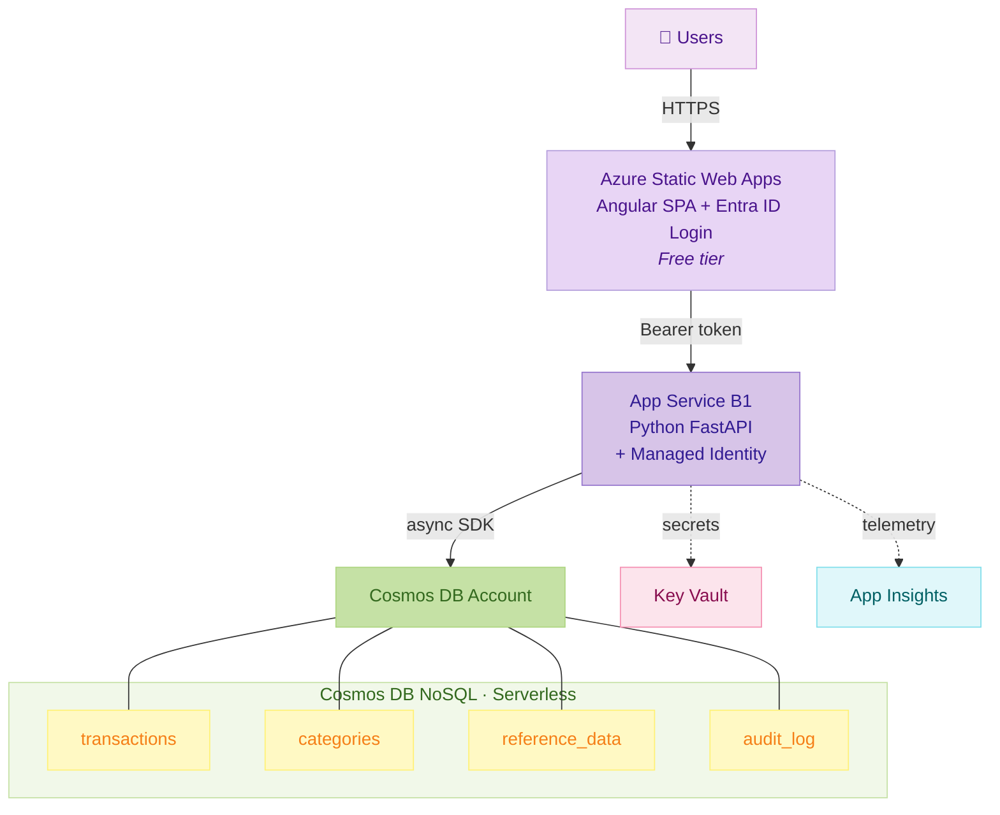

# OpenTreasury

Open-source treasury management application for NGOs. Helps administrative staff track bank transactions, income, and expenses with categories, subcategories, and tags for proper financial oversight.

Designed to be extensible — any non-profit organization can fork, configure, and deploy to their own Azure subscription.

## Architecture

| Layer | Technology | Hosting |
|-------|-----------|---------|
| Frontend | Angular 19+, Angular Material, MSAL Angular | Azure Static Web Apps (Free) |
| Backend | Python FastAPI, async Cosmos DB SDK | Azure App Service B1 |
| Database | Azure Cosmos DB NoSQL (Serverless) | ~€1-5/month |
| Auth | Microsoft Entra ID (your tenant) | Employees only |
| IaC | Bicep | GitHub Actions |

**Estimated monthly cost:** ~€20-25



## Project Structure

```
opentreasury/
├── frontend/          Angular 19 app (standalone components, MSAL auth)
├── api/               Python FastAPI backend
│   └── tests/         Backend test suite (pytest)
├── infra/             Bicep IaC (Cosmos DB, App Service, SWA, Key Vault, App Insights)
│   ├── modules/       Reusable Bicep modules
│   └── parameters/    Environment-specific parameter files (dev, prod)
├── docs/              Architecture docs, feature specs, security reviews
├── scripts/           Azure setup and teardown scripts
├── .github/workflows/ CI/CD pipelines + Squad automation
└── .squad/            AI team state (Squad coordination)
```

## Deploy to Your Azure

OpenTreasury is built for any organization to run on their own Azure subscription. Your data stays in your account — you own it completely.

**Estimated cost:** €15-25/month for a small organization.

**What you'll need:**
- An Azure subscription
- Admin access to your Microsoft Entra ID tenant
- A private GitHub repository

**Get started:**
1. Copy the contents of [`deploy-template/`](deploy-template/) to a new private repo
2. Follow the step-by-step [Deployment Guide](deploy-template/README.md)
3. Run the setup script, configure GitHub, and trigger the workflow — done!

Most organizations are up and running in about an hour.

## Prerequisites

- **Node.js** 20+
- **Python** 3.11+
- **Angular CLI** (`npm install -g @angular/cli`)
- **Azure CLI** (for deployment)

## Quick Start

### Frontend (with mock data — no backend needed)

```bash
cd frontend
npm install
npx ng serve
```

Open http://localhost:4200 — logs in as a mock Admin user with 25 sample transactions.

> The frontend runs with mock data by default (`useMocks: true` in `environment.ts`). All API calls are intercepted and return realistic sample data. To connect to a real backend, see [Connecting Frontend to Backend](#connecting-frontend-to-backend).

### Backend

```bash
cd api
python -m venv .venv
# Windows:
.venv\Scripts\activate
# macOS/Linux:
source .venv/bin/activate

pip install -r requirements.txt
cp .env.example .env
# Edit .env with your Azure credentials

uvicorn app.main:app --reload --port 8000
```

API docs at http://localhost:8000/api/docs (Swagger UI, dev only — disabled in production).

### Connecting Frontend to Backend

In `frontend/src/environments/environment.ts`, set:

```typescript
useMocks: false,
apiBaseUrl: 'http://localhost:8000/api',
```

And configure the MSAL settings with your Entra ID app registration.

## Environment Variables (Backend)

| Variable | Description | Example |
|----------|-------------|---------|
| `AZURE_TENANT_ID` | Entra ID tenant | `xxxxxxxx-xxxx-xxxx-xxxx-xxxxxxxxxxxx` |
| `AZURE_CLIENT_ID` | Backend app registration client ID | `xxxxxxxx-xxxx-xxxx-xxxx-xxxxxxxxxxxx` |
| `COSMOS_ENDPOINT` | Cosmos DB account endpoint | `https://cosmos-opentreasury.documents.azure.com:443/` |
| `COSMOS_DATABASE_NAME` | Database name | `opentreasury` |
| `CORS_ORIGINS` | Allowed frontend origins | `["http://localhost:4200"]` |

> **Database auth:** Cosmos DB uses Entra ID RBAC (`disableLocalAuth: true`) — no connection keys. In production, the App Service system-assigned managed identity authenticates via `DefaultAzureCredential`. For local development, run `az login` and ensure your account has a Cosmos DB data-plane role (e.g., *Cosmos DB Built-in Data Contributor*). See the [Azure Setup Guide](docs/guides/azure-setup.md) for details.

## Features

### MVP
- ✅ Transaction entry with categories, subcategories, and tags
- ✅ Multi-account support (4 bank accounts + PayPal)
- ✅ "Guardar y Nuevo" flow for fast daily data entry (~15s per transaction)
- ✅ Transaction search and filtering (account, date, category, tag, text)
- ✅ Category/subcategory management
- ✅ Tag management
- ✅ Bank account management
- ✅ Excel/CSV import from bank exports
- ✅ Excel export for accounting firm
- ✅ Dashboard with account balances and monthly summary
- ✅ Multi-language support (Spanish + English)
- ✅ RBAC: Admin (full access) / Viewer (read-only)
- ✅ Audit trail on all changes
- ✅ Soft deletes (financial data is never permanently lost)

### Planned
- Invoice file attachments
- PowerBI analytics integration
- Multi-currency support

## RBAC

| Role | Access |
|------|--------|
| **Admin** | Full read/write. Manages transactions, categories, tags, accounts. |
| **Viewer** | Read-only. Views transactions, reports, exports. Board members. |

Roles are assigned via Entra ID app roles.

## Cosmos DB Containers

| Container | Partition Key | Purpose |
|-----------|--------------|---------|
| `transactions` | `/partitionKey` ("YYYY-MM") | Financial transactions |
| `categories` | `/id` | Categories with embedded subcategories |
| `reference_data` | `/type` | Tags + bank accounts |
| `audit_log` | `/entityType` | Audit trail (7-year TTL) |

## License

Apache License 2.0 — see [LICENSE](LICENSE).

## Contributing

See [CONTRIBUTING.md](CONTRIBUTING.md) for development setup, code style, and PR process.

## Documentation

- [Architecture overview](docs/architecture.md)
- [Feature catalog](docs/features.md)
- [Security reviews](docs/security/)
