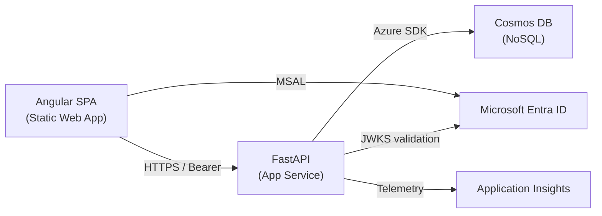
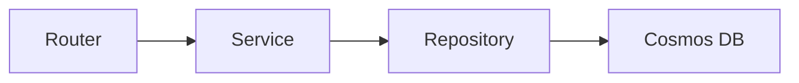

# Architecture Overview

> A 5-minute guide to how OpenTreasury is built, deployed, and connected.

## High-Level Architecture



- **Frontend** — Angular 19 standalone app on Azure Static Web Apps.
- **Backend** — Python FastAPI on Azure App Service with Managed Identity.
- **Database** — Azure Cosmos DB (NoSQL), accessed via the async Python SDK.
- **Auth** — Microsoft Entra ID. MSAL handles login; FastAPI validates JWTs.
- **Observability** — Application Insights + Log Analytics.

## Backend Layers



| Layer | Location | Responsibility |
|-------|----------|----------------|
| **Routers** | [`api/app/routers/`](../api/app/routers/) | HTTP endpoints, request/response validation (Pydantic schemas) |
| **Services** | [`api/app/services/`](../api/app/services/) | Business logic, orchestration, audit logging |
| **Repositories** | [`api/app/repositories/`](../api/app/repositories/) | Data access. Protocol-based interfaces in [`protocols.py`](../api/app/repositories/protocols.py) |
| **Cosmos Client** | [`cosmos_client.py`](../api/app/services/cosmos_client.py) | Singleton managing the SDK connection and container references |

**Dependency injection** — FastAPI's `Depends()` wires layers together. Repository implementations conform to `Protocol` classes (`TransactionRepository`, `ReferenceItemRepository`, `CategoryRepository`, `AuditRepository`), keeping services testable against fakes.

**App lifecycle** — [`main.py`](../api/app/main.py) uses a `lifespan` context manager to initialize Cosmos DB on startup and close on shutdown. Settings come from [`config.py`](../api/app/config.py) (Pydantic `BaseSettings`, reads `.env`).

### Registered Routers

`transactions` · `categories` · `accounts` · `tags` · `reports` · `export` · `imports` · `reference_data` · `user` · `audit` · `health`

## Frontend Architecture

| Concept | Implementation |
|---------|----------------|
| **Framework** | Angular 19, standalone components (no NgModules) |
| **Routing** | Lazy-loaded via `loadComponent()` — see [`app.routes.ts`](../frontend/src/app/app.routes.ts) |
| **State** | Angular Signals (no NgRx). Services own signals; components read them |
| **HTTP** | [`ApiService`](../frontend/src/app/core/services/api.service.ts) — thin wrapper over `HttpClient` with typed `get/post/put/delete` |
| **Cached Lookups** | [`ReferenceDataService`](../frontend/src/app/core/services/reference-data.service.ts) — loads accounts, categories, tags once; signal-cached; `invalidate()` on mutation |
| **Auth** | MSAL Angular (`@azure/msal-angular`). `MsalInterceptor` attaches Bearer tokens. `MsalGuard` protects routes |
| **Admin Guard** | `adminGuard` restricts write routes (new/edit transactions, categories, tags, accounts) |
| **UI Kit** | Angular Material with a custom theme ([`custom-theme.scss`](../frontend/src/custom-theme.scss)) |
| **Mock Mode** | `environment.useMocks` swaps MSAL + API for local mocks — no Azure needed for UI work |

### Route Map

| Path | Component | Auth |
|------|-----------|------|
| `/dashboard` | DashboardComponent | MsalGuard |
| `/transactions` | TransactionListComponent | MsalGuard |
| `/transactions/new`, `/transactions/:id/edit` | TransactionFormComponent | MsalGuard + adminGuard |
| `/categories` | CategoryListComponent | adminGuard |
| `/tags` | TagListComponent | adminGuard |
| `/accounts` | AccountListComponent | adminGuard |
| `/export` | ExportComponent | MsalGuard |
| `/import` | ImportComponent | adminGuard |
| `/reports` | ReportsComponent | MsalGuard |
| `/audit` | AuditComponent | adminGuard |

## Data Model (Cosmos DB)

All containers live in the `opentreasury` database (name derived from the `projectName` parameter).

| Container | Partition Key | Stores |
|-----------|--------------|--------|
| `transactions` | `YYYY-MM` (e.g. `2026-04`) | Income/expense records. Soft-delete via `deleted` flag |
| `categories` | `"category"` (fixed) | Hierarchical categories with subcategories array |
| `reference_data` | `type` (`"account"`, `"tag"`) | Bank accounts, tags, and other lookup entities |
| `audit_log` | `YYYY-MM` | Immutable audit trail entries (who, what, when) |

Partition strategy keeps hot queries scoped to a single logical partition (e.g. one month's transactions).

## Auth Flow

```
1. User opens SPA  →  MSAL redirects to Entra ID login
2. Entra ID returns ID token + access token (audience = API client ID)
3. MsalInterceptor attaches "Authorization: Bearer {token}" to API calls
4. FastAPI HTTPBearer extracts token
5. Backend fetches JWKS from Entra ID (cached 1 hour), validates signature + audience + issuer
6. Claims decoded → user identity + roles (admin role from JWT claims)
```

Source: [`api/app/auth/dependencies.py`](../api/app/auth/dependencies.py) — supports both v1 and v2 Entra ID token formats.

**Token validation details:**
- Audiences accepted: `{CLIENT_ID}` and `api://{CLIENT_ID}`
- Issuers accepted: `https://login.microsoftonline.com/{TENANT}/v2.0` and `https://sts.windows.net/{TENANT}/`
- JWKS TTL: 3600 seconds

## Infrastructure

Defined in Bicep at [`infra/main.bicep`](../infra/main.bicep) with parameterized environments.

| Module | Resource | Purpose |
|--------|----------|---------|
| [`cosmos-db.bicep`](../infra/modules/cosmos-db.bicep) | Cosmos DB Account | NoSQL database (optional free tier) |
| [`app-service.bicep`](../infra/modules/app-service.bicep) | App Service + Plan | Hosts FastAPI backend |
| [`static-web-app.bicep`](../infra/modules/static-web-app.bicep) | Static Web App | Hosts Angular SPA |
| [`key-vault.bicep`](../infra/modules/key-vault.bicep) | Key Vault | Stores secrets (Cosmos endpoint, Entra IDs) |
| [`app-insights.bicep`](../infra/modules/app-insights.bicep) | App Insights + Log Analytics | Monitoring and diagnostics |
| [`role-assignments.bicep`](../infra/modules/role-assignments.bicep) | RBAC | Grants App Service Managed Identity access to Cosmos DB and Key Vault |

**Environments:** [`dev.bicepparam`](../infra/parameters/dev.bicepparam) and [`prod.bicepparam`](../infra/parameters/prod.bicepparam).

**Naming convention:** `{type}-{project}-{env}` (e.g. `app-opentreasury-dev`, `cosmos-opentreasury-prod`).

**Security model:** App Service uses Managed Identity — no database keys in app settings. Key Vault stores secrets; App Service reads them via Key Vault references. `DefaultAzureCredential` in the Python SDK handles auth transparently.

## Related Docs

- [Features Catalog](features.md) — what each feature does, who can use it, constraints
- [Azure Setup Guide](guides/azure-setup.md) — provisioning and deployment steps
