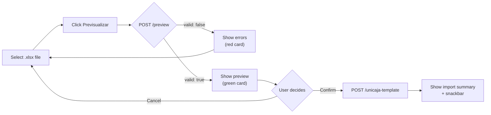
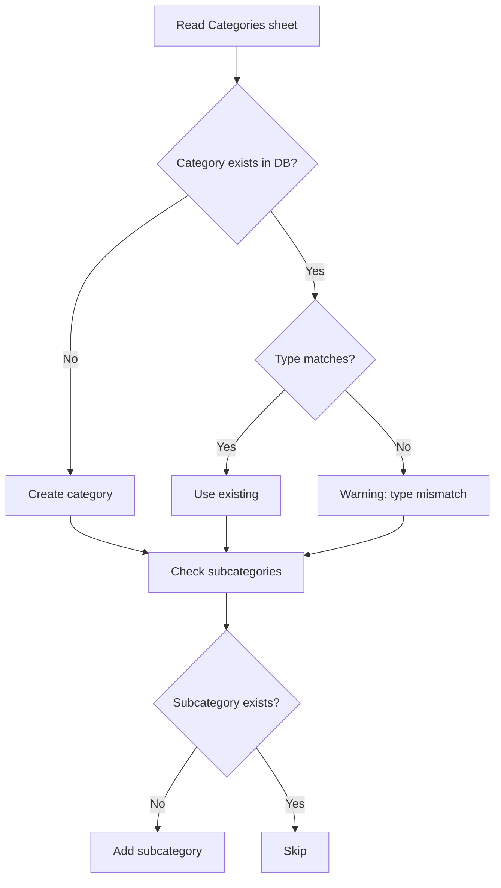
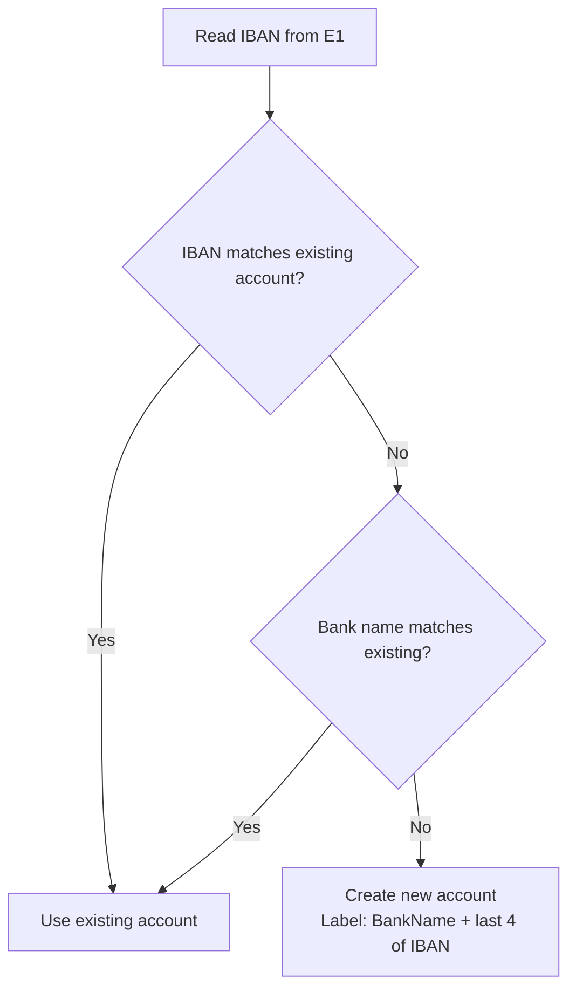

# Import — Excel Workbook Import

> Bulk-import bank transactions from an Excel workbook with multilingual header support,
> strict pre-flight validation, and a two-step preview/confirm flow.

**Access:** Admin only  
**Source:** [api/app/services/import_service.py](../api/app/services/import_service.py) · [api/app/routers/imports.py](../api/app/routers/imports.py) · [frontend/src/app/features/import/](../frontend/src/app/features/import/)

---

## User Flow



1. User selects an `.xlsx` file.
2. Clicks **"Previsualizar"** — the file is uploaded for dry-run validation.
3. If validation fails → error card lists every issue. The Confirm button is **not available**.
4. If validation passes → preview card shows: new categories/subcategories to create, transactions to import, duplicates to skip.
5. User clicks **"Confirmar importación"** → file is uploaded again for the real import.
6. Result summary is displayed with a snackbar notification.

---

## Workbook Format

The import expects an `.xlsx` file with **two sheets** (one Movements sheet
and one Categories sheet). When a workbook contains **multiple** movements-shaped
sheets — for example an archive with one sheet per year — the user is asked to
pick which one to import; see [Multi-sheet workbooks](#multi-sheet-workbooks) below.

### Sheet 1 — Movements

**Metadata rows** (above the header):

| Cell | Content | Example |
|------|---------|---------|
| D1 | SWIFT / BIC code | `UCJAES2MXXX` |
| E1 | IBAN (with or without label) | `IBAN: ES00 0049 0001 0000 0000 1234` |

These are used for **account resolution** (see below). IBAN/SWIFT positions are currently fixed to D1/E1.

**Header row** — auto-detected within the first 12 rows. The system scans each row and checks whether it contains the 4 required column headers (in any supported language). Columns are matched by **header text**, not position — `Date` can be in column A, C, or anywhere.

#### Required columns

| Canonical key | ES | EN | PT | FR | DE |
|---------------|----|----|----|----|-----|
| `date` | Fecha | Date | Data | Date | Datum |
| `amount` | Importe | Amount | Montante | Montant | Betrag |
| `category` | Categoria | Category | Categoria | Categorie | Kategorie |
| `subcategory` | Subcategoria | Subcategory | Subcategoria | Sous categorie | Unterkategorie |

All four must be present or the file is rejected at preview.

#### Optional columns

| Canonical key | ES | EN | PT | FR | DE |
|---------------|----|----|----|----|-----|
| `value_date` | Valor | Value Date | Data Valor | — | Wertstellung |
| `description` | Observaciones | Description | Descricao | Observations | Beschreibung |
| `currency` | Divisa | Currency | Moeda | Devise | Wahrung |
| `balance` | Saldo | Balance | — | Solde | — |
| `movement_no` | Nº mov | Movement No | Movimento | Mouvement | Bewegung |
| `branch` | Oficina | Branch | Agencia | Succursale | Filiale |
| `detail` | Detalle | Detail | Detalhe | — | — |
| `invoice_no` | Nº Factura | Invoice | Fatura | Facture | Rechnung |
| `file_ref` | Referencia archivo factura | File Reference | Referencia arquivo | — | — |
| `extra_data` | Datos | Data | Dados | Donnees | Daten |
| `ref` | Ref | Ref | — | — | — |

Header matching is **case-insensitive and accent-insensitive** — `Categoría`, `categoria`, and `CATEGORIA` all match.

### Sheet 2 — Categories

The sheet must be named one of: `Categorias`, `Categories`, or `Kategorien`.

| Row | Content | Example |
|-----|---------|---------|
| 1 | Category type per column | `Entrada` · `Income` · `Gasto` · `Expense` |
| 2 | Category name per column | `Donaciones` · `Cuotas` · `Gastos` |
| 3+ | Subcategory names (one per row) | `Donación Particular` · `Cuota Socio Mensual` |

**Recognized type aliases:**

| Type | Aliases |
|------|---------|
| Income | `Entrada`, `Income`, `Receita`, `Recette`, `Einnahme`, `Entrata` |
| Expense | `Gasto`, `Expense`, `Despesa`, `Dépense`, `Ausgabe`, `Spesa` |

---

## Preview — Dry-Run Validation

`POST /api/imports/preview` performs strict validation without writing anything to the database.

### Validation checks

| Check | Severity | Rule |
|-------|----------|------|
| **Workbook readable** | Error | Must be a valid `.xlsx` file (openpyxl) |
| **Movement sheet found** | Error | At least one sheet must contain the 4 required headers |
| **Categories sheet found** | Error | Sheet named `Categorias` / `Categories` / `Kategorien` must exist |
| **Empty dates** | Error | Counts rows with blank date column |
| **Unparseable dates** | Error | Counts rows where date text cannot be parsed |
| **Empty amounts** | Error | Counts rows with blank amount column |
| **Unparseable amounts** | Error | Counts rows where amount is not a valid number |
| **Empty categories** | Error | Counts rows with blank category column |
| **Empty subcategories** | Error | Counts rows with blank subcategory column |
| **Orphaned subcategories** | Error | Transaction references a subcategory not found in DB or categories sheet |
| **Orphaned categories** | Error | Transaction references a category not found in DB or categories sheet |
| **Category type mismatch** | Warning | Category exists in DB with a different type than the sheet declares |

If **any error** is present → `valid: false` → import cannot proceed.

### Preview response

```json
{
  "valid": true,
  "errors": [],
  "warnings": ["Category 'Cuotas' exists with type 'income' but sheet declares 'expense'"],
  "totalRows": 52,
  "rowsWithErrors": 0,
  "account": {
    "exists": true,
    "id": "acc-abc123",
    "label": "Unicaja 0382",
    "iban": "ES0000490001000000001234"
  },
  "newCategories": [
    { "name": "Donaciones", "type": "income" }
  ],
  "newSubcategories": [
    { "categoryName": "Donaciones", "name": "Donación Particular" }
  ],
  "transactionsToImport": 47,
  "duplicatesToSkip": 5
}
```

---

## Duplicate Detection

Each transaction is identified by a **composite key**:

```
date | movementNumber | bankDescription | detail | absoluteAmount
```

Before importing, the system loads all existing transactions for the same account and date range, then builds a set of existing keys. Any row matching an existing key is counted as a duplicate and **skipped**.

| Scenario | Result |
|----------|--------|
| Same file imported twice | 0 new transactions — all are duplicates |
| New file with 5 new + 20 existing rows | 5 imported, 20 skipped |
| Same file after deleting some transactions | Only the deleted ones are re-imported |

The preview shows exact counts (`transactionsToImport` vs `duplicatesToSkip`) before the user confirms.

---

## Category & Subcategory Sync

During import, the system reads the **Categories sheet** and syncs with the database:



**Key behaviors:**
- **Additive only** — never deletes or modifies existing categories or subcategories.
- **Type mismatch** — if a category exists as `income` but the sheet says `expense`, a warning is issued. The existing type is preserved.
- **Subcategory completeness** — every `(category, subcategory)` pair referenced in the transactions sheet must be resolvable (either exists in DB or listed in the categories sheet). Orphans cause a **preview error**.

---

## Account Resolution

The system resolves which bank account the transactions belong to:



- IBAN is cleaned (spaces removed, uppercased) before matching.
- Bank name is derived from the sheet title (first word, title-cased).
- During **preview**, the account is resolved read-only (shows `exists: true/false`). During **import**, a missing account is auto-created.

---

## API Reference

### Preview (dry-run)

```
POST /api/imports/preview
Content-Type: application/vnd.openxmlformats-officedocument.spreadsheetml.sheet
Authorization: Bearer {token}     (Admin role required)
Body: raw .xlsx bytes

→ 200 OK: ImportPreview (see response format above)
→ 400 Bad Request: empty body or ValueError from parser
→ 413 Request Entity Too Large: file exceeds 10 MB
→ 415 Unsupported Media Type: wrong Content-Type
→ 403 Forbidden: Viewer role
```

### Import (commit)

```
POST /api/imports/unicaja-template
Content-Type: application/vnd.openxmlformats-officedocument.spreadsheetml.sheet
Authorization: Bearer {token}     (Admin role required)
Body: raw .xlsx bytes

→ 201 Created: ExcelImportSummary
→ 400 Bad Request: empty body or ValueError
→ 413 / 415 / 403: same as preview
```

**Import response:**

```json
{
  "accountId": "acc-abc123",
  "accountLabel": "Unicaja 0382",
  "categoriesCreated": 3,
  "subcategoriesAdded": 5,
  "transactionsImported": 47,
  "duplicatesSkipped": 5,
  "rowsSkipped": 0,
  "warnings": []
}
```

---

## Multi-sheet workbooks

When the uploaded `.xlsx` contains **two or more** sheets that match the movements
header pattern (`date` + `amount` detectable in the first 12 rows), the preview
endpoint returns a *sheet-selection-required* payload instead of validating
immediately. The UI shows a sheet picker listing each candidate with its data-row
count, plus a collapsed "Ignored sheets" panel explaining why other sheets were
skipped (`missing_required_headers` or `empty`).

The user picks a sheet, runs preview again — this time with `?sheet={name}` —
and the rest of the flow is unchanged. The sheet name is also passed to
`POST /imports/workbook` so the import commits exactly the sheet that was
validated.

| Workbook shape | Behavior |
|----------------|----------|
| 1 candidate sheet | Auto-selected, no extra clicks. Sheet name shown as a chip on the preview card. |
| 2+ candidate sheets | User picks one before validation runs. Default selection is the first candidate (workbook order). |
| 0 candidate sheets | Existing error card, plus a list of sheets found and why each was skipped. |

API contract:

- `POST /api/imports/preview?sheet={name}` — optional. When omitted with multi-sheet
  workbooks, returns `requiresSheetSelection: true` with a `candidateSheets` list.
- `POST /api/imports/workbook?sheet={name}` — optional. When omitted, falls back to
  the first candidate sheet (preserves the pre-issue-#17 behavior for legacy clients).
- An invalid `sheet` value (unknown sheet name or non-candidate sheet) returns HTTP 400.

## Constraints

| Constraint | Value |
|------------|-------|
| File format | `.xlsx` only (openpyxl) |
| Max file size | 10 MB |
| Auth | Admin role required |
| Required columns | `date`, `amount`, `category`, `subcategory` |
| Date formats accepted | `YYYY-MM-DD`, `DD/MM/YYYY`, `DD-MM-YYYY`, ISO 8601 |
| Amount precision | 2 decimal places (Decimal) |
| Currency default | `EUR` (if currency column missing) |

---

## Known Limitations & Roadmap

| Item | Priority | Status |
|------|----------|--------|
| IBAN/SWIFT position hardcoded to D1/E1 — scan first rows instead | P2 | Planned |
| Transactions without category/subcategory are skipped — staging area for uncategorized rows | P3 | Under discussion |
| No drag-and-drop file upload | — | Enhancement |
| Stateless preview/confirm — file is uploaded twice (once per step) | — | By design (no server-side temp storage) |
| Multi-sheet workbooks — pick which sheet to import | — | ✅ Implemented (issue #17) |
