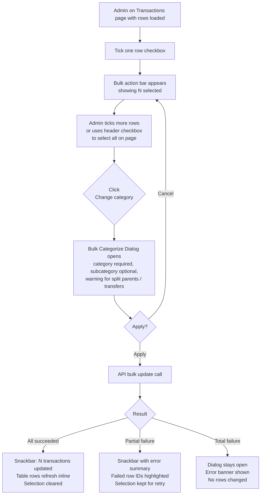

# Bulk Category + Subcategory Update — UX Spec

**Version:** 1.1
**Date:** 2026-04-18
**Author:** Niobe (Spec / UX Analyst)
**Requested by:** Pedro (perocha)
**Status:** Amended — ready for implementation
**Issue:** [#22](https://github.com/rett-europe/opentreasury/issues/22)
**Branch:** `copilot/create-spec-for-issue-22`
**Scope:** Transactions page — multi-select + bulk "Change category / subcategory" action

**Prerequisite:** Phase 3 — Split transactions (`docs/specs/phase-3-split-transactions-spec.md`, FR-022–025) must be merged before this feature ships. The split-parent carve-out (§5.4, §7.5, §9.3, AC-24) depends on the `splits[]` data model from Phase 3. Until Phase 3 merges, the carve-out has no rows to apply to and is a forward-compatible no-op.

**Changelog:**

- **v1.1 (2026-04-18)** — Amendments from Neo's Lead review:
  - R-1: `categorizationStatus = 'categorized'` corrected to `'manually_categorized'` (matches `api/app/models/domain.py::CategorizationStatus`) — §7.2, §9.1, AC-18.
  - R-2: Phase 3 declared as prerequisite (header above).
  - R-3: AC-24 added — backend must reject split parents with stable error code.
  - §15 open questions resolved (A-1…A-9): API shape, partial-failure body, batch cap = 200, audit trail with `batchCorrelationId`, Undo / server-side select deferred, sticky placement, i18n pattern, action-bar context.
  - AC-25 added (NB-1): selection-update semantics on partial failure.
  - §5.3 extended (NB-2): selection cleared on navigation to transaction detail/edit page.
  - §7.1 clarified (NB-3): no-op rows (already in chosen category) count under "will be overwritten".
  - §11 note (NB-4): en/es label parity asserted at build time.
  - §11 `bulkBatchLimit` label added (NB-5).
- **v1.0 (2026-04-18)** — Initial draft.

---

## Table of Contents

1. [Executive Summary](#1-executive-summary)
2. [User Stories](#2-user-stories)
3. [Real-World Scenarios](#3-real-world-scenarios)
4. [UX Flow](#4-ux-flow)
5. [Selection UX on the Transactions List](#5-selection-ux-on-the-transactions-list)
6. [Bulk Action Bar](#6-bulk-action-bar)
7. [Bulk Categorize Dialog](#7-bulk-categorize-dialog)
8. [Apply & Feedback](#8-apply--feedback)
9. [Behavior & Semantics](#9-behavior--semantics)
10. [RBAC](#10-rbac)
11. [i18n — EN / ES Labels](#11-i18n--en--es-labels)
12. [Acceptance Criteria](#12-acceptance-criteria)
13. [Edge Cases](#13-edge-cases)
14. [Out of Scope](#14-out-of-scope)
15. [Resolved Decisions](#15-resolved-decisions-formerly-open-questions)

---

## 1. Executive Summary

Today, the admin can only change category/subcategory one transaction at a time (via the row-level "Quick categorize" dialog or the full edit form). In practice, the same categorization often applies to many rows: a remesa of 12 member payments, dozens of recurring supplier charges, or a batch of imported transactions that all need the same label after an import.

This spec adds a **bulk re-categorization** workflow on the transactions page:

- The admin selects 2 or more rows from the transaction list.
- A sticky bulk action bar appears with a **"Change category"** action.
- A dialog lets the admin pick a single category (required) and subcategory (optional) — or explicitly clear both.
- The selected category/subcategory is applied to **every selected transaction**, replacing whatever was there before.
- Only the `category` and `subcategory` fields change. All other fields (amount, date, account, tags, notes, type, review status, splits) are untouched.

**Principles:**

- **Explicit selection.** Nothing is ever bulk-updated implicitly (e.g., "all filtered transactions" without the user confirming).
- **One value for all.** The bulk dialog sets one category for the whole selection. The admin cannot pick "keep existing" per row — use single-row edit for that.
- **Subcategory is optional and always tied to the chosen category.** If the admin does not pick a subcategory, subcategory is set to `null` on every selected transaction (this mirrors the existing single-row behavior).
- **Admin-only.** Viewers do not see checkboxes or the bulk action bar. This matches existing RBAC.

**What this spec does NOT cover:** API contract shape, Cosmos DB cross-partition strategy, audit trail schema changes, or the concurrency model — those are Morpheus/Neo decisions. This spec defines *what the user needs* and *how the feature should behave*.

---

## 2. User Stories

| ID | Role | Story |
|----|------|-------|
| US-1 | Admin | As an admin, I want to select multiple transactions from the list and assign the same category (and optionally subcategory) to all of them in one action, so I can classify recurring or batch-imported items without repeating the same click 20 times. |
| US-2 | Admin | As an admin, I want to clear the category on many transactions at once (back to uncategorized), so I can quickly reset wrong categorizations applied by an import or a previous mistake. |
| US-3 | Admin | As an admin, I want to see how many rows I have selected and a summary of them (count + net amount) before I apply a bulk change, so I have a chance to verify I'm changing the right set. |
| US-4 | Admin | As an admin, I want selection to survive normal scrolling / loading more months so I can build up a large selection across the currently loaded transactions, but to reset when I change the active date range or other filters so I don't accidentally modify rows I can't see. |
| US-5 | Admin | As an admin, I want the bulk change to be atomic from my perspective — either I get a clear success with the updated rows showing the new category immediately, or a clear error explaining which rows failed — so my books never end up in a half-updated state without me knowing. |
| US-6 | Viewer | As a viewer, I want the bulk selection UI to be hidden entirely (no checkboxes, no action bar), so I'm not confused by controls I can't use. |
| US-7 | Admin | As an admin, when some of my selected transactions are **split parents**, I want the system to refuse to re-categorize them in bulk with a clear message, so I don't accidentally destroy a split's per-line categorization by overwriting the parent. |

---

## 3. Real-World Scenarios

### Scenario A — Monthly remesa clean-up

María imports the March bank statement. 14 rows are the monthly member contributions, all ~€25, from 14 different payers. The import wizard couldn't auto-categorize them because the description varies. She wants to mark all 14 as **Income → Member contributions**.

Today: she opens Quick categorize 14 times. ~2 minutes of clicking.
With bulk: she filters by amount €20–€30 and account "CaixaBank", selects the 14 rows, picks the category once, applies. ~15 seconds.

### Scenario B — Correcting a mis-categorized import

After an import, 40 supplier transactions were auto-categorized as "Office supplies" but they are actually "Event logistics". Pedro selects all 40 rows (already filtered by "Office supplies"), opens the bulk dialog, picks the correct category, applies. The table refreshes and all 40 rows now show the new category.

### Scenario C — Emptying categorization for a messy batch

An import went wrong — an entire batch got the wrong category. Before redoing the classification carefully, the treasurer wants to reset all of them to "uncategorized". The admin selects the batch (via filter + select-all), opens the bulk dialog, explicitly picks the **Clear category** option, applies. All selected rows become uncategorized (`categorizationStatus = 'uncategorized'`).

### Scenario D — Mixed selection including a split parent (not allowed)

The admin selects 10 transactions; one of them is a split parent (has child lines with their own categories). When they open the bulk dialog, a warning banner lists the 1 split parent and the dialog's **Apply** button is disabled until they deselect it. The dialog explains why: bulk re-categorizing would overwrite the split structure's parent-level category and break the split line subordination.

---

## 4. UX Flow



---

## 5. Selection UX on the Transactions List

### 5.1 Row checkbox column

- A new **leftmost column** with a Material checkbox is added to the transactions table.
- The column is only visible to **Admin** users. Viewers see the table exactly as today.
- The header cell contains a **"select all visible"** checkbox (tri-state: unchecked / checked / indeterminate).

### 5.2 Selection scope

| Action | Selects |
|--------|---------|
| Click a row checkbox | Toggles that single transaction |
| Header checkbox unchecked → click | Selects all transactions currently rendered in the table (i.e., every row the user can see, across all already-loaded months) |
| Header checkbox checked → click | Clears the entire selection |
| Header in indeterminate state → click | Clears the selection (standard Material pattern) |

> **Explicit decision:** There is **no "select all matching the filter"** shortcut in v1. "Select all" only selects what's already loaded into the table. If the admin wants to bulk-update 500 rows that span several months, they must first load those months (existing month-walk / "load more" behavior). This prevents accidental updates to rows the admin hasn't actually reviewed.

### 5.3 Selection persistence

Selection is an in-memory set of transaction IDs kept by the transactions page component. It is **preserved** while:

- Scrolling the table.
- Loading additional months (month-walk). Previously-selected rows remain checked even as more rows load below.
- Opening auxiliary dialogs (Quick categorize on another row, Split dialog, etc.) that are cancelled without modifying the selected rows.

Selection is **cleared** when:

- The admin changes any filter in the filter bar (date range, account, category, search, etc.). Rationale: the set of visible rows changes, so the user's mental model of "what I have selected" would break.
- The admin clicks the **Clear** action on the bulk action bar.
- The admin navigates away from the transactions page (including navigating to a specific transaction's detail or edit page).
- A bulk update completes successfully (see §8).

### 5.4 Row disabled states

- Split parent rows render a checkbox that is **visually present but disabled**, with a tooltip: *"Split transactions can't be bulk re-categorized"*. See §9.3.
- Child split lines render at the same indentation as today and **are selectable** — their categorization is independent from the parent and is a legitimate bulk-update target.
- Soft-deleted rows are not shown in the list (existing behavior), so they cannot be selected.

### 5.5 Visual treatment

- Selected rows get a subtle highlight background (Material default `selected` row style).
- The header checkbox and row checkboxes follow Material `mat-checkbox` with primary color.
- No new column on mobile narrow widths — the first column wraps; the table already scrolls horizontally per existing behavior.

---

## 6. Bulk Action Bar

A sticky action bar is shown at the top of the table content area (just below the filter bar / summary strip) whenever the selection is non-empty.

### Layout

```
┌──── Bulk Action Bar (sticky, admin-only) ───────────────────────────────┐
│ ✓ 14 selected  ·  Net: −€342,50                                         │
│                                                                          │
│ [ Change category ]   [ Clear selection ]                                │
└──────────────────────────────────────────────────────────────────────────┘
```

### Content

| Element | Behavior |
|---------|----------|
| Selection count | `{N} selected` — live, updates as checkboxes toggle |
| Net amount | Sum of the signed amounts of the selected transactions. Purely informational — helps the admin sanity-check the selection. Formatted with EUR locale. |
| **Change category** button | Primary action. Opens the bulk categorize dialog (§7). Disabled when selection < 1 (but the whole bar is hidden in that case). |
| **Clear selection** button | Secondary (stroked) action. Clears the selection set; bar disappears. |

### Visibility rules

- Visible only when `selectedIds.size >= 1` **and** user is Admin.
- Hidden entirely in the empty state (no transactions loaded) and for Viewer role.

### Future slot

Additional bulk actions (bulk delete, bulk tag, bulk assign review status) are natural extensions of this bar. They are **out of scope** for this spec (§14), but the layout leaves space for them on the right.

---

## 7. Bulk Categorize Dialog

Opened by clicking **Change category** in the bulk action bar.

### Layout

```
┌── Change category for 14 transactions ───────────────────────────────────┐
│                                                                           │
│  Selection summary                                                        │
│  • 14 transactions selected                                               │
│  • Net: −€342,50                                                          │
│  • 10 currently uncategorized · 4 will be overwritten                     │
│                                                                           │
│  ⚠ 1 split parent is in your selection and will be skipped. [Deselect]   │  ← shown only when applicable
│                                                                           │
│  Category *                                                               │
│  [ Select a category             ▾ ]                                      │
│                                                                           │
│  Subcategory (optional)                                                   │
│  [ Select a subcategory          ▾ ]     (disabled until category chosen) │
│                                                                           │
│  ○ Apply category and subcategory to all 14                               │
│  ○ Clear category on all 14 (set to uncategorized)                        │
│                                                                           │
│                                        [ Cancel ]   [ Apply ]             │
└───────────────────────────────────────────────────────────────────────────┘
```

### 7.1 Selection summary block

Read-only, above the form. Three lines:

- `{N} transactions selected`.
- `Net: {amount}` (same EUR formatting as the action bar).
- A breakdown line: `{X} currently uncategorized · {Y} will be overwritten`, where `X + Y = N`. If all rows are currently uncategorized, show just `{X} currently uncategorized`.

> **No-op rows count as "will be overwritten."** If some selected rows already have the chosen category/subcategory, they still count under `{Y}` — we do not add a third "no change" bucket. A bulk apply is defined by the intended target state, not the diff. The backend may no-op on the wire (EC-2).

### 7.2 Mode selector — two mutually exclusive modes

A pair of Material radio buttons chooses what the dialog does:

1. **Apply category and subcategory** (default):
   - Category dropdown is **required**.
   - Subcategory dropdown is **optional** and filtered by the chosen category's active subcategories.
   - Applying sets `categoryId = chosen`, `subcategoryId = chosen or null`, `categorizationStatus = 'manually_categorized'` (see §9.1).

2. **Clear category**:
   - The category and subcategory dropdowns are hidden / disabled.
   - Applying sets `categoryId = null`, `subcategoryId = null`, `categorizationStatus = 'uncategorized'`.
   - Used for Scenario C.

### 7.3 Category dropdown

- Shows active categories only (same filter as the per-row Quick categorize dialog).
- Ordered alphabetically, same as elsewhere in the UI.
- No "mixed" / "keep existing" option — a bulk update always sets one value.

### 7.4 Subcategory dropdown

- Hidden or disabled until a category is chosen.
- Shows active subcategories of the chosen category only.
- First option is "— (none)" which explicitly sets `subcategoryId = null`.
- If the chosen category has zero active subcategories, the dropdown is hidden entirely (no need to show an empty control).

### 7.5 Warning banners

Shown above the form, below the summary, stacked in this order when they apply:

| Condition | Banner text (EN) | Behavior |
|-----------|------------------|----------|
| Selection contains split parents | "⚠ {N} split transaction(s) are in your selection and will be skipped." | Includes a **"Deselect"** link that removes them from the selection. Apply is still enabled — see §9.3. |
| Selection contains transfers | "ℹ {N} transfer(s) are in your selection. Transfers are typically uncategorized — categorizing them will affect category reports." | Informational only. No action blocked. |
| Selection has mixed accounts | (none — allowed silently) | Not surfaced; not a problem. |

### 7.6 Buttons

- **Cancel** — closes the dialog. Selection is preserved so the admin can retry.
- **Apply** — disabled until the form is valid:
  - In "Apply" mode: a category must be chosen **and** the effective selection (after excluding split parents) must be ≥ 1.
  - In "Clear" mode: the effective selection must be ≥ 1.
  - Also disabled while a save is in progress (shows a spinner inline on the button).

---

## 8. Apply & Feedback

### 8.1 On Apply

1. The dialog enters a loading state (Apply button shows spinner, inputs disabled, Cancel becomes a "Close" fallback that's disabled during the call).
2. The frontend sends one bulk update request containing the effective selection (split parents excluded), the chosen category/subcategory (or the "clear" indicator), and the partition hints (`year`, `month` per transaction — same pattern the per-row `categorize` call uses).
3. The progress is shown as a single request; no per-row progress bar. Expected to be fast for typical selections (up to ~100 rows).

### 8.2 Success (all rows updated)

- Dialog closes.
- Snackbar: *"{N} transactions updated"* with a "Close" action, 4 s duration.
- Every updated row in the table is refreshed in place with the new category/subcategory text, the updated categorization badge, and any derived styling.
- Summary strip recomputes automatically (existing reactive pattern).
- Selection is cleared.

### 8.3 Partial failure

If the API reports per-row failures (e.g., some rows not found, concurrency conflicts, validation errors, split parents rejected — see §15 / A-2 for the stable error codes):

- Dialog closes.
- Snackbar (error variant, 8 s duration or until dismissed): *"{S} updated · {F} failed. Tap to see details."*
- Clicking the snackbar opens a small results dialog listing the failed transaction IDs with their error reason (mapped from the stable code). The admin can close it and try again.
- **Selection update is specified by AC-25:** successfully updated rows are refreshed inline and deselected; rows that failed remain in the selection set so the admin can retry without re-picking them.

### 8.4 Total failure (network / server error)

- Dialog **stays open** with a red error banner across the top: *"Something went wrong. No transactions were changed."*
- No rows are modified in the UI.
- Admin can retry (press Apply again) or Cancel.

### 8.5 Optimistic UI?

**No.** Categorization affects reports. We do not flip the UI until the server confirms. The Apply button's spinner is enough feedback for the expected sub-second latency.

---

## 9. Behavior & Semantics

### 9.1 `categorizationStatus` derivation

Bulk update drives `categorizationStatus` the same way single-row update does (existing backend logic, not redefined here). The allowed values are defined by the `CategorizationStatus` enum in `api/app/models/domain.py`:

| Mode | `categoryId` | `subcategoryId` | `categorizationStatus` |
|------|--------------|-----------------|------------------------|
| Apply | chosen (non-null) | chosen or null | `manually_categorized` |
| Clear | null | null | `uncategorized` |

A user-initiated bulk apply is by definition manual and sets `manually_categorized`. The `auto_categorized` value is reserved for rules-engine / import-driven classification and is never produced by this flow. This matches the per-row Quick categorize behavior.

### 9.2 Untouched fields

A bulk update **must not** modify any field other than `categoryId`, `subcategoryId`, and `categorizationStatus`. Explicitly preserved:

- `amount`, `date`, `description`, `account`, `transactionType`, `currency`.
- `tags` (list).
- `notes`.
- `reviewStatus`, `reviewedBy`, `reviewedAt`.
- `splits` (if any — but see §9.3, split parents are excluded).
- `batchId`, `importId`, any audit trail fields other than the standard `updatedAt` / `updatedBy`.

### 9.3 Split parents

A **split parent** (a transaction with child split lines) must be excluded from the effective bulk update target. Rationale:

- The parent's category is implicitly derived from its split lines (per the split spec).
- Overwriting it in bulk would break the invariant that split lines drive category reporting.
- Child split lines are **regular transactions from a categorization standpoint** and ARE bulk-updatable. The admin can select child lines directly.

UX implementation:

- Split parent rows are un-selectable in the list (§5.4).
- If a split parent somehow ends up in the selection (e.g., existing selection + user toggling split state), the dialog shows the warning banner (§7.5) and the backend **must** refuse to update split parents, returning them as per-row errors with stable code `SPLIT_PARENT_NOT_BULK_UPDATABLE` (AC-24). The UI carve-out is a usability aid; the backend rejection is the authoritative invariant.

### 9.4 Transfers

Transfers (`transactionType === 'transfer'`) are **allowed** in bulk category updates — we do not block them. The informational banner (§7.5) nudges the admin because the current guidance is that transfers stay uncategorized. But some NGOs do categorize transfers for internal reporting, so this is not blocked.

### 9.5 Transactions across multiple year/month partitions

The selection can span many `(year, month)` partitions (Cosmos DB layout). The bulk request must carry the partition hint per transaction, following the same pattern as the per-row `categorize` endpoint today.

### 9.6 Audit trail

Each affected transaction gets an `updatedAt` / `updatedBy` stamp as today. If the data model already records a change history entry per categorization change, bulk updates produce the same entries — **one per transaction, not one for the batch**. In addition, every audit entry produced by a single bulk request carries the **same `batchCorrelationId`** (UUID v4, generated server-side once per bulk request) so the team can reconstruct "what changed in this bulk op" post-hoc. Reuse of `AuditAction.UPDATE` is preferred over introducing a new action value — the field-level diff is identical to a single-row edit. See §15 / A-4.

### 9.7 Concurrency

If a selected transaction is modified by someone else between selection and apply (rare in a single-admin NGO setting), standard optimistic-concurrency semantics apply: the backend may reject the individual row; the frontend surfaces it as a partial failure (§8.3). No special UX beyond that.

---

## 10. RBAC

- Row checkboxes and bulk action bar: **Admin only**. Viewer role sees no trace of bulk UI.
- The bulk update backend call is admin-only (existing write-endpoint pattern — `get_current_admin`). Viewers attempting to POST it receive the standard 403 and would never see the UI in the first place.
- No new role is introduced. No separate permission gate beyond "admin can categorize, viewer cannot", which already exists per-row.

---

## 11. i18n — EN / ES Labels

New label keys to be added to `frontend/src/app/core/i18n/en.ts` and `es.ts`. Where a close-enough label already exists it is reused.

| Key | EN | ES |
|-----|----|----|
| `bulkSelectedCount` | `{n} selected` | `{n} seleccionadas` |
| `bulkNetLabel` | `Net` | `Neto` |
| `bulkChangeCategory` | `Change category` | `Cambiar categoría` |
| `bulkClearSelection` | `Clear selection` | `Limpiar selección` |
| `bulkDialogTitle` | `Change category for {n} transactions` | `Cambiar categoría de {n} transacciones` |
| `bulkSelectionSummary` | `{n} transactions selected` | `{n} transacciones seleccionadas` |
| `bulkSelectionBreakdown` | `{x} currently uncategorized · {y} will be overwritten` | `{x} sin categorizar · {y} se sobrescribirán` |
| `bulkModeApply` | `Apply category and subcategory to all {n}` | `Aplicar categoría y subcategoría a las {n}` |
| `bulkModeClear` | `Clear category on all {n} (set to uncategorized)` | `Quitar la categoría de las {n} (dejar sin categorizar)` |
| `bulkSubcategoryNone` | `— (none)` | `— (ninguna)` |
| `bulkSplitParentWarning` | `{n} split transaction(s) are in your selection and will be skipped.` | `{n} transacciones divididas están en tu selección y se omitirán.` |
| `bulkSplitParentDeselect` | `Deselect` | `Deseleccionar` |
| `bulkTransferInfo` | `{n} transfer(s) are in your selection. Categorizing transfers affects category reports.` | `{n} transferencia(s) están en tu selección. Categorizarlas afecta a los informes por categoría.` |
| `bulkApplyButton` | `Apply` | `Aplicar` |
| `bulkSuccessToast` | `{n} transactions updated` | `{n} transacciones actualizadas` |
| `bulkPartialFailureToast` | `{s} updated · {f} failed. Tap for details.` | `{s} actualizadas · {f} con error. Toca para ver detalles.` |
| `bulkFailureBanner` | `Something went wrong. No transactions were changed.` | `Algo falló. No se modificó ninguna transacción.` |
| `bulkSplitParentDisabledTooltip` | `Split transactions can't be bulk re-categorized` | `Las transacciones divididas no se pueden re-categorizar en bloque` |
| `bulkBatchLimit` | `You can bulk-update up to {max} transactions at once.` | `Puedes actualizar en bloque hasta {max} transacciones a la vez.` |

Label interpolation follows the existing `{n}` pattern used elsewhere in the app (see `AppSettingsService.labels()`).

> **Build-time parity:** Trinity to add an assertion (unit test or type-level check) that `en.ts` and `es.ts` expose the same set of keys for this feature. Missing a key in either locale should fail the frontend build.

---

## 12. Acceptance Criteria

| # | Criterion | Testable |
|---|-----------|----------|
| AC-1 | Row-level and header checkbox columns are visible for admin users only; viewers see no checkbox column. | ✅ DOM assertion per role |
| AC-2 | Header checkbox is tri-state and correctly reflects the selection state of visible rows. | ✅ Unit test on tri-state logic |
| AC-3 | Clicking the header checkbox selects all currently loaded transactions; clicking again clears the selection. | ✅ E2E: load 30 rows, click header, 30 selected |
| AC-4 | Selection is preserved when loading more months (month-walk) and when scrolling. | ✅ E2E: select, trigger load-more, verify still selected |
| AC-5 | Selection is cleared when the user changes any filter (date range, account, category, etc.). | ✅ E2E per filter control |
| AC-6 | Bulk action bar appears exactly when ≥ 1 row is selected (admin) and is hidden otherwise. | ✅ DOM presence assertion |
| AC-7 | The action bar shows a correct selection count and net amount (signed sum) that update live. | ✅ Component test |
| AC-8 | Clicking **Change category** opens the bulk dialog; the dialog title includes the correct count. | ✅ E2E |
| AC-9 | The selection breakdown line shows correct counts: uncategorized vs will-be-overwritten. | ✅ Unit test on derivation |
| AC-10 | In "Apply" mode, Apply is disabled until a category is chosen. | ✅ Unit / E2E |
| AC-11 | Subcategory dropdown is filtered to the chosen category's active subcategories; "— (none)" is always the first option; it is hidden entirely when the category has no active subcategories. | ✅ Unit test |
| AC-12 | In "Clear" mode, category/subcategory dropdowns are hidden/disabled and Apply is enabled as soon as the effective selection is ≥ 1. | ✅ Unit test |
| AC-13 | A selection containing split parents shows the warning banner with the correct count and a Deselect link that removes them. Apply acts only on non-parent rows. | ✅ E2E |
| AC-14 | A selection containing transfers shows the informational banner but does not block Apply. | ✅ E2E |
| AC-15 | On successful apply, the dialog closes, a snackbar shows `"{n} transactions updated"`, the affected table rows update inline, and the selection is cleared. | ✅ E2E |
| AC-16 | Bulk update does not modify any field other than category, subcategory, and categorizationStatus. | ✅ Backend integration test (snapshot compare) |
| AC-17 | In "Clear" mode, applied rows have `categoryId = null`, `subcategoryId = null`, `categorizationStatus = 'uncategorized'`. | ✅ Backend integration test |
| AC-18 | In "Apply" mode, applied rows have `categoryId = chosen`, `subcategoryId = chosen or null`, `categorizationStatus = 'manually_categorized'`. | ✅ Backend integration test |
| AC-19 | On partial failure, the snackbar shows the split counts, and the UI reflects the partial outcome per AC-25. | ✅ E2E with mocked partial failure |
| AC-20 | On total failure, the dialog remains open with an error banner and no row is modified. | ✅ E2E with mocked 500 |
| AC-21 | Viewer role cannot trigger the bulk action via URL / API even if forged; backend returns 403. | ✅ Backend integration test |
| AC-22 | All new strings render in both EN and ES based on the active locale. | ✅ E2E per locale |
| AC-23 | The bulk dialog handles selections ≥ 100 rows without UI jank (no per-row rendering in the dialog; only counts). | ✅ Manual / perf test |
| AC-24 | The bulk endpoint rejects any item whose target transaction is a split parent, returning it as a per-row failure with stable error code `SPLIT_PARENT_NOT_BULK_UPDATABLE`. Non-parent items in the same request still succeed. | ✅ Backend integration test |
| AC-25 | On partial failure, successfully updated rows are refreshed inline and **deselected**; rows that failed remain in the selection set so the admin can retry without re-picking them. | ✅ E2E with mocked partial failure |

---

## 13. Edge Cases

| # | Case | Expected Behavior |
|---|------|-------------------|
| EC-1 | Selection of exactly 1 row | Bulk bar still appears. Bulk dialog works the same. (We do not force a minimum of 2 — the admin may prefer the bulk dialog's UX even for 1 row.) |
| EC-2 | All selected rows are already in the chosen category/subcategory | Apply still succeeds. Backend may no-op per row. Snackbar says `"{n} transactions updated"` — we do not distinguish no-ops from real updates in the message. |
| EC-3 | Admin picks a category that later gets soft-deleted | Not possible inside the open dialog (category list is a signal of active categories). If staleness occurs, backend should return a per-row validation error handled as partial failure. |
| EC-4 | Admin picks a subcategory that belongs to a different category (data race) | Not possible through the UI (subcategory dropdown is derived from chosen category). Backend must still validate and reject; treated as total failure. |
| EC-5 | Selection crosses many year/month partitions (e.g., 2024-12, 2025-01, 2025-02) | Fully supported. The frontend sends partition hints per transaction. |
| EC-6 | Selection includes a row that was deleted in another tab | Treated as per-row failure; surfaced as partial failure. |
| EC-7 | Filter changes with dialog open | The dialog stays open and acts on the captured selection snapshot. Filter changes in the background do not cancel the in-flight dialog. On close (success or cancel), the selection is cleared per normal rules (already cleared by the filter change in the underlying list). |
| EC-8 | Admin closes the browser tab mid-apply | Server processes what it received; frontend state is lost. Reopening the page shows current server state (whatever updated). This matches existing single-row behavior. |
| EC-9 | Mixed transactionType selection (income + expense) | Allowed. The same category can span types at the data level (the category model is not type-bound in v1 of the app). No warning. |
| EC-10 | Admin selects only child split lines (no parents) | Works normally. Each child is categorized independently. The split parent's derived category will recompute per the split spec. |
| EC-11 | Selection includes a row currently open in another dialog (e.g., Quick categorize) | The other dialog takes precedence; bulk apply runs independently. If conflicting, last-writer-wins (existing concurrency posture). |
| EC-12 | User attempts to bulk-update more rows than the server-enforced max (**200**, see §15 / A-3) | Frontend pre-validates against the limit and disables the action bar's Change category button with the `bulkBatchLimit` tooltip when the selection exceeds it. If the frontend check is bypassed, backend returns HTTP 422 with code `BATCH_TOO_LARGE`, surfaced as a total failure. |
| EC-13 | Locale changes mid-dialog | Dialog labels re-render via the existing `settings.labels()` signal pattern. No special handling. |
| EC-14 | Admin has pending edits in a row's inline editor (not currently in the app) | N/A — transactions list is not inline-editable. |
| EC-15 | Keyboard accessibility | The table already supports keyboard navigation. Checkboxes are focusable with Tab; Space toggles; the bulk action bar is reachable via Tab order. The dialog is a standard Material dialog with focus trap. |

---

## 14. Out of Scope

- Other bulk actions (delete, tag, change account, change review status). The bar's layout leaves space, but those features are separate tickets.
- A "select all matching the current filter" (server-side selection) mechanism. V1 only selects loaded rows.
- Changing `categoryId` through import / rules engine — this spec is specifically the interactive bulk-update workflow.
- Any change to the split transactions feature (parents remain excluded from bulk category updates by design).
- Undo of a bulk update. No "undo" action is offered; the admin re-selects and re-applies if needed. Deferred per §15 / A-5.
- Bulk categorization from the Reports or Dashboard pages. This spec is transactions page only.
- API contract, data model changes, or backend concurrency/performance tuning — Morpheus/Neo territory.

---

## 15. Resolved Decisions (formerly Open Questions)

The v1.0 draft left nine open questions. Neo's Lead review (`.squad/decisions/inbox/neo-bulk-categorize-spec-review.md`, 2026-04-18) resolved all of them. Recorded here as the authoritative answers for Morpheus, Trinity and Cypher.

### A-1 — API shape (was Q-5, Morpheus)

**Single endpoint:** `POST /api/transactions/bulk-categorize` (admin-only, guarded by `get_current_admin`).

Request body:

```jsonc
{
  "items": [
    { "id": "txid-1", "year": 2026, "month": 3 },
    { "id": "txid-2", "year": 2026, "month": 2 }
  ],
  "action": "apply",                // or "clear"
  "categoryId": "cat-123",          // required when action == "apply"; null/omitted when "clear"
  "subcategoryId": "sub-456"        // optional when "apply"; ignored when "clear"
}
```

Rationale: matches the existing per-row `categorize` contract's partition-hint pattern, atomic from the client's perspective, single retry policy, single audit boundary. Client-side fan-out over N PATCH calls rejected — it pushes partial-failure complexity to the frontend and fragments the audit trail.

### A-2 — Partial-failure response (was Q-6, Morpheus)

**Per-row results, HTTP 200.** The bulk endpoint returns HTTP 200 whenever the request itself is well-formed (including the case where every per-row attempt fails). 4xx is reserved for whole-request errors (auth, schema validation, unknown category, `BATCH_TOO_LARGE`).

Response body:

```jsonc
{
  "batchCorrelationId": "a1b2c3d4-…",
  "succeeded": ["txid-1"],
  "failed": [
    { "id": "txid-2", "code": "SPLIT_PARENT_NOT_BULK_UPDATABLE", "message": "…" },
    { "id": "txid-3", "code": "NOT_FOUND", "message": "…" }
  ]
}
```

**Initial stable error codes:** `NOT_FOUND`, `SPLIT_PARENT_NOT_BULK_UPDATABLE`, `INVALID_SUBCATEGORY`, `INACTIVE_CATEGORY`, `CONCURRENCY_CONFLICT`. Morpheus may add codes; they must be documented in OpenAPI. HTTP 207 explicitly rejected — keep the contract idiomatic JSON.

### A-3 — Max batch size (was Q-4, Morpheus)

**Cap the `items` array at 200 per request.** Matches the existing `pageSize` cap on `GET /api/transactions` — one consistent server-side bound.

- Worst-case latency at ~50 ms / row stays under ~10 s.
- 200 covers >99% of realistic NGO bulk operations.
- Frontend pre-validates against the cap and surfaces it via the new `bulkBatchLimit` i18n label (see §11). Over-limit selections disable the **Change category** button with the tooltip; see EC-12.
- Backend enforces independently: over-limit returns HTTP 422, code `BATCH_TOO_LARGE`.

### A-4 — Audit trail (was Q-7, Morpheus)

**Per-transaction audit entries** (one per affected row), reusing `AuditAction.UPDATE`. Do **not** introduce a new action value — the field-level diff is identical to a single-row edit.

Add a new optional `batchCorrelationId` (UUID v4, server-generated once per bulk request) on each audit entry. This lets the team reconstruct "what changed in this bulk op" post-hoc without a parallel batch-level audit document. The same `batchCorrelationId` is returned in the response body (see A-2) so the frontend can reference it in error reports.

### A-5 — Undo (was Q-3, Pedro) — **deferred**

No Undo snackbar action in v1. Requires per-row prior-state snapshots and a restoration endpoint. The audit trail (A-4) provides post-hoc reconstruction when needed. Reconsider once we see real usage pain.

### A-6 — Server-side "select all matching filter" (was Q-2, Pedro) — **deferred**

v1 selects currently-loaded rows only, as specified in §5.2. Server-side selection is a separate feature with its own RBAC, count-confirmation UX, and a filter-based endpoint shape. Don't conflate.

### A-7 — Action bar DOM placement (was Q-9, Trinity)

**Separate sticky section** between the existing `.sticky-header` (page header + filter bar) and the table content area — *not* nested inside the existing header. Use `position: sticky; top: var(--sticky-header-height);` with a CSS variable so the bar survives future header changes. Keeps each sticky band single-purpose and bounded on narrow screens.

### A-8 — Action bar context (was Q-1, Pedro)

**Minimal as proposed in §6** — count + signed net only. Date range, account counts, etc. are already visible in the filter bar above; don't duplicate.

### A-9 — i18n interpolation (was Q-8, Trinity)

**Use the existing `AppSettingsService.labels()` pattern** with `{n}` / `{x}` / `{y}` / `{max}` / `{s}` / `{f}` placeholders as defined in §11. Trinity introduces a small interpolation helper only if templates become unwieldy — implementation judgment, not a spec concern.

---

## Appendix — Component Impact Sketch

(Informational only — implementation is Trinity/Morpheus's call.)

- `frontend/src/app/features/transactions/transaction-list.component.ts`: add selection signal, checkbox column, selection-reset on filter change.
- `frontend/src/app/features/transactions/bulk-action-bar.component.ts` (new): dumb presenter for count, net, buttons.
- `frontend/src/app/features/transactions/bulk-categorize-dialog.component.ts` (new): mirrors `quick-categorize-dialog.component.ts` but operates on a selection.
- `frontend/src/app/core/services/transaction.service.ts`: add `bulkCategorize(ids, mode, categoryId, subcategoryId)` method.
- `frontend/src/app/core/i18n/{en,es}.ts`: add new labels per §11.
- `api/app/routers/transactions.py`: add `POST /api/transactions/bulk-categorize` per §15 / A-1, guarded by `get_current_admin`.
- `api/app/services/transaction_service.py`: add `bulk_categorize(items, action, category_id, subcategoryId, user_id, user_name) -> BulkCategorizeResult` with per-row validation (split-parent rejection, category/subcategory validation, batch-size cap) producing one `AuditAction.UPDATE` entry per row, all sharing the request's `batchCorrelationId` (A-4).
- No changes expected in data models, categories, or reports.
