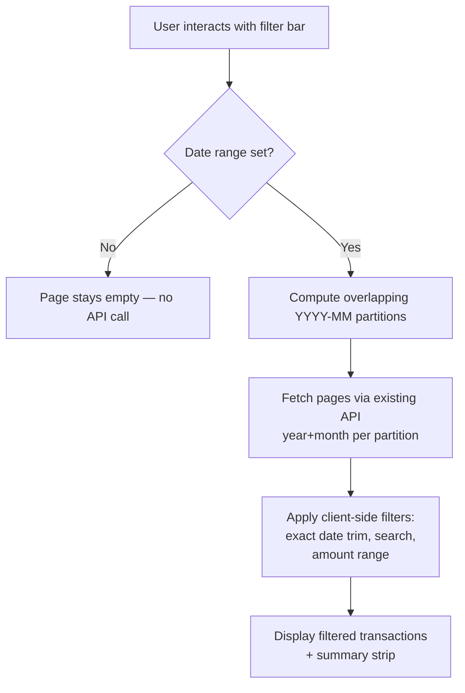
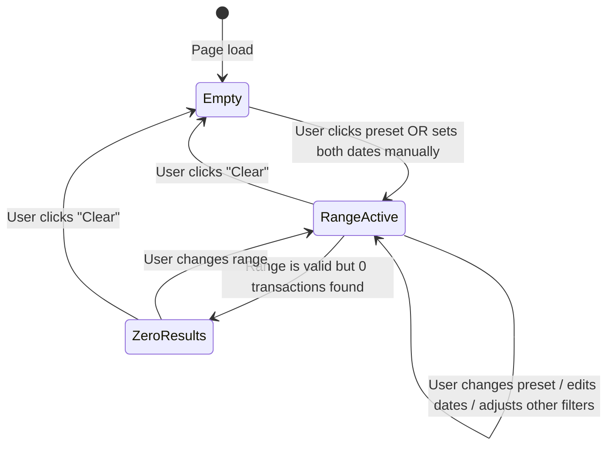

# Date Range Filter — UX Spec

**Author:** Niobe (Spec / UX Analyst)
**Requested by:** Pedro (perocha)
**Date:** 2026-04-16
**Status:** Ready for implementation
**Branch:** `feature/date-range-filter`
**Approach:** Alternative D (frontend-only smart routing) — approved by Pedro

---

## Overview

Replace the year/month dropdown pair with a Material `MatDateRangeInput` + quick-select preset buttons. The page starts **empty** — no transactions load until the user selects a date range or clicks a preset. The existing API (`GET /api/transactions?year=N&month=M`) is **unchanged**; the frontend computes which `YYYY-MM` partitions overlap the selected range and fetches them using the existing month-walk pattern.

---

## 1. User Stories

| ID | Role | Story | Acceptance |
|----|------|-------|------------|
| US-1 | Admin | I want to select a date range so I see transactions in that period | Date range picker populates, transactions load for the selected range |
| US-2 | Admin | I want one-click presets for common ranges (this month, last 30 days, etc.) | Clicking a preset fills the date picker and immediately loads transactions |
| US-3 | Viewer | I want the same filtering experience (read-only) | Filter bar is identical; only write actions (new, edit, delete, split) are hidden per existing RBAC |
| US-4 | Admin | I want to clear my selection and return to the empty state | A "Clear" action resets the date range, removes loaded transactions, shows the empty state |
| US-5 | Admin | I want to see a summary of the currently loaded range | Summary strip shows income/expenses/net/count computed from all loaded transactions in the range |

---

## 2. Filter Bar Layout

### What Changes

| Current | New |
|---------|-----|
| Year dropdown + Month dropdown (first two controls in row 1) | **Preset button row** (new row above existing filters) + **Date range picker** (replaces year/month in row 1) |

### Layout Structure

```
┌──── Filter Bar ──────────────────────────────────────────────────────────┐
│ ROW 0 — Preset Buttons                                                   │
│ [This month] [Last month] [Last 30 days] [This quarter] [Last quarter]  │
│ [This year] [Last year]                                           [Clear]│
├──────────────────────────────────────────────────────────────────────────┤
│ ROW 1 — Primary Filters                                                  │
│ [Date range: From — To 📅]  [Account ▾]  [Category ▾]  [Subcategory ▾] │
│ [Tag ▾]  [Type ▾]                                                        │
├──────────────────────────────────────────────────────────────────────────┤
│ ROW 2 — Secondary Filters                                                │
│ [🔍 Search _______________]  [Min €]  [Max €]  [Categorization ▾]       │
│ [Review status ▾]                                                        │
└──────────────────────────────────────────────────────────────────────────┘
```

### Design Rationale

- **Presets on their own row (row 0):** They are the primary call-to-action on an empty page. Prominent placement, not buried between dropdowns.
- **Date range picker in row 1:** Replaces year + month. Uses Material `MatDateRangeInput` with `MatDatepickerToggle` — standard calendar popup with range selection.
- **Other filters unchanged:** Account, category, subcategory, tag, type, search, amount, categorization, review — all remain in their current positions (shifted left to fill the space freed by removed year/month).

### Preset Button Styling

- Material `mat-button` (flat) by default; `mat-flat-button` (filled, primary color) when the active range matches the preset exactly.
- Compact horizontal row; wraps on narrow screens.
- "Clear" button is right-aligned, uses `mat-stroked-button` with a close (✕) icon. Only visible when a range is active.

---

## 3. Preset Buttons — Exact Definitions

All date logic uses the user's local date (via `new Date()`). "Today" = start of today at 00:00.

| Preset | Label (EN) | Label (ES) | `dateFrom` | `dateTo` |
|--------|-----------|-----------|------------|----------|
| This month | This month | Este mes | 1st of current month | Today |
| Last month | Last month | Mes anterior | 1st of previous month | Last day of previous month |
| Last 30 days | Last 30 days | Últimos 30 días | Today − 30 days | Today |
| This quarter | This quarter | Este trimestre | 1st of current quarter¹ | Today |
| Last quarter | Last quarter | Trimestre anterior | 1st of previous quarter | Last day of previous quarter |
| This year | This year | Este año | January 1 of current year | Today |
| Last year | Last year | Año anterior | January 1 of previous year | December 31 of previous year |

¹ Quarter boundaries: Q1 = Jan–Mar, Q2 = Apr–Jun, Q3 = Jul–Sep, Q4 = Oct–Dec.

### Why these presets?

- **This month / Last month:** The NGO admin's daily workflow — review current activity, close previous month for auditors.
- **Last 30 days:** Rolling window for operational review.
- **This/Last quarter:** Quarterly reporting is standard for NGO treasurers.
- **This/Last year:** Annual review, fiscal year preparation.

### "Custom range"

There is no explicit "Custom range" button. When the user manually edits dates in the `MatDateRangeInput` (typing or calendar popup), the range is a custom range — no preset button highlights. The presets are shortcuts, not the only way to set dates.

---

## 4. Empty State (Page Load)

### Behavior

On page load, **no API calls are made**. The transaction table, summary strip, and "loading more" indicator are all hidden. The filter bar is fully visible with all presets and filters, but no date range is filled.

### Empty State Display

```
┌──── Filter Bar (fully visible, all controls active) ─────────────────┐
│ [This month] [Last month] [Last 30 days] ...                         │
│ [Date range: From — To 📅]  [Account ▾]  [Category ▾] ...           │
│ [🔍 Search ___]  [Min €]  [Max €] ...                               │
├───────────────────────────────────────────────────────────────────────┤
│                                                                       │
│                        📅 (calendar icon, 48px)                       │
│                                                                       │
│        Select a date range to view transactions                       │
│     Selecciona un rango de fechas para ver transacciones             │
│                                                                       │
│        (same preset buttons repeated as action chips)                │
│        [This month]  [Last 30 days]  [This year]                     │
│                                                                       │
└───────────────────────────────────────────────────────────────────────┘
```

### Details

- **Icon:** `calendar_today` (Material icon), 48px, muted color.
- **Message (EN):** "Select a date range to view transactions"
- **Message (ES):** "Selecciona un rango de fechas para ver transacciones"
- **Inline preset shortcuts:** Repeat the 3 most common presets ("This month", "Last 30 days", "This year") as clickable chips below the message. These duplicate the top row buttons — tapping either works identically. The inline chips serve as a call-to-action so the user doesn't need to scan the filter bar.
- **Other filters (account, category, etc.):** Always visible, always enabled. The user can pre-set an account filter before selecting a date range — the filter will apply once transactions load. This avoids a confusing "disabled until date range" pattern.
- **Summary strip:** Hidden (not shown at all, not zeroed).

---

## 5. Active Range Display

### When a Preset is Clicked

1. The preset button gets `mat-flat-button` + primary color (filled). All other presets revert to `mat-button` (flat).
2. The `MatDateRangeInput` fields populate with the computed `dateFrom`/`dateTo`.
3. Transactions load immediately.

### When the User Manually Sets Dates

1. No preset button is highlighted (all flat).
2. The `MatDateRangeInput` shows the user-chosen dates.
3. Transactions load when both `dateFrom` and `dateTo` are set (not on partial input).

### Preset Deselection on Manual Edit

If a preset is active (e.g., "This month" → Apr 1–Apr 16) and the user changes either date in the picker (e.g., changes `dateTo` to Apr 10), the preset button deselects. The range is now "custom." This is purely visual — no data re-fetch until the user commits the date change.

### "Clear" / Reset

- A **"Clear" button** (✕ icon + "Clear" text) appears in the preset row only when a range is active.
- Clicking it: clears `dateFrom`/`dateTo`, deselects all presets, clears loaded transactions, returns to the empty state.
- Other filters (account, category, etc.) are **not** cleared — only the date range resets. This matches user intent: "I want to pick a different period but keep my account filter."

---

## 6. Interaction with Other Filters

### All Filters Are Always Visible and Enabled

No filter is disabled or hidden based on date range state. The user can set account = "CaixaBank" before selecting a date range. When they click "This month," the API calls include the account filter.

### Filter Application Flow



### Server-Side vs Client-Side Filters

| Filter | Applied where | Notes |
|--------|---------------|-------|
| Date range (partition selection) | Server (via year+month params) | Determines which partitions to query |
| Date range (exact boundary trim) | Client | Trims transactions outside the exact from/to dates within boundary months |
| Account | Server (`accountId` param) | Existing behavior |
| Category / Subcategory | Server (`categoryId`, `subcategoryId` params) | Existing behavior |
| Tag | Server (`tagId` param) | Existing behavior |
| Transaction type | Server (`transactionType` param) | Existing behavior |
| Categorization status | Server (`categorizationStatus` param) | Existing behavior |
| Review status | Server (`reviewStatus` param) | Existing behavior |
| Search (text) | Client | Existing behavior — filters loaded transactions |
| Amount range | Client | Existing behavior — filters loaded transactions |

---

## 7. Edge Cases

| Scenario | Behavior |
|----------|----------|
| **Cross-year range** (Dec 2025 – Feb 2026) | Works naturally. Compute partitions: `2025-12`, `2026-01`, `2026-02`. Fetch each via existing API. Client trims to exact dates. |
| **Future date selected** | Allowed — the datepicker does NOT restrict future dates. If the user picks Apr 16 – May 31, the system fetches partitions for Apr and May. If May has no data, the table shows whatever April has. No error. |
| **Start date > End date** | The `MatDateRangeInput` natively prevents this (end date picker disables dates before start). If programmatically set, treat as invalid — no fetch, show validation error on the form field. |
| **Very large range** (e.g., 3 years) | No hard cap. The system computes overlapping partitions (up to 36 months for 3 years). Fetch walks from newest month to oldest, same as current "All months" mode. Performance note: at 200–500 tx/year, even 3 years is ~1500 tx max — fine for client-side handling. |
| **Single-day range** (same date for from and to) | Valid. Compute 1 partition. Client-side trim to that single day. |
| **0 transactions in selected range** | Show the `EmptyStateComponent` with icon `search_off`, message: "No transactions found in this range" / "No se encontraron transacciones en este rango". Summary strip is hidden (same as before-any-selection). The filter bar remains fully visible — the user can adjust their range. |
| **Partial date input** (only `dateFrom` set, `dateTo` empty) | No fetch. Wait until both dates are set. The `MatDateRangeInput` naturally waits for both inputs. Presets always set both simultaneously. |
| **Maximum range** | No enforced maximum. NGO volumes (~500 tx/year) make even multi-year ranges trivial. If future scale requires it, add a warning at 24+ months — not a blocker. |

---

## 8. Summary Strip Behavior

### With Active Range

- Summary strip is **visible** whenever transactions are loaded (i.e., a date range is active and at least one transaction exists).
- **Computation:** Client-side, from `allTransactions[]` (all loaded and date-trimmed transactions). Fields: total income, total expenses, net, transaction count, uncategorized count, transfers total (existing `TransactionSummaryData` interface).
- **Progressive accuracy:** As the month-walk loads more partitions, the summary updates. A shimmer/loading indicator shows until all partitions in the range are fully loaded.

### With No Range Selected (Empty State)

- Summary strip is **hidden** (not rendered). Not zeroed — fully absent.

### With Range Selected but 0 Results

- Summary strip is **hidden**. The empty-results message is enough.

### Multi-Month Aggregate Accuracy

Currently, the API returns per-partition aggregates on the first page response. With multi-month ranges, these per-partition aggregates don't add up correctly when client-side filters (search, amount) narrow the results. **Decision: compute aggregates entirely client-side from `transactions()` (the filtered signal).** This gives accurate totals that reflect all active filters including search and amount range. With ≤500 tx/year, the computation is instant.

---

## 9. TransactionFilters Interface Change

### Current

```typescript
export interface TransactionFilters {
  year: number;
  month: number | null;
  // ...other filters
}
```

### New

```typescript
export interface TransactionFilters {
  dateFrom: string | null;   // ISO date: 'YYYY-MM-DD'
  dateTo: string | null;     // ISO date: 'YYYY-MM-DD'
  // ...other filters unchanged
}
```

- `year` and `month` are removed.
- `dateFrom`/`dateTo` are `null` when no range is selected (empty state).
- The `onFiltersChanged` handler in `transaction-list.component.ts` checks for null dates and skips loading if either is missing.

---

## 10. Loading Behavior — Partition Walk

When a date range is set, the frontend:

1. Computes overlapping `YYYY-MM` partition keys from the range.
   - Example: `2026-03-15` to `2026-04-20` → partitions `['2026-04', '2026-03']` (newest first).
2. Sets `currentMonth` = last partition month, `minMonth` = first partition month, `currentYear` tracking per-partition.
3. Walks from newest to oldest (existing pattern), calling `GET /api/transactions?year=Y&month=M` per partition.
4. After all partitions are loaded, applies client-side date-boundary trim (exclude transactions outside the exact `dateFrom`/`dateTo`).
5. Updates the summary strip with final totals.

For cross-year ranges, the partition list includes entries from both years (e.g., `['2026-02', '2026-01', '2025-12']`). The existing `fetchPage` logic adapts to iterate this list instead of decrementing a month counter within a single year.

---

## 11. Acceptance Criteria

| # | Criterion | Testable? |
|---|-----------|-----------|
| AC-1 | Page loads with no transactions displayed, no API calls made | ✅ — verify network tab is empty on page load |
| AC-2 | Empty state shows calendar icon, message in current locale, and 3 preset shortcuts | ✅ — visual + DOM assertion |
| AC-3 | Clicking a preset button fills the date range picker and loads transactions | ✅ — assert API calls match expected partitions |
| AC-4 | Active preset button is visually highlighted (filled primary) | ✅ — CSS class assertion |
| AC-5 | Manually editing dates deselects any active preset | ✅ — click "This month," change end date, verify no preset highlighted |
| AC-6 | "Clear" button resets to empty state, does not clear other filters | ✅ — verify dateFrom/dateTo null, account filter retained |
| AC-7 | Cross-year range (e.g., Dec 2025 – Feb 2026) correctly fetches all overlapping partitions | ✅ — network tab shows requests for 2025/12, 2026/01, 2026/02 |
| AC-8 | Client-side date trim excludes transactions outside exact range boundaries | ✅ — range Mar 15–Apr 20, verify Mar 14 transaction is excluded |
| AC-9 | Summary strip visible only when transactions are loaded; hidden in empty state and 0-result state | ✅ — DOM presence assertion |
| AC-10 | Summary strip totals match loaded+filtered transactions (not server aggregates) | ✅ — compare DOM values with manual sum of displayed rows |
| AC-11 | 0 results for a valid range shows "No transactions found" message, not the initial empty state | ✅ — different icon (`search_off` vs `calendar_today`) and message text |
| AC-12 | All 7 presets compute correct date ranges (unit testable with fixed "today") | ✅ — inject date, assert dateFrom/dateTo per preset |
| AC-13 | Preset dates recalculate on each click (not cached from page load) | ✅ — test "This month" on Apr 16 vs Apr 17 |
| AC-14 | Other filters (account, category, search, etc.) work in combination with date range | ✅ — set account + "This month," verify filtered results |
| AC-15 | Viewer role sees identical filter bar; no write actions visible | ✅ — existing RBAC tests extend to new filter bar |
| AC-16 | Filter bar is responsive — preset buttons wrap on narrow screens | ✅ — resize viewport, verify no horizontal overflow |

---

## 12. Out of Scope

- **API changes:** No new endpoints, no changes to query parameters. The frontend orchestrates.
- **Export behavior:** Export already has its own `dateFrom`/`dateTo` — no changes needed.
- **Report pages:** Reports have their own filters — not affected.
- **Pagination UX (virtual scroll, etc.):** Separate concern. Infinite scroll remains as-is.
- **Fiscal year customization:** Presets assume calendar quarters. If an NGO uses a different fiscal year, that's a future feature.

---

## Appendix: Mermaid — Filter Bar State Machine


