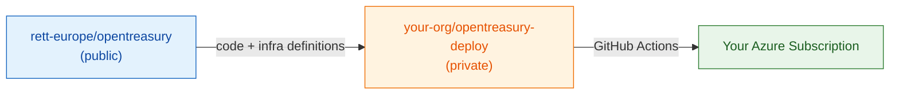
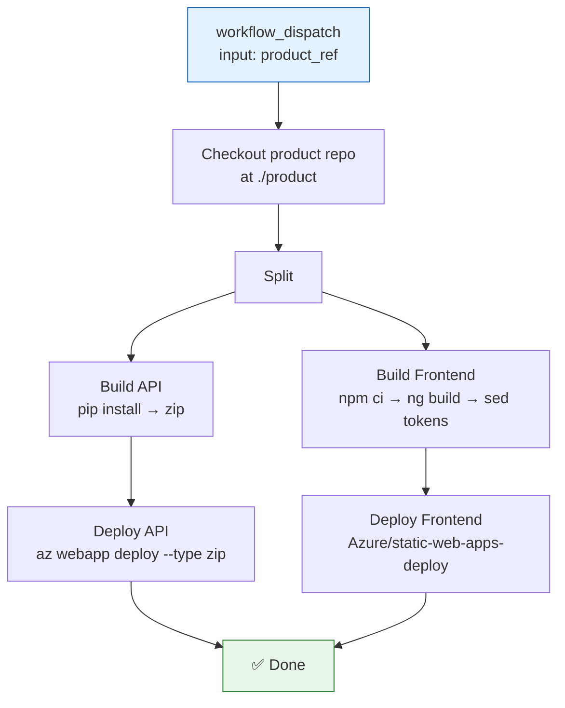
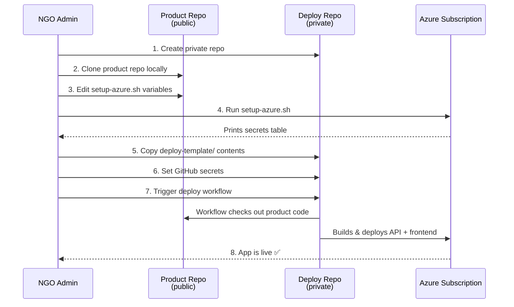

# Deploy Template Specification

> **Author:** Neo (Lead/Architect) · **Requested by:** Pedro  
> **Status:** Draft — awaiting team review  
> **Date:** 2026-04-14

---

## 1. Problem

OpenTreasury is a public product repo (`rett-europe/opentreasury`) designed so any NGO can deploy it to their own Azure subscription. The architecture splits **product code** (public) from **deployment state** (private, per-org). Today, the only reference deployment is `rett-spain/opentreasury-deploy`, and new adopters have no guided path to create their own.

## 2. Goal

Ship a **deploy template** inside the product repo that any organization can copy to bootstrap a private deployment repository and have a working production deployment in **under 30 minutes** (assuming Azure prerequisites are met).

## 3. Architecture — What Goes Where

This is the most important decision in the spec. The product repo already contains substantial deployment infrastructure. The deploy template should be **minimal** — only what's org-specific.

### 3.1 Current State (Already in Product Repo)

| Asset | Location | What it does |
|-------|----------|--------------|
| Bicep IaC | `infra/main.bicep` + 6 modules | Full infrastructure definition (Cosmos, App Service, SWA, Key Vault, App Insights, RBAC) |
| Setup script | `scripts/setup-azure.sh` | One-command provisioning: RG, Entra apps (API + SPA), SP, Bicep deploy, SWA token, secrets printout |
| Teardown script | `scripts/teardown-azure.sh` | Clean removal of all resources |
| PR checks | `.github/workflows/pr-checks.yml` | Lint, format, build, test on every PR |
| Param template | `infra/parameters/dev.bicepparam` | Dev environment parameters (6 lines) |
| Setup guide | `docs/guides/azure-setup.md` | Manual + automated setup instructions |
| Dockerfile | `api/Dockerfile` | Multi-stage Python 3.12 container build |
| Frontend config | `frontend/src/environments/environment.prod.ts` | Production config with `#{...}#` token placeholders |

### 3.2 What the Deploy Template Provides (New)

Only what an adopting org needs in their **private** repo:

| Asset | Purpose |
|-------|---------|
| `.github/workflows/deploy.yml` | Single production deploy workflow (build + deploy API & frontend) |
| `README.md` | Step-by-step adoption guide |

That's it. **Two files.** Here's why:

1. **No `deploy-infra.yml`** — `setup-azure.sh` is already idempotent and handles full provisioning. Infra changes are rare; re-running the script covers them. A separate infra workflow adds complexity for minimal value.
2. **No `prod.bicepparam` in deploy repo** — Bicep parameters are passed inline by `setup-azure.sh`. The `using` path in `.bicepparam` files creates fragile cross-repo path dependencies. If an org wants param customization, they edit the clearly-labeled variables at the top of `setup-azure.sh`.
3. **No Dockerfile** — Already in the product repo. The workflow checks out the product repo directly.
4. **No infra modules** — Entirely in the product repo. DRY.

### 3.3 Architectural Principle



**Product repo** = what to deploy. **Deploy repo** = how to deploy it for your org.

## 4. Secrets Reference — 7 Required

The reference draft listed 12 secrets. After auditing the actual codebase, **7 are needed**. The rest are either stored in Key Vault, derived in the workflow, or unnecessary.

### 4.1 Required GitHub Secrets

| # | Secret | Source | Example |
|---|--------|--------|---------|
| 1 | `AZURE_CREDENTIALS` | Service principal JSON from `setup-azure.sh` | `{"clientId":"...","clientSecret":"...","subscriptionId":"...","tenantId":"..."}` |
| 2 | `AZURE_RESOURCE_GROUP` | Resource group name | `rg-opentreasury-prod` |
| 3 | `AZURE_WEBAPP_NAME` | App Service name (from Bicep naming: `app-{project}-{env}`) | `app-opentreasury-prod` |
| 4 | `AZURE_STATIC_WEB_APPS_API_TOKEN` | SWA deployment token from `setup-azure.sh` output | `(long token)` |
| 5 | `MSAL_CLIENT_ID` | SPA app registration client ID | `xxxxxxxx-xxxx-...` |
| 6 | `MSAL_API_SCOPE` | API scope URI | `api://opentreasury-api/access_as_user` |
| 7 | `SWA_HOSTNAME` | Static Web App default hostname | `blue-coast-abc123.azurestaticapps.net` |

### 4.2 Values Derived in Workflow (Not Secrets)

| Value | Derived from | Formula |
|-------|-------------|---------|
| `AZURE_TENANT_ID` | `AZURE_CREDENTIALS` | `echo "$creds" \| jq -r .tenantId` |
| `AZURE_SUBSCRIPTION_ID` | `AZURE_CREDENTIALS` | `echo "$creds" \| jq -r .subscriptionId` |
| `API_BASE_URL` | `AZURE_WEBAPP_NAME` | `https://${AZURE_WEBAPP_NAME}.azurewebsites.net/api` |
| `SWA_URL` | `SWA_HOSTNAME` | `https://${SWA_HOSTNAME}` |

### 4.3 Values NOT Needed as Secrets (Handled Elsewhere)

| Dropped | Reason |
|---------|--------|
| `COSMOS_ENDPOINT` | Stored in Key Vault; App Service reads via Key Vault reference (`@Microsoft.KeyVault(...)`) |
| `COSMOS_KEY` | Not used in production — Managed Identity + RBAC handles Cosmos auth |
| `API_CLIENT_ID` | Stored in Key Vault; App Service reads via Key Vault reference |
| `AZURE_TENANT_ID` | Stored in Key Vault + derivable from `AZURE_CREDENTIALS` |
| `AZURE_SUBSCRIPTION_ID` | Derivable from `AZURE_CREDENTIALS` |

> **🔒 Switch review requested:** Confirm that deriving `AZURE_TENANT_ID` from `AZURE_CREDENTIALS` JSON is acceptable vs. storing it as a separate secret. The credential JSON is already a secret, so extracting fields from it shouldn't reduce security posture.

## 5. Deploy Workflow Specification

### 5.1 Trigger

```yaml
on:
  workflow_dispatch:        # Manual trigger (primary — adopters control when to deploy)
    inputs:
      product_ref:
        description: 'Product repo ref (tag, branch, or SHA)'
        default: 'main'
        type: string
  # Optional: uncomment for auto-deploy on dispatch
  # repository_dispatch:
  #   types: [product-release]
```

**Manual dispatch only** for v1. Adopters decide when to pull new product versions. Auto-deploy can be enabled later.

### 5.2 Workflow Structure



### 5.3 Key Workflow Steps

#### a) Checkout

```yaml
- uses: actions/checkout@v4
  with:
    repository: rett-europe/opentreasury
    ref: ${{ inputs.product_ref || 'main' }}
    path: product
```

The deploy repo itself is not checked out — only the product repo is needed.

#### b) Build API

```yaml
- name: Build API package
  working-directory: product/api
  run: |
    pip install -r requirements.txt --target .python_packages/lib/site-packages
    zip -r ${{ github.workspace }}/api-deploy.zip . \
      -x '.venv/*' 'tests/*' '*.pyc' '__pycache__/*' '.env*'
```

**Why zip with `.python_packages/`:** The App Service uses `WEBSITE_RUN_FROM_PACKAGE=1` (read-only filesystem). The existing `startup.sh` expects packages at `.python_packages/lib/site-packages` and adds it to `PYTHONPATH`. This pre-packaging approach matches the existing startup script exactly.

#### c) Build Frontend with Token Replacement

```yaml
- name: Build frontend
  working-directory: product/frontend
  run: |
    npm ci
    npx ng build --configuration=production

- name: Replace environment tokens
  working-directory: product/frontend/dist/frontend/browser
  run: |
    # Derive values
    API_BASE_URL="https://${{ secrets.AZURE_WEBAPP_NAME }}.azurewebsites.net/api"
    SWA_URL="https://${{ secrets.SWA_HOSTNAME }}"
    TENANT_ID=$(echo '${{ secrets.AZURE_CREDENTIALS }}' | jq -r .tenantId)

    # Replace #{...}# tokens in compiled JS files
    find . -name '*.js' -exec sed -i \
      -e "s|#{API_BASE_URL}#|${API_BASE_URL}|g" \
      -e "s|#{MSAL_CLIENT_ID}#|${{ secrets.MSAL_CLIENT_ID }}|g" \
      -e "s|#{MSAL_TENANT_ID}#|${TENANT_ID}|g" \
      -e "s|#{MSAL_API_SCOPE}#|${{ secrets.MSAL_API_SCOPE }}|g" \
      -e "s|#{SWA_URL}#|${SWA_URL}|g" \
      {} +
```

**Token mapping** (from `frontend/src/environments/environment.prod.ts`):

| Token in source | Replaced with |
|-----------------|---------------|
| `#{API_BASE_URL}#` | `https://{AZURE_WEBAPP_NAME}.azurewebsites.net/api` |
| `#{MSAL_CLIENT_ID}#` | `MSAL_CLIENT_ID` secret |
| `#{MSAL_TENANT_ID}#` | Extracted from `AZURE_CREDENTIALS` |
| `#{MSAL_API_SCOPE}#` | `MSAL_API_SCOPE` secret |
| `#{SWA_URL}#` | `https://{SWA_HOSTNAME}` |

#### d) Deploy API

```yaml
- name: Azure Login
  uses: azure/login@v2
  with:
    creds: ${{ secrets.AZURE_CREDENTIALS }}

- name: Deploy API to App Service
  run: |
    az webapp deploy \
      --resource-group ${{ secrets.AZURE_RESOURCE_GROUP }} \
      --name ${{ secrets.AZURE_WEBAPP_NAME }} \
      --src-path ${{ github.workspace }}/api-deploy.zip \
      --type zip
```

#### e) Deploy Frontend

```yaml
- name: Deploy Frontend to SWA
  uses: Azure/static-web-apps-deploy@v1
  with:
    azure_static_web_apps_api_token: ${{ secrets.AZURE_STATIC_WEB_APPS_API_TOKEN }}
    action: upload
    app_location: product/frontend/dist/frontend/browser
    skip_app_build: true
    skip_api_build: true
```

Note: `skip_app_build: true` because we already built with `ng build` in a previous step (to control the token replacement).

## 6. Deploy Template Directory Structure

```
deploy-template/
├── README.md                              # Adoption guide (primary deliverable)
└── .github/
    └── workflows/
        └── deploy.yml                     # Production deploy workflow
```

### 6.1 README.md Content (Outline)

The adoption README should cover:

1. **Prerequisites** — Azure subscription, Entra ID admin, GitHub repo admin, Azure CLI
2. **Step 1: Create your deploy repo** — `gh repo create your-org/opentreasury-deploy --private`
3. **Step 2: Copy template files** — Copy contents from `deploy-template/` to new repo
4. **Step 3: Provision Azure** — Clone product repo, customize `setup-azure.sh` variables, run it
5. **Step 4: Set GitHub secrets** — Table matching `setup-azure.sh` output → secret names
6. **Step 5: First deploy** — Trigger workflow manually
7. **Step 6: Verify** — Checklist (SWA loads, login works, API responds)
8. **Updating** — How to pull new product versions (change `product_ref` input)
9. **Troubleshooting** — Common issues and fixes

### 6.2 Product Repo README Update

Add a "Deploy to Your Azure" section to the main `README.md`:

```markdown
## Deploy to Your Azure

OpenTreasury is designed for any organization to deploy. See the
[deploy template](deploy-template/) for a guided setup that gets you running
in under 30 minutes.

**What you'll need:** An Azure subscription, admin access to your
Microsoft Entra ID tenant, and a private GitHub repository.
```

## 7. Adoption Flow



## 8. Known Deployment Gotchas

These are real issues discovered from the codebase. The deploy template README must document each one.

### 8.1 `WEBSITE_RUN_FROM_PACKAGE=1` — Read-Only Filesystem

Set in `infra/modules/app-service.bicep`. The API zip is mounted read-only. Implications:
- No writing to the app directory at runtime
- Packages must be pre-installed into the zip (not installed on the server)
- The `startup.sh` handles this via `PYTHONPATH` pointing to `.python_packages/`

### 8.2 Bicep `appSettings` is Replace-All

When `app-service.bicep` deploys, it **replaces** all app settings with the ones in the template. Any manually-added app settings in the Azure Portal get wiped. All settings must be in Bicep.

### 8.3 `AZURE_CLIENT_ID` Env Var Collision

The app uses `AZURE_CLIENT_ID` for JWT validation (the API app registration's client ID). However, `DefaultAzureCredential` in the Azure SDK also reads `AZURE_CLIENT_ID` to determine which managed identity to use. Since the App Service uses **System Assigned Managed Identity**, `DefaultAzureCredential` should fall through to the MSI endpoint. But this can cause confusing behavior if debugging auth issues.

> **🔒 Switch review requested:** Evaluate whether we should rename this env var to `API_AUTH_CLIENT_ID` or similar to avoid the `DefaultAzureCredential` collision. This would require changes in `config.py`, `key-vault.bicep`, and `app-service.bicep`.

### 8.4 Service Principal Role Requirements

The SP created by `setup-azure.sh` gets **Contributor** on the resource group. For the deploy workflow (code deployment only), this is sufficient. If the SP also needs to manage role assignments (e.g., re-running Bicep with role-assignments module), it needs **User Access Administrator** as well.

> **⚙️ Tank review requested:** Confirm whether the `az webapp deploy` command needs only Contributor, or if additional RBAC is needed for zip deploy. Also evaluate whether `az ad sp create-for-rbac --role Contributor` is sufficient for the workflow or if we should scope it tighter (e.g., Website Contributor).

### 8.5 Frontend Token Placeholder Format

`environment.prod.ts` uses `#{TOKEN_NAME}#` delimiters. The `sed` replacement in the workflow must match this exact format. If Angular's build process mangled the delimiters (e.g., string splitting in compiled JS), tokens might not replace correctly.

The tokens survive Angular's production build because they're string literals — the AOT compiler preserves them verbatim in the output JS.

### 8.6 `SCM_DO_BUILD_DURING_DEPLOYMENT` Interaction

This is set to `true` in `app-service.bicep`. When using `WEBSITE_RUN_FROM_PACKAGE=1`, Oryx's build step is skipped for the mounted zip but SCM might still attempt to build during non-zip deployments. The workflow uses `az webapp deploy --type zip`, which correctly bypasses Oryx.

### 8.7 SWA `staticwebapp.config.json` Location

The `staticwebapp.config.json` must be in the deployed output directory (`dist/frontend/browser/`). The Angular build copies it from `frontend/src/staticwebapp.config.json` via `angular.json` assets config. Verify this is included in the build output.

## 9. Acceptance Criteria

### Must Have (v1)

- [ ] `deploy-template/` directory exists in the product repo with `README.md` and `deploy.yml`
- [ ] A fresh adopter can follow the README end-to-end: provision Azure, set secrets, deploy successfully
- [ ] The deploy workflow checks out the product repo at a configurable ref (tag/branch/SHA)
- [ ] API deploys to App Service via zip deploy and responds at `/api/health`
- [ ] Frontend deploys to SWA with all `#{...}#` tokens replaced correctly
- [ ] MSAL login works end-to-end (redirects to Entra, returns with token, API calls succeed)
- [ ] The deploy workflow uses only the 7 specified secrets (no extras)
- [ ] `setup-azure.sh` output maps 1:1 to the secrets the workflow expects
- [ ] Product repo `README.md` has a "Deploy to Your Azure" section linking to the template

### Should Have (v1 stretch)

- [ ] The workflow runs in under 10 minutes
- [ ] The README includes a troubleshooting section for the 7 gotchas documented above
- [ ] The workflow includes a smoke-test step (curl `/api/health` after deploy)

### Won't Have (v1)

- [ ] Multi-environment support (dev/staging/prod in one deploy repo)
- [ ] Infrastructure-as-code in the deploy workflow (setup-azure.sh is the infra path)
- [ ] Custom domain configuration
- [ ] GitHub template repository feature (evaluating for v2)
- [ ] Automated release notifications from product → deploy repos
- [ ] Container-based deployment (Dockerfile exists but App Service uses Python runtime today)

## 10. Open Questions for Team Review

### For Tank (DevOps)

1. **Zip deploy vs. container deploy:** App Service currently uses `PYTHON|3.12` runtime with `WEBSITE_RUN_FROM_PACKAGE=1`. A Dockerfile exists. Should the deploy workflow use zip deploy (simpler, matches current config) or container deploy (more portable, matches Dockerfile)? **Recommendation:** Zip deploy for v1, container path documented for v2.

2. **Workflow concurrency:** Should the deploy workflow use concurrency groups to prevent overlapping deploys?

3. **Build caching:** Should the workflow cache `node_modules/` and pip packages for faster builds?

4. **Startup script path:** The `startup.sh` is checked in at `api/startup.sh`. When deployed via zip, does App Service find it? Or does it need explicit `STARTUP_COMMAND` configuration?

### For Switch (Security)

1. **`AZURE_CLIENT_ID` env var collision** (see §8.3) — rename or document-and-accept?

2. **Secret minimization:** Are we comfortable deriving `AZURE_TENANT_ID` from the `AZURE_CREDENTIALS` JSON in workflow logs? The `jq` extraction happens in a GitHub Actions step, so it's in the runner's memory but not logged (if we use `::add-mask::`).

3. **SP scope:** Should the service principal be scoped to individual resources (App Service + SWA) instead of the entire resource group?

4. **`COSMOS_KEY` in config.py:** The API has `COSMOS_KEY: str = ""` as an optional field. In production, this is empty and Managed Identity is used. Should we add a startup check that warns if `COSMOS_KEY` is set in a production environment?

## 11. Out of Scope

| Item | Reason |
|------|--------|
| GitHub template repository feature | Requires GitHub admin setup per-org; evaluate for v2 |
| Multi-environment support | Adds complexity; each environment can be a separate deploy repo |
| Custom domain + TLS | Org-specific; document as post-deploy optional step |
| Automated product → deploy sync | Adopters control when to update; manual dispatch is intentional |
| PowerShell equivalent of deploy workflow | `setup-azure.ps1` exists for provisioning; CI runs on Linux |
| Monitoring/alerting setup | Already handled by App Insights module in Bicep |

## 12. Dependencies

| Dependency | Status |
|-----------|--------|
| `infra/main.bicep` + modules | ✅ Exists, complete |
| `scripts/setup-azure.sh` | ✅ Exists, comprehensive |
| `frontend/src/environments/environment.prod.ts` with `#{...}#` tokens | ✅ Exists |
| `api/startup.sh` | ✅ Exists |
| `.github/workflows/pr-checks.yml` | ✅ Exists (not modified by this feature) |
| `docs/guides/azure-setup.md` | ✅ Exists (link from template README) |

No blockers. All infrastructure is already in place.

## 13. Implementation Notes

### Estimated Effort

| Task | Estimate | Owner |
|------|----------|-------|
| `deploy-template/.github/workflows/deploy.yml` | Small | Tank (DevOps) |
| `deploy-template/README.md` (adoption guide) | Medium | Tank + Neo |
| Product `README.md` update | Small | Neo |
| End-to-end test with a fresh Azure subscription | Medium | Tank + Switch |
| Gotchas documentation in README | Small | Tank |

### Implementation Order

1. Write `deploy.yml` workflow
2. Write `deploy-template/README.md`
3. Update product `README.md`
4. Test end-to-end with a clean subscription
5. Security review of secrets handling
