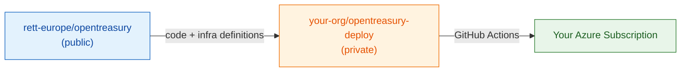
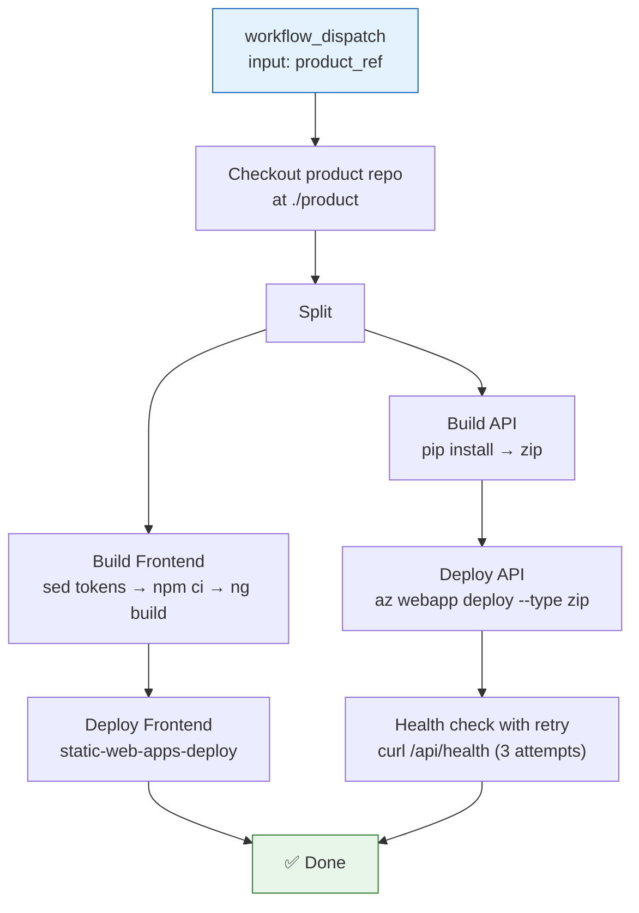
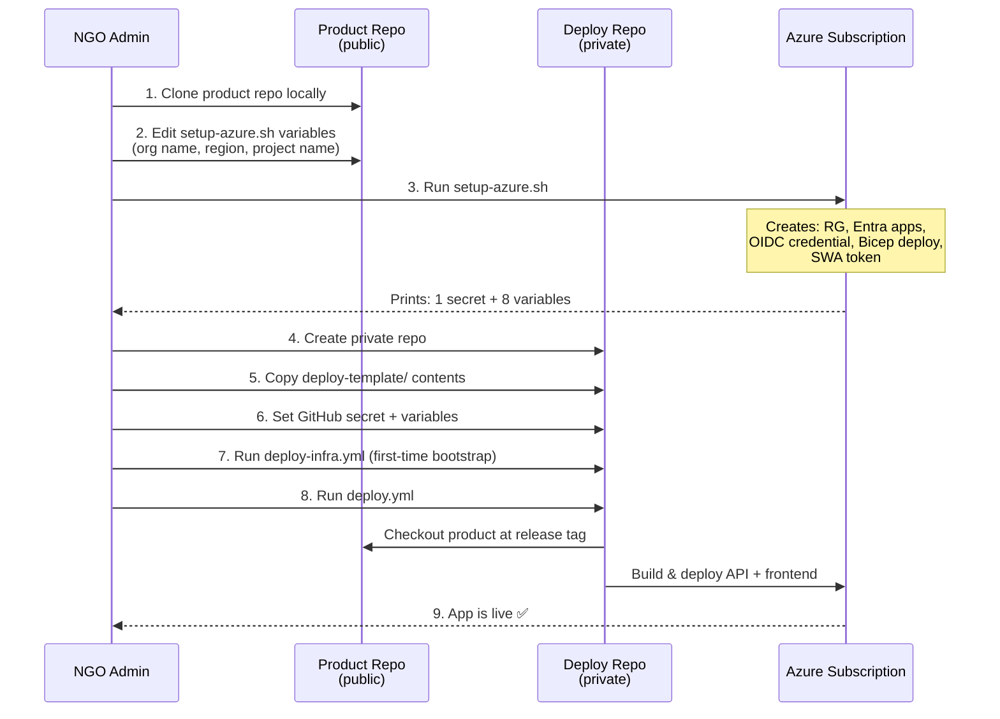

# Deploy Template Specification

> **Author:** Neo (Lead/Architect) · **Requested by:** Pedro  
> **Status:** Draft v2 — incorporating Switch (security) + Tank (DevOps) reviews  
> **Date:** 2026-04-14  
> **Revision:** v2 — OIDC auth, secret/variable reclassification, Bicep hardening, versioning strategy, adopter lifecycle

---

## 1. Problem

OpenTreasury is a public product repo (`rett-europe/opentreasury`) designed so any NGO can deploy it to their own Azure subscription. The architecture splits **product code** (public) from **deployment state** (private, per-org). Today, the only reference deployment is `rett-spain/opentreasury-deploy`, and new adopters have no guided path to create their own.

## 2. Goal

Ship a **deploy template** inside the product repo that any organization can copy to bootstrap a private deployment repository and have a working production deployment in **under 30 minutes** (assuming Azure prerequisites are met).

## 3. Architecture — What Goes Where

This is the most important decision in the spec. The product repo already contains substantial deployment infrastructure. The deploy template should be **minimal** — only what's org-specific.

### 3.1 Current State (Already in Product Repo)

| Asset | Location | What it does |
|-------|----------|--------------|
| Bicep IaC | `infra/main.bicep` + 6 modules | Full infrastructure definition (Cosmos, App Service, SWA, Key Vault, App Insights, RBAC) |
| Setup script | `scripts/setup-azure.sh` | One-command provisioning: RG, Entra apps (API + SPA), SP, OIDC federated credential, Bicep deploy, SWA token, secrets printout |
| Teardown script | `scripts/teardown-azure.sh` | Clean removal of all resources |
| PR checks | `.github/workflows/pr-checks.yml` | Lint, format, build, test on every PR |
| Param template | `infra/parameters/dev.bicepparam` | Dev environment parameters (6 lines) |
| Setup guide | `docs/guides/azure-setup.md` | Manual + automated setup instructions |
| Dockerfile | `api/Dockerfile` | Multi-stage Python 3.12 container build |
| Frontend config | `frontend/src/environments/environment.prod.ts` | Production config with `#{...}#` token placeholders |

### 3.2 What the Deploy Template Provides (New)

Only what an adopting org needs in their **private** repo:

| Asset | Purpose |
|-------|---------|
| `.github/workflows/deploy.yml` | Code deployment workflow (build + deploy API & frontend) |
| `.github/workflows/deploy-infra.yml` | Infrastructure deployment workflow (Bicep, first-time bootstrap + infra changes) |
| `README.md` | Step-by-step adoption guide |

**Three files.** Here's why:

1. **Separate `deploy-infra.yml`** — Different permission scopes: code deploy needs only Website Contributor + SWA token; infra deploy needs Contributor + User Access Administrator for RBAC assignments. Principle of least privilege. (Adopted from Tank's recommendation, endorsed by Switch.)
2. **No `prod.bicepparam` in deploy repo** — `using` path in `.bicepparam` files creates fragile cross-repo path dependencies. `deploy-infra.yml` passes parameters inline.
3. **No Dockerfile** — Already in the product repo. Workflows check out the product repo directly.
4. **No infra modules** — Entirely in the product repo. DRY.

### 3.3 Architectural Principle



**Product repo** = what to deploy. **Deploy repo** = how to deploy it for your org.

## 4. Security Posture

> Incorporates Switch's full security review. Switch has final say on security decisions — all must-fix items adopted without exception.

### 4.1 Workflow Auth: OIDC Federation (Mandatory)

**No persistent credentials.** The deploy repo uses [OIDC federation](https://learn.microsoft.com/en-us/entra/workload-id/workload-identity-federation) for all Azure operations. This replaces the legacy `AZURE_CREDENTIALS` service principal JSON.

**How it works:**
1. `setup-azure.sh` creates an Entra ID app registration with a **federated credential** whose `subject` matches the adopter's deploy repo.
2. GitHub Actions requests a short-lived token (5-10 min) from Entra ID via OIDC.
3. No client secrets are stored, rotated, or leaked.

**Federated credential subject claims:**

| Workflow | Subject pattern |
|----------|----------------|
| `deploy.yml` | `repo:{org}/{repo}:ref:refs/heads/main` |
| `deploy-infra.yml` | `repo:{org}/{repo}:ref:refs/heads/main` |

> **NGO fork caveat:** Each adopting org must configure the `subject` claim to match their own repo path. `setup-azure.sh` handles this automatically if the org passes their repo name as a parameter.

### 4.2 Secret and Variable Classification

Switch's review reduced secrets from 7 to **1 actual GitHub Secret**. Everything else is a GitHub Variable (non-sensitive) or eliminated entirely.

#### GitHub Secrets (1)

| # | Secret | Source | Why it's a secret |
|---|--------|--------|-------------------|
| 1 | `AZURE_STATIC_WEB_APPS_API_TOKEN` | SWA deployment token from `setup-azure.sh` | Bearer token granting SWA deploy access |

#### GitHub Variables (8)

| # | Variable | Source | Example |
|---|----------|--------|---------|
| 1 | `AZURE_CLIENT_ID` | OIDC app registration client ID | `xxxxxxxx-xxxx-...` |
| 2 | `AZURE_TENANT_ID` | Entra ID tenant ID | `xxxxxxxx-xxxx-...` |
| 3 | `AZURE_SUBSCRIPTION_ID` | Azure subscription ID | `xxxxxxxx-xxxx-...` |
| 4 | `AZURE_RESOURCE_GROUP` | Resource group name | `rg-opentreasury-prod` |
| 5 | `AZURE_WEBAPP_NAME` | App Service name | `app-opentreasury-prod` |
| 6 | `MSAL_CLIENT_ID` | SPA app registration client ID | `xxxxxxxx-xxxx-...` |
| 7 | `MSAL_API_SCOPE` | API scope URI | `api://opentreasury-api/access_as_user` |
| 8 | `SWA_HOSTNAME` | Static Web App hostname | `blue-coast-abc123.azurestaticapps.net` |

#### Eliminated (from original 12)

| Dropped | Reason |
|---------|--------|
| `AZURE_CREDENTIALS` | Replaced by OIDC federation — no persistent SP credentials |
| `COSMOS_ENDPOINT` | Stored in Key Vault; App Service reads via Key Vault reference |
| `COSMOS_KEY` | **Must not exist as a secret.** App uses Managed Identity at runtime. Flagged as C4 in security scan. |

#### Values Derived in Workflow

| Value | Derived from | Formula |
|-------|-------------|---------|
| `API_BASE_URL` | `AZURE_WEBAPP_NAME` | `https://${AZURE_WEBAPP_NAME}.azurewebsites.net/api` |
| `SWA_URL` | `SWA_HOSTNAME` | `https://${SWA_HOSTNAME}` |

### 4.3 Bicep Hardening

Required changes to existing Bicep modules:

| Module | Property | Value | Why |
|--------|----------|-------|-----|
| `infra/modules/cosmos-db.bicep` | `disableLocalAuth` | `true` | Forces Managed Identity only — no connection string/key auth. Eliminates COSMOS_KEY attack vector entirely. |
| `infra/modules/key-vault.bicep` | `enablePurgeProtection` | `true` | Prevents permanent secret deletion (even by admins). Required for production Key Vault per Azure Well-Architected Framework. |

### 4.4 GitHub Actions Hardening

All workflows must follow these rules:

**SHA pinning:** All third-party actions must be pinned to a full commit SHA, not a mutable tag. Tags can be moved to point at malicious commits.

```yaml
# ❌ Wrong — tag can be moved
- uses: azure/login@v2

# ✅ Correct — immutable SHA
- uses: azure/login@a457da9ea143d694b1b9c7c869eed04575f8b2db  # v2.3.0
```

**Explicit permissions:** Every workflow must declare the minimum required permissions. GitHub defaults to broad `write-all` unless restricted.

```yaml
permissions:
  id-token: write    # Required for OIDC federation
  contents: read     # Required for actions/checkout
```

### 4.5 AZURE_CLIENT_ID Rename

**Problem:** The codebase uses `AZURE_CLIENT_ID` in `config.py` for JWT audience validation (the API app registration's client ID). Meanwhile, `DefaultAzureCredential` also reads `AZURE_CLIENT_ID` to identify which managed identity to use. These are different values serving different purposes on the same machine.

**Resolution:** Rename the app-level env var to `ENTRA_API_CLIENT_ID`. This is a coordinated change across:

| File | Change |
|------|--------|
| `api/app/config.py` | `AZURE_CLIENT_ID` → `ENTRA_API_CLIENT_ID` |
| `infra/modules/key-vault.bicep` | Secret name update |
| `infra/modules/app-service.bicep` | App setting name update |
| `scripts/setup-azure.sh` | Variable name update |

The OIDC variable `AZURE_CLIENT_ID` in GitHub Variables (§4.2) refers to the **OIDC app registration**, not the API app registration. These are now clearly distinct.

## 5. Deploy Workflow Specification

### 5.1 `deploy.yml` — Code Deployment

#### Trigger

```yaml
on:
  workflow_dispatch:
    inputs:
      product_ref:
        description: 'Product repo ref (tag, branch, or SHA). Use a release tag like v1.2.0 for production.'
        default: 'main'
        type: string
```

Manual dispatch only for v1. Adopters decide when to pull new product versions.

#### Permissions & Auth

```yaml
permissions:
  id-token: write    # OIDC token request
  contents: read     # Checkout

jobs:
  deploy:
    runs-on: ubuntu-latest
    steps:
      - name: Azure Login (OIDC)
        uses: azure/login@a457da9ea143d694b1b9c7c869eed04575f8b2db  # v2.3.0
        with:
          client-id: ${{ vars.AZURE_CLIENT_ID }}
          tenant-id: ${{ vars.AZURE_TENANT_ID }}
          subscription-id: ${{ vars.AZURE_SUBSCRIPTION_ID }}
```

#### Workflow Structure



#### Key Steps

**a) Checkout**

```yaml
- uses: actions/checkout@11bd71901bbe5b1630ceea73d27597364c9af683  # v4.2.2
  with:
    repository: rett-europe/opentreasury
    ref: ${{ inputs.product_ref || 'main' }}
    path: product
```

**b) Build Frontend with Token Replacement (sed-before-build)**

Token replacement happens **before** `ng build`, not after. This is Tank's recommendation — replacing in source TypeScript is more reliable than in compiled/minified JS.

```yaml
- name: Replace environment tokens
  working-directory: product/frontend/src/environments
  run: |
    API_BASE_URL="https://${{ vars.AZURE_WEBAPP_NAME }}.azurewebsites.net/api"
    SWA_URL="https://${{ vars.SWA_HOSTNAME }}"

    sed -i \
      -e "s|#{API_BASE_URL}#|${API_BASE_URL}|g" \
      -e "s|#{MSAL_CLIENT_ID}#|${{ vars.MSAL_CLIENT_ID }}|g" \
      -e "s|#{MSAL_TENANT_ID}#|${{ vars.AZURE_TENANT_ID }}|g" \
      -e "s|#{MSAL_API_SCOPE}#|${{ vars.MSAL_API_SCOPE }}|g" \
      -e "s|#{SWA_URL}#|${SWA_URL}|g" \
      environment.prod.ts

- name: Build frontend
  working-directory: product/frontend
  run: |
    npm ci
    npx ng build --configuration=production
```

**Token mapping** (from `frontend/src/environments/environment.prod.ts`):

| Token in source | Replaced with | Source |
|-----------------|---------------|--------|
| `#{API_BASE_URL}#` | `https://{AZURE_WEBAPP_NAME}.azurewebsites.net/api` | Derived from variable |
| `#{MSAL_CLIENT_ID}#` | SPA app registration client ID | `vars.MSAL_CLIENT_ID` |
| `#{MSAL_TENANT_ID}#` | Entra ID tenant ID | `vars.AZURE_TENANT_ID` |
| `#{MSAL_API_SCOPE}#` | API scope URI | `vars.MSAL_API_SCOPE` |
| `#{SWA_URL}#` | `https://{SWA_HOSTNAME}` | Derived from variable |

> Note: None of these values are secrets. All come from GitHub Variables via `vars.*`.

**c) Build API**

```yaml
- name: Build API package
  working-directory: product/api
  run: |
    pip install -r requirements.txt --target .python_packages/lib/site-packages
    zip -r ${{ github.workspace }}/api-deploy.zip . \
      -x '.venv/*' 'tests/*' '*.pyc' '__pycache__/*' '.env*'
```

**Why zip with `.python_packages/`:** App Service uses `WEBSITE_RUN_FROM_PACKAGE=1` (read-only filesystem). The existing `startup.sh` expects packages at `.python_packages/lib/site-packages` and adds it to `PYTHONPATH`.

**d) Deploy API**

```yaml
- name: Deploy API to App Service
  run: |
    az webapp deploy \
      --resource-group ${{ vars.AZURE_RESOURCE_GROUP }} \
      --name ${{ vars.AZURE_WEBAPP_NAME }} \
      --src-path ${{ github.workspace }}/api-deploy.zip \
      --type zip
```

**e) Deploy Frontend**

```yaml
- name: Deploy Frontend to SWA
  uses: Azure/static-web-apps-deploy@1a947af9992250f3bc2e68ad0763e334a11e60d9  # v1.0.0
  with:
    azure_static_web_apps_api_token: ${{ secrets.AZURE_STATIC_WEB_APPS_API_TOKEN }}
    action: upload
    app_location: product/frontend/dist/frontend/browser
    skip_app_build: true
    skip_api_build: true
```

**f) Health Check with Retry**

RBAC role assignments (Key Vault access, Cosmos DB access) can take 5-10 minutes to propagate on first deploy. The health check retries to accommodate this.

```yaml
- name: Health check (with retry for RBAC propagation)
  run: |
    API_URL="https://${{ vars.AZURE_WEBAPP_NAME }}.azurewebsites.net/api/health"
    for i in 1 2 3; do
      echo "Health check attempt $i..."
      STATUS=$(curl -s -o /dev/null -w "%{http_code}" "$API_URL" || true)
      if [ "$STATUS" = "200" ]; then
        echo "✅ API healthy"
        exit 0
      fi
      echo "Got HTTP $STATUS, waiting 60s..."
      sleep 60
    done
    echo "❌ API health check failed after 3 attempts"
    exit 1
```

### 5.2 `deploy-infra.yml` — Infrastructure Deployment

Separate workflow with broader permissions. Used for first-time bootstrap and infrastructure changes.

```yaml
name: Deploy Infrastructure
on:
  workflow_dispatch:
    inputs:
      product_ref:
        description: 'Product repo ref for Bicep modules'
        default: 'main'
        type: string

permissions:
  id-token: write
  contents: read

jobs:
  deploy-infra:
    runs-on: ubuntu-latest
    steps:
      - uses: actions/checkout@11bd71901bbe5b1630ceea73d27597364c9af683  # v4.2.2
        with:
          repository: rett-europe/opentreasury
          ref: ${{ inputs.product_ref || 'main' }}
          path: product

      - name: Azure Login (OIDC)
        uses: azure/login@a457da9ea143d694b1b9c7c869eed04575f8b2db  # v2.3.0
        with:
          client-id: ${{ vars.AZURE_CLIENT_ID }}
          tenant-id: ${{ vars.AZURE_TENANT_ID }}
          subscription-id: ${{ vars.AZURE_SUBSCRIPTION_ID }}

      - name: Deploy Bicep
        uses: azure/arm-deploy@a1361c2c2cd2e944d2ae6b48b598b3090c7d9ca0  # v2.0.0
        with:
          resourceGroupName: ${{ vars.AZURE_RESOURCE_GROUP }}
          template: product/infra/main.bicep
          parameters: >-
            projectName=${{ vars.PROJECT_NAME || 'opentreasury' }}
            environment=prod
```

> The OIDC app registration for `deploy-infra.yml` needs **Contributor + User Access Administrator** on the resource group (for RBAC assignments in `role-assignments.bicep`). This is a broader scope than `deploy.yml` — hence the separation.

## 6. Solution Versioning Strategy

### 6.1 What Gets "Released"

A **release** is a git tag on the product repo (`rett-europe/opentreasury`) plus a GitHub Release with changelog. No binary artifacts — the product is source code deployed to Azure.

```
rett-europe/opentreasury
├── v1.0.0  ← git tag (immutable)
├── v1.1.0  ← git tag
├── v1.2.0  ← git tag (latest release)
└── main    ← development head (bleeding edge)
```

### 6.2 Versioning Scheme

Semantic versioning (`vMAJOR.MINOR.PATCH`):

| Bump | When | Example |
|------|------|---------|
| **MAJOR** | Breaking changes to data model, API, or required infra | Data migration needed, Bicep params changed |
| **MINOR** | New features, non-breaking additions | New report type, new import format |
| **PATCH** | Bug fixes, security patches, doc updates | Fix calculation error, patch dependency |

### 6.3 Adopter Experience

**"I want to deploy v1.2.0":**
1. Go to deploy repo → Actions → `deploy.yml` → Run workflow
2. Set `product_ref` to `v1.2.0`
3. Workflow checks out the product repo at that exact tag
4. Tags are immutable — same tag always produces the same deployment

**"I want the latest":**
- Set `product_ref` to `main` (default). Bleeding edge, no stability guarantees.

**"How do I know a new version is available?"**
- **GitHub Watch:** Adopter watches `rett-europe/opentreasury` → Releases only. Gets an email/notification per release.
- **Release notes:** Each GitHub Release includes a changelog (what changed, migration steps if any).
- **Breaking change alerts:** MAJOR version bumps include explicit migration instructions in release notes.

### 6.4 Release Process (Product Maintainers)

1. Merge feature branches to `main`
2. When ready to cut a release:
   ```bash
   git tag -a v1.2.0 -m "Release v1.2.0: description"
   git push origin v1.2.0
   ```
3. Create GitHub Release from the tag with changelog
4. Changelog can be auto-generated via `gh release create v1.2.0 --generate-notes`

### 6.5 Upgrade Path for Adopters

| Upgrade type | Adopter action | Risk |
|-------------|----------------|------|
| PATCH (v1.2.0 → v1.2.1) | Change `product_ref`, redeploy | Minimal — bug fixes only |
| MINOR (v1.2.x → v1.3.0) | Change `product_ref`, redeploy. Check release notes for new features. | Low — backward compatible |
| MAJOR (v1.x → v2.0.0) | Read migration guide in release notes. May need to re-run `setup-azure.sh` or `deploy-infra.yml` for infra changes. Data migration script provided if schema changed. | Medium — follow migration guide |

## 7. Adopter Lifecycle — Complete Journey

### 7.1 Persona

**Primary adopter:** NGO administrator or IT coordinator. Moderate technical skills — comfortable with command-line tools, Azure Portal basics, GitHub. Not a software developer. Needs clear step-by-step instructions with no assumed knowledge.

### 7.2 Phase 1: Discovery & Prerequisites (Day 0)

**"I found OpenTreasury and want to deploy it"**

Before touching Azure, the adopter needs:

| Prerequisite | What it means | How to get it |
|-------------|---------------|---------------|
| Azure subscription | Pay-as-you-go or Visual Studio subscription works. Estimated cost: €20-25/month. | [azure.microsoft.com](https://azure.microsoft.com) |
| Entra ID admin access | Ability to create app registrations in the org's Entra ID tenant | See org's IT admin |
| Azure CLI | `az` command-line tool | `curl -sL https://aka.ms/InstallAzureCLIDeb \| sudo bash` |
| GitHub account | To host the private deploy repo | [github.com](https://github.com) |
| `gh` CLI (optional) | For repo creation and release watching | `brew install gh` / `winget install GitHub.cli` |

### 7.3 Phase 2: Provisioning (Day 1 — ~30 minutes)



**Step-by-step:**

1. **Clone product repo** — `git clone https://github.com/rett-europe/opentreasury.git`
2. **Configure** — Open `scripts/setup-azure.sh`, edit the clearly-labeled variables block at the top (org name, Azure region, project name)
3. **Run provisioning** — `az login && bash scripts/setup-azure.sh`
   - Script creates everything: resource group, Entra ID app registrations (API + SPA with roles/scopes), OIDC federated credential, Bicep deployment, SWA deployment token
   - Script prints a table mapping each value to its GitHub secret/variable name
4. **Create deploy repo** — `gh repo create your-org/opentreasury-deploy --private`
5. **Copy template** — Copy `deploy-template/` contents into the new repo
6. **Set GitHub config** — 1 secret (`AZURE_STATIC_WEB_APPS_API_TOKEN`) + 8 variables (copy-paste from script output)
7. **First infra deploy** — Actions → `deploy-infra.yml` → Run workflow (ensures Bicep is up-to-date)
8. **First code deploy** — Actions → `deploy.yml` → Run workflow with `product_ref: v1.0.0` (or latest release tag)
9. **Verify** — Visit SWA URL, log in with Entra ID, check API health

### 7.4 Phase 3: Day-2 Operations

| Task | How | Frequency |
|------|-----|-----------|
| **Add users** | Entra ID → Enterprise App → assign users to Admin or Viewer role | As needed |
| **Deploy new version** | Actions → `deploy.yml` → set `product_ref` to new release tag | When notified of new release |
| **Infrastructure changes** | Actions → `deploy-infra.yml` → run with latest product ref | Rare — only when release notes say "run deploy-infra" |
| **Monitor health** | Azure Portal → App Insights (auto-provisioned by Bicep) | Ad-hoc |
| **Cost check** | Azure Portal → Cost Analysis → filter by resource group | Monthly |
| **Backup data** | Cosmos DB → continuous backup (enabled by default in Bicep) | Automatic |

### 7.5 Phase 4: Upgrading

**When a new release appears:**

1. Adopter gets GitHub notification (if watching Releases)
2. Read release notes — check for:
   - **PATCH:** Just redeploy. `product_ref: v1.2.1`
   - **MINOR:** Redeploy. New features available immediately.
   - **MAJOR:** Follow migration guide in release notes. May require:
     - Re-running `setup-azure.sh` (for new Entra ID scopes/roles)
     - Running `deploy-infra.yml` (for Bicep changes)
     - Data migration script (if schema changed)
3. Trigger `deploy.yml` with new version tag
4. Verify — quick smoke test (login, list transactions, create one)

### 7.6 Phase 5: When Something Breaks

**Adopter troubleshooting ladder:**

| Symptom | First check | Resolution |
|---------|-------------|------------|
| "App won't load" | SWA URL → browser console | Check deployment status in GitHub Actions |
| "Login doesn't work" | Entra ID → App registrations → redirect URIs | Verify SWA_HOSTNAME matches redirect URI |
| "API errors" | App Insights → Failures | Check App Service logs in Azure Portal |
| "Deploy failed" | GitHub Actions → workflow run logs | Look for the failing step — usually auth or build |
| "Everything was working, now it's broken" | Was `deploy-infra.yml` or `setup-azure.sh` re-run? | Bicep `appSettings` is replace-all — check for missing settings |

**Rollback:** Redeploy previous working version — `product_ref: v1.1.0` (the previous tag). This is instant.

**Escape hatch:** If provisioning is completely broken, `scripts/teardown-azure.sh` removes everything. Re-run `setup-azure.sh` from scratch. Data in Cosmos DB is gone (unless continuous backup was enabled and you restore from it).

## 8. Deploy Template Directory Structure

```
deploy-template/
├── README.md                              # Adoption guide (primary deliverable)
└── .github/
    └── workflows/
        ├── deploy.yml                     # Code deployment workflow
        └── deploy-infra.yml               # Infrastructure deployment workflow
```

### 8.1 README.md Content (Outline)

1. **Prerequisites** — Azure subscription, Entra ID admin, GitHub repo admin, Azure CLI
2. **Step 1: Create your deploy repo** — `gh repo create your-org/opentreasury-deploy --private`
3. **Step 2: Copy template files** — Copy contents from `deploy-template/` to new repo
4. **Step 3: Provision Azure** — Clone product repo, customize `setup-azure.sh` variables, run it
5. **Step 4: Set GitHub secret + variables** — Table mapping `setup-azure.sh` output → GitHub config (1 secret, 8 variables)
6. **Step 5: First deploy** — Run `deploy-infra.yml`, then `deploy.yml`
7. **Step 6: Verify** — Checklist (SWA loads, login works, API responds at `/api/health`)
8. **Adding users** — Entra ID role assignment
9. **Updating** — How to pull new product versions (change `product_ref` to release tag)
10. **Troubleshooting** — Common issues and fixes

### 8.2 Product Repo README Update

Add a "Deploy to Your Azure" section to the main `README.md`:

```markdown
## Deploy to Your Azure

OpenTreasury is designed for any organization to deploy. See the
[deploy template](deploy-template/) for a guided setup that gets you running
in under 30 minutes.

**What you'll need:** An Azure subscription, admin access to your
Microsoft Entra ID tenant, and a private GitHub repository.
```

## 9. Known Deployment Gotchas

### 9.1 `WEBSITE_RUN_FROM_PACKAGE=1` — Read-Only Filesystem

Set in `infra/modules/app-service.bicep`. The API zip is mounted read-only. Implications:
- No writing to the app directory at runtime
- Packages must be pre-installed into the zip (not installed on the server)
- The `startup.sh` handles this via `PYTHONPATH` pointing to `.python_packages/`

### 9.2 Bicep `appSettings` is Replace-All

When `app-service.bicep` deploys, it **replaces** all app settings with the ones in the template. Any manually-added app settings in the Azure Portal get wiped. All settings must be in Bicep.

### 9.3 `ENTRA_API_CLIENT_ID` (Resolved)

**Resolved:** Renamed from `AZURE_CLIENT_ID` to `ENTRA_API_CLIENT_ID` (see §4.5). The collision with `DefaultAzureCredential` is eliminated.

### 9.4 RBAC Propagation Delay on First Deploy

Key Vault and Cosmos DB RBAC role assignments can take 5-10 minutes to propagate after initial Bicep deployment. The `deploy.yml` health check (§5.1f) retries 3 times with 60-second intervals to accommodate this. On subsequent deploys, RBAC is already propagated and the health check passes immediately.

### 9.5 Service Principal Scope

The OIDC app registration gets **different scope per workflow:**
- `deploy.yml`: Website Contributor on App Service (narrowest possible for code deploy)
- `deploy-infra.yml`: Contributor + User Access Administrator on resource group (needed for Bicep + RBAC)

`setup-azure.sh` creates the appropriate role assignments for each.

### 9.6 Frontend Token Placeholder Format

`environment.prod.ts` uses `#{TOKEN_NAME}#` delimiters. With sed-before-build (§5.1b), replacement happens on TypeScript source files — no risk of minification/mangling issues.

### 9.7 `SCM_DO_BUILD_DURING_DEPLOYMENT` Interaction

Set to `true` in `app-service.bicep`. With `WEBSITE_RUN_FROM_PACKAGE=1`, Oryx's build step is skipped for mounted zip. The workflow uses `az webapp deploy --type zip`, which correctly bypasses Oryx.

### 9.8 SWA `staticwebapp.config.json` Location

Must be in the deployed output directory (`dist/frontend/browser/`). Angular copies it from `frontend/src/staticwebapp.config.json` via `angular.json` assets config.

### 9.9 Cosmos DB Local Auth Disabled

With `disableLocalAuth: true` (§4.3), connection strings and keys **will not work**. If someone tries to use Azure Portal's Data Explorer with a connection string, it will fail. They must use the Portal's Entra ID-based authentication or Azure CLI with `az cosmosdb account show`.

## 10. Acceptance Criteria

### Must Have (v1)

- [ ] `deploy-template/` directory exists with `README.md`, `deploy.yml`, and `deploy-infra.yml`
- [ ] Workflows use OIDC federation — no `AZURE_CREDENTIALS` secret
- [ ] Only 1 GitHub Secret (`AZURE_STATIC_WEB_APPS_API_TOKEN`) + 8 GitHub Variables
- [ ] All third-party GitHub Actions pinned to SHA with version comment
- [ ] All workflows declare explicit `permissions` blocks
- [ ] `AZURE_CLIENT_ID` renamed to `ENTRA_API_CLIENT_ID` across codebase
- [ ] Bicep: `disableLocalAuth: true` on Cosmos DB, `enablePurgeProtection: true` on Key Vault
- [ ] A fresh adopter can follow the README end-to-end: provision Azure, set config, deploy
- [ ] The deploy workflow checks out the product repo at a configurable ref (tag/branch/SHA)
- [ ] API deploys to App Service via zip deploy and responds at `/api/health`
- [ ] Frontend deploys to SWA with all `#{...}#` tokens replaced (sed-before-build)
- [ ] MSAL login works end-to-end
- [ ] Health check with retry handles RBAC propagation delay on first deploy
- [ ] `setup-azure.sh` creates OIDC federated credentials (not SP client secret)
- [ ] `setup-azure.sh` output maps 1:1 to the secret + variables the workflows expect
- [ ] Product repo `README.md` has a "Deploy to Your Azure" section linking to the template

### Should Have (v1 stretch)

- [ ] The code deploy workflow runs in under 10 minutes
- [ ] Troubleshooting section covers all gotchas from §9
- [ ] GitHub Release workflow or documented release process for product maintainers
- [ ] `setup-azure.sh` validates prerequisites before starting (az cli, correct subscription, etc.)

### Won't Have (v1)

- [ ] Multi-environment support (dev/staging/prod in one deploy repo)
- [ ] Custom domain configuration
- [ ] GitHub template repository feature (evaluate for v2)
- [ ] Automated release notifications from product → deploy repos (adopters use GitHub Watch)
- [ ] Container-based deployment (Dockerfile exists, evaluate for v2)
- [ ] Auto-generated changelogs (manual for v1, automate in v2)

## 11. Resolved Questions

### From Tank (DevOps) — Answered

| Question | Resolution |
|----------|-----------|
| Zip deploy vs. container deploy? | **Zip deploy for v1.** Matches existing `WEBSITE_RUN_FROM_PACKAGE=1` + `startup.sh` pattern. Container path documented for v2. |
| Separate `deploy-infra.yml`? | **Yes.** Different permission scopes per workflow. Adopted. |
| Frontend token injection timing? | **sed-before-build.** Replace in TypeScript source before `ng build`. More reliable than post-build JS replacement. Adopted. |
| RBAC propagation delay? | **Health check with retry.** 3 attempts × 60-second intervals. Adopted. |
| Workflow concurrency? | **Not in v1.** Manual dispatch makes overlapping deploys unlikely. Add concurrency groups if needed later. |
| Build caching? | **Not in v1.** Optimize if deploy time exceeds 10 minutes. |

### From Switch (Security) — Answered

| Question | Resolution |
|----------|-----------|
| `AZURE_CLIENT_ID` collision? | **Rename to `ENTRA_API_CLIENT_ID`.** Adopted. |
| `AZURE_CREDENTIALS` approach? | **OIDC federation.** No persistent credentials. Adopted. |
| Secret minimization? | **1 secret + 8 variables.** Adopted. |
| SP scope? | **Per-workflow RBAC.** Website Contributor for code deploy, Contributor + UAA for infra. Adopted. |
| `COSMOS_KEY` in config? | **Must not exist as secret.** `disableLocalAuth: true` enforces this at the Bicep level. Adopted. |

## 12. Out of Scope

| Item | Reason |
|------|--------|
| GitHub template repository feature | Requires GitHub admin setup per-org; evaluate for v2 |
| Multi-environment support | Each environment can be a separate deploy repo |
| Custom domain + TLS | Org-specific; document as post-deploy optional step |
| Automated product → deploy sync | Adopters control when to update via GitHub Watch + manual dispatch |
| PowerShell equivalent of deploy workflow | `setup-azure.ps1` exists for provisioning; CI runs on Linux |
| Monitoring/alerting setup | Already handled by App Insights module in Bicep |
| Container-based deployment | Dockerfile exists; evaluate for v2 when Container Apps is considered |
