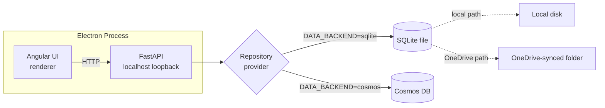
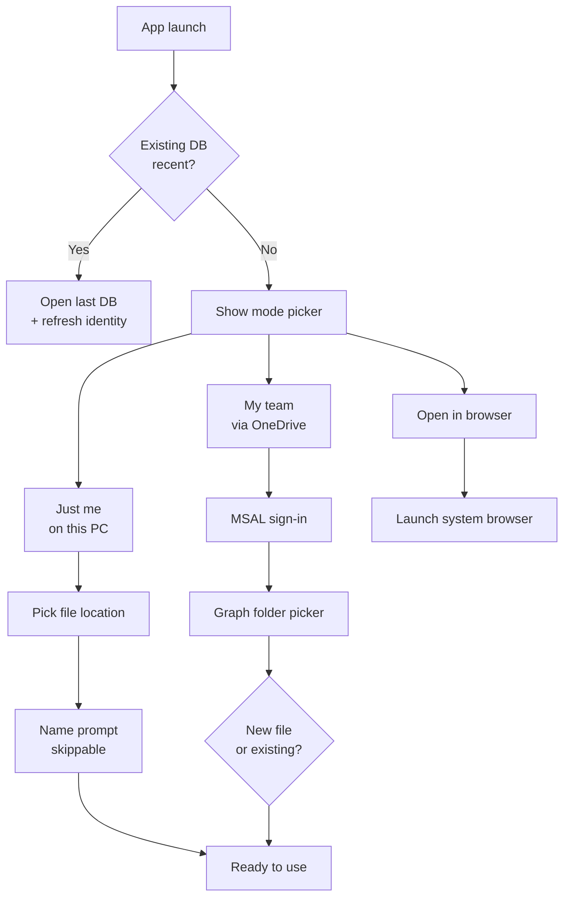
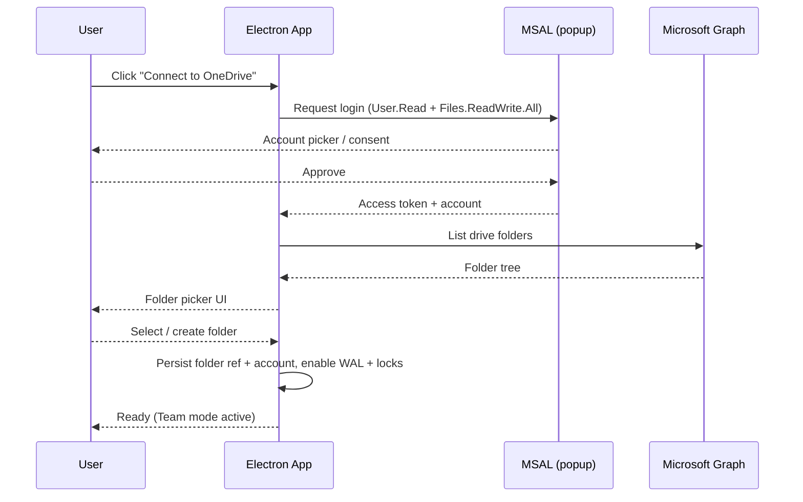

# Electron + SQLite Desktop Mode Specification

**Author:** Neo (Lead/Architect)
**Contributors:** Trinity (Frontend), Morpheus (Backend), Switch (Security), Tank (DevOps), Cypher (Testing)
**Reviewers:** Oracle (Docs), Niobe (UX)
**Requested by:** Issue #14 — Team collaboration via desktop runtime
**Date:** 2026-04-18
**Status:** Draft — ready for technical validation

> **Preamble.** This spec is the design response to Issue #14 ("Team collaboration"). It introduces a desktop deployment mode (Electron + SQLite) that enables small NGO teams to collaborate on a single treasury database via OneDrive, without requiring the full cloud (Cosmos + Entra) deployment. The cloud mode remains the recommended path for organizations that need tamper-evident audit, RBAC, and high-concurrency editing.

---

## 1. Problem

OpenTreasury currently runs as a web app (Angular + FastAPI + Cosmos DB + Entra ID).
Issue #14 requests a desktop runtime with **Electron + SQLite**, feature parity with the current product, optional **OneDrive-based shared DB file**, and full alignment with the existing layered architecture.

## 2. Goal

Deliver a desktop deployment mode that:

1. Preserves all current functional capabilities (transactions, reports, import/export, audit, preferences).
2. Reuses current Router → Service → Repository boundaries.
3. Uses SQLite as the persistence engine for desktop mode.
4. Supports collaborative operation through a OneDrive-synced SQLite file with explicit safety controls.
5. Keeps identity tracking consistent for audit purposes across Local and Team modes.

## 3. Scope

### In Scope

- Electron shell around the Angular app.
- Desktop API runtime using existing FastAPI routers/services.
- New SQLite repository implementations behind current repository protocols.
- Configuration-driven repository provider selection (Cosmos vs SQLite).
- Desktop identity: OS username (Local mode) or Microsoft account via explicit MSAL login (Team mode).
- No in-app RBAC in desktop mode — all desktop users are implicit Admin. OneDrive folder permissions serve as coarse access control in Team mode.
- Audit logging parity in SQLite, with `actor_source` discriminator for trust tiering.
- Team mode (OneDrive-shared SQLite file) with lock and conflict protections.

### Out of Scope

- Replacing existing cloud deployment.
- New business features.
- Multi-tenant desktop support.
- Real-time collaborative editing guarantees stronger than SQLite + OneDrive constraints can provide.
- In-app role management for desktop mode (deferred to a future spec).

## 4. Architecture Alignment

### 4.1 Layering Rule (Must Keep)

Existing layering remains authoritative:

- **Routers:** unchanged contracts.
- **Services:** unchanged business rules.
- **Repositories:** add SQLite implementations; keep protocol interfaces stable.

Desktop mode introduces a storage adapter, not a domain rewrite.

### 4.2 Proposed Runtime Topology



1. Electron launches the Angular UI (renderer) and a local FastAPI process bound to `127.0.0.1` only.
2. FastAPI uses existing services and dependency injection.
3. Repository provider resolves to SQLite implementations when `DATA_BACKEND=sqlite`.
4. SQLite file location is configured per mode (Local: any disk path; Team: OneDrive-synced folder selected via Graph picker).

### 4.3 Data Mapping

Create SQLite-backed repositories for:

- `transactions`
- `categories`
- `reference_data`
- `audit_log` (extended with `actor_source` column — see §6.5)
- `app_identity` (new — stores the Local-mode user-asserted display name and `actor_source`)
- `users` (new, reserved — empty in this phase; future in-app RBAC will populate it)
- user preferences

Mapping must preserve current invariants:

- signed amount semantics
- soft-delete behavior
- referential integrity checks used by services
- audit immutability

#### 4.3.1 SQLite ↔ Cosmos Document Mapping (Phase B, decision 2026-04-18)

The SQLite schema uses `snake_case` column names; the existing service layer
and Cosmos repositories speak `camelCase` document keys. The mapping is the
sole responsibility of each SQLite repository and is encapsulated in two
private helpers per repo:

- `_to_doc(row) -> dict` — convert a SQL row into a Cosmos-shaped document
  (camelCase keys, `Decimal` for money, parsed JSON for embedded
  collections, `bool` for `isDeleted`).
- `_from_doc(doc) -> dict` — convert a Cosmos-shaped document into a row
  parameter dict for an `INSERT`/`UPDATE` statement (snake_case keys,
  serialized JSON for embedded collections, normalized `Decimal` for money).

The Cosmos document shape is the **canonical contract**. Services and
routers are not modified to accommodate SQLite. If a parity test fails
because a service reads a particular camelCase key, the fix lives in the
SQLite repo's mapping helpers, not in the service.

#### 4.3.2 Phase B Schema-Gap Inventory (`0002_phase_b_schema_parity`)

The Phase A migration (`0001_phase_a_initial`) intentionally shipped a
minimal schema. Phase B adds the following columns so that the existing
service-layer queries reach functional parity with the Cosmos backend:

| Table | Add column | Type | Why |
|-------|------------|------|-----|
| `transactions` | `is_split` | `Integer NOT NULL DEFAULT 0` | Read by `query_for_report` and `aggregate_filtered`; differentiates split parents from leaf transactions when counting "uncategorized." |
| `transactions` | `split_lines` | `JSON NULL` | Embedded split-line array (Phase 3 split-transactions decision, 2026-04-14). Without it `query_for_report` cannot unroll splits and reports diverge from Cosmos. |
| `transactions` | `bank_description` | `Text NULL` | Half of the `search` filter target in `_build_filter_conditions`. Phase A schema only had `description` (which maps to Cosmos `detail`). |
| `transactions` | `detail` | `Text NULL` | Other half of the `search` filter. Distinct from `description` in the Cosmos document. |
| `transactions` | `reviewed_by_email` | `String NULL` | Stamped by the review service alongside `reviewed_by` and `reviewed_by_name`. Missing in v1. |
| `transactions` | `tag_ids` | `JSON NULL` | Renamed from Phase A's `tags` column for explicit parity with the Cosmos `tagIds` field. The `count_by_tag` query uses `ARRAY_CONTAINS(c.tagIds, …)`; the SQLite equivalent uses `json_each(tag_ids)`. Phase A had no production data so the rename is safe. |
| `audit_log` | `metadata` | `JSON NULL` | Free-form context bag stamped by the audit service in some flows; present in Cosmos documents. |

**Out of scope for `0002_phase_b_schema_parity`** (deferred):

- Optimistic-concurrency `version` *behavior* — the column already exists
  from Phase A; the wiring is Phase D.
- Foreign-key constraints between `transactions` and reference tables —
  Cosmos does not enforce referential integrity, parity says SQLite must
  not either; integrity stays at the service tier.
- `app_identity` / `users` evolution — Phase C.

## 5. Feature Parity Requirements

Desktop mode must match current behavior for:

- Authentication + authorization (see §6 for the desktop-specific model)
- Dashboard
- Transactions CRUD + filters + pagination semantics
- Accounts/Categories/Tags management constraints
- Reports
- Export XLSX
- Import validation + confirm flow
- Reference data caching behavior
- Audit logging
- User preferences persistence

No feature may regress due to storage backend switch.

## 6. Authentication, Identity & Audit Quality

> **Terminology.** This spec uses three mode names consistently: **Local mode** (single-user, local disk), **Team mode** (OneDrive-shared SQLite), and **Cloud mode** (existing web app + Cosmos + Entra). "Team mode" and "OneDrive shared mode" refer to the same thing; prefer "Team mode" in user-facing copy.

### 6.0 First-Run Mode Selection

On first launch (no `app_identity` row, no recent DB), the app shows a mode-selection screen with three large action cards:

| Card | Subtitle | Action |
|------|----------|--------|
| **Just me on this computer** | Local file. No account needed. | → Local mode → file picker → name prompt |
| **My team via OneDrive** | Shared file. Sign in with Microsoft. | → MSAL login → Graph folder picker (§6.3) |
| **Open in browser instead** | Use the cloud version. | → Opens configured cloud URL in default browser |

A small "I already have a database file" link below opens a file picker for existing SQLite files. The mode is inferred from the file location (local path → Local mode; OneDrive path → prompt to Connect via §6.3 to upgrade identity to Microsoft account).



### 6.1 Three Modes — How the User Enters Each

| Mode | Entry point | Identity source | Audit quality | RBAC |
|------|------------|----------------|---------------|------|
| **Local (single-user)** | Mode picker → "Just me on this computer" → file picker, anywhere on disk | OS username + optional first-run name prompt | **Best-effort.** Self-asserted, not tamper-evident. User can edit SQLite directly. | Implicit Admin — sole user. |
| **Team (OneDrive)** | Mode picker → "My team via OneDrive" → MSAL login → Graph folder picker | Microsoft account (real, cryptographically verified) | **Real identity.** File is still local, so not fully tamper-evident, but audit actor is trustworthy. | All users are Admin. OneDrive folder permissions provide coarse read/write control at OS level. |
| **Cloud (existing)** | Web app URL → Entra ID login | Entra ID with app roles | **Tamper-evident.** User cannot touch storage directly. | Admin/Viewer via Entra app roles. Unchanged by this spec. |

### 6.2 Local Mode — Identity Details

- App reads the OS username (`%USERNAME%` on Windows, `whoami` on macOS) automatically.
- On creation of the first local DB (not on app launch), show a "What's your name?" prompt before the first write.
- The prompt has a **Skip** button — falls back to OS username with `actor_source = os_username`.
- The accepted name is stored in the `app_identity` row in SQLite with `actor_source = app_prompt`.
- The name is editable later via the status chip (§6.7) → *Change name*. Updating the name does NOT rewrite historical audit entries.
- Identity is self-asserted — the user can change their OS username, set an env var, or edit SQLite directly. **This is an accepted limitation.** The spec acknowledges that local-mode audit is a hint, not a legal record.
- If the NGO needs real audit, they should use Team mode or Cloud mode.

### 6.3 Team Mode — OneDrive Button Flow

Entry into Team mode is **explicit, not heuristic**. The app does NOT silently detect OneDrive paths.



**Why this approach (not silent detection):**
- Path heuristics (`%OneDrive%` env var, known folder paths) work ~95% of the time but fail with custom OneDrive locations, junctions, and non-Windows platforms.
- Explicit entry means the app **knows** it's shared, so it can confidently activate the safeguards (WAL mode, `.opentreasury.lock`, optimistic concurrency).
- MSAL login gives **real Microsoft account identity** for audit, not a guessable OS username.
- The Graph folder picker constrains the file to the user's actual OneDrive, preventing accidental misplacement.

**App registration:** A single multi-tenant public-client app registration is shipped with the app (similar to VS Code, GitHub Desktop). Permissions required: `User.Read` + `Files.ReadWrite.All` (write scope is required because the app creates the SQLite file in the chosen folder and writes it back through the OneDrive-synced filesystem; read-only would prevent file creation and updates). No admin consent needed — any Microsoft account can use it.

#### 6.3.1 Error and Cancel Paths

| Failure | UX |
|---------|----|
| MSAL popup blocked | Inline error in mode card: "Allow popups for OpenTreasury, then try again." Retry button. |
| User cancels MSAL | Return to mode-selection screen. No error. |
| User cancels folder picker | Stay in Connect dialog. "Pick a folder" button still active. |
| Account has no OneDrive | Error: "This account doesn't have OneDrive set up. Activate OneDrive at onedrive.live.com, then try again." Link out. |
| Network offline | Disable Connect button with tooltip "OneDrive requires internet." |
| Silent token refresh fails on relaunch | Open last-used DB in **read-only mode**, show banner: "Sign in to OneDrive to make changes." Sign-in button in banner. |

### 6.4 RBAC — Not Implemented in Desktop Mode

- All desktop users (both Local and Team mode) are implicit Admin.
- RBAC is delegated to OneDrive folder permissions in Team mode:
  - Read+Write folder access → user can modify data.
  - Read-only folder access → **the app detects read-only at DB open** (attempts to open for write; on failure, reopens read-only). The UI shows a persistent **read-only banner** at the top of the app: *"You have read-only access to this team database. Ask the owner to grant edit access in OneDrive."* All write controls (save, edit, delete, import, split) are disabled with a tooltip pointing at the banner. The status chip (§6.7) reflects `(read-only)`. Raw `SQLITE_READONLY` errors must never reach the user.
- Future enhancement (not in scope): in-app role table populated in the reserved SQLite `users` table.

### 6.5 Audit Schema — Actor Discriminator

The audit log table must include an `actor_source` field to distinguish identity origins:

| `actor_source` | Meaning | Trust level |
|----------------|---------|-------------|
| `os_username` | Local mode — OS-provided name | Low — self-asserted |
| `app_prompt` | Local mode — first-run name prompt | Low — self-asserted |
| `microsoft_account` | Team mode — MSAL-verified identity | Medium — real identity, local storage |
| `entra_id` | Cloud mode — Entra token claims | High — tamper-evident |

This discriminator is written once per audit entry and never changes. It allows downstream consumers (reports, exports, compliance) to assess the trustworthiness of each audit record.

### 6.6 Session Handling

- **Local mode:** No tokens. No session. App reads OS username on launch.
- **Team mode:** MSAL token cached in OS secure credential store. Silent refresh on subsequent launches. User stays signed in until explicit sign-out.
- **Cloud mode:** Unchanged — Entra token lifecycle per existing auth flow.
- No plaintext secrets in SQLite, regardless of mode.

### 6.7 Mode + Identity Status Chip

A status chip in the app footer (right-aligned) is always visible and shows:

- **Local:** `🖥️ Local · Alice (this PC)`
- **Team:** `☁️ Team · alice@contoso.com · /Treasury/Shared/`
- **Read-only Team:** `☁️ Team (read-only) · alice@contoso.com`

Clicking the chip opens a menu with: *Switch mode*, *Sign out* (Team only), *Change name* (Local only), *Open data folder*. This chip is the canonical entry point for mode-switching after first run.

## 7. Team Mode (OneDrive Shared SQLite)

### 7.1 Support Model

Team mode (OneDrive-synced SQLite) is supported with strict constraints:

1. SQLite in WAL mode.
2. App-level advisory lock file (`.opentreasury.lock`) before writes.
3. Short write transactions only.
4. Automatic retry with backoff on lock contention.
5. Conflict detector using row version fields (`updated_at`, `version`) for optimistic concurrency in update paths.
6. Scheduled SQLite backup snapshots before schema migrations.

### 7.2 Identity in Team Mode

- Identity provided by the MSAL login performed when the user clicked "Connect to OneDrive" (see §6.3).
- Audit entries stamped with Microsoft account name + email + `actor_source = microsoft_account`.
- Identity is cached — subsequent launches use silent MSAL refresh, no login popup unless the token has expired and cannot be refreshed.

### 7.3 Operational Limits

- Supported for small teams with low simultaneous write volume.
- Not suitable for heavy concurrent editing.
- If lock/conflict thresholds are exceeded, teams must switch to Cloud mode (Cosmos authoritative backend).

### 7.4 Contention and Conflict UX

| Situation | User-facing behavior |
|-----------|---------------------|
| Lock acquired in <500ms | Silent. No UI. |
| Lock wait 500ms–2s | Subtle progress indicator on Save button. |
| Lock wait 2s–10s | Toast: "Waiting for the database to be available…" with cancel option. |
| Lock wait >10s | Modal: "Another user is editing right now. Try again or cancel." Shows lock holder's name from `.opentreasury.lock` if available. |
| Optimistic concurrency conflict on save | **Conflict dialog** with three options: *Keep my version*, *Discard mine and reload theirs*, *View differences side-by-side*. Default focus on "View differences." |
| Lock file stale (>5min, holder unreachable) | Confirm dialog: "The previous editor's lock is stale. Take over?" |

## 8. Security Requirements (Switch Gate)

1. Encrypt sensitive local secrets using OS secure store.
2. Optionally encrypt SQLite file at rest (SQLCipher or OS-level encrypted volume requirement).
3. Validate all imported files exactly as current backend flow does.
4. Audit trail is append-only at the service layer. In desktop mode, acknowledge that the user can edit the SQLite file directly — audit is best-effort (Local) or real-identity-but-not-tamper-evident (Team). Cloud mode remains the only tamper-evident tier.
5. Disable external network exposure of desktop FastAPI (localhost loopback only — bind `127.0.0.1`, never `0.0.0.0`).

## 9. Implementation Phases

1. **Phase A — Foundations**
   - Add backend selector and SQLite repository skeletons.
   - Add migration framework for SQLite schema (including `app_identity`, reserved `users`, and `audit_log.actor_source`).
2. **Phase B — Functional parity**
   - Complete repository implementations and parity tests.
   - Wire Electron shell and local API startup.
3. **Phase C — Identity + security**
   - Local mode: OS username reader + first-run name prompt UX.
   - Team mode: MSAL login + Graph folder picker + multi-tenant public-client app registration.
   - Localhost-only FastAPI hardening, SQLite file encryption decision.
   - Audit `actor_source` discriminator in schema.
   - **UX deliverables (Niobe → Trinity):**
     - First-run mode-selection screen (§6.0)
     - First-run name prompt with skip (§6.2)
     - Persistent mode + identity status chip with menu (§6.7)
     - OneDrive Connect dialog — happy path (§6.3) + 6 error/cancel states (§6.3.1)
     - Read-only banner + write-control disable pattern (§6.4)
     - Sign-out confirmation dialog
     - Settings → Identity panel (change name, view audit-source labels)
     - All Phase C surfaces meet existing app a11y baseline (keyboard nav, ARIA labels, screen-reader announcements for mode/identity changes).
4. **Phase D — OneDrive collaboration**
   - Advisory lock, conflict handling, stress tests, operational docs.
   - Contention UX surfaces from §7.4 (progress indicator, toast, modal, conflict-resolution dialog).
5. **Phase E — Packaging**
   - Signed installers (Windows/macOS), update strategy, rollback instructions.

## 10. Validation Criteria

Desktop mode is accepted only if:

1. Existing API/service unit tests pass against SQLite repositories (adapted test matrix).
2. Core end-to-end user journeys pass in Electron.
3. Security review confirms token/secret handling and localhost exposure controls.
4. Team mode collaboration tests show no data corruption under expected NGO usage patterns.
5. Feature parity checklist is fully green.

## 11. Team Ownership

- **Neo:** architecture and repository boundary compliance.
- **Trinity:** Electron shell integration with Angular; implementation of UX surfaces from §6.0/§6.3.1/§6.4/§6.7/§7.4.
- **Morpheus:** SQLite repositories, migrations, backend DI wiring.
- **Switch:** auth/session/storage security hardening sign-off.
- **Tank:** packaging, installer pipeline, release automation.
- **Cypher:** parity, concurrency, and regression test strategy.
- **Niobe:** UX design for desktop flows (§6.0, §6.3.1, §6.4, §6.7, §7.4) and usability validation.
- **Oracle:** setup/runbook/update documentation; feature catalog impact note in `docs/features.md` once Phase C lands.

## 12. Open Questions

### Technical
1. Do we mandate SQLite file encryption or allow OS-disk encryption as minimum baseline? (Switch gate.)
2. What is the explicit supported user concurrency ceiling for Team mode? (To be answered by Phase D stress tests.)

### UX (to validate with a real NGO user before building Phase C)
3. When two volunteers from the same NGO each install the desktop app, how do they discover each other's OneDrive DB? (Likely the #1 onboarding failure mode if unaddressed.)
4. Does the treasurer expect the app to remember "I'm in Team mode" forever, or do they expect to "log out" at the end of the day like a banking app?
5. If the treasurer's laptop is shared with another volunteer (common in small NGOs), should we support fast user-switching, or is "sign out → mode picker" enough?
6. When the OneDrive sync client is paused (very common — users do this to save bandwidth), the local file is still readable but stale. What's the user's mental model for "I'm working but my teammates can't see my changes yet"?
7. For the read-only case (§6.4): do NGO users actually understand OneDrive folder permissions, or will the banner copy need to say literally "ask the owner of the shared folder to share it with you for editing"?
8. For the conflict-resolution dialog (§7.4): do volunteers want to see *what* changed (diff view) or just choose which version wins? Diff is technically harder; pick-a-winner may be enough for v1.
# Electron + SQLite Desktop Mode Specification

**Author:** Neo (Lead/Architect)  
**Contributors:** Trinity (Frontend), Morpheus (Backend), Switch (Security), Tank (DevOps), Cypher (Testing), Niobe (UX), Oracle (Docs)  
**Requested by:** Issue #14  
**Date:** 2026-04-18  
**Status:** Draft — ready for technical validation

---

## 1. Problem

OpenTreasury currently runs as a web app (Angular + FastAPI + Cosmos DB + Entra ID).  
Issue #14 requests a desktop runtime with **Electron + SQLite**, feature parity with the current product, optional **OneDrive-based shared DB file**, and full alignment with the existing layered architecture.

## 2. Goal

Deliver a desktop deployment mode that:

1. Preserves all current functional capabilities (transactions, reports, import/export, audit, RBAC, preferences).
2. Reuses current Router → Service → Repository boundaries.
3. Uses SQLite as the persistence engine for desktop mode.
4. Supports collaborative operation through a OneDrive-synced SQLite file with explicit safety controls.
5. Keeps identity tracking consistent for audit purposes across local and shared modes.

## 3. Scope

### In Scope

- Electron shell around the Angular app.
- Desktop API runtime using existing FastAPI routers/services.
- New SQLite repository implementations behind current repository protocols.
- Configuration-driven repository provider selection (Cosmos vs SQLite).
- Desktop identity: OS username (local) or Microsoft account via explicit MSAL login (Team/OneDrive mode).
- No RBAC in desktop mode — all users are Admin. OneDrive folder permissions serve as coarse access control.
- Audit logging parity in SQLite.
- OneDrive shared-file collaboration mode with lock/conflict protections.

### Out of Scope

- Replacing existing cloud deployment.
- New business features.
- Multi-tenant desktop support.
- Real-time collaborative editing guarantees stronger than SQLite + OneDrive constraints can provide.

## 4. Architecture Alignment

### 4.1 Layering Rule (Must Keep)

Existing layering remains authoritative:

- **Routers:** unchanged contracts.
- **Services:** unchanged business rules.
- **Repositories:** add SQLite implementations; keep protocol interfaces stable.

Desktop mode introduces a storage adapter, not a domain rewrite.

### 4.2 Proposed Runtime Topology

1. Electron launches:
   - Angular UI (renderer process).
   - Local FastAPI process (localhost loopback only).
2. FastAPI uses existing services and dependency injection.
3. Repository provider resolves to SQLite implementations when `DATA_BACKEND=sqlite`.
4. SQLite file location is configured per environment (`local` or `onedrive-shared` path).

### 4.3 Data Mapping

Create SQLite-backed repositories for:

- `transactions`
- `categories`
- `reference_data`
- `audit_log`
- user preferences

Mapping must preserve current invariants:

- signed amount semantics
- soft-delete behavior
- referential integrity checks used by services
- audit immutability

## 5. Feature Parity Requirements

Desktop mode must match current behavior for:

- Authentication + Admin/Viewer authorization
- Dashboard
- Transactions CRUD + filters + pagination semantics
- Accounts/Categories/Tags management constraints
- Reports
- Export XLSX
- Import validation + confirm flow
- Reference data caching behavior
- Audit logging
- User preferences persistence

No feature may regress due to storage backend switch.

## 6. Authentication, Identity & Audit Quality

### 6.1 Three Modes — How the User Enters Each

| Mode | Entry point | Identity source | Audit quality | RBAC |
|------|------------|----------------|---------------|------|
| **Local (single-user)** | "New local database" → file picker, anywhere on disk | OS username + optional first-run name prompt | **Best-effort.** Self-asserted, not tamper-evident. User can edit SQLite directly. | Implicit Admin — sole user. |
| **Team (OneDrive)** | "Connect to OneDrive" button → MSAL login → Graph-based folder picker | Microsoft account (real, cryptographically verified) | **Real identity.** File is still local, so not fully tamper-evident, but audit actor is trustworthy. | All users are Admin. OneDrive folder permissions provide coarse read/write control at OS level. |
| **Cloud (existing)** | Web app URL → Entra ID login | Entra ID with app roles | **Tamper-evident.** User cannot touch storage directly. | Admin/Viewer via Entra app roles. Unchanged by this spec. |

### 6.2 Local Mode — Identity Details

- App reads the OS username (`%USERNAME%` on Windows, `whoami` on macOS) automatically.
- **Recommended UX:** On first launch, show a "What's your name?" prompt. Store in an `app_identity` row in SQLite. This gives a friendlier audit name than `DESKTOP-ABC\alice`.
- Identity is self-asserted — the user can change their OS username, set an env var, or edit SQLite directly. **This is an accepted limitation.** The spec acknowledges that local-mode audit is a hint, not a legal record.
- If the NGO needs real audit, they should use Team mode or Cloud mode.

### 6.3 Team Mode — OneDrive Button Flow

Entry into Team mode is **explicit, not heuristic**. The app does NOT silently detect OneDrive paths.

```
User clicks "Connect to OneDrive" button
  → MSAL login popup (Microsoft account — personal or work)
  → User consents once (User.Read + Files.Read.All)
  → App uses Graph API to list OneDrive folders
  → User picks or creates a folder for the team database
  → App stores the folder reference + identity
  → Done — WAL, advisory locks, and conflict detection are now active
```

**Why this approach (not silent detection):**
- Path heuristics (`%OneDrive%` env var, known folder paths) work ~95% of the time but fail with custom OneDrive locations, junctions, and non-Windows platforms.
- Explicit entry means the app **knows** it's shared, so it can confidently activate the safeguards (WAL mode, `.opentreasury.lock`, optimistic concurrency).
- MSAL login gives **real Microsoft account identity** for audit, not a guessable OS username.
- The Graph folder picker constrains the file to the user's actual OneDrive, preventing accidental misplacement.

**App registration:** A single multi-tenant public-client app registration is shipped with the app (similar to VS Code, GitHub Desktop). Permissions required: `User.Read` + `Files.Read.All`. No admin consent needed — any Microsoft account can use it.

### 6.4 RBAC — Not Implemented in Desktop Mode

- All desktop users (both Local and Team mode) are implicit Admin.
- RBAC is delegated to OneDrive folder permissions in Team mode:
  - Read+Write folder access → user can modify data.
  - Read-only folder access → SQLite blocks writes at OS level. No app code needed.
- Future enhancement (not in scope): in-app role table stored in SQLite `users` table.

### 6.5 Audit Schema — Actor Discriminator

The audit log table must include an `actor_source` field to distinguish identity origins:

| `actor_source` | Meaning | Trust level |
|----------------|---------|-------------|
| `os_username` | Local mode — OS-provided name | Low — self-asserted |
| `app_prompt` | Local mode — first-run name prompt | Low — self-asserted |
| `microsoft_account` | Team mode — MSAL-verified identity | Medium — real identity, local storage |
| `entra_id` | Cloud mode — Entra token claims | High — tamper-evident |

This discriminator is written once per audit entry and never changes. It allows downstream consumers (reports, exports, compliance) to assess the trustworthiness of each audit record.

### 6.6 Session Handling

- **Local mode:** No tokens. No session. App reads OS username on launch.
- **Team mode:** MSAL token cached in OS secure credential store. Silent refresh on subsequent launches. User stays signed in until explicit sign-out.
- **Cloud mode:** Unchanged — Entra token lifecycle per existing auth flow.
- No plaintext secrets in SQLite, regardless of mode.

## 7. OneDrive Shared SQLite Mode

### 7.1 Support Model

OneDrive-shared SQLite is supported with strict constraints:

1. SQLite in WAL mode.
2. App-level advisory lock file (`.opentreasury.lock`) before writes.
3. Short write transactions only.
4. Automatic retry with backoff on lock contention.
5. Conflict detector using row version fields (`updated_at`, `version`) for optimistic concurrency in update paths.
6. Scheduled SQLite backup snapshots before schema migrations.

### 7.2 Identity in Shared Mode

- Identity provided by the MSAL login performed when the user clicked "Connect to OneDrive" (see §6.3).
- Audit entries stamped with Microsoft account name + email + `actor_source = microsoft_account`.
- Identity is cached — subsequent launches use silent MSAL refresh, no login popup unless the token has expired and cannot be refreshed.

### 7.3 Operational Limits

- Supported for small teams with low simultaneous write volume.
- Not suitable for heavy concurrent editing.
- If lock/conflict thresholds are exceeded, teams must switch to cloud mode (Cosmos authoritative backend).

## 8. Security Requirements (Switch Gate)

1. Encrypt sensitive local secrets using OS secure store.
2. Optionally encrypt SQLite file at rest (SQLCipher or OS-level encrypted volume requirement).
3. Validate all imported files exactly as current backend flow does.
4. Audit trail is append-only at the service layer. In desktop mode, acknowledge that the user can edit the SQLite file directly — audit is best-effort (Local) or real-identity-but-not-tamper-evident (Team). Cloud mode remains the only tamper-evident tier.
5. Disable external network exposure of desktop FastAPI (localhost only).

## 9. Implementation Phases

1. **Phase A — Foundations**
   - Add backend selector and SQLite repository skeletons.
   - Add migration framework for SQLite schema.
2. **Phase B — Functional parity**
   - Complete repository implementations and parity tests.
   - Wire Electron shell and local API startup.
3. **Phase C — Identity + security**
   - Local mode: OS username reader + first-run name prompt UX.
   - Team mode: MSAL login + Graph folder picker + multi-tenant public-client app registration.
   - Localhost-only FastAPI hardening, SQLite file encryption decision.
   - Audit `actor_source` discriminator in schema.
4. **Phase D — OneDrive collaboration**
   - Advisory lock, conflict handling, stress tests, operational docs.
5. **Phase E — Packaging**
   - Signed installers (Windows/macOS), update strategy, rollback instructions.

## 10. Validation Criteria

Desktop mode is accepted only if:

1. Existing API/service unit tests pass against SQLite repositories (adapted test matrix).
2. Core end-to-end user journeys pass in Electron.
3. Security review confirms token/secret handling and localhost exposure controls.
4. OneDrive collaboration tests show no data corruption under expected NGO usage patterns.
5. Feature parity checklist is fully green.

## 11. Team Ownership

- **Neo:** architecture and repository boundary compliance.
- **Trinity:** Electron shell integration with Angular.
- **Morpheus:** SQLite repositories, migrations, backend DI wiring.
- **Switch:** auth/session/storage security hardening sign-off.
- **Tank:** packaging, installer pipeline, release automation.
- **Cypher:** parity, concurrency, and regression test strategy.
- **Niobe:** UX parity and desktop flow usability validation.
- **Oracle:** setup/runbook/update documentation.

## 12. Open Questions

1. Do we mandate SQLite file encryption or allow OS-disk encryption as minimum baseline?
2. What is the explicit supported user concurrency ceiling for OneDrive shared mode?
3. Should desktop mode support offline work when OneDrive sync is paused but the file is locally cached?
4. Is OneDrive shared mode GA or marked beta initially?
