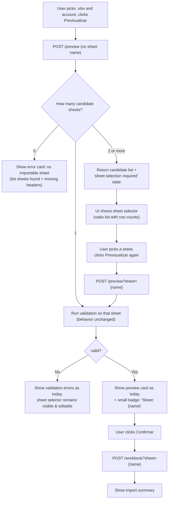

# Multi-Sheet Excel Import — UX Spec

**Author:** Niobe (Spec / UX Analyst)
**Requested by:** Pedro (perocha)
**Issue:** [#17](https://github.com/rett-europe/opentreasury/issues/17) — Import Excel supports multi sheet files
**Date:** 2026-04-18
**Status:** Draft — awaiting Neo + Pedro approval
**Branch:** `copilot/fix-issue-17`

---

## 1. Summary

Today, when an uploaded `.xlsx` workbook contains several sheets, the importer silently picks the **first** sheet that matches the required headers (`_find_movements_sheet` in `api/app/services/import_service.py`). Other movement-shaped sheets are ignored, with no signal to the user.

This spec proposes a **per-import sheet selection** UX: when the workbook contains more than one candidate sheet, the user is shown the list and chooses which one to import. When only one candidate exists, behavior is unchanged (no extra clicks).

> **Non-goal (this spec):** importing several sheets in a single run. That is a separate, larger feature (multi-sheet merge, per-sheet account mapping, cross-sheet duplicate detection) and stays out of scope.

---

## 2. User Stories

| ID | Role | Story | Acceptance |
|----|------|-------|------------|
| US-1 | Admin | When my workbook has only one movements sheet, I want the import to "just work" with no extra clicks | Single-sheet workbooks behave exactly as today — no new prompts |
| US-2 | Admin | When my workbook has several sheets, I want to pick which one to import | A sheet selector appears in preview; only the selected sheet is processed |
| US-3 | Admin | I want to see which sheets are even importable, so I don't pick a "Summary" or "Notes" tab by mistake | Selector lists only sheets that contain the required headers; non-candidate sheets are not offered |
| US-4 | Admin | I want to see *why* a sheet was skipped, in case I expected it to be importable | Non-candidate sheets are listed in a secondary "Ignored sheets" area with a one-line reason (e.g., "missing required headers") |
| US-5 | Admin | I want my chosen sheet to carry over from preview to import, so I don't have to re-pick it on confirm | Confirm step uses the same sheet the preview validated |
| US-6 | Admin | I want a clear error if my workbook contains zero importable sheets | Same error message as today, plus a list of sheets the system found and what's missing per sheet |

---

## 3. Current vs New Behavior

| Scenario | Today | New |
|----------|-------|-----|
| Workbook with 1 candidate sheet | First (only) sheet imported | **Unchanged** — auto-selected, no prompt |
| Workbook with 2+ candidate sheets | First candidate imported silently; rest ignored | Preview returns the candidate list; user picks one; selected sheet is the **only** one validated and imported |
| Workbook with 0 candidate sheets | Error: "Could not find a sheet with the required headers" | Same error + list of sheet names found, with the missing required headers per sheet |
| Categories sheet | Always picked by name (`Categorias` / `Categories` / `Kategorien`) | **Unchanged** — categories sheet detection stays name-based and is not part of selection |

---

## 4. UX Flow



### 4.1 First preview call — discovery

The first `POST /preview` is sent **without** a sheet parameter. This is the discovery call.

- If the workbook has 0 or 1 candidate sheets, the response is the normal `ImportPreview` shape — the UI does not need to change for the common single-sheet case.
- If the workbook has 2+ candidate sheets, the response is a new "sheet selection required" payload (see §6). No validation/categorization work has been done yet — the server has only enumerated candidates.

### 4.2 Second preview call — validation

If a sheet must be selected, the user picks one and the UI re-issues `POST /preview?sheet={name}`. From this point on, the flow is identical to today's preview/confirm.

### 4.3 Confirm

`POST /workbook` accepts the same `sheet` query parameter. The frontend always passes the sheet name it received from the successful preview, so the import is guaranteed to commit the same data the user validated.

---

## 5. UI Specification

### 5.1 Sheet selector card (new)

Appears **only** when the discovery preview returns `requiresSheetSelection: true`. Lives in the same column as today's error/preview cards, above them.

```
┌─ This workbook has multiple importable sheets ────────────────────────┐
│ Pick the sheet you want to import.                                    │
│                                                                       │
│  ◉ Movimientos 2026          52 data rows                             │
│  ○ Movimientos 2025         247 data rows                             │
│  ○ Movimientos 2024         312 data rows                             │
│                                                                       │
│  ▸ Ignored sheets (2)                                                 │
│      • Resumen — missing required headers (date, amount)              │
│      • Notas    — sheet is empty                                      │
│                                                                       │
│  [Previsualizar]                                                      │
└───────────────────────────────────────────────────────────────────────┘
```

**Behaviors:**
- Default selection: the **first** candidate sheet in workbook order. This preserves today's "first-wins" behavior as the default and means a one-sheet-different workbook can be imported with two clicks (preview → confirm).
- Row count is the data-row count *after* the detected header row, not raw `max_row`. If the count is unknown/expensive to compute, omit it rather than guess.
- The "Ignored sheets" disclosure is collapsed by default. It is informational; nothing inside is selectable.
- The selector remains visible after a successful preview so the user can change their mind and re-preview a different sheet without restarting the file upload. Changing the selection after a successful preview clears the preview result and the Confirm button (you must preview the new sheet first).

### 5.2 Selected-sheet badge (new)

When a preview is valid, today's green preview card gains a small chip near the title:

```
✅ Validación correcta   [📄 Sheet: Movimientos 2026]
```

Single-sheet workbooks **also** show this chip (using the auto-selected name) so the user always knows which sheet is going to be committed. This is cheap, removes ambiguity, and is consistent across the two paths.

### 5.3 Zero-candidate error

The existing red error card gets one extra block when the workbook has sheets but none are candidates:

```
❌ No se pudo importar
   • Could not find a sheet with the required headers.

   Sheets found:
     • Resumen   — missing required headers: date, amount
     • Notas     — sheet is empty
     • Gráficos  — missing required headers: date, amount, category, subcategory
```

This is a small, low-cost improvement and avoids a "the file looks fine, why won't it import?" support loop.

### 5.4 i18n

New label keys (added to all five locales — ES/EN/PT/FR/DE — following the existing `import.*` group):

| Key | EN (canonical) |
|-----|----------------|
| `importSheetSelectorTitle` | This workbook has multiple importable sheets |
| `importSheetSelectorHelp` | Pick the sheet you want to import. |
| `importSheetSelectorRows` | `{n} data rows` |
| `importSheetSelectorIgnored` | `Ignored sheets ({n})` |
| `importSheetBadge` | `Sheet: {name}` |
| `importSheetReasonNoHeaders` | missing required headers: {list} |
| `importSheetReasonEmpty` | sheet is empty |

All text already shown today (Previsualizar, Confirmar, error titles) is reused unchanged.

### 5.5 Accessibility

- The selector is a native `mat-radio-group` so screen readers announce "1 of 3, Movimientos 2026, 52 data rows".
- The "Ignored sheets" disclosure is a `mat-expansion-panel` with a clear header.
- The badge uses an icon + visible text; it is not the only signal of which sheet was chosen (also stated in the preview card body).

---

## 6. API Impact

### 6.1 Preview endpoint

**Route:** `POST /api/imports/preview` *(unchanged)*
**New optional query parameter:** `sheet={name}` — URL-encoded worksheet title.

Two response shapes from the same endpoint:

#### 6.1.1 Sheet-selection-required response (new)

Returned only when `sheet` is **not** provided **and** the workbook has 2+ candidate sheets.

```json
{
  "requiresSheetSelection": true,
  "candidateSheets": [
    { "name": "Movimientos 2026", "dataRowCount": 52, "headerRow": 3 },
    { "name": "Movimientos 2025", "dataRowCount": 247, "headerRow": 3 },
    { "name": "Movimientos 2024", "dataRowCount": 312, "headerRow": 3 }
  ],
  "ignoredSheets": [
    { "name": "Resumen", "reason": "missing_required_headers", "missing": ["date", "amount"] },
    { "name": "Notas",   "reason": "empty" }
  ],
  "account": { "exists": true, "id": "acc-abc123", "label": "Unicaja 0382", "iban": "ES…1234" }
}
```

Notes:
- No validation work has been done. `errors`, `warnings`, `transactionsToImport`, etc. are intentionally absent.
- `account` is included so the UI can show "importing into Unicaja 0382" alongside the sheet picker (matches the rest of the flow).
- `headerRow` is included for diagnostics and in case a later iteration wants to show a header preview.

#### 6.1.2 Normal preview response (existing shape, slightly extended)

Returned when `sheet` is provided, **or** when discovery finds exactly one (or zero) candidate sheets. Existing fields are unchanged. Two new fields:

```jsonc
{
  "valid": true,
  "selectedSheet": "Movimientos 2026",   // NEW — name of the sheet that was validated
  "availableSheets": ["Movimientos 2026", "Movimientos 2025", "Movimientos 2024"], // NEW — for badge tooltip / re-pick affordance
  "errors": [],
  "warnings": [],
  "totalRows": 52,
  "transactionsToImport": 47,
  "duplicatesToSkip": 5,
  "newCategories": [...],
  "newSubcategories": [...],
  "account": { ... },
  "importMode": "full"
}
```

`requiresSheetSelection` is **omitted** (or `false`) in this shape so the frontend can branch on a single boolean.

#### 6.1.3 Errors

| Condition | Status | Detail |
|-----------|--------|--------|
| `sheet` parameter refers to a sheet that does not exist | 400 | `Sheet '{name}' not found in workbook` |
| `sheet` refers to a sheet that is not a candidate (no required headers) | 400 | `Sheet '{name}' is not importable: missing required headers` |
| Workbook has zero candidate sheets (with or without `sheet` param) | 200, `valid: false` | Existing error message + new `ignoredSheets` field for diagnostics |

Bad sheet name is a **400**, not a `valid: false` payload, because it indicates a UI/state bug or a tampered request — not a user-correctable data problem.

### 6.2 Import endpoint

**Route:** `POST /api/imports/workbook` *(unchanged)*
**New optional query parameter:** `sheet={name}`.

Behavior:
- If `sheet` is provided, the server imports **that sheet only**. Same not-found / not-candidate errors as preview.
- If `sheet` is omitted, the server falls back to today's behavior — first candidate sheet wins. This keeps backwards compatibility for any existing API client.
- Same `ExcelImportSummary` response shape, with a new field:

```jsonc
{
  "accountId": "acc-abc123",
  "accountLabel": "Unicaja 0382",
  "selectedSheet": "Movimientos 2026",   // NEW
  "categoriesCreated": 3,
  "subcategoriesAdded": 5,
  "transactionsImported": 47,
  "duplicatesSkipped": 5,
  "rowsSkipped": 0,
  "warnings": []
}
```

### 6.3 Frontend service contract

The Angular `ImportService` gains an optional `sheet` argument on both methods:

- `preview(file, accountId, sheet?: string): Observable<ImportPreviewOrSheetSelection>`
- `import(file, accountId, sheet?: string, metadata?): Observable<ExcelImportSummary>`

`ImportPreview` becomes a discriminated union on `requiresSheetSelection`. Trinity will model this; the API guarantees the two shapes never mix.

---

## 7. Backwards Compatibility

| Caller | Effect |
|--------|--------|
| Existing frontend (today's build) calling preview without `sheet` on a single-sheet workbook | No change — server returns existing `ImportPreview` shape; new fields (`selectedSheet`, `availableSheets`) are additive |
| Existing frontend calling preview without `sheet` on a multi-sheet workbook | **Breaking** for the old UI: it would receive `requiresSheetSelection: true` and not know what to render. **Acceptable** because the frontend ships in lockstep with the API. Documented in CHANGELOG so external API users are warned. |
| Existing automated/import scripts (if any) hitting `/workbook` directly | No change when omitting `sheet` — server falls back to first-candidate behavior, exactly as today |
| Existing tests (`test_router_imports.py`, `test_import_service.py`, `test_import_fixtures.py`) | All single-sheet fixtures continue to pass without change. New tests are added for multi-sheet. |

The "lockstep frontend" assumption is true for this repo (single repo, single deploy). If that ever changes, this becomes a versioned-API problem, not a multi-sheet problem.

---

## 8. Edge Cases

| # | Case | Behavior |
|---|------|----------|
| EC-1 | Two candidate sheets with identical names | Excel forbids this. Trust openpyxl; if it ever happens, treat the second as a duplicate name and append `" (2)"` for display only — internal `sheet` parameter still uses the first match. (Verify with Morpheus: openpyxl's behavior here.) |
| EC-2 | Sheet name contains URL-unsafe characters (`/`, `#`, spaces, accents, emojis) | Frontend URL-encodes the value; backend decodes. Test with a sheet named `Año 2026 / Caja #1`. |
| EC-3 | User picks sheet A, validates OK, then changes the dropdown to sheet B without re-previewing, then clicks Confirm | Confirm button is **disabled** whenever the selected sheet differs from the validated sheet. Forces an explicit re-preview. |
| EC-4 | Categories sheet is itself a candidate movements sheet (has the four required headers by coincidence) | It is offered in the candidate list. If the user selects it, it is validated as a movements sheet. Categories sheet detection is independent and continues by name. Document this as expected. |
| EC-5 | The workbook has one movements-shaped sheet, but the user explicitly passes `sheet={its-name}` | Behaves identically to omitting `sheet`. Do not throw. |
| EC-6 | `sheet` parameter passed with whitespace or different case than the actual sheet title | Server matches **exact** title (case-sensitive, whitespace-sensitive) — this matches openpyxl semantics. UI never lets the user type the name freehand, so this is safe. |
| EC-7 | Workbook has 50+ candidate sheets (Pedro showed an archive with one sheet per year) | Selector renders as a scrollable `mat-radio-group` with max-height ~360px. No pagination. |
| EC-8 | Same workbook, second preview with different sheet — duplicate detection | Duplicate detection is per-account and date-based; it does not care which sheet rows came from. Re-previewing a different sheet just re-runs the same logic against different rows. |
| EC-9 | User selects sheet A, validates OK, then uploads a **different file** | Treated as a new flow: clear `selectedSheet`, clear `availableSheets`, re-issue discovery preview without `sheet`. |
| EC-10 | Discovery preview returns `requiresSheetSelection: true` and the file is large (close to 10 MB) | Discovery does not parse rows — it only inspects the first ~12 rows of each sheet for headers. Cost is bounded. The full parse only happens on the second (validation) call. |

---

## 9. Acceptance Criteria

The feature is done when **all** of the following are true:

1. Uploading a workbook with **one** movements sheet behaves exactly like today (no new clicks, same preview card, plus the new sheet badge).
2. Uploading a workbook with **two or more** movements sheets shows the sheet selector before any validation. No transactions are imported and no categories are created until the user picks a sheet and confirms.
3. The selector lists every sheet that has all four required headers detectable in its first 12 rows; sheets without those headers are listed separately as "Ignored" with a reason.
4. The default radio selection is the first candidate in workbook order.
5. After preview succeeds, the green preview card shows a chip with the selected sheet name.
6. Clicking Confirm imports **only** the selected sheet's rows. Other candidate sheets are untouched, even if they have new categories or subcategories.
7. The import summary shows the selected sheet name.
8. Uploading a workbook with **zero** importable sheets shows an error that lists every sheet found and the missing required headers per sheet.
9. Changing the sheet selection after a successful preview clears the preview result and disables Confirm until the new sheet is previewed.
10. The `POST /api/imports/workbook` endpoint, called without `sheet`, falls back to today's "first candidate wins" behavior so legacy API clients are unaffected.
11. Calling either endpoint with a `sheet` value that does not exist in the workbook returns HTTP 400 with a clear message.
12. New i18n keys are present and translated in all five supported locales (ES/EN/PT/FR/DE).
13. The Categories sheet (`Categorias` / `Categories` / `Kategorien`) is **never** offered in the movements selector unless it independently also matches the four required headers (EC-4).
14. Existing import tests continue to pass without modification. New tests cover: 2-sheet selection, 3-sheet selection, zero-candidate diagnostics, invalid `sheet` parameter, sheet-name URL encoding (EC-2), and EC-4 (categories sheet that also looks like movements).
15. `docs/features/import.md` is updated to describe multi-sheet behavior.

---

## 10. Out of Scope

- Importing more than one sheet in a single run (multi-sheet merge).
- Per-sheet account mapping (each sheet → different bank account).
- Remembering the last-picked sheet across sessions.
- Sheet-level previews (showing first N rows of each candidate before the user picks).
- Renaming sheets from the UI.

These are valid future ideas; flagging them here so reviewers don't conflate them with this spec.

---

## 11. Open Questions

| # | Question | Asked of |
|---|----------|----------|
| Q-1 | Confirm `dataRowCount` is cheap enough to compute during discovery for a 50-sheet workbook. If not, drop it from the discovery payload. | Morpheus |
| Q-2 | Should the discovery payload also include the sheet's detected `importMode` (`full` / `bank` / `inline`) per candidate, so the user can see "Movimientos 2026 — Bank mode" before picking? Slight extra work, possibly useful when an archive mixes formats. | Pedro |
| Q-3 | When the discovery call finds exactly one candidate, should the response still include `availableSheets` (so the UI can show the badge consistently)? Recommendation: **yes**. | Trinity |
| Q-4 | Sheet ordering in the picker — workbook order (proposed) or by `dataRowCount` desc / by name? Pedro's archive workflow likely wants newest year first, which is workbook order in his files. | Pedro |
| Q-5 | Telemetry: is it worth logging which sheet name was picked (anonymized) to understand usage? | Switch |

---

## 12. Implementation Notes (for Morpheus / Trinity)

These are **hints**, not the spec. Adjust as engineering judgment dictates.

- The discovery logic is a small refactor of `_find_movements_sheet`: instead of returning the first match, return the list of all matches plus the list of non-matches with reasons. Build a thin `enumerate_sheets(workbook)` helper and let `preview_workbook` / `import_workbook` consume it.
- The `sheet` parameter resolution should happen in **one** place (the new helper), not duplicated across preview and import.
- Frontend: introduce a `SheetSelectionRequired` model alongside `ImportPreview`, discriminated by `requiresSheetSelection`. The `import.component.ts` template grows one new `@if` branch above the existing error/preview branches.
- No new dependencies expected. openpyxl already exposes `workbook.sheetnames` and `workbook[name]`.

---

## 13. Files Likely Changed

(Indicative — final list belongs to the implementer.)

**Backend**
- `api/app/services/import_service.py` — extract sheet discovery, accept optional `sheet` argument in `preview_workbook` and `import_workbook`
- `api/app/routers/imports.py` — add `sheet` query param to both endpoints
- `api/app/models/schemas.py` — extend `ImportPreview` (selectedSheet, availableSheets), add `SheetSelectionRequired`, extend `ExcelImportSummary` (selectedSheet)
- `api/tests/test_import_service.py`, `api/tests/test_router_imports.py`, `api/tests/fixtures/generate_import_fixtures.py` — new multi-sheet fixtures and tests

**Frontend**
- `frontend/src/app/shared/models/import.model.ts` — discriminated union, new types
- `frontend/src/app/core/services/import.service.ts` — pass `sheet` through
- `frontend/src/app/features/import/import.component.ts` — sheet selector card, badge, state machine for re-pick
- `frontend/src/app/core/i18n/en.ts`, `es.ts`, `labels.type.ts` (and PT/FR/DE) — new keys
- `frontend/src/app/core/mocks/mock-api.interceptor.ts` — multi-sheet mock fixture

**Docs**
- `docs/features/import.md` — multi-sheet section
- `docs/specs/multi-sheet-import-spec.md` — this file

---

## 14. Approval

- [ ] Pedro — product approval
- [ ] Neo — architectural / scope approval
- [ ] Morpheus — backend feasibility (Q-1, Q-2)
- [ ] Trinity — frontend feasibility (Q-3)
- [ ] Switch — telemetry question (Q-5)

Once approved, this becomes the contract Morpheus and Trinity implement against.
