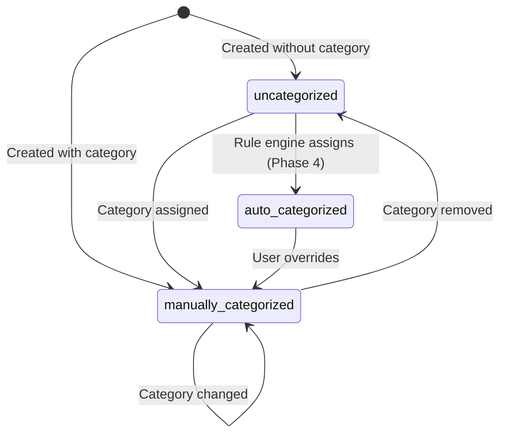
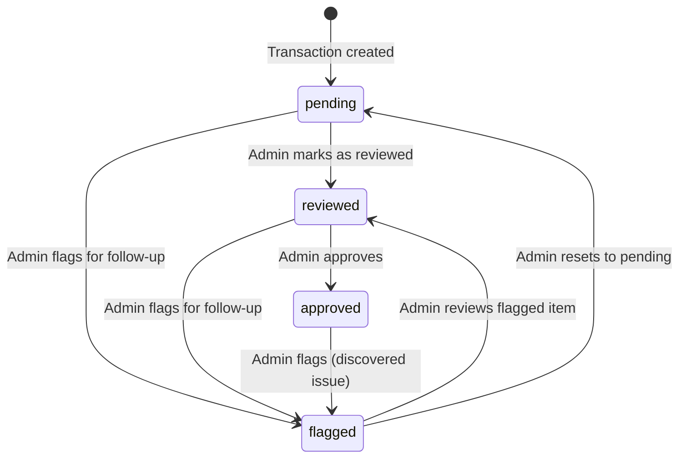

# Phase 1 — Core Data Model & CRUD Technical Specification

**Version:** 1.0  
**Date:** 2026-04-12  
**Author:** Niobe (Spec / UX Analyst)  
**Requested by:** Pedro (perocha)  
**Status:** Draft — awaiting approval  
**Scope:** V2 revamp Phase 1 — Core data model changes + manual transaction CRUD  
**Prerequisites:** None (Phase 1 is the foundation)  
**Supersedes:** Current v1 transaction model with category-driven amount signing

---

## Table of Contents

1. [Executive Summary](#1-executive-summary)
2. [FR-010 Decision: TransactionType Architecture](#2-fr-010-decision-transactiontype-architecture)
3. [New Enums](#3-new-enums)
4. [Transaction Document Schema (v2)](#4-transaction-document-schema-v2)
5. [Account Document Schema Changes](#5-account-document-schema-changes)
6. [API Changes](#6-api-changes)
7. [Business Rules](#7-business-rules)
8. [Impact on Reports](#8-impact-on-reports)
9. [Acceptance Criteria](#9-acceptance-criteria)
10. [Migration Strategy](#10-migration-strategy)
11. [Open Questions](#11-open-questions)

---

## 1. Executive Summary

Phase 1 replaces the implicit, category-driven amount signing model with an explicit `transactionType` field on every transaction. This is the biggest structural change — it decouples "what direction is this money moving?" (transactionType) from "what accounting category does this belong to?" (categoryId). This unlocks nullable categories (FR-016), proper transfer/refund support (future phases), and a clear review workflow.

**FRs addressed:** FR-002, FR-009, FR-010, FR-011, FR-012, FR-016, FR-017, FR-018, FR-021, FR-030–034.

**V2 is a clean break.** No deprecated endpoints, no backward-compatible shims. Old schemas are replaced, not extended.

---

## 2. FR-010 Decision: TransactionType Architecture

### The Question

Currently, transaction direction (income vs. expense) is **derived from the category**. When you create a transaction with a category of type `income`, the amount is forced positive. With a category of type `expense`, it's forced negative. There is no explicit direction field on the transaction itself.

FR-010 asks for an explicit `transactionType` enum. The critical question: does it **replace** `categoryType`, or **coexist** with it?

### The Decision: Coexistence

**`transactionType` lives on the Transaction. `categoryType` stays on the Category. They serve different purposes.**

| Concept | Lives on | Purpose | Values |
|---------|----------|---------|--------|
| `transactionType` | Transaction | "What direction is this money moving?" | `income`, `expense`, `transfer`, `refund` |
| `categoryType` | Category | "Is this an income-type or expense-type classification?" | `income`, `expense` |

**Why coexistence, not replacement:**

1. **Categories have natural types.** "Bank fees" is always expense. "Membership dues" is always income. Removing `categoryType` from categories would lose this structural constraint — any category could be assigned to any transaction, and the system would have no way to warn you that assigning "Bank fees" to an income transaction is probably a mistake.

2. **Uncategorized transactions need a direction.** With FR-016, transactions can exist without a category. If direction is derived from the category, an uncategorized transaction has no direction — you can't compute income/expense totals. With `transactionType`, an uncategorized transaction still knows it's income or expense.

3. **Transfers and refunds need their own type.** A transfer from Bank A to Bank B is neither income nor expense — it's a neutral movement. Under the old model, you'd have to create fake "Transfer" categories under both income and expense types, which pollutes reports. With `transactionType = transfer`, the transaction is cleanly excluded from operational totals.

4. **Amount signing becomes self-contained.** The service doesn't need to look up the category to determine the sign. The sign is determined by `transactionType` alone. This simplifies the code and eliminates the category-lookup dependency during creation.

### Amount Signing: TransactionType × Scenario Matrix

The user always enters a **positive (absolute) amount.** The system applies the sign based on `transactionType`.

| TransactionType | Amount stored as | Formula | Example |
|-----------------|-----------------|---------|---------|
| `income` | Positive | `+abs(amount)` | Donation of €500 → stored as `+500.00` |
| `expense` | Negative | `-abs(amount)` | Office rent of €800 → stored as `-800.00` |
| `transfer` | Signed by user | As-entered¹ | Transfer out: `-500.00`; Transfer in: `+500.00` |
| `refund` | Signed by user | As-entered¹ | Refund received: `+200.00`; Refund given: `-200.00` |

¹ **For `transfer` and `refund`:** The user specifies the sign because these types can go either direction. A transfer-out from Account A is negative; the matching transfer-in to Account B is positive. The API accepts the signed value as-is. During bank import (Phase 2), the bank statement's sign is preserved directly.

> **Practical example — Calendario fundraiser:**
> - María buys flyers for the calendar event: `transactionType=expense`, amount=`-150.00`, category="Producción Calendarios" (expense category). ✅
> - Calendar sales come in: `transactionType=income`, amount=`+2,400.00`, category="Venta Calendarios" (income category). ✅
> - Both appear in the correct category breakdown with correct signs.

> **Practical example — Internal transfer:**
> - Pedro transfers €5,000 from Unicaja to Sabadell.
> - Unicaja leg: `transactionType=transfer`, amount=`-5000.00`, accountId=unicaja. Category optional.
> - Sabadell leg: `transactionType=transfer`, amount=`+5000.00`, accountId=sabadell. Category optional.
> - Neither appears in income/expense totals. Both visible in "all transactions" view.

> **Practical example — Refund:**
> - Rett España paid €300 for a venue deposit. Venue cancels, refunds the money.
> - Original: `transactionType=expense`, amount=`-300.00`, category="Alquiler Locales".
> - Refund: `transactionType=refund`, amount=`+300.00`, category optional.
> - Net effect on reports: the refund is excluded from operational income/expense but visible in transaction history.

### What Happens to the Old Auto-Signing Logic

**It is deleted.** The current `create_transaction()` and `update_transaction()` methods look up the category and force the amount sign. In v2:

- **Create:** The sign is determined by `transactionType` alone. No category lookup for signing.
- **Update:** If `transactionType` changes, the amount is re-signed. If only the amount changes, the sign is re-applied based on the current `transactionType`.
- **Category changes do NOT trigger re-signing.** The category is classification, not direction.

### Cross-Validation: TransactionType ↔ CategoryType

When a transaction has both a `transactionType` and a `categoryId`:

| TransactionType | Allowed CategoryType | Rule |
|-----------------|---------------------|------|
| `income` | `income` only | Category must match direction |
| `expense` | `expense` only | Category must match direction |
| `transfer` | `income` or `expense` | No restriction — transfers can optionally be categorized under any type |
| `refund` | `income` or `expense` | No restriction — refunds can optionally be categorized under any type |

If the validation fails → HTTP 422 with message: `"Category type '{categoryType}' does not match transaction type '{transactionType}'."`

---

## 3. New Enums

### 3.1 TransactionType (NEW)

```python
class TransactionType(str, Enum):
    INCOME = "income"
    EXPENSE = "expense"
    TRANSFER = "transfer"
    REFUND = "refund"
```

**Design notes:**
- No `adjustment` value in Phase 1. Adjustments are rare for a small NGO and can be modeled as income/expense with an explanatory detail. Reconsider in Phase 3+.
- `transfer` covers both legs. The sign on the amount indicates direction (positive=in, negative=out).
- `refund` covers both received and given refunds. Sign indicates direction.

### 3.2 CategorizationStatus (NEW)

```python
class CategorizationStatus(str, Enum):
    UNCATEGORIZED = "uncategorized"
    MANUALLY_CATEGORIZED = "manually_categorized"
    AUTO_CATEGORIZED = "auto_categorized"
```

**Phase 1 usage:** Only `uncategorized` and `manually_categorized` are active. `auto_categorized` exists in the enum for forward-compatibility with Phase 4 (smart categorization) but is not set by any Phase 1 logic.

### 3.3 ReviewStatus (NEW)

```python
class ReviewStatus(str, Enum):
    PENDING = "pending"
    REVIEWED = "reviewed"
    APPROVED = "approved"
    FLAGGED = "flagged"
```

**Phase 1 usage:** The field exists on every transaction. Admins can manually set it. The full review workflow (queues, notifications, batch operations) ships in Phase 2 alongside import. For now, it's a simple status field.

### 3.4 CategoryType (UNCHANGED)

```python
class CategoryType(str, Enum):
    INCOME = "income"
    EXPENSE = "expense"
```

No changes. Categories retain their income/expense type. This type is used for cross-validation with `transactionType` (see §2).

---

## 4. Transaction Document Schema (v2)

### 4.1 Complete Field Reference

Every field in the Cosmos DB transaction document, organized by status (existing, modified, new).

#### Existing Fields (no changes)

| Field | Type | Required | Default | Validation | Notes |
|-------|------|----------|---------|------------|-------|
| `id` | `string` | Yes | Auto (UUID) | — | Cosmos document ID |
| `type` | `string` | Yes | `"transaction"` | — | Partition discrimination |
| `partitionKey` | `string` | Yes | Computed | `YYYY-MM` | Derived from `date` |
| `date` | `string` (ISO date) | Yes | — | Valid date, ≥2020-01-01 | Transaction/booking date |
| `valueDate` | `string` (ISO date) | No | `= date` | Valid date | Bank value date |
| `year` | `int` | Yes | Computed | — | Derived from `date` |
| `month` | `int` | Yes | Computed | — | Derived from `date` |
| `currency` | `string` | Yes | `"EUR"` | Max 3 chars | ISO 4217 code |
| `balance` | `float \| null` | No | `null` | — | Running balance from bank statement |
| `movementNumber` | `string \| null` | No | `null` | Max 50 chars | Bank movement number |
| `branchNumber` | `string \| null` | No | `null` | Max 50 chars | Bank branch number |
| `bankDescription` | `string \| null` | No | `null` | Max 500 chars | Original bank description |
| `accountId` | `string` | Yes | — | Must reference active account | Financial source |
| `tagIds` | `list[string]` | No | `[]` | Each must reference active tag | User-defined labels |
| `detail` | `string \| null` | No | `null` | Max 500 chars | User notes |
| `createdBy` | `string` | Yes | From auth | — | Entra ID OID |
| `createdByName` | `string \| null` | No | From auth | — | Display name |
| `createdAt` | `string` (ISO datetime) | Yes | Auto | — | UTC timestamp |
| `updatedBy` | `string \| null` | No | `null` | — | Entra ID OID |
| `updatedByName` | `string \| null` | No | `null` | — | Display name |
| `updatedAt` | `string \| null` | No | `null` | — | UTC timestamp |
| `isDeleted` | `bool` | Yes | `false` | — | Soft-delete flag |

#### Modified Fields

| Field | Old Type | New Type | Change | Related FR |
|-------|----------|----------|--------|------------|
| `amount` | `float` (signed by category) | `float` (signed by transactionType) | Sign source changes from category-lookup to transactionType | FR-010 |
| `categoryId` | `string` (required) | `string \| null` | **Now optional.** `null` = uncategorized | FR-016 |
| `subcategoryId` | `string \| null`¹ | `string \| null` | Explicitly optional. Must belong to `categoryId` if both provided | FR-016, FR-018 |

¹ `subcategoryId` was technically optional in `TransactionResponse` but required in `TransactionCreate`. Now optional everywhere.

#### New Fields

| Field | Type | Required | Default | Validation | Related FR |
|-------|------|----------|---------|------------|------------|
| `transactionType` | `string` (enum) | **Yes** | — | One of: `income`, `expense`, `transfer`, `refund` | FR-010 |
| `sourceReference` | `string \| null` | No | `null` | Max 100 chars | FR-009 |
| `counterpartyName` | `string \| null` | No | `null` | Max 200 chars | FR-011 |
| `counterpartyReference` | `string \| null` | No | `null` | Max 200 chars | FR-011 |
| `categorizationStatus` | `string` (enum) | Yes | `"uncategorized"` | One of: `uncategorized`, `manually_categorized`, `auto_categorized` | FR-021 |
| `reviewStatus` | `string` (enum) | Yes | `"pending"` | One of: `pending`, `reviewed`, `approved`, `flagged` | FR-030 |
| `reviewedBy` | `string \| null` | No | `null` | Entra ID OID | FR-034 |
| `reviewedByName` | `string \| null` | No | `null` | Display name | FR-034 |
| `reviewedAt` | `string \| null` | No | `null` | ISO datetime (UTC) | FR-034 |
| `originalAmount` | `float \| null` | No | `null` | Set on first edit of `amount` | FR-012 |
| `originalDate` | `string \| null` | No | `null` | Set on first edit of `date` | FR-012 |
| `notes` | `list[{id, text, author, authorName, createdAt}]` | No | `[]` | Threaded notes array | FR-033 |

### 4.2 Example Document (v2)

```json
{
  "id": "a1b2c3d4-e5f6-7890-abcd-ef1234567890",
  "type": "transaction",
  "partitionKey": "2026-03",
  "date": "2026-03-15",
  "valueDate": "2026-03-15",
  "year": 2026,
  "month": 3,
  "amount": -150.00,
  "currency": "EUR",
  "balance": 12345.67,
  "movementNumber": "00234",
  "branchNumber": "0049",
  "sourceReference": "TRF-2026-00234",
  "bankDescription": "PAGO ALQUILER LOCAL MARZO",
  "accountId": "acc-unicaja001",
  "transactionType": "expense",
  "categoryId": "cat-alquiler-001",
  "subcategoryId": "sub-local-sede",
  "categorizationStatus": "manually_categorized",
  "counterpartyName": "Inmobiliaria García S.L.",
  "counterpartyReference": null,
  "reviewStatus": "approved",
  "reviewedBy": "oid-maria-001",
  "reviewedByName": "María García",
  "reviewedAt": "2026-03-16T10:30:00Z",
  "originalAmount": null,
  "originalDate": null,
  "tagIds": ["tag-mensual"],
  "detail": "Alquiler sede marzo 2026",
  "createdBy": "oid-pedro-001",
  "createdByName": "Demo Admin",
  "createdAt": "2026-03-15T09:00:00Z",
  "updatedBy": null,
  "updatedByName": null,
  "updatedAt": null,
  "isDeleted": false
}
```

---

## 5. Account Document Schema Changes

### FR-002: New Fields

| Field | Type | Required | Default | Validation | Purpose |
|-------|------|----------|---------|------------|---------|
| `currency` | `string` | Yes | `"EUR"` | ISO 4217, max 3 chars | Base currency of the account |

**No other account changes in Phase 1.** The current `bankName`, `bankNameShort`, `iban`, `paypalEmail`, `isPaypal` fields are sufficient. A unified provider/identifier abstraction is reserved for a future phase.

### Account Document (v2)

```json
{
  "id": "acc-unicaja001",
  "type": "bank_account",
  "bankName": "Unicaja Banco S.A.",
  "bankNameShort": "UNICAJA",
  "iban": "ES12 0182 1234 5678 9012 3456",
  "paypalEmail": null,
  "accountLabel": "Unicaja — Cuenta principal",
  "isPaypal": false,
  "currency": "EUR",
  "sortOrder": 1,
  "isActive": true,
  "createdAt": "2026-01-15T10:00:00Z",
  "updatedAt": null
}
```

---

## 6. API Changes

### 6.1 Transaction Endpoints

#### `POST /api/transactions` — Create Transaction

**Current signature:**
```
POST /api/transactions
Body: TransactionCreate { date, valueDate?, amount, currency?, bankDescription?,
      accountId, categoryId, subcategoryId, tagIds?, detail?,
      movementNumber?, branchNumber?, balance? }
```

**New signature:**
```
POST /api/transactions
Body: TransactionCreateV2 { date, valueDate?, amount, currency?,
      bankDescription?, accountId, transactionType,
      categoryId?, subcategoryId?, tagIds?, detail?,
      movementNumber?, branchNumber?, balance?, sourceReference?,
      counterpartyName?, counterpartyReference? }
```

**Key changes:**
- `transactionType` is **required** (new)
- `categoryId` is now **optional** (was required)
- `subcategoryId` is now **optional** (was required)
- New optional fields: `sourceReference`, `counterpartyName`, `counterpartyReference`
- Amount signing: determined by `transactionType`, NOT by category lookup
- `categorizationStatus` is computed automatically (not in request)
- `reviewStatus` defaults to `"pending"` (not in request)

**New validations added:**
1. `transactionType` is a valid enum value
2. If `categoryId` provided → category must exist and be active
3. If `categoryId` AND `subcategoryId` provided → subcategory must belong to that category (FR-018)
4. If `transactionType` is `income` or `expense` AND `categoryId` is provided → `category.categoryType` must match `transactionType` (cross-validation)
5. For `income`/`expense`: amount is force-signed (`+abs` / `-abs`). For `transfer`/`refund`: amount is accepted as-entered.

**Old validations removed:**
- Category lookup for amount auto-signing (replaced by transactionType-based signing)
- Requirement that `categoryId` and `subcategoryId` are non-null

---

#### `PUT /api/transactions/{id}` — Update Transaction

**Current signature:**
```
PUT /api/transactions/{id}?year=YYYY&month=MM
Body: TransactionUpdate { date?, valueDate?, amount?, currency?,
      bankDescription?, accountId?, categoryId?, subcategoryId?,
      tagIds?, detail?, movementNumber?, branchNumber?, balance? }
```

**New signature:**
```
PUT /api/transactions/{id}?year=YYYY&month=MM
Body: TransactionUpdateV2 { date?, valueDate?, amount?, currency?,
      bankDescription?, accountId?, transactionType?,
      categoryId?, subcategoryId?, tagIds?, detail?,
      movementNumber?, branchNumber?, balance?, sourceReference?,
      counterpartyName?, counterpartyReference?,
      reviewStatus? }
```

**Key changes:**
- `transactionType` can be changed (optional in update)
- New optional fields matching create
- `reviewStatus` can be set in update (Admin only)
- Amount re-signing: if `transactionType` changes, amount is re-signed. If only `amount` changes, sign is applied based on current `transactionType`.
- **FR-012 preservation:** On first edit of `amount`, if `originalAmount` is `null`, set `originalAmount` to the pre-edit value. Same for `date` → `originalDate`.
- **Categorization status update:** If `categoryId` changes from null → value, set `categorizationStatus = "manually_categorized"`. If `categoryId` changes from value → null, set `categorizationStatus = "uncategorized"`.

**New validations:** Same cross-validations as create (subcategory-belongs-to-category, transactionType-matches-categoryType).

---

#### `GET /api/transactions` — List Transactions

**Current query params:**
```
year, month, accountId?, categoryId?, subcategoryId?, tagId?,
search?, amountMin?, amountMax?, includeDeleted?, pageSize?, continuationToken?
```

**New query params (additions):**
```
...existing params...
transactionType? — filter by transaction type
categorizationStatus? — filter by categorization status
reviewStatus? — filter by review status
```

**Response change:** `TransactionResponse` gains all new fields from §4. The response schema is updated to include `transactionType`, `categorizationStatus`, `reviewStatus`, `sourceReference`, `counterpartyName`, `counterpartyReference`, `reviewedBy`, `reviewedByName`, `reviewedAt`, `originalAmount`, `originalDate`.

---

#### `DELETE /api/transactions/{id}` — Soft Delete

**No changes.** Soft delete behavior remains the same.

---

#### `PATCH /api/transactions/{id}/review` — Set Review Status (NEW)

```
PATCH /api/transactions/{id}/review?year=YYYY&month=MM
Body: { "reviewStatus": "reviewed" | "approved" | "flagged" | "pending" }
Auth: Admin only
```

**Behavior:**
- Sets `reviewStatus` on the transaction
- Sets `reviewedBy` = current user OID, `reviewedByName` = current user name, `reviewedAt` = now (UTC)
- Creates an audit log entry with `action = "Update"`, `oldValues.reviewStatus`, `newValues.reviewStatus`

**Validations:**
- `reviewStatus` is a valid enum value
- Transaction exists and is not deleted

**Response:** Updated `TransactionResponse`

---

#### `PATCH /api/transactions/{id}/categorize` — Quick Categorize (NEW)

```
PATCH /api/transactions/{id}/categorize?year=YYYY&month=MM
Body: { "categoryId": "..." | null, "subcategoryId": "..." | null }
Auth: Admin only
```

**Behavior:**
- Sets/clears `categoryId` and `subcategoryId`
- Updates `categorizationStatus`: if `categoryId` provided → `"manually_categorized"`, if `null` → `"uncategorized"`
- Cross-validates categoryType ↔ transactionType (same rules as create/update)
- Validates subcategory belongs to category (FR-018)
- Creates audit log entry

**Purpose:** Dedicated endpoint for the categorization workflow. Separating this from the general update makes the frontend simpler — the "Categorize" button calls this endpoint instead of a full PUT with only two fields.

**Response:** Updated `TransactionResponse`

---

#### `POST /api/transactions/{id}/notes` — Add Note (NEW)

```
POST /api/transactions/{id}/notes?year=YYYY&month=MM
Body: { "text": "string" }
Auth: Admin only
```

**Behavior:**
- Appends a new note to the transaction's `notes` array
- Note structure: `{id: UUID, text: user_input, author: current_user_OID, authorName: current_user_name, createdAt: UTC_now}`
- Notes are append-only — no edit or delete in Phase 1
- Creates an audit log entry

**Validations:**
- `text` is required, non-empty, max 1000 chars
- Transaction exists and is not deleted

**Response:** Updated `TransactionResponse`

---

### 6.2 Account Endpoints

#### `POST /api/accounts` — Create Account

**New field in request:**
```
currency?: string  (default "EUR")
```

**New field in response:**
```
currency: string
```

#### `PUT /api/accounts/{id}` — Update Account

**New optional field:**
```
currency?: string
```

#### Other Account Endpoints

No changes to `GET`, `DELETE`, or `GET /{id}/transaction-count`.

---

### 6.3 Report Endpoints

All report endpoints are modified internally (see §8), but their external API signatures remain the same. The response schemas do not change.

Internally they switch from sign-based classification (`amount > 0` = income) to `transactionType`-based filtering.

---

### 6.4 Category Endpoints

**No endpoint changes.** The category model retains `categoryType`. No new fields needed on categories for Phase 1.

---

## 7. Business Rules

### 7.1 Amount Signing

| Rule ID | Rule | When |
|---------|------|------|
| AS-001 | `income` transactions: `amount = +abs(user_input)` | Create, Update (when transactionType=income) |
| AS-002 | `expense` transactions: `amount = -abs(user_input)` | Create, Update (when transactionType=expense) |
| AS-003 | `transfer` transactions: `amount = user_input` (signed as-entered) | Create, Update |
| AS-004 | `refund` transactions: `amount = user_input` (signed as-entered) | Create, Update |
| AS-005 | When `transactionType` changes on update, re-apply signing rules AS-001–004 to the current amount | Update |
| AS-006 | When only `amount` changes on update (no type change), re-apply signing for the current `transactionType` | Update |
| AS-007 | Category changes do NOT trigger re-signing | Update |

### 7.2 Category Assignment

| Rule ID | Rule | When |
|---------|------|------|
| CA-001 | `categoryId` is optional. `null` = uncategorized | Create, Update |
| CA-002 | `subcategoryId` is optional. Can only be set if `categoryId` is also set | Create, Update |
| CA-003 | If `categoryId` is set, the referenced category must exist and be active | Create, Update, Categorize |
| CA-004 | If `subcategoryId` is set, it **must** belong to the referenced `categoryId` | Create, Update, Categorize |
| CA-005 | Setting `categoryId = null` also forces `subcategoryId = null` | Update, Categorize |

### 7.3 Cross-Validation: TransactionType ↔ CategoryType

| Rule ID | Rule | When |
|---------|------|------|
| XV-001 | If `transactionType = income` and `categoryId` is set → `category.categoryType` must be `income` | Create, Update, Categorize |
| XV-002 | If `transactionType = expense` and `categoryId` is set → `category.categoryType` must be `expense` | Create, Update, Categorize |
| XV-003 | If `transactionType = transfer` or `refund` → no constraint on `category.categoryType` | Create, Update, Categorize |
| XV-004 | Violation of XV-001/002 → HTTP 422: "Category type does not match transaction type" | — |

### 7.4 Categorization Status Transitions



| Rule ID | Trigger | New Status |
|---------|---------|------------|
| CS-001 | Transaction created with `categoryId = null` | `uncategorized` |
| CS-002 | Transaction created with `categoryId` provided | `manually_categorized` |
| CS-003 | Update/categorize sets `categoryId` from `null` → value | `manually_categorized` |
| CS-004 | Update/categorize sets `categoryId` from value → `null` | `uncategorized` |
| CS-005 | Update/categorize changes `categoryId` from value → different value | `manually_categorized` |
| CS-006 | `categorizationStatus` is **never** set directly by the user via API | — |

### 7.5 Review Status Transitions



| Rule ID | Rule | When |
|---------|------|------|
| RS-001 | Manually created transactions default to `reviewStatus = "approved"`. Imported transactions default to `"pending"`. | Create |
| RS-002 | Only Admin users can change `reviewStatus` | Review endpoint |
| RS-003 | Any status → any status is allowed (no strict linear workflow) | Review endpoint |
| RS-004 | Changing review status sets `reviewedBy`, `reviewedByName`, `reviewedAt` | Review endpoint |
| RS-005 | Review status changes are logged in the audit trail | Review endpoint |

**Design rationale (RS-003):** Rett España has 2–3 admin staff. Enforcing a strict state machine (e.g., can't go from pending directly to approved) adds complexity without value for a tiny team. The flexibility to set any status directly is intentional. If the team grows and needs stricter governance, add transition constraints later.

### 7.6 Transaction Correction Preservation (FR-012)

| Rule ID | Rule | When |
|---------|------|------|
| TC-001 | On first edit of `amount`: if `originalAmount` is `null`, set `originalAmount = current amount` before applying the edit | Update |
| TC-002 | On first edit of `date`: if `originalDate` is `null`, set `originalDate = current date` before applying the edit | Update |
| TC-003 | `originalAmount` and `originalDate` are write-once: once set, they are never overwritten by subsequent edits | Update |
| TC-004 | `originalAmount`/`originalDate` are read-only in the API — cannot be set by the user | Create, Update |

**This is the minimal viable correction tracking.** The audit log continues to capture full before/after for every change. The `original*` fields provide a quick "was this transaction corrected?" check without querying the audit log.

### 7.7 Subcategory-Belongs-to-Category (FR-018)

**Current gap:** The v1 API accepts any `subcategoryId` regardless of whether it belongs to the given `categoryId`. This is a data integrity bug.

**New validation:**

```
When both categoryId and subcategoryId are provided:
1. Fetch the category document
2. Check that category.subcategories contains an entry with id = subcategoryId
3. Check that the subcategory is active (isActive = true)
4. If not found or inactive → HTTP 422: "Subcategory '{subcategoryId}' does not belong to category '{categoryId}' or is inactive"
```

**Applied on:** TransactionCreate, TransactionUpdate, and the new Categorize endpoint.

---

## 8. Impact on Reports

### Current Report Logic

All four report endpoints use the same pattern: fetch transactions, classify income/expense by **amount sign**.

```python
# Current logic (to be replaced)
if amount > 0:
    total_income += amount
else:
    total_expense += abs(amount)
```

### New Report Logic

Reports must switch to **transactionType-based classification** and **exclude non-operational types**.

```python
# New logic
if item["transactionType"] == "income":
    total_income += abs(item["amount"])
elif item["transactionType"] == "expense":
    total_expense += abs(item["amount"])
# transfer and refund: excluded from income/expense totals
```

### Endpoint-by-Endpoint Impact

#### `GET /api/reports/summary` (Annual Summary)

- **Income** = sum of `amount` where `transactionType = "income"`
- **Expense** = sum of `abs(amount)` where `transactionType = "expense"`
- **Net** = income - expense
- **Transfers and refunds are excluded** from both totals

#### `GET /api/reports/by-category` (Category Breakdown)

- Group by `categoryId`, compute income/expense per category using `transactionType`
- **Uncategorized transactions** (`categoryId = null`): grouped under a special `"uncategorized"` bucket with `category_id = "uncategorized"`, `category_name = null`
- **Transfers/refunds**: excluded from the breakdown by default. If a transfer/refund has a category, it still doesn't appear in the income/expense breakdown — it belongs to a non-operational type
- Frontend renders the "uncategorized" bucket as "Sin categorizar" or equivalent

#### `GET /api/reports/monthly-trend` (Monthly Trend)

- Same income/expense classification change as summary
- Transfers/refunds excluded from monthly totals

#### `GET /api/reports/by-account` (Account Summary)

- Same income/expense classification change
- `transaction_count` still counts all transaction types (including transfers/refunds)
- Income/expense totals exclude transfers/refunds

### New Optional Query Parameter (future consideration)

Not required for Phase 1, but the architecture should support a future `includeTransfers=true` parameter on report endpoints to optionally include neutral types in totals. For Phase 1, transfers and refunds are always excluded from income/expense report figures.

---

## 9. Acceptance Criteria

### FR-002: Maintain Financial Source Details

**AC-002.1 — Account currency field**
```
GIVEN an admin creates a new account
WHEN they provide a currency value (e.g., "USD")
THEN the account is stored with that currency
AND the currency appears in the account response
```

**AC-002.2 — Default currency**
```
GIVEN an admin creates a new account
WHEN they do not provide a currency value
THEN the account is stored with currency = "EUR"
```

**AC-002.3 — Update currency**
```
GIVEN an existing account with currency "EUR"
WHEN an admin updates the currency to "USD"
THEN the account response shows currency = "USD"
```

---

### FR-009: Store Key Transaction Attributes

**AC-009.1 — Source reference field**
```
GIVEN an admin creates a transaction
WHEN they provide a sourceReference value
THEN the transaction is stored with that sourceReference
AND it appears in the transaction response
```

**AC-009.2 — Source reference optional**
```
GIVEN an admin creates a transaction
WHEN they do not provide a sourceReference
THEN the transaction is stored with sourceReference = null
```

---

### FR-010: Track Transaction Direction and Type

**AC-010.1 — TransactionType is required**
```
GIVEN an admin creates a transaction
WHEN they do not provide a transactionType
THEN the API returns HTTP 422
```

**AC-010.2 — Income auto-signing**
```
GIVEN an admin creates a transaction with transactionType = "income" and amount = 500
THEN the stored amount is +500.00
```

**AC-010.3 — Expense auto-signing**
```
GIVEN an admin creates a transaction with transactionType = "expense" and amount = 500
THEN the stored amount is -500.00
```

**AC-010.4 — Transfer preserves sign**
```
GIVEN an admin creates a transaction with transactionType = "transfer" and amount = -3000
THEN the stored amount is -3000.00 (as-entered)
```

**AC-010.5 — Refund preserves sign**
```
GIVEN an admin creates a transaction with transactionType = "refund" and amount = 200
THEN the stored amount is +200.00 (as-entered)
```

**AC-010.6 — Type change re-signs amount**
```
GIVEN a transaction with transactionType = "income" and amount = +500
WHEN an admin updates transactionType to "expense"
THEN the amount becomes -500.00
```

**AC-010.7 — Cross-validation: income + expense category**
```
GIVEN a category "Donations" with categoryType = "income"
WHEN an admin creates a transaction with transactionType = "expense" and categoryId = "Donations"
THEN the API returns HTTP 422 with message about type mismatch
```

**AC-010.8 — Transfer allows any category type**
```
GIVEN a category "Internal Movements" with categoryType = "expense"
WHEN an admin creates a transaction with transactionType = "transfer" and categoryId = "Internal Movements"
THEN the transaction is created successfully
```

---

### FR-011: Store Counterparty Information

**AC-011.1 — Counterparty fields stored**
```
GIVEN an admin creates a transaction with counterpartyName = "Fundación X"
THEN the transaction response includes counterpartyName = "Fundación X"
```

**AC-011.2 — Counterparty fields optional**
```
GIVEN an admin creates a transaction without counterparty fields
THEN counterpartyName and counterpartyReference are null in the response
```

---

### FR-012: Support Transaction Corrections

**AC-012.1 — Original amount preserved on first edit**
```
GIVEN a transaction with amount = +500.00 and originalAmount = null
WHEN an admin updates the amount to +600.00
THEN originalAmount = +500.00 (the pre-edit value)
AND amount = +600.00
```

**AC-012.2 — Original amount not overwritten on subsequent edits**
```
GIVEN a transaction with originalAmount = +500.00 and amount = +600.00
WHEN an admin updates the amount to +700.00
THEN originalAmount remains +500.00 (unchanged)
AND amount = +700.00
```

**AC-012.3 — Original date preserved on first edit**
```
GIVEN a transaction with date = "2026-03-15" and originalDate = null
WHEN an admin updates the date to "2026-03-16"
THEN originalDate = "2026-03-15"
AND date = "2026-03-16"
```

---

### FR-016: Support Uncategorized Transactions

**AC-016.1 — Create without category**
```
GIVEN an admin creates a transaction with transactionType = "income" and no categoryId
THEN the transaction is created with categoryId = null, subcategoryId = null
AND categorizationStatus = "uncategorized"
```

**AC-016.2 — Create with category**
```
GIVEN an admin creates a transaction with a valid categoryId
THEN categorizationStatus = "manually_categorized"
```

**AC-016.3 — Subcategory requires category**
```
GIVEN an admin creates a transaction with subcategoryId but no categoryId
THEN the API returns HTTP 422: "Cannot set subcategory without a category"
```

---

### FR-017: Re-categorize Transactions

**AC-017.1 — Change category**
```
GIVEN a transaction with categoryId = "A" (income) and transactionType = "income"
WHEN an admin changes categoryId to "B" (income)
THEN categoryId = "B" and categorizationStatus = "manually_categorized"
AND amount sign does NOT change (category change doesn't re-sign)
```

**AC-017.2 — Remove category**
```
GIVEN a transaction with categoryId = "A"
WHEN an admin sets categoryId = null (via categorize endpoint)
THEN categoryId = null, subcategoryId = null, categorizationStatus = "uncategorized"
```

**AC-017.3 — Cross-validation on re-categorize**
```
GIVEN a transaction with transactionType = "expense"
WHEN an admin tries to set categoryId to an income category
THEN the API returns HTTP 422
```

---

### FR-018: Validate Classification Consistency

**AC-018.1 — Subcategory must belong to category**
```
GIVEN category "A" with subcategories ["sub1", "sub2"]
WHEN an admin creates a transaction with categoryId = "A" and subcategoryId = "sub3" (from category "B")
THEN the API returns HTTP 422: "Subcategory does not belong to category"
```

**AC-018.2 — Inactive subcategory rejected**
```
GIVEN category "A" with subcategory "sub1" where sub1.isActive = false
WHEN an admin creates a transaction with categoryId = "A" and subcategoryId = "sub1"
THEN the API returns HTTP 422: "Subcategory is inactive"
```

---

### FR-021: Track Categorization Status

**AC-021.1 — Auto-set on create**
```
GIVEN a new transaction created without categoryId
THEN categorizationStatus = "uncategorized"

GIVEN a new transaction created with categoryId
THEN categorizationStatus = "manually_categorized"
```

**AC-021.2 — Auto-set on categorize**
```
GIVEN an uncategorized transaction
WHEN a category is assigned via the categorize endpoint
THEN categorizationStatus = "manually_categorized"
```

**AC-021.3 — Filter by status**
```
GIVEN transactions with various categorization statuses
WHEN listing with filter categorizationStatus = "uncategorized"
THEN only uncategorized transactions are returned
```

---

### FR-030–034: Review and Audit Workflow

**AC-030.1 — Default review status (manual)**
```
GIVEN an admin creates a transaction manually
THEN reviewStatus = "approved"
```

**AC-030.2 — Default review status (import)**
```
GIVEN a transaction is created via import
THEN reviewStatus = "pending"
```

**AC-031.1 — Set review status**
```
GIVEN a pending transaction
WHEN an admin calls PATCH /transactions/{id}/review with reviewStatus = "approved"
THEN reviewStatus = "approved"
AND reviewedBy = admin OID, reviewedByName = admin name, reviewedAt = now
```

**AC-032.1 — Flag for follow-up**
```
GIVEN a transaction in any review status
WHEN an admin sets reviewStatus = "flagged"
THEN reviewStatus = "flagged" and reviewer info is updated
```

**AC-033.1 — Add a note**
```
GIVEN an admin adds a note to a transaction
WHEN they provide text content
THEN a new note is appended to the notes array with id (UUID), text, author (OID), authorName, and createdAt (UTC)
```

**AC-033.2 — Notes are append-only**
```
GIVEN a transaction with existing notes
WHEN a new note is added
THEN existing notes are preserved and the new note is appended
```

**AC-033.3 — Notes returned in response**
```
GIVEN a transaction with notes
WHEN the transaction is fetched via GET
THEN all notes are returned in chronological order
```

**AC-034.1 — Reviewer identity tracked**
```
GIVEN an admin reviews a transaction
THEN reviewedBy, reviewedByName, and reviewedAt are set
AND the audit log records who changed the review status
```

**AC-034.2 — Filter by review status**
```
GIVEN transactions with various review statuses
WHEN listing with filter reviewStatus = "pending"
THEN only pending transactions are returned
```

---

## 10. Migration Strategy

### Approach

All existing transactions in Cosmos DB need the new fields. Since V2 is a clean break and the data set is small (~200–500 transactions), migration is a one-time script.

### Field Defaults for Existing Documents

| Field | Migration Value | Rationale |
|-------|----------------|-----------|
| `transactionType` | `"income"` if `amount > 0`, `"expense"` if `amount < 0`, `"expense"` if `amount == 0` | Matches current behavior: positive amounts are income, negative are expense |
| `categorizationStatus` | `"manually_categorized"` | All existing transactions have categories (they were required) |
| `reviewStatus` | `"approved"` | All existing transactions were manually entered by admins — trusted |
| `reviewedBy` | `null` | Cannot retroactively determine who "reviewed" old transactions |
| `reviewedByName` | `null` | Same |
| `reviewedAt` | `null` | Same |
| `notes` | `[]` | Field didn't exist |
| `sourceReference` | `null` | Field didn't exist |
| `counterpartyName` | `null` | Field didn't exist |
| `counterpartyReference` | `null` | Field didn't exist |
| `originalAmount` | `null` | No pre-correction data to backfill |
| `originalDate` | `null` | No pre-correction data to backfill |

### Account Migration

| Field | Migration Value | Rationale |
|-------|----------------|-----------|
| `currency` | `"EUR"` | All existing accounts are EUR-denominated |

### Migration Script

A Python script (run once, manually) that:

1. Queries all transaction documents across all partitions
2. For each document, adds the new fields with migration values above
3. Replaces the document in Cosmos DB
4. Logs progress: `Migrated {n}/{total} transactions`

**Estimated scope:** <500 documents. No downtime required — the new API code handles both migrated and un-migrated documents gracefully (with sensible defaults). But the migration should run before the v2 frontend is deployed.

### Account migration:

1. Queries all account documents
2. Adds `currency = "EUR"` to each
3. Replaces in Cosmos DB

**Risk:** Low. The migration is additive (new fields only). No existing fields are modified or removed. The old `amount` values are already correctly signed — the migration just adds `transactionType` to make the signing explicit.

---

## 11. Resolved Questions

All questions resolved by Pedro on 2026-04-12:

### Q1: Transfer/Refund Manual Entry UX ✅

**Answer:** Option (c). Frontend dropdown shows sub-options: "Transfer In" / "Transfer Out", "Refund Received" / "Refund Given". Mapped to `transactionType = transfer` or `refund` with positive/negative sign on the API.

### Q2: Structured Notes Array ✅

**Answer:** Add `notes[]` array in Phase 1. Each note: `{id: UUID, text: string, author: string (OID), authorName: string, createdAt: ISO datetime}`. Append-only. The `detail` field continues to exist as a general-purpose text field distinct from notes.

### Q3: Review Status on Manual Transactions ✅

**Answer:** `"approved"`. Manually created transactions are trusted since they're created by admins. Imported transactions default to `"pending"`.

### Q4: Reset to Uncategorized ✅

**Answer:** Yes. `PATCH /categorize` with `categoryId = null` resets to uncategorized (see CA-005, AC-017.2).

---

*End of Phase 1 Specification.*
