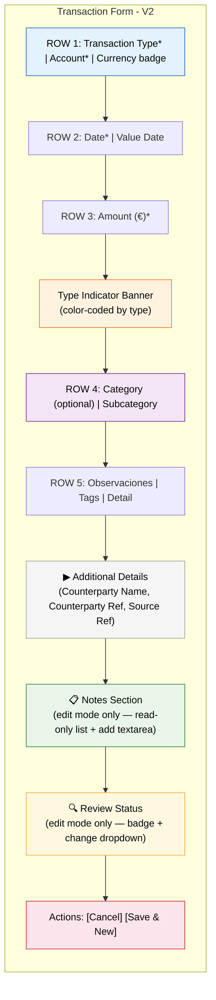
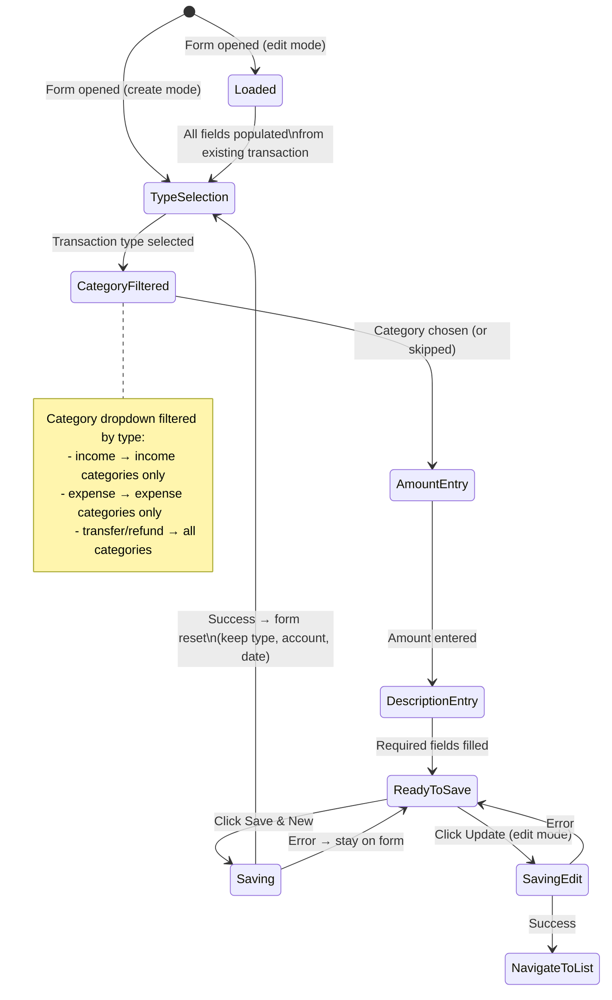
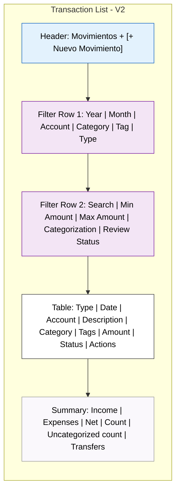
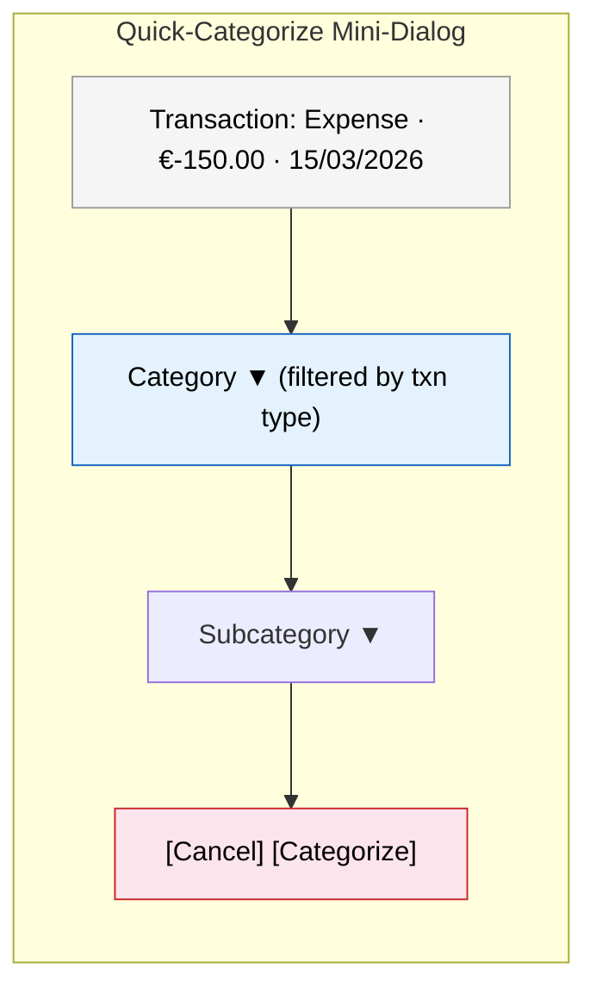
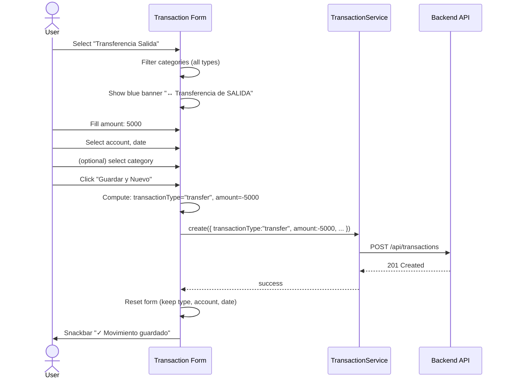

# Phase 1 — Frontend UX Specification

**Version:** 1.0
**Date:** 2026-04-12
**Author:** Niobe (Spec / UX Analyst)
**Requested by:** Pedro (perocha)
**Status:** Draft — awaiting approval
**Scope:** V2 revamp Phase 1 — Frontend component redesign for new data model
**Prerequisites:** Phase 1 backend (complete), Phase 1 frontend models/services (complete)
**Implements against:** [Phase 1 Core Model Spec](phase-1-core-model-spec.md)

---

## Table of Contents

1. [Design Principles](#1-design-principles)
2. [Transaction Form Redesign](#2-transaction-form-redesign)
3. [Transaction List Redesign](#3-transaction-list-redesign)
4. [Account Form Changes](#4-account-form-changes)
5. [Future Views — Phase 2 Recommendations](#5-future-views--phase-2-recommendations)
6. [Label Additions](#6-label-additions)
7. [Acceptance Criteria](#7-acceptance-criteria)

---

## 1. Design Principles

These principles guide every decision in this spec:

1. **Speed-of-entry first.** The admin enters 10–15 transactions daily from a bank export. Every extra click or scroll is multiplied 15×/day. The form must be optimized for rapid sequential entry.
2. **Progressive disclosure.** The most common fields are visible. Infrequent fields (counterparty, source reference, notes) are accessible but not in the way.
3. **Type drives context.** Selecting the transaction type should shape the rest of the form — category filtering, amount signing, and field emphasis all respond to the type.
4. **No red asterisks where none are needed.** Categories are now optional. The form should invite categorization, not demand it. This is critical for the Phase 2 bank import workflow.
5. **Existing patterns preserved.** The app uses Angular Material, mat-card layouts, dialog-based forms for reference data, and the `AppSettingsService` label system. All v2 work follows these established conventions.

---

## 2. Transaction Form Redesign

### 2.1 Current State

The current form has 10 fields in this order:

| Row | Fields | Layout |
|-----|--------|--------|
| 1 | Account, Date, Value Date | 3-column grid |
| 2 | Category (required), Subcategory (required) | 2-column grid |
| — | Category type indicator (income/expense banner) | Full-width |
| 3 | Amount (€) | Full-width |
| 4 | Observaciones (bankDescription) | Full-width textarea |
| 5 | Tags (multi-select) | Full-width |
| 6 | Detail | Full-width |
| — | Cancel / Save & New | Right-aligned actions |

**Key issues with current form:**
- No transaction type selector — direction is derived from category, which creates confusion
- Category and subcategory are required — blocks uncategorized transaction entry
- No counterparty, source reference, notes, or review status fields
- The category type indicator (green/red banner) appears *after* category selection — it should be clear *before*

### 2.2 V2 Form Layout

The redesigned form puts **Transaction Type first** — it's the single most important choice because it determines amount signing, category filtering, and field emphasis.

```
┌─────────────────────────────────────────────────────────────┐
│  [New Transaction / Edit Transaction]                       │
├─────────────────────────────────────────────────────────────┤
│                                                             │
│  ┌─ ROW 1: Type & Account ─────────────────────────────┐   │
│  │ Transaction Type ▼    Account ▼    [Currency badge]  │   │
│  └──────────────────────────────────────────────────────┘   │
│                                                             │
│  ┌─ ROW 2: Dates ──────────────────────────────────────┐   │
│  │ Date  📅            Value Date  📅                   │   │
│  └──────────────────────────────────────────────────────┘   │
│                                                             │
│  ┌─ ROW 3: Amount ─────────────────────────────────────┐   │
│  │ € Amount                                             │   │
│  │ [Type indicator: "↑ This will be recorded as INCOME"]│   │
│  └──────────────────────────────────────────────────────┘   │
│                                                             │
│  ┌─ ROW 4: Category (optional) ────────────────────────┐   │
│  │ Category ▼ (optional)     Subcategory ▼              │   │
│  └──────────────────────────────────────────────────────┘   │
│                                                             │
│  ┌─ ROW 5: Description & Tags ─────────────────────────┐   │
│  │ Observaciones                                        │   │
│  │ Tags ▼▼                                              │   │
│  │ Detail                                               │   │
│  └──────────────────────────────────────────────────────┘   │
│                                                             │
│  ┌─ ROW 6: Additional Details (collapsible) ───────────┐   │
│  │ ▶ Additional Details                                 │   │
│  │   Counterparty Name        Counterparty Reference    │   │
│  │   Source Reference                                   │   │
│  └──────────────────────────────────────────────────────┘   │
│                                                             │
│  ┌─ SECTION: Notes (edit mode only) ───────────────────┐   │
│  │ 📋 Notes (2)                                         │   │
│  │ ┌────────────────────────────────────┐               │   │
│  │ │ Pedro · 15/03/2026                 │               │   │
│  │ │ Confirmed with María — correct amt │               │   │
│  │ └────────────────────────────────────┘               │   │
│  │ ┌──────────────────────────┐                         │   │
│  │ │ Add a note...            │  [Add]                  │   │
│  │ └──────────────────────────┘                         │   │
│  └──────────────────────────────────────────────────────┘   │
│                                                             │
│  ┌─ SECTION: Review Status (edit mode only) ───────────┐   │
│  │ Review: [🟢 Approved]  [Change ▼]                    │   │
│  └──────────────────────────────────────────────────────┘   │
│                                                             │
│  ┌─ Actions ───────────────────────────────────────────┐   │
│  │                            [Cancel]  [Save & New]    │   │
│  └──────────────────────────────────────────────────────┘   │
└─────────────────────────────────────────────────────────────┘
```

### 2.3 Transaction Type Selector

**Component:** `mat-select` dropdown, full-width in its grid cell.

**Options (6 items — flat list, no grouping):**

| Display Label (ES) | Display Label (EN) | API Mapping | Amount Sign |
|--------------------|--------------------|-------------|-------------|
| Ingreso | Income | `transactionType: "income"` | `+abs(amount)` |
| Gasto | Expense | `transactionType: "expense"` | `-abs(amount)` |
| Transferencia Entrada | Transfer In | `transactionType: "transfer"` | `+abs(amount)` |
| Transferencia Salida | Transfer Out | `transactionType: "transfer"` | `-abs(amount)` |
| Reembolso Recibido | Refund Received | `transactionType: "refund"` | `+abs(amount)` |
| Reembolso Emitido | Refund Given | `transactionType: "refund"` | `-abs(amount)` |

**Implementation detail — the form stores TWO derived values:**

```typescript
// Internal form state (not sent to API directly)
transactionTypeDisplay: 'income' | 'expense' | 'transfer_in' | 'transfer_out' | 'refund_received' | 'refund_given'

// Computed for API payload:
// transactionType: 'income' | 'expense' | 'transfer' | 'refund'
// amountSign: +1 | -1
```

The `persist()` method maps the display value to the API:

| Display value | → `transactionType` | → Amount formula |
|---------------|---------------------|------------------|
| `income` | `income` | `+abs(amount)` |
| `expense` | `expense` | `-abs(amount)` |
| `transfer_in` | `transfer` | `+abs(amount)` |
| `transfer_out` | `transfer` | `-abs(amount)` |
| `refund_received` | `refund` | `+abs(amount)` |
| `refund_given` | `refund` | `-abs(amount)` |

**Behavior on selection change:**
1. Update the type indicator banner (see §2.5)
2. Filter the category dropdown (see §2.4)
3. On edit mode: if loading an existing transaction, derive the display value from `transactionType` + sign of `amount`:
   - `transfer` with positive amount → `transfer_in`
   - `transfer` with negative amount → `transfer_out`
   - `refund` with positive amount → `refund_received`
   - `refund` with negative amount → `refund_given`

**Position:** First field in Row 1, left column. Required (red asterisk). Default: none selected (user must choose).

**Save-and-New behavior:** When saving and resetting for the next entry, **preserve the transaction type** along with account and date. María typically enters a batch of the same type.

### 2.4 Category / Subcategory Behavior

**Category is now OPTIONAL.** This is the biggest behavioral change from v1.

**Visual changes:**
- Remove `Validators.required` from `categoryId` and `subcategoryId` form controls
- Add `(optional)` hint text inside the `mat-label`: `"Categoría (opcional)"` / `"Category (optional)"`
- No red asterisk on either field

**Category filtering by transaction type:**

| Transaction Type Display | Categories shown |
|-------------------------|------------------|
| Income | Only `categoryType: 'income'` categories |
| Expense | Only `categoryType: 'expense'` categories |
| Transfer In / Transfer Out | All categories (income + expense) |
| Refund Received / Refund Given | All categories (income + expense) |
| None selected | All categories |

Implementation: computed signal `filteredCategories` derives from `transactionTypeDisplay` signal + `activeCategories` list.

**When category is cleared:**
- Subcategory resets to empty
- `categorizationStatus` is handled server-side (no frontend logic needed)

**"Clear category" affordance:**
- Add a clear button (✕) inside the category `mat-select`. Angular Material supports this via a custom suffix or `mat-select` with an explicit "None" option.
- Recommended: add a first option `"— Sin categorizar —"` / `"— Uncategorized —"` with value `null`. This is more accessible than a small ✕ icon.

### 2.5 Type Indicator Banner

The current green/red banner that appears after category selection is **replaced and relocated.** It now appears immediately after the Transaction Type selector and responds to the type, not the category.

**Banner variants:**

| Transaction Type Display | Banner style | Text (ES) | Text (EN) |
|-------------------------|-------------|-----------|-----------|
| Income | Green background | ↑ Se registrará como INGRESO | ↑ Will be recorded as INCOME |
| Expense | Red background | ↓ Se registrará como GASTO | ↓ Will be recorded as EXPENSE |
| Transfer In | Blue background | ↔ Transferencia de ENTRADA | ↔ INCOMING transfer |
| Transfer Out | Blue background | ↔ Transferencia de SALIDA | ↔ OUTGOING transfer |
| Refund Received | Teal background | ↩ Reembolso RECIBIDO | ↩ RECEIVED refund |
| Refund Given | Teal background | ↩ Reembolso EMITIDO | ↩ GIVEN refund |
| None selected | Hidden | — | — |

**Placement:** Between Amount field and Category row. Visually it confirms "the system understood your intent" — not tied to category anymore.

### 2.6 Amount Field

**Always enter a positive number.** The transaction type dropdown already communicates direction. The user should never think about signs.

- `min="0.01"` on the input (prevent zero/negative)
- The `€` prefix stays
- The type indicator banner above confirms direction
- On save: `persist()` applies the sign based on `transactionTypeDisplay` mapping

**Label stays:** `"Importe (€)"` / `"Amount (€)"`

### 2.7 Additional Details — Collapsible Section

New fields that most transactions won't need: `counterpartyName`, `counterpartyReference`, `sourceReference`.

**Component:** Angular Material expansion panel (`mat-expansion-panel`) below the tags/detail row.

```html
<mat-expansion-panel>
  <mat-expansion-panel-header>
    <mat-panel-title>
      {{ settings.labels().additionalDetails }}
    </mat-panel-title>
  </mat-expansion-panel-header>

  <div class="form-row two-col">
    <mat-form-field appearance="outline">
      <mat-label>{{ settings.labels().counterpartyName }}</mat-label>
      <input matInput formControlName="counterpartyName">
    </mat-form-field>
    <mat-form-field appearance="outline">
      <mat-label>{{ settings.labels().counterpartyReference }}</mat-label>
      <input matInput formControlName="counterpartyReference">
    </mat-form-field>
  </div>

  <mat-form-field appearance="outline" class="full-width">
    <mat-label>{{ settings.labels().sourceReference }}</mat-label>
    <input matInput formControlName="sourceReference">
  </mat-form-field>
</mat-expansion-panel>
```

**Auto-expand in edit mode:** If the loaded transaction has any of these fields populated, expand the panel automatically.

### 2.8 Notes Section (Edit Mode Only)

Notes are append-only. The section only appears when editing an existing transaction.

**Layout:**

```
┌─ Notes (3) ────────────────────────────────────┐
│                                                 │
│  ┌─────────────────────────────────────────┐    │
│  │ Demo Admin · 15/03/2026 10:30          │    │
│  │ Confirmed with María — correct amount   │    │
│  └─────────────────────────────────────────┘    │
│  ┌─────────────────────────────────────────┐    │
│  │ María García · 16/03/2026 14:15         │    │
│  │ Reviewed and approved                   │    │
│  └─────────────────────────────────────────┘    │
│                                                 │
│  ┌─────────────────────────┐                    │
│  │ Add a note...           │  [Add Note]        │
│  └─────────────────────────┘                    │
└─────────────────────────────────────────────────┘
```

**Component behavior:**
- Existing notes rendered as read-only cards, sorted newest-first
- Each note shows: `authorName` (fallback to `author` OID), `createdAt` formatted as `dd/MM/yyyy HH:mm`, and `text`
- "Add Note" is a `textarea` + `mat-flat-button`. On click:
  1. Call `transactionService.addNote(id, { text }, year, month)`
  2. On success: clear the textarea, prepend the new note to the displayed list
  3. On error: snackbar with error message
- Section header shows count: `"Notas (3)"` / `"Notes (3)"`
- If no notes exist, show the section with just the add-note input and header `"Notas (0)"`
- **Not shown in create mode** — you can't add notes to a transaction that doesn't exist yet

**API call:** `POST /api/transactions/{id}/notes` with body `{ "text": "..." }`

### 2.9 Review Status (Edit Mode Only)

Visible only when editing. Shows the current review status as a colored chip and allows admins to change it.

**Layout:**

```
┌─ Review ───────────────────────────────────────┐
│  Status: [🟠 Pending]   [Change ▼]             │
│  Last reviewed by: María García · 16/03/2026   │
└─────────────────────────────────────────────────┘
```

**Badge/chip colors:**

| Status | Color | Icon | Label (ES) | Label (EN) |
|--------|-------|------|-----------|-----------|
| `pending` | Orange (`#ff9800`) | `schedule` | Pendiente | Pending |
| `reviewed` | Blue (`#2196f3`) | `visibility` | Revisado | Reviewed |
| `approved` | Green (`#4caf50`) | `check_circle` | Aprobado | Approved |
| `flagged` | Red (`#f44336`) | `flag` | Marcado | Flagged |

**"Change" control:** `mat-select` dropdown inline, pre-selected to current status. On selection change:
1. Call `transactionService.review(id, { reviewStatus: newValue }, year, month)`
2. Update the chip display
3. Update the "Last reviewed by" line

**"Last reviewed by" line:** Only shown if `reviewedBy` is not null. Format: `"{reviewedByName} · {reviewedAt as dd/MM/yyyy}"`.

**Viewers (non-admin):** The status badge is shown as read-only. The "Change" dropdown is hidden.

### 2.10 Form Wireframe — Mermaid



### 2.11 Form State Diagram



---

## 3. Transaction List Redesign

### 3.1 Current State

**Columns:** date, account, bankDescription, category, subcategory, tags, amount, balance, actions (edit/delete)

**Filters:** year, month, account, category, tag, search text, amount min/max

**Summary footer:** Total Income, Total Expenses, Net

### 3.2 V2 Column Changes

New column order with additions:

| # | Column | New? | Content | Width hint |
|---|--------|------|---------|------------|
| 1 | Type | **NEW** | Icon badge for transaction type | 40px |
| 2 | Date | existing | `dd/MM/yyyy` | 100px |
| 3 | Account | existing | Account label | 140px |
| 4 | Description | existing | `bankDescription` or `detail` | flex |
| 5 | Category | **MODIFIED** | Category name or uncategorized badge | 150px |
| 6 | Tags | existing | Tag pills | 120px |
| 7 | Amount | existing | Signed, color-coded | 100px |
| 8 | Status | **NEW** | Review + categorization indicators | 80px |
| 9 | Actions | existing | Edit / Delete buttons | 80px |

**Removed:** `subcategory` column (space constraint — visible on hover/edit), `balance` column (clutters the view; useful only during import reconciliation — moved to export).

### 3.3 Transaction Type Column

**Display:** Small icon badge, no text (to save horizontal space).

| Type | Icon | Color | Tooltip (ES) | Tooltip (EN) |
|------|------|-------|-------------|-------------|
| `income` | `arrow_upward` | Green (`#4caf50`) | Ingreso | Income |
| `expense` | `arrow_downward` | Red (`#e53935`) | Gasto | Expense |
| `transfer` (positive) | `swap_horiz` | Blue (`#1e88e5`) | Transferencia entrada | Transfer in |
| `transfer` (negative) | `swap_horiz` | Blue (`#1e88e5`) | Transferencia salida | Transfer out |
| `refund` (positive) | `replay` | Teal (`#00897b`) | Reembolso recibido | Refund received |
| `refund` (negative) | `replay` | Teal (`#00897b`) | Reembolso emitido | Refund given |

Implementation: `mat-icon` with `[matTooltip]` and `[style.color]` bound to a computed value.

### 3.4 Category Column — Uncategorized Handling

When `categoryId` is `null`:

- Display: `"Sin categorizar"` / `"Uncategorized"` in italics, muted color (`#a69cad`)
- **Quick-categorize button:** A small `mat-icon-button` with icon `categorize` (or `label`) appears inline next to the text. On click → opens a mini-dialog or inline dropdown to assign a category.
  - The quick-categorize calls `PATCH /api/transactions/{id}/categorize`
  - Category dropdown in the mini-dialog is filtered by the transaction's `transactionType` (same rules as the form)

When `categoryId` is present: show category name as before. Subcategory is omitted from the list view (visible in edit form).

### 3.5 Status Column — Combined Indicators

Combine review status and categorization status into one compact column using stacked small badges.

**Layout per cell:**

```
┌────────┐
│ 🟠 P   │  ← Review status badge (small)
│ ○ UC   │  ← Categorization badge (only if uncategorized)
└────────┘
```

**Review status badges (always shown):**

| Status | Abbreviation | Color | Full tooltip (ES) |
|--------|-------------|-------|-------------------|
| `pending` | P | Orange chip | Pendiente de revisión |
| `reviewed` | R | Blue chip | Revisado |
| `approved` | A | Green chip | Aprobado |
| `flagged` | F | Red chip | Marcado para revisión |

**Categorization badge (only shown when uncategorized):**

| Status | Display | Color |
|--------|---------|-------|
| `uncategorized` | `○` (empty circle) + "SC" | Gray, muted |
| `manually_categorized` | Hidden | — |
| `auto_categorized` | Hidden | — |

The categorization badge only appears for uncategorized items. Categorized items don't need a badge — the category column already tells the story.

### 3.6 New Filters

Add these filters to the filter bar:

**Transaction Type filter — Row 1, after "Tag" filter:**

```html
<mat-form-field appearance="outline" class="filter-field">
  <mat-label>{{ settings.labels().transactionType }}</mat-label>
  <mat-select [(ngModel)]="filterTransactionType" (selectionChange)="loadTransactions()">
    <mat-option value="">{{ settings.labels().allItems }}</mat-option>
    <mat-option value="income">{{ settings.labels().incomeType }}</mat-option>
    <mat-option value="expense">{{ settings.labels().expenseType }}</mat-option>
    <mat-option value="transfer">{{ settings.labels().transferType }}</mat-option>
    <mat-option value="refund">{{ settings.labels().refundType }}</mat-option>
  </mat-select>
</mat-form-field>
```

**Categorization Status filter — Row 2, after amount max:**

```html
<mat-form-field appearance="outline" class="filter-field">
  <mat-label>{{ settings.labels().categorizationFilter }}</mat-label>
  <mat-select [(ngModel)]="filterCategorizationStatus" (selectionChange)="loadTransactions()">
    <mat-option value="">{{ settings.labels().allItems }}</mat-option>
    <mat-option value="uncategorized">{{ settings.labels().uncategorizedOnly }}</mat-option>
    <mat-option value="manually_categorized">{{ settings.labels().manuallyCategorized }}</mat-option>
  </mat-select>
</mat-form-field>
```

**Review Status filter — Row 2, after categorization:**

```html
<mat-form-field appearance="outline" class="filter-field">
  <mat-label>{{ settings.labels().reviewStatusFilter }}</mat-label>
  <mat-select [(ngModel)]="filterReviewStatus" (selectionChange)="loadTransactions()">
    <mat-option value="">{{ settings.labels().allItems }}</mat-option>
    <mat-option value="pending">{{ settings.labels().statusPending }}</mat-option>
    <mat-option value="reviewed">{{ settings.labels().statusReviewed }}</mat-option>
    <mat-option value="approved">{{ settings.labels().statusApproved }}</mat-option>
    <mat-option value="flagged">{{ settings.labels().statusFlagged }}</mat-option>
  </mat-select>
</mat-form-field>
```

All three are passed as query parameters to the API (`transactionType`, `categorizationStatus`, `reviewStatus`). Server-side filtering — no additional client-side logic needed.

### 3.7 Summary Footer Update

The current footer shows `Total Income | Total Expenses | Net`.

**V2 changes:**
- Keep the same three values
- Add a transaction count: `"42 movimientos"` / `"42 transactions"`
- Add uncategorized count if > 0: `"3 sin categorizar"` / `"3 uncategorized"` in orange
- Transfers and refunds are excluded from income/expense totals (per spec). Add a separate line if transfer/refund transactions exist: `"Transferencias: €5.000,00"` / `"Transfers: €5,000.00"`

### 3.8 List Wireframe — Mermaid



### 3.9 Quick-Categorize Dialog

When the user clicks the categorize icon on an uncategorized transaction in the list:



**Behavior:**
1. Opens as a `MatDialog` (small — `width: 400px`)
2. Shows transaction summary at top (type, amount, date) for context
3. Category dropdown filtered by the transaction's `transactionType`
4. Subcategory dropdown populated when category is selected
5. On "Categorize" → `PATCH /api/transactions/{id}/categorize`
6. On success → close dialog, update the row in the list (change category text, remove uncategorized badge)
7. Includes a "Clear Category" option (sets categoryId to null) for re-categorization corrections

---

## 4. Account Form Changes

### 4.1 Current State

The account form dialog has: Bank Name, Short Name, Account Label, PayPal toggle, IBAN/PayPal Email, Sort Order.

### 4.2 V2 Addition: Currency Field

Add a `currency` field.

**Position:** After IBAN/PayPal Email, before Sort Order.

**Component:** `mat-select` with pre-defined common currencies.

```html
<mat-form-field appearance="outline" class="full-width">
  <mat-label>{{ settings.labels().currency }}</mat-label>
  <mat-select formControlName="currency">
    <mat-option value="EUR">EUR — Euro</mat-option>
    <mat-option value="USD">USD — US Dollar</mat-option>
    <mat-option value="GBP">GBP — British Pound</mat-option>
  </mat-select>
</mat-form-field>
```

**Default:** `EUR` (pre-selected for new accounts).

**Short list rationale:** Rett Spain deals almost exclusively in EUR. USD and GBP cover edge cases (international donations). If Pedro needs more currencies, the list is trivial to extend.

### 4.3 Account Card — Currency Display

On the account list cards, show the currency next to the account label:

```
┌──────────────────────────────────────┐
│ 🏦  Unicaja — Cuenta principal [EUR] │
│     Unicaja Banco S.A.               │
│     IBAN: ****3456                   │
│                             [toggle] [edit] [delete]
└──────────────────────────────────────┘
```

The `[EUR]` badge is a small chip (`mat-chip`) next to the title. Only shown if currency differs from EUR — or always shown for clarity. **Recommendation:** always show it.

---

## 5. Future Views — Phase 2 Recommendations

These are NOT in Phase 1 scope. They are recommendations for when Phase 2 (bank import) ships.

### 5.1 Review Queue Page

**Route:** `/review`

**Purpose:** List all `pending` and `flagged` transactions for review. The admin (María) uses this after a bank import to review imported transactions.

**Content:**
- Filtered list showing only `reviewStatus: pending | flagged`
- Batch actions: "Approve All Visible", "Flag Selected"
- Each row has inline approve/flag buttons

**Why defer:** Phase 1 has no import. Manual transactions default to `approved`. The review queue becomes useful when Phase 2 imports create `pending` transactions.

### 5.2 Categorize Queue Page

**Route:** `/categorize`

**Purpose:** List all `uncategorized` transactions for categorization. Critical after bank import (transactions arrive without categories).

**Content:**
- Filtered list showing only `categorizationStatus: uncategorized`
- Quick-categorize inline (same dialog as §3.9)
- Smart suggestions (Phase 4): suggest categories based on description patterns

**Why defer:** Phase 1 transactions are typically categorized at creation. The queue becomes essential when Phase 2 bank imports create uncategorized transactions.

### 5.3 Navigation Update (Phase 2)

When these pages ship, add them to the sidebar navigation:

```
Panel
Movimientos
  → Cola de revisión (badge: 5)
  → Sin categorizar (badge: 12)
Categorías
Etiquetas
Cuentas
Importación
Exportar
```

The badge counts would be fetched from a lightweight API endpoint or computed client-side.

---

## 6. Label Additions

All new labels needed for `AppLabels` type and both language files (`es.ts`, `en.ts`).

### 6.1 New Label Keys

```typescript
// --- Phase 1: Transaction Type ---
transactionType: string;           // "Tipo de movimiento" / "Transaction type"
incomeOption: string;              // "Ingreso" / "Income"
expenseOption: string;             // "Gasto" / "Expense"
transferInOption: string;          // "Transferencia Entrada" / "Transfer In"
transferOutOption: string;         // "Transferencia Salida" / "Transfer Out"
refundReceivedOption: string;      // "Reembolso Recibido" / "Refund Received"
refundGivenOption: string;         // "Reembolso Emitido" / "Refund Given"
transferType: string;              // "Transferencia" / "Transfer" (filter label)
refundType: string;                // "Reembolso" / "Refund" (filter label)

// --- Phase 1: Type indicators (form banners) ---
incomeIndicatorV2: string;         // "↑ Se registrará como INGRESO" / "↑ Will be recorded as INCOME"
expenseIndicatorV2: string;        // "↓ Se registrará como GASTO" / "↓ Will be recorded as EXPENSE"
transferInIndicator: string;       // "↔ Transferencia de ENTRADA" / "↔ INCOMING transfer"
transferOutIndicator: string;      // "↔ Transferencia de SALIDA" / "↔ OUTGOING transfer"
refundReceivedIndicator: string;   // "↩ Reembolso RECIBIDO" / "↩ RECEIVED refund"
refundGivenIndicator: string;      // "↩ Reembolso EMITIDO" / "↩ GIVEN refund"

// --- Phase 1: Category optional ---
categoryOptional: string;          // "Categoría (opcional)" / "Category (optional)"
subcategoryOptional: string;       // "Subcategoría (opcional)" / "Subcategory (optional)"
uncategorizedLabel: string;        // "Sin categorizar" / "Uncategorized"
clearCategory: string;             // "— Sin categorizar —" / "— Uncategorized —"

// --- Phase 1: Additional details ---
additionalDetails: string;         // "Detalles adicionales" / "Additional details"
counterpartyName: string;          // "Nombre tercero" / "Counterparty name"
counterpartyReference: string;     // "Referencia tercero" / "Counterparty reference"
sourceReference: string;           // "Referencia origen" / "Source reference"

// --- Phase 1: Notes ---
notesSection: string;              // "Notas" / "Notes"
noteCount: (n: number) => string;  // "Notas (3)" / "Notes (3)"
addNote: string;                   // "Añadir nota" / "Add note"
addNotePlaceholder: string;        // "Escribir una nota..." / "Write a note..."
noteAdded: string;                 // "✓ Nota añadida" / "✓ Note added"

// --- Phase 1: Review status ---
reviewStatus: string;              // "Estado de revisión" / "Review status"
statusPending: string;             // "Pendiente" / "Pending"
statusReviewed: string;            // "Revisado" / "Reviewed"
statusApproved: string;            // "Aprobado" / "Approved"
statusFlagged: string;             // "Marcado" / "Flagged"
changeStatus: string;              // "Cambiar" / "Change"
lastReviewedBy: string;            // "Última revisión:" / "Last reviewed by:"
reviewStatusUpdated: string;       // "✓ Estado actualizado" / "✓ Status updated"

// --- Phase 1: Filters ---
categorizationFilter: string;      // "Categorización" / "Categorization"
uncategorizedOnly: string;         // "Solo sin categorizar" / "Uncategorized only"
manuallyCategorized: string;       // "Categorizado manual" / "Manually categorized"
reviewStatusFilter: string;        // "Revisión" / "Review"

// --- Phase 1: List summary ---
transactionCount: (n: number) => string;      // "42 movimientos" / "42 transactions"
uncategorizedCount: (n: number) => string;     // "3 sin categorizar" / "3 uncategorized"
transfersTotal: string;            // "Transferencias" / "Transfers"

// --- Phase 1: Account ---
currency: string;                  // "Moneda" / "Currency"

// --- Phase 1: Quick categorize dialog ---
quickCategorize: string;           // "Categorizar" / "Categorize"
categorizeTitle: string;           // "Categorizar movimiento" / "Categorize transaction"
categorizeButton: string;          // "Categorizar" / "Categorize"
categorizationSaved: string;       // "✓ Categoría asignada" / "✓ Category assigned"
```

### 6.2 Label Count

**New labels:** ~42 new entries.
**Modified labels:** `incomeIndicator` and `expenseIndicator` can be replaced by v2 versions, or kept for backward compatibility during transition.

---

## 7. Acceptance Criteria

### 7.1 Transaction Form — Type Selector

- [ ] **AC-F01:** Given the transaction form (create mode), when the form loads, then the Transaction Type dropdown is visible as the first field in Row 1, required, with no default selection.
- [ ] **AC-F02:** Given the Transaction Type dropdown, when the user opens it, then 6 options are shown: Ingreso, Gasto, Transferencia Entrada, Transferencia Salida, Reembolso Recibido, Reembolso Emitido (in Spanish) or their English equivalents.
- [ ] **AC-F03:** Given the user selects "Ingreso", when the form updates, then the type indicator banner shows green with "↑ Se registrará como INGRESO" and the category dropdown shows only income-type categories.
- [ ] **AC-F04:** Given the user selects "Gasto", when the form updates, then the type indicator banner shows red with "↓ Se registrará como GASTO" and the category dropdown shows only expense-type categories.
- [ ] **AC-F05:** Given the user selects "Transferencia Entrada", when the form updates, then the type indicator banner shows blue with "↔ Transferencia de ENTRADA" and the category dropdown shows all categories (income + expense).
- [ ] **AC-F06:** Given the user selects "Transferencia Salida", when the form updates, then the type indicator banner shows blue with "↔ Transferencia de SALIDA" and the category dropdown shows all categories.
- [ ] **AC-F07:** Given the user selects "Reembolso Recibido", when the form updates, then the type indicator banner shows teal with "↩ Reembolso RECIBIDO" and the category dropdown shows all categories.
- [ ] **AC-F08:** Given the user selects "Reembolso Emitido", when the form updates, then the type indicator banner shows teal with "↩ Reembolso EMITIDO" and the category dropdown shows all categories.
- [ ] **AC-F09:** Given the user enters amount 500 and type "Gasto", when the form is saved, then the API receives `transactionType: "expense"` and `amount: 500` (the backend signs it as -500).
- [ ] **AC-F10:** Given the user enters amount 500 and type "Transferencia Salida", when the form is saved, then the API receives `transactionType: "transfer"` and `amount: -500` (negative because transfer out).
- [ ] **AC-F11:** Given the user saves a transaction and selects "Save & New", when the form resets, then the Transaction Type, Account, and Date are preserved from the previous entry.

### 7.2 Transaction Form — Optional Category

- [ ] **AC-F12:** Given the transaction form, when it loads, then the Category and Subcategory fields show "(opcional)" / "(optional)" in the label hint and have no required asterisk.
- [ ] **AC-F13:** Given the category dropdown, when the user opens it, then a first option "— Sin categorizar —" with value `null` is available.
- [ ] **AC-F14:** Given a transaction with type "Ingreso" and the user opens the category dropdown, then only income-type categories are shown (plus the uncategorized option).
- [ ] **AC-F15:** Given a transaction with no category selected, when the user saves, then the transaction is created successfully with `categoryId: null`.

### 7.3 Transaction Form — Additional Details

- [ ] **AC-F16:** Given the transaction form, when it loads, then the "Additional Details" section is collapsed by default.
- [ ] **AC-F17:** Given the "Additional Details" section, when the user expands it, then three fields are visible: Counterparty Name, Counterparty Reference, Source Reference.
- [ ] **AC-F18:** Given a transaction being edited that has `counterpartyName = "Inmobiliaria García"`, when the form loads, then the "Additional Details" section is expanded automatically and the counterparty name field shows the value.

### 7.4 Transaction Form — Notes

- [ ] **AC-F19:** Given the transaction form in create mode, when the form loads, then the Notes section is NOT visible.
- [ ] **AC-F20:** Given the transaction form in edit mode for a transaction with 2 notes, when the form loads, then the Notes section is visible with header "Notas (2)" and both notes are shown with author, date, and text.
- [ ] **AC-F21:** Given the Notes section, when the user types "Checked with bank" and clicks "Add Note", then the note is saved via `POST /api/transactions/{id}/notes` and appears at the top of the notes list without page reload.
- [ ] **AC-F22:** Given the Notes section, when the add-note textarea is empty, then the "Add Note" button is disabled.

### 7.5 Transaction Form — Review Status

- [ ] **AC-F23:** Given the transaction form in create mode, when the form loads, then the Review Status section is NOT visible.
- [ ] **AC-F24:** Given the transaction form in edit mode for a transaction with `reviewStatus: "pending"`, when the form loads, then an orange "Pendiente" badge is visible.
- [ ] **AC-F25:** Given an admin user editing a transaction, when the admin changes the review status from "Pending" to "Approved" via the dropdown, then `PATCH /api/transactions/{id}/review` is called with `{ reviewStatus: "approved" }` and the badge updates to green "Aprobado".
- [ ] **AC-F26:** Given a viewer (non-admin) user editing a transaction, then the review status badge is shown but the "Change" dropdown is hidden.

### 7.6 Transaction List — Type Column

- [ ] **AC-L01:** Given the transaction list, when it renders, then each row shows a type icon: green ↑ for income, red ↓ for expense, blue ↔ for transfer, teal ↩ for refund.
- [ ] **AC-L02:** Given a transaction with `transactionType: "transfer"` and positive amount, when the user hovers over the type icon, then a tooltip shows "Transferencia entrada" / "Transfer in".

### 7.7 Transaction List — Uncategorized Handling

- [ ] **AC-L03:** Given a transaction with `categoryId: null`, when the list renders, then the category cell shows "Sin categorizar" in italics, muted color, with a small categorize icon button.
- [ ] **AC-L04:** Given the user clicks the categorize icon on an uncategorized expense transaction, when the quick-categorize dialog opens, then only expense-type categories are shown in the category dropdown.
- [ ] **AC-L05:** Given the user selects a category in the quick-categorize dialog and clicks "Categorize", then `PATCH /api/transactions/{id}/categorize` is called and the list row updates to show the assigned category name (without full page reload).

### 7.8 Transaction List — Status Column

- [ ] **AC-L06:** Given the transaction list, when it renders, then each row shows a small review status badge (P/R/A/F) with the correct color.
- [ ] **AC-L07:** Given an uncategorized transaction, when the list renders, then a gray "○ SC" badge appears below the review status badge in the status column.

### 7.9 Transaction List — New Filters

- [ ] **AC-L08:** Given the transaction list filter bar, then a "Transaction Type" filter is available with options: All, Income, Expense, Transfer, Refund.
- [ ] **AC-L09:** Given the user selects "Expense" in the Type filter, when transactions reload, then only expense-type transactions are shown.
- [ ] **AC-L10:** Given the transaction list filter bar, then a "Categorization" filter is available with options: All, Uncategorized Only, Manually Categorized.
- [ ] **AC-L11:** Given the user selects "Uncategorized Only", when transactions reload, then only transactions with `categoryId: null` are shown.
- [ ] **AC-L12:** Given the transaction list filter bar, then a "Review Status" filter is available with options: All, Pending, Reviewed, Approved, Flagged.

### 7.10 Transaction List — Summary Footer

- [ ] **AC-L13:** Given the transaction list with 42 visible transactions (30 income/expense + 12 transfers), then the footer shows: Income total, Expense total, Net (excluding transfers), transaction count "42 movimientos", and a transfers line.
- [ ] **AC-L14:** Given the transaction list includes 3 uncategorized transactions, then the footer shows "3 sin categorizar" in orange text.

### 7.11 Account Form — Currency

- [ ] **AC-A01:** Given the account form dialog (create mode), when it opens, then a Currency dropdown is visible with EUR pre-selected.
- [ ] **AC-A02:** Given the account form dialog, when the user changes currency to USD and saves, then the account is created with `currency: "USD"`.
- [ ] **AC-A03:** Given the account list, then each account card shows its currency as a small badge (e.g., "[EUR]").

---

## Appendix A: Form Field Mapping — Current vs. V2

| Current Form | V2 Form | Change |
|-------------|---------|--------|
| — | Transaction Type* (dropdown) | **NEW — required, first field** |
| Account* (dropdown) | Account* (dropdown) | Moved to Row 1 with Type |
| Date* (datepicker) | Date* (datepicker) | Moved to Row 2 |
| Value Date (datepicker) | Value Date (datepicker) | Moved to Row 2 |
| Category* (dropdown) | Category (optional, dropdown) | **Changed — now optional, filtered by type** |
| Subcategory* (dropdown) | Subcategory (optional, dropdown) | **Changed — now optional** |
| Category type banner | Type indicator banner | **Changed — driven by type, not category** |
| Amount* (number) | Amount* (number, always positive) | Moved to Row 3 |
| Observaciones (textarea) | Observaciones (textarea) | No change |
| Tags (multi-select) | Tags (multi-select) | No change |
| Detail (text) | Detail (text) | No change |
| — | Counterparty Name (text) | **NEW — in collapsible section** |
| — | Counterparty Reference (text) | **NEW — in collapsible section** |
| — | Source Reference (text) | **NEW — in collapsible section** |
| — | Notes section (edit only) | **NEW — read-only list + add** |
| — | Review Status (edit only) | **NEW — badge + change dropdown** |

## Appendix B: Data Flow — Transaction Create


