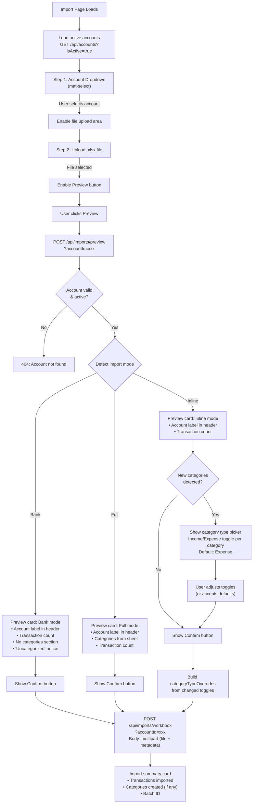
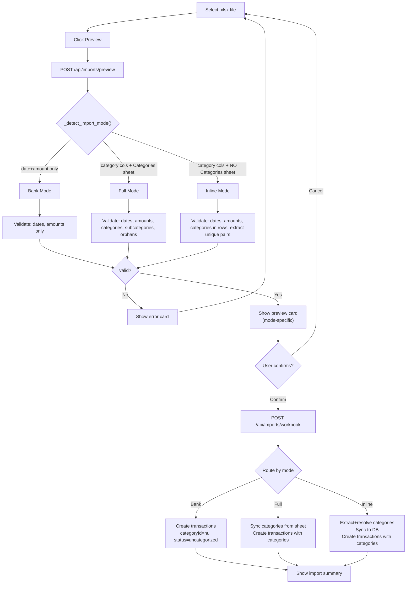

# Phase 2 — Import Improvements Technical Specification

**Version:** 1.0
**Date:** 2026-04-12
**Author:** Niobe (Spec / UX Analyst)
**Requested by:** Pedro (perocha)
**Status:** Draft — awaiting approval
**Scope:** V2 revamp Phase 2 — Import mode detection, Bank mode, Inline mode, endpoint rename, batch tracking
**Prerequisites:** Phase 1 merged (transactionType, nullable categories, categorizationStatus, reviewStatus)
**Branch:** `feature/phase2-import`

---

## Table of Contents

1. [Executive Summary](#1-executive-summary)
2. [Import Mode Detection](#2-import-mode-detection)
3. [REQUIRED_HEADERS Change](#3-required_headers-change)
4. [Bank Mode](#4-bank-mode)
5. [Inline Mode](#5-inline-mode)
6. [Full Mode Updates](#6-full-mode-updates)
7. [Endpoint Rename](#7-endpoint-rename)
8. [Import Batch Tracking](#8-import-batch-tracking)
9. [Schema Changes](#9-schema-changes)
10. [Frontend Changes](#10-frontend-changes)
11. [Acceptance Criteria](#11-acceptance-criteria)
12. [Test Fixtures](#12-test-fixtures)
13. [Files Changed](#13-files-changed)
14. [Amendment 1: Account Selection & Category Type Picker](#amendment-1-account-selection--category-type-picker)

---

## 1. Executive Summary

Phase 2 transforms the import feature from a single rigid mode into a flexible three-mode system. The key change: **`category` and `subcategory` columns are no longer required.** Only `date` and `amount` are needed for header detection. The presence or absence of category columns and a Categories sheet determines which import mode the system uses.

This unlocks the critical **Bank mode**: raw bank exports (date + amount only) can be imported directly, with transactions created as uncategorized for later manual categorization. This is Pedro's daily workflow — importing Unicaja bank statements without needing to categorize everything upfront.

**Key decisions:**
- **No auto-categorization in Bank mode.** This is explicitly a Phase 4 rule-engine feature.
- **No backward compatibility.** The `/unicaja-template` endpoint is renamed to `/workbook` directly.
- **Import batch tracking** via `importBatchId` + `importSource` on every imported transaction.

**FRs addressed:** FR-005 (full), FR-007 (importBatchId), FR-016 (uncategorized via Bank mode).

---

## 2. Import Mode Detection

### Three Modes

| Mode | Category columns present? | Categories sheet exists? | Behavior |
|------|--------------------------|-------------------------|----------|
| **Full** | ✅ Yes | ✅ Yes | Current behavior — sync categories from sheet, map transactions to categories |
| **Inline** | ✅ Yes | ❌ No | Extract unique category/subcategory pairs from transaction rows, create as needed |
| **Bank** | ❌ No | (ignored) | Import as uncategorized — date + amount only |

### Detection Algorithm: `_detect_import_mode()`

```python
def _detect_import_mode(self, workbook) -> str:
    """Detect import mode from workbook structure.
    
    Returns: "full", "inline", or "bank"
    
    Algorithm (order matters):
    1. Find the movements sheet (must exist — checked earlier)
    2. Build header map from the header row
    3. Check if 'category' AND 'subcategory' keys exist in the header map
       - If NO → return "bank" (category columns absent)
       - If YES → continue to step 4
    4. Check if a Categories sheet exists (by name match)
       - If YES → return "full"
       - If NO → return "inline"
    """
    movement_sheet, header_row = self._find_movements_sheet(workbook)
    headers = self._build_header_map(movement_sheet, header_row)
    
    has_category_col = "category" in headers
    has_subcategory_col = "subcategory" in headers
    has_category_columns = has_category_col and has_subcategory_col
    
    if not has_category_columns:
        return "bank"
    
    category_sheet = self._find_categories_sheet(workbook)
    if category_sheet is not None:
        return "full"
    
    return "inline"
```

**Edge cases:**

| Scenario | Result | Rationale |
|----------|--------|-----------|
| Only `category` present (no `subcategory`) | **Bank** | Both must be present to count as "category columns present" |
| Only `subcategory` present (no `category`) | **Bank** | Same — incomplete category information |
| Category columns present + Categories sheet present but empty | **Full** | Sheet exists, even if empty — Full mode validation will catch empty-sheet errors |
| Category columns present + Categories sheet named `"Cats"` | **Inline** | Sheet name doesn't match `CATEGORY_SHEET_NAMES` → treated as absent |

### Where Detection Runs

Mode detection runs in both `preview_workbook()` and `import_workbook()`. The detected mode is included in the response (`importMode` field) and drives routing to mode-specific logic.

---

## 3. REQUIRED_HEADERS Change

### Current Behavior

```python
REQUIRED_HEADERS = {"date", "amount", "category", "subcategory"}
```

All 4 must be found for header row detection. If any is missing, the file is rejected.

### New Behavior

```python
REQUIRED_HEADERS = {"date", "amount"}
```

Only `date` and `amount` are required for **header row detection**. The `_find_header_row()` method scans for rows containing at least these 2 canonical keys.

**`category` and `subcategory`** become optional detection signals: their presence or absence drives mode detection (see section 2), but they are NOT required for header identification.

### Impact on `_find_header_row()`

The method logic stays the same — scan first 12 rows, check if `REQUIRED_HEADERS.issubset(found_keys)`. The change is only that `REQUIRED_HEADERS` is now `{"date", "amount"}`.

### Constants File Update

In `app/constants/import_constants.py`:

```python
# Required for header row detection (minimum columns)
REQUIRED_HEADERS = {"date", "amount"}

# Optional columns that determine import mode
CATEGORY_HEADERS = {"category", "subcategory"}
```

---

## 4. Bank Mode

### When Active

The file has `date` + `amount` columns but **NO** `category` and/or `subcategory` columns. The Categories sheet is ignored even if present.

### Preview: `preview_workbook()` in Bank Mode

**Validation checks (Bank mode):**

| Check | Severity | Rule |
|-------|----------|------|
| Workbook readable | Error | Must be a valid `.xlsx` |
| Movement sheet found | Error | At least one sheet contains `date` + `amount` headers |
| Empty dates | Error | Rows with blank date column |
| Unparseable dates | Error | Rows where date can't be parsed |
| Empty amounts | Error | Rows with blank amount column |
| Unparseable amounts | Error | Rows where amount isn't a valid number |

**NOT checked in Bank mode:**
- ❌ Categories sheet existence (irrelevant)
- ❌ Empty categories/subcategories (columns don't exist)
- ❌ Orphaned categories/subcategories (no categories to orphan)
- ❌ Category type mismatch (no categories)

**Preview response (Bank mode):**

```json
{
  "valid": true,
  "importMode": "bank",
  "errors": [],
  "warnings": [],
  "totalRows": 52,
  "rowsWithErrors": 0,
  "account": {
    "exists": true,
    "id": "acc-abc123",
    "label": "Unicaja 0382",
    "iban": "ES0000490001000000001234"
  },
  "newCategories": [],
  "newSubcategories": [],
  "transactionsToImport": 47,
  "duplicatesToSkip": 5
}
```

Key differences from Full mode:
- `importMode` = `"bank"`
- `newCategories` and `newSubcategories` are always empty arrays
- No category-related warnings

### Import: `import_workbook()` in Bank Mode

**Transaction creation (per row):**

| Field | Value | Source |
|-------|-------|--------|
| `transactionDate` | Parsed from `date` column | Row data |
| `valueDate` | From `value_date` column if present, else same as `transactionDate` | Row data or default |
| `amount` | Raw value from `amount` column (preserving sign) | Row data |
| `currency` | From `currency` column if present, else `"EUR"` | Row data or default |
| `bankDescription` | From `description` column if present | Row data |
| `accountId` | Resolved account | Account resolution |
| `transactionType` | Inferred from amount sign: `amount >= 0` → `income`, `amount < 0` → `expense` | Derived |
| `categoryId` | `null` | Bank mode — no categories |
| `subcategoryId` | `null` | Bank mode — no categories |
| `categorizationStatus` | `"uncategorized"` | Bank mode default |
| `reviewStatus` | `"pending"` | Import default (per Phase 1 decision) |
| `detail` | Built from optional columns (same `_build_detail()` logic) | Row data |
| `movementNumber` | From `movement_no` column if present | Row data |
| `branchNumber` | From `branch` column if present | Row data |
| `balance` | From `balance` column if present | Row data |
| `tagIds` | `[]` | Default |
| `counterpartyName` | `null` | Default |
| `counterpartyReference` | `null` | Default |
| `sourceReference` | `null` | Default |
| `importBatchId` | UUID generated for this import run | See section 8 |
| `importSource` | `"excel-bank"` | See section 8 |

**`transactionType` inference from amount sign:**

```python
def _infer_transaction_type(self, amount: Decimal) -> TransactionType:
    """Infer transaction type from amount sign.
    
    Used in Bank mode (no category to derive from) and updated Full mode.
    Positive/zero → income, negative → expense.
    """
    if amount >= 0:
        return TransactionType.INCOME
    return TransactionType.EXPENSE
```

**Row skip conditions (Bank mode):**
- Missing or unparseable date → skip + warning
- Missing or unparseable amount → skip + warning
- Duplicate (same identity key as existing transaction) → skip as duplicate

**NOT a skip condition:**
- Missing category/subcategory (columns don't exist in Bank mode)

### Changes to Internal Methods

**`_import_transactions()` refactor:**

The current `_import_transactions()` requires `category_map` and skips rows without category/subcategory. For Bank mode, a new method `_import_transactions_bank()` handles the simplified flow:

```python
async def _import_transactions_bank(
    self,
    sheet,
    *,
    header_row: int,
    headers: dict[str, int],
    account_id: str,
    import_batch_id: str,
    user_id: str,
    user_name: str,
    summary: ImportSummary,
) -> None:
    """Import transactions without category information (Bank mode)."""
```

Alternatively, the existing `_import_transactions()` can be refactored with a `mode` parameter to handle all three modes in a single method. The implementer should decide — the behavioral contract is what matters:

- Bank mode: `categoryId = None`, `subcategoryId = None`, `categorizationStatus = "uncategorized"`
- No row is skipped for missing category data
- `transactionType` derived from amount sign, not from `category_map`

---

## 5. Inline Mode

### When Active

The file has `category` + `subcategory` columns but NO sheet matching `CATEGORY_SHEET_NAMES`.

### Category Extraction: `_extract_categories_from_rows()`

```python
def _extract_categories_from_rows(
    self, 
    rows: list[tuple], 
    headers: dict[str, int],
) -> list[dict]:
    """Extract unique (category, subcategory) pairs from transaction rows.
    
    Returns a list of dicts matching the same structure as _parse_category_sheet():
    [
        {
            "name": "Donaciones",
            "type": CategoryType.EXPENSE,  # default for inferred categories
            "subcategories": ["Donación Particular", "Donación Empresa"]
        },
        ...
    ]
    
    Algorithm:
    1. Scan all rows, extract (category_text, subcategory_text) pairs
    2. Skip rows where either is empty
    3. Group subcategories under their parent category (normalized matching)
    4. Return unique categories with their subcategory lists
    5. Category type is NOT determined here — it's resolved later against DB
    """
    categories: dict[str, dict] = {}  # normalized_name → {name, subcategories: set}
    
    for row in rows:
        cat_text = self._string_value(self._cell(row, headers.get("category")))
        sub_text = self._string_value(self._cell(row, headers.get("subcategory")))
        
        if not cat_text or not sub_text:
            continue
        
        cat_key = self._normalize_text(cat_text)
        if cat_key not in categories:
            categories[cat_key] = {
                "name": cat_text,  # preserve original casing from first occurrence
                "subcategories": set(),
                "subcategory_names": {},  # normalized → original casing
            }
        
        sub_key = self._normalize_text(sub_text)
        if sub_key not in categories[cat_key]["subcategory_names"]:
            categories[cat_key]["subcategories"].add(sub_key)
            categories[cat_key]["subcategory_names"][sub_key] = sub_text
    
    # Convert to list format (type is a placeholder — resolved in _resolve_inline_categories)
    return [
        {
            "name": info["name"],
            "type": None,  # resolved later
            "subcategories": list(info["subcategory_names"].values()),
        }
        for info in categories.values()
    ]
```

### Category Resolution: `_resolve_inline_categories()`

After extraction, each category must be resolved against the database:

```python
async def _resolve_inline_categories(
    self,
    extracted: list[dict],
    existing_categories: list[dict],
) -> tuple[list[dict], list[str]]:
    """Resolve extracted categories against DB. Assign types.
    
    Returns: (resolved_list, warnings)
    
    For each extracted category:
    1. Look up by name in existing_categories (normalized match)
    2. If found → use existing type, merge subcategories
    3. If NOT found → default type to "expense", add warning
    
    Warning format: "New category 'X' will be created as 'expense' type (no Categories sheet to determine type)"
    """
```

**Type resolution rules:**

| Category exists in DB? | Type assigned | Warning? |
|------------------------|--------------|----------|
| Yes | Use existing `categoryType` | No |
| No | Default to `CategoryType.EXPENSE` | Yes: `"New category '{name}' will be created as 'expense' type (no Categories sheet to determine type)"` |

**After resolution,** the resolved list is fed into the existing `_sync_categories()` pipeline (which handles creation of missing categories and subcategories).

### Preview: `preview_workbook()` in Inline Mode

**Validation checks (Inline mode):**

Same as current Full mode EXCEPT:
- ❌ Categories sheet existence is NOT checked (defining feature of Inline mode)
- ✅ Empty categories/subcategories in rows ARE checked (columns exist, values expected)
- ✅ Orphaned check runs against extracted+existing categories (not against a sheet)

**Preview response (Inline mode):**

```json
{
  "valid": true,
  "importMode": "inline",
  "errors": [],
  "warnings": [
    "New category 'Donaciones' will be created as 'expense' type (no Categories sheet to determine type)"
  ],
  "totalRows": 52,
  "rowsWithErrors": 0,
  "account": { "exists": true, "id": "acc-abc123", "label": "Unicaja 0382", "iban": "..." },
  "newCategories": [
    { "name": "Donaciones", "type": "expense" }
  ],
  "newSubcategories": [
    { "categoryName": "Donaciones", "name": "Donación Particular" }
  ],
  "transactionsToImport": 47,
  "duplicatesToSkip": 5
}
```

### Import: `import_workbook()` in Inline Mode

**Transaction field defaults:**

| Field | Value |
|-------|-------|
| `transactionType` | Inferred from amount sign (same as Bank mode) |
| `categoryId` | Resolved from extracted+synced category map |
| `subcategoryId` | Resolved from extracted+synced category map |
| `categorizationStatus` | `"manually_categorized"` (the file had category data) |
| `reviewStatus` | `"pending"` (import default) |
| `importBatchId` | UUID for this run |
| `importSource` | `"excel-inline"` |

**Flow:**
1. Extract categories from rows via `_extract_categories_from_rows()`
2. Resolve against DB via `_resolve_inline_categories()`
3. Sync to DB via `_sync_categories()` (reuse existing pipeline)
4. Import transactions via `_import_transactions()` with the resulting `category_map`

---

## 6. Full Mode Updates

The existing Full mode continues to work but needs these updates for v2 model alignment:

### Transaction Field Changes

| Field | Old Value | New Value | Rationale |
|-------|-----------|-----------|-----------|
| `transactionType` | Derived from `category_info["type"]` | **Inferred from amount sign** | `categoryType` is guidance only (Phase 1 decision). Amount sign is the ground truth from the bank. |
| `categorizationStatus` | (didn't exist) | `"manually_categorized"` | File provides categories |
| `reviewStatus` | (didn't exist) | `"pending"` | Import default |
| `importBatchId` | (didn't exist) | UUID per run | See section 8 |
| `importSource` | (didn't exist) | `"excel-full"` | See section 8 |
| `counterpartyName` | (didn't exist) | `null` | Default |
| `counterpartyReference` | (didn't exist) | `null` | Default |
| `sourceReference` | (didn't exist) | `null` | Default |

### Code Change

In `_import_transactions()`, replace:

```python
# OLD: Derive transaction type from category type
cat_type = category_info.get("type", "expense")
tx_type = TransactionType.INCOME if cat_type == "income" else TransactionType.EXPENSE
```

With:

```python
# NEW: Derive transaction type from amount sign
tx_type = self._infer_transaction_type(amount)
```

**Rationale:** The bank statement's amount sign is the actual truth. A `-85.40` is an expense regardless of what category type says. `categoryType` on the category is structural guidance — it helps the UI filter category dropdowns — but the import should trust the bank data.

### Preview Changes

Full mode preview response adds `importMode: "full"`. No other changes to the preview logic — category sheet is still required, all existing checks remain.

---

## 7. Endpoint Rename

### API Changes

| Old | New | Notes |
|-----|-----|-------|
| `POST /api/imports/unicaja-template` | `POST /api/imports/workbook` | Renamed — no backward compat |
| `POST /api/imports/preview` | `POST /api/imports/preview` | Unchanged (already generic) |

### Router Changes (`app/routers/imports.py`)

```python
# OLD
@router.post("/unicaja-template", ...)
async def import_unicaja_template(...):
    summary = await service.import_unicaja_workbook(...)

# NEW
@router.post("/workbook", ...)
async def import_workbook(...):
    summary = await service.import_workbook(...)
```

### Service Method Rename

| Old | New |
|-----|-----|
| `import_unicaja_workbook()` | `import_workbook()` |

The method signature stays the same. Internal logic gains mode detection and routing.

### Frontend Changes

In `frontend/src/app/core/services/import.service.ts`:

```typescript
// OLD
importUnicajaWorkbook(file: File): Observable<ExcelImportSummary> {
  return this.api.postRaw<ExcelImportSummary>('/imports/unicaja-template', file, { ... });
}

// NEW
importWorkbook(file: File): Observable<ExcelImportSummary> {
  return this.api.postRaw<ExcelImportSummary>('/imports/workbook', file, { ... });
}
```

In `frontend/src/app/features/import/import.component.ts`:

```typescript
// OLD
this.importService.importUnicajaWorkbook(file).subscribe({ ... });

// NEW
this.importService.importWorkbook(file).subscribe({ ... });
```

---

## 8. Import Batch Tracking

### New Fields on Transaction Documents

| Field | Type | Description |
|-------|------|-------------|
| `importBatchId` | `string \| null` | UUID v4, generated once per import run. `null` for manually created transactions. |
| `importSource` | `string \| null` | Import mode identifier. `null` for manually created transactions. |

### `importSource` Values

| Value | When |
|-------|------|
| `"excel-full"` | Full mode import |
| `"excel-inline"` | Inline mode import |
| `"excel-bank"` | Bank mode import |
| `null` | Manual creation (POST /api/transactions) |

### Generation

```python
import uuid

# At the start of import_workbook(), before any transactions are created:
import_batch_id = str(uuid.uuid4())
import_mode = self._detect_import_mode(workbook)
import_source = f"excel-{import_mode}"  # "excel-full", "excel-inline", "excel-bank"
```

The `import_batch_id` is passed down to `_import_transactions()` / `_import_transactions_bank()` and stored on every `TransactionCreate`.

### Schema Changes

**`TransactionCreate`** — add:

```python
import_batch_id: Optional[str] = None
import_source: Optional[str] = None
```

**`TransactionResponse`** — add:

```python
import_batch_id: Optional[str] = None
import_source: Optional[str] = None
```

### Import Summary Response

The `ExcelImportSummary` response includes the batch ID and mode:

```json
{
  "importBatchId": "a1b2c3d4-e5f6-7890-abcd-ef1234567890",
  "importMode": "bank",
  "importSource": "excel-bank",
  "accountId": "...",
  "accountLabel": "Unicaja 0382",
  "categoriesCreated": 0,
  "subcategoriesAdded": 0,
  "transactionsImported": 47,
  "duplicatesSkipped": 5,
  "rowsSkipped": 0,
  "warnings": []
}
```

---

## 9. Schema Changes

### `ImportPreview` (updated)

```python
class ImportPreview(CamelModel):
    valid: bool
    import_mode: str = "full"                          # NEW: "full", "inline", "bank"
    errors: list[str] = []
    warnings: list[str] = []
    total_rows: int = 0
    rows_with_errors: int = 0
    account: AccountPreview
    new_categories: list[NewCategoryPreview] = []
    new_subcategories: list[NewSubcategoryPreview] = []
    transactions_to_import: int = 0
    duplicates_to_skip: int = 0
```

### `ExcelImportSummary` (updated)

```python
class ExcelImportSummary(CamelModel):
    import_batch_id: str                               # NEW
    import_mode: str                                   # NEW: "full", "inline", "bank"
    import_source: str                                 # NEW: "excel-full", "excel-inline", "excel-bank"
    account_id: str
    account_label: str
    categories_created: int
    subcategories_added: int
    transactions_imported: int
    duplicates_skipped: int
    rows_skipped: int
    warnings: list[str] = []
```

### `ImportSummary` dataclass (internal, updated)

```python
@dataclass
class ImportSummary:
    import_batch_id: str                               # NEW
    import_mode: str                                   # NEW
    account_id: str
    account_label: str
    categories_created: int = 0
    subcategories_added: int = 0
    transactions_imported: int = 0
    duplicates_skipped: int = 0
    rows_skipped: int = 0
    warnings: list[str] = field(default_factory=list)
```

### Frontend TypeScript Models (updated)

In `frontend/src/app/shared/models/import.model.ts`:

```typescript
export interface ImportPreview {
  valid: boolean;
  importMode: string;             // NEW: "full" | "inline" | "bank"
  errors: string[];
  warnings: string[];
  totalRows: number;
  rowsWithErrors: number;
  account: AccountPreview;
  newCategories: NewCategoryPreview[];
  newSubcategories: NewSubcategoryPreview[];
  transactionsToImport: number;
  duplicatesToSkip: number;
}

export interface ExcelImportSummary {
  importBatchId: string;          // NEW
  importMode: string;             // NEW
  importSource: string;           // NEW
  accountId: string;
  accountLabel: string;
  categoriesCreated: number;
  subcategoriesAdded: number;
  transactionsImported: number;
  duplicatesSkipped: number;
  rowsSkipped: number;
  warnings: string[];
}
```

---

## 10. Frontend Changes

### Import Component Updates

The import UI (`import.component.ts`) needs to display the detected mode and adapt the preview card.

#### Mode Badge

After preview returns, show the detected mode as a badge/chip next to the preview title:

| Mode | Badge text (ES) | Badge text (EN) | Color |
|------|-----------------|-----------------|-------|
| `full` | Importación completa | Full import | Green |
| `inline` | Categorías desde filas | Categories from rows | Blue |
| `bank` | Extracto bancario | Bank statement | Orange |

#### Preview Card — Mode-Specific Content

**Full mode** (current behavior, unchanged):
- Shows new categories, new subcategories, transaction count, duplicates

**Inline mode:**
- Shows new categories with an "inferred" badge: `"Donaciones (inferred, type: expense)"`
- Shows new subcategories
- Shows transaction count, duplicates
- If there are type-defaulting warnings, show them prominently

**Bank mode:**
- **Hides** the categories/subcategories sections entirely (they'll always be empty)
- Shows a notice: *"Las transacciones se importarán sin categorizar"* / *"Transactions will be imported as uncategorized"*
- Shows: transaction count, duplicates, account info
- Notice uses an info-style (blue) callout, not a warning

#### Confirmation Button Text

| Mode | Button text (ES) | Button text (EN) |
|------|-----------------|-----------------|
| `full` | Confirmar importación | Confirm import |
| `inline` | Confirmar importación | Confirm import |
| `bank` | Importar extracto | Import statement |

#### Import Summary Card — Mode-Specific

**Bank mode summary:**
- Hide `categoriesCreated` and `subcategoriesAdded` tiles (always 0)
- Show `importMode` and `importBatchId` in the summary
- Add note: *"Recuerda categorizar las transacciones importadas"* / *"Remember to categorize the imported transactions"*

#### New Labels Required

Add to the label system (ES/EN):

| Key | ES | EN |
|-----|----|----|
| `importModeFull` | Importación completa | Full import |
| `importModeInline` | Categorías desde filas | Categories from rows |
| `importModeBank` | Extracto bancario | Bank statement |
| `bankModeNotice` | Las transacciones se importarán sin categorizar | Transactions will be imported as uncategorized |
| `bankModeSummaryNotice` | Recuerda categorizar las transacciones importadas | Remember to categorize the imported transactions |
| `inferred` | inferida | inferred |
| `importStatementBtn` | Importar extracto | Import statement |
| `importBatchId` | Lote de importación | Import batch |

#### Frontend Import Service

Rename `importUnicajaWorkbook()` → `importWorkbook()` and update the URL to `/imports/workbook`.

---

## 11. Acceptance Criteria

### Bank Mode

```gherkin
Scenario: Preview a bank export file (no category columns)
  Given an .xlsx file with columns [Date, Description, Amount, Balance]
  And the file does NOT have Category or Subcategory columns
  When the user uploads the file for preview
  Then the response has importMode = "bank"
  And valid = true (if date/amount data is valid)
  And newCategories = []
  And newSubcategories = []
  And transactionsToImport reflects the valid row count
  And duplicatesToSkip reflects existing duplicates

Scenario: Import a bank export file
  Given a valid bank export preview (importMode = "bank")
  When the user confirms the import
  Then all transactions are created with:
    | categoryId             | null                   |
    | subcategoryId          | null                   |
    | categorizationStatus   | "uncategorized"        |
    | reviewStatus           | "pending"              |
    | transactionType        | inferred from sign     |
    | importBatchId          | same UUID for all      |
    | importSource           | "excel-bank"           |
  And the summary shows transactionsImported > 0
  And categoriesCreated = 0

Scenario: Bank mode with positive amount → income
  Given a bank export row with amount = 500.00
  When imported
  Then the transaction has transactionType = "income"
  And amount = 500.00

Scenario: Bank mode with negative amount → expense
  Given a bank export row with amount = -85.40
  When imported
  Then the transaction has transactionType = "expense"
  And amount = -85.40

Scenario: Bank mode skips rows with missing date
  Given a bank export row with empty date and amount = 100
  When imported
  Then the row is skipped
  And a warning is logged: "Row N: missing date, category, subcategory, or amount."

Scenario: Bank mode duplicate detection
  Given a bank export with 5 rows
  And 2 rows match existing transactions (same identity key)
  When imported
  Then transactionsImported = 3
  And duplicatesSkipped = 2

Scenario: Bank mode ignores Categories sheet
  Given an .xlsx with Date + Amount columns (no Category/Subcategory)
  And a sheet named "Categorias" exists in the workbook
  When uploaded for preview
  Then importMode = "bank"
  And the Categories sheet is not validated
```

### Inline Mode

```gherkin
Scenario: Preview a file with inline categories (no Categories sheet)
  Given an .xlsx file with columns [Date, Amount, Category, Subcategory]
  And NO sheet named "Categorias", "Categories", or "Kategorien"
  When uploaded for preview
  Then importMode = "inline"
  And newCategories lists categories not in the database
  And newSubcategories lists subcategories not in the database

Scenario: Inline mode — existing category reused
  Given a row with Category = "Donaciones" which exists in the DB as income type
  When previewed
  Then "Donaciones" does NOT appear in newCategories
  And its type is preserved as "income"

Scenario: Inline mode — new category defaults to expense
  Given a row with Category = "Nuevos Gastos" which does NOT exist in the DB
  When previewed
  Then "Nuevos Gastos" appears in newCategories with type = "expense"
  And a warning: "New category 'Nuevos Gastos' will be created as 'expense' type..."

Scenario: Import with inline categories
  Given a valid inline preview
  When the user confirms
  Then missing categories are created (type: expense if new)
  And missing subcategories are added
  And transactions have:
    | categorizationStatus | "manually_categorized" |
    | reviewStatus         | "pending"              |
    | importSource         | "excel-inline"         |

Scenario: Inline mode — rows with empty category are skipped
  Given an inline-mode file with a row where Category is empty
  When imported
  Then the row is skipped with a warning
```

### Full Mode (Updated)

```gherkin
Scenario: Full mode — transactionType from amount sign
  Given a Full-mode file with a row: amount = -85.40, category = "Gastos Generales" (expense type)
  When imported
  Then transactionType = "expense" (from amount sign, not category type)

Scenario: Full mode — positive amount in expense category
  Given a Full-mode file with a row: amount = 200.00, category = "Gastos Generales" (expense type)
  When imported
  Then transactionType = "income" (amount is positive → income, regardless of category type)
  And a type mismatch warning may be generated

Scenario: Full mode adds v2 fields
  Given a Full-mode import
  When transactions are created
  Then each transaction has:
    | categorizationStatus | "manually_categorized" |
    | reviewStatus         | "pending"              |
    | importBatchId        | non-null UUID          |
    | importSource         | "excel-full"           |
```

### Endpoint Rename

```gherkin
Scenario: New endpoint works
  Given the user POSTs to /api/imports/workbook
  Then the import proceeds normally

Scenario: Old endpoint is gone
  Given the user POSTs to /api/imports/unicaja-template
  Then the response is 404 Not Found
```

### Import Batch Tracking

```gherkin
Scenario: All transactions in a batch share the same importBatchId
  Given a file with 10 valid rows
  When imported
  Then all 10 created transactions have the same importBatchId value
  And importBatchId is a valid UUID

Scenario: Manual transactions have null importBatchId
  Given a manually created transaction via POST /api/transactions
  Then importBatchId = null
  And importSource = null
```

### Mode Detection

```gherkin
Scenario: File with Category + Subcategory + Categories sheet → Full
  Given an .xlsx with category columns AND a "Categorias" sheet
  When uploaded for preview
  Then importMode = "full"

Scenario: File with Category + Subcategory but NO Categories sheet → Inline
  Given an .xlsx with category columns AND no matching categories sheet
  When uploaded for preview
  Then importMode = "inline"

Scenario: File with only Date + Amount columns → Bank
  Given an .xlsx with Date + Amount but no Category or Subcategory columns
  When uploaded for preview
  Then importMode = "bank"

Scenario: File with only Category column (no Subcategory) → Bank
  Given an .xlsx with Date, Amount, Category but no Subcategory column
  When uploaded for preview
  Then importMode = "bank"
```

---

## 12. Test Fixtures

### New Fixtures Required

Update `api/tests/fixtures/generate_import_fixtures.py` to add:

#### 1. `bank_export_no_categories.xlsx`

Bank mode test file. Structure:

**Sheet 1:** "UNICAJA 2026"
- Row 1: metadata (D1 = SWIFT, E1 = IBAN)
- Rows 2-4: empty (mimics real bank layout)
- Row 5: headers — `Fecha | Valor | Observaciones | Importe | Divisa | Saldo | Nº mov | Oficina`
- NO `Categoria` or `Subcategoria` columns
- Rows 6+: 5-8 test rows with mixed positive/negative amounts

**No Categories sheet.**

Test data should include:
- Positive amounts (income inference)
- Negative amounts (expense inference)
- Various date formats
- At least one row that would be a duplicate (same identity as existing test data)

#### 2. `backup_inline_categories.xlsx`

Inline mode test file. Structure:

**Sheet 1:** "UNICAJA 2026"
- Row 1: metadata (D1 = SWIFT, E1 = IBAN)
- Rows 2-4: empty
- Row 5: headers — full header set INCLUDING `Categoria` + `Subcategoria`
- Rows 6+: 5-8 test rows with category/subcategory values

**No "Categorias" sheet** (this is what makes it Inline mode).

Test data should include:
- Rows using an existing DB category (for reuse testing)
- Rows using a brand-new category (for creation testing)
- Multiple rows with the same category (for deduplication in extraction)
- A row with empty category (for skip testing)

#### 3. Existing Fixture Stays

The current `valid-spanish.xlsx` and `valid-english.xlsx` continue to serve as Full mode test files. No changes needed.

#### 4. Additional Edge Case Fixtures (Optional)

| Fixture | Tests |
|---------|-------|
| `bank_export_english.xlsx` | Bank mode with English headers |
| `inline_with_categories_sheet_wrong_name.xlsx` | Has category columns + a sheet named "Cats" (not matching) → Inline mode |
| `bank_only_date_and_amount.xlsx` | Minimal: only Date + Amount columns, nothing else |

---

## 13. Files Changed

### Backend

| File | Change |
|------|--------|
| `api/app/constants/import_constants.py` | `REQUIRED_HEADERS` → `{"date", "amount"}`. Add `CATEGORY_HEADERS`. |
| `api/app/services/import_service.py` | Add `_detect_import_mode()`, `_extract_categories_from_rows()`, `_resolve_inline_categories()`, `_infer_transaction_type()`, `_import_transactions_bank()`. Refactor `preview_workbook()` and `import_workbook()` (renamed from `import_unicaja_workbook()`) to route by mode. Update Full mode transaction creation. |
| `api/app/routers/imports.py` | Rename endpoint `/unicaja-template` → `/workbook`. Rename handler `import_unicaja_template` → `import_workbook`. Rename service call. |
| `api/app/models/schemas.py` | Add `import_mode` to `ImportPreview`. Add `import_batch_id`, `import_mode`, `import_source` to `ExcelImportSummary`. Add `import_batch_id`, `import_source` to `TransactionCreate` and `TransactionResponse`. |
| `api/app/models/domain.py` | No changes (enums already exist from Phase 1). |
| `api/tests/fixtures/generate_import_fixtures.py` | Add `bank_export_no_categories.xlsx` and `backup_inline_categories.xlsx` generators. |
| `api/tests/test_import_service.py` | New test cases for Bank mode, Inline mode, mode detection, batch tracking, endpoint rename. |

### Frontend

| File | Change |
|------|--------|
| `frontend/src/app/core/services/import.service.ts` | Rename `importUnicajaWorkbook()` → `importWorkbook()`, URL → `/imports/workbook`. |
| `frontend/src/app/shared/models/import.model.ts` | Add `importMode` to `ImportPreview`. Add `importBatchId`, `importMode`, `importSource` to `ExcelImportSummary`. |
| `frontend/src/app/features/import/import.component.ts` | Mode badge, conditional preview sections, Bank mode notice, button text by mode. Import summary updates. |
| Label files (ES/EN) | Add ~8 new labels (see section 10). |

### Documentation

| File | Change |
|------|--------|
| `docs/features/import.md` | Update with three-mode documentation, new endpoint, new fields. |

---

## Amendment 1: Account Selection & Category Type Picker

**Version:** 1.1
**Date:** 2026-04-13
**Author:** Niobe (Spec / UX Analyst)
**Requested by:** Pedro (perocha)
**Status:** Draft — awaiting approval
**Scope:** Two changes to the import flow: (1) account selected upfront by the user, (2) category type picker for new categories in Inline mode.
**Supersedes:** Account auto-detection logic in sections 4, 5, 6 and the `account` field behavior in section 9.

---

### A1.1 Change 1 — Account Selected Upfront

#### Problem

The v1.0 spec auto-detects the account from IBAN in cell E1 and bank name from the sheet title. Auto-creates the account if not found. This is fragile — it depends on hardcoded cell positions, only works for the Unicaja template layout, and auto-creating accounts is dangerous (typos create ghost accounts).

#### New Behavior

The user MUST select an existing, active account from a dropdown BEFORE uploading the file. The selected `accountId` is passed as a required query parameter on both preview and import endpoints. No auto-detection, no auto-creation — ever.

#### API Changes

| Endpoint | Change |
|----------|--------|
| `POST /api/imports/preview?accountId=xxx` | `accountId` is a **required** query parameter |
| `POST /api/imports/workbook?accountId=xxx` | `accountId` is a **required** query parameter |

**Validation rules:**

| Condition | Response |
|-----------|----------|
| `accountId` missing or empty | `422 Unprocessable Entity` — `"accountId query parameter is required"` |
| Account not found in DB | `404 Not Found` — `"Account not found: {accountId}"` |
| Account exists but `isActive = false` | `404 Not Found` — `"Account not found or inactive: {accountId}"` |

**Router signature change** (`api/app/routers/imports.py`):

```python
@router.post("/preview")
async def preview_workbook(
    file: UploadFile = File(...),
    account_id: str = Query(..., alias="accountId", min_length=1),
    service: ImportService = Depends(get_import_service),
    user: dict = Depends(require_admin),
) -> ImportPreview:
    ...

@router.post("/workbook")
async def import_workbook(
    file: UploadFile = File(...),
    account_id: str = Query(..., alias="accountId", min_length=1),
    service: ImportService = Depends(get_import_service),
    user: dict = Depends(require_admin),
) -> ExcelImportSummary:
    ...
```

#### Backend Logic Removed

The following methods and logic are **removed entirely** from `ImportService`:

| Removed | Was in | Reason |
|---------|--------|--------|
| `_preview_account()` | `preview_workbook()` | Account comes from query param, not from file |
| `_resolve_account()` | `import_workbook()` | Same |
| IBAN parsing from cell E1 | `_preview_account()` | No longer needed |
| Bank name extraction from sheet title | `_preview_account()` | No longer needed |
| Account auto-creation logic | `_resolve_account()` | Explicitly forbidden |

**New logic:** Both `preview_workbook()` and `import_workbook()` receive `account_id` from the router. They call the account repository to fetch the account by ID and validate it exists and is active. The account info (id, label, iban) is used directly — no file parsing involved.

```python
async def _validate_account(self, account_id: str) -> dict:
    """Fetch and validate the selected account.
    
    Returns account dict with id, label, iban.
    Raises HTTPException(404) if not found or inactive.
    """
    account = await self.account_repo.get(account_id)
    if not account or not account.get("isActive", True):
        raise HTTPException(
            status_code=404,
            detail=f"Account not found or inactive: {account_id}",
        )
    return {
        "id": account["id"],
        "label": account.get("label", ""),
        "iban": account.get("iban", ""),
    }
```

#### Preview Response — `account` Field

The `account` field in `ImportPreview` still exists, but now always shows the user-selected account:

```json
{
  "valid": true,
  "importMode": "bank",
  "account": {
    "id": "acc-abc123",
    "label": "Unicaja 0382",
    "iban": "ES0000490001000000001234"
  },
  ...
}
```

The `AccountPreview` schema simplifies — remove the `exists` boolean field (the account always exists; if it didn't, the request would have been rejected with 404):

```python
class AccountPreview(CamelModel):
    id: str
    label: str
    iban: str
```

#### Frontend Changes

The import page gains a **two-step flow**:

1. **Step 1 — Select account:** A dropdown (`mat-select`) showing all active accounts. Loaded on page init via `GET /api/accounts?isActive=true`. Display format: `"{label} ({iban})"`.
2. **Step 2 — Upload file:** The existing file upload area. Disabled until an account is selected.
3. **Preview button:** Enabled only when BOTH account is selected AND file is uploaded.

The selected `accountId` is appended as a query parameter to both the preview and import API calls.

**Account label in preview card:** The preview card header shows the selected account label (e.g., `"Unicaja 0382"`) so the user can confirm they picked the right one.

**New labels:**

| Key | ES | EN |
|-----|----|----|
| `importSelectAccount` | Selecciona una cuenta | Select an account |
| `importSelectAccountPlaceholder` | Cuenta bancaria | Bank account |
| `importStepAccount` | Paso 1: Cuenta | Step 1: Account |
| `importStepFile` | Paso 2: Archivo | Step 2: File |

---

### A1.2 Change 2 — Category Type Picker for New Categories (Inline Mode)

#### Problem

In Inline mode, new categories default to `"expense"` type silently. The user gets a warning in the AVISOS section but cannot change it. This is wrong for categories like "Cuotas" or "Donaciones" which are income.

#### New Behavior

The preview response includes a `suggestedType` field on each new category. The frontend renders an income/expense toggle for each one. The user can change any category's type before confirming. On confirm, the frontend sends `categoryTypeOverrides` — a mapping of category name → chosen type for any category the user changed from the default.

#### Preview Response — `newCategories` (Updated)

Each entry in `newCategories` gains a `suggestedType` field:

```json
{
  "newCategories": [
    { "name": "Donaciones", "suggestedType": "expense" },
    { "name": "Cuotas", "suggestedType": "expense" }
  ]
}
```

**Schema change** (`NewCategoryPreview`):

```python
class NewCategoryPreview(CamelModel):
    name: str
    suggested_type: str = "expense"   # NEW: always "expense" as default suggestion
```

The `suggestedType` is always `"expense"` (preserving current default behavior). The user decides whether to accept or override.

**Impact on warnings:** The warning `"New category 'X' will be created as 'expense' type"` is **removed** from the `warnings` list. It is no longer needed — the user explicitly chooses the type via the toggle. Inline mode preview warnings only contain actual problems (empty values, parse errors), not category type defaults.

#### Import Endpoint — Multipart Form

The import endpoint changes from raw bytes to a **multipart form** to accommodate the overrides alongside the file:

**`POST /api/imports/workbook?accountId=xxx`**

| Part | Content-Type | Description |
|------|-------------|-------------|
| `file` | `application/vnd.openxmlformats-officedocument.spreadsheetml.sheet` | The uploaded `.xlsx` file |
| `metadata` | `application/json` | JSON object with import options |

**`metadata` JSON schema:**

```json
{
  "categoryTypeOverrides": {
    "Donaciones": "income",
    "Cuotas": "income"
  }
}
```

- `categoryTypeOverrides`: `dict[str, str]` — maps category name (exact match, case-sensitive) to `"income"` or `"expense"`. Only includes categories the user explicitly changed. If the user accepted all defaults, this dict is empty `{}` or the field is omitted.

**Router signature change:**

```python
@router.post("/workbook")
async def import_workbook(
    file: UploadFile = File(...),
    metadata: Optional[str] = Form(None),             # JSON string
    account_id: str = Query(..., alias="accountId", min_length=1),
    service: ImportService = Depends(get_import_service),
    user: dict = Depends(require_admin),
) -> ExcelImportSummary:
    overrides = {}
    if metadata:
        parsed = json.loads(metadata)
        overrides = parsed.get("categoryTypeOverrides", {})
    ...
```

**Validation on `categoryTypeOverrides`:**

| Condition | Response |
|-----------|----------|
| Value is not `"income"` or `"expense"` | `422` — `"Invalid category type '{value}' for '{name}'. Must be 'income' or 'expense'."` |
| Category name not in the `newCategories` from preview | Ignored (no error — harmless stale data) |

**Note:** The preview endpoint (`POST /api/imports/preview`) stays as **raw bytes** — no multipart needed. Overrides are only relevant at import time.

#### Backend Logic — Applying Overrides

The `_sync_categories()` method (or its caller) receives the `category_type_overrides` dict. When creating a new category:

```python
async def _sync_categories(
    self,
    extracted: list[dict],
    existing_categories: list[dict],
    category_type_overrides: dict[str, str] | None = None,   # NEW
) -> dict:
    """Sync categories to DB. Apply type overrides for new categories.
    
    For each new category:
    1. Check if name is in category_type_overrides → use that type
    2. Otherwise → use the resolved type (default: "expense")
    
    For existing categories: overrides are ignored (type is already set in DB).
    """
```

Overrides only apply to **new** categories. Existing categories keep their DB type — the user can't change an existing category's type via import. This is intentional: existing category types should be changed through the category management UI, not as a side effect of import.

#### Frontend Changes

**Preview card — new categories section (Inline mode only):**

When `newCategories` is non-empty, render each category with a toggle:

```
┌──────────────────────────────────────────────────┐
│ Nuevas categorías / New categories                │
│                                                   │
│  Donaciones      [Ingreso ◉] [○ Gasto]           │
│  Cuotas          [Ingreso ◉] [○ Gasto]           │
│  Material        [○ Ingreso] [Gasto ◉]           │
│                                                   │
└──────────────────────────────────────────────────┘
```

Implementation: `mat-button-toggle-group` per category row.
- Default position: "Gasto" / "Expense" (matching `suggestedType`).
- The user flips any toggle before clicking Confirm.
- On confirm, the frontend builds `categoryTypeOverrides` from any toggle that was changed from default.

**Import service change:**

```typescript
importWorkbook(
  file: File,
  accountId: string,
  categoryTypeOverrides?: Record<string, string>,
): Observable<ExcelImportSummary> {
  const formData = new FormData();
  formData.append('file', file);
  if (categoryTypeOverrides && Object.keys(categoryTypeOverrides).length > 0) {
    formData.append('metadata', JSON.stringify({ categoryTypeOverrides }));
  }
  return this.http.post<ExcelImportSummary>(
    `${this.apiUrl}/imports/workbook?accountId=${encodeURIComponent(accountId)}`,
    formData,
  );
}
```

**New labels:**

| Key | ES | EN |
|-----|----|----|
| `importNewCategories` | Nuevas categorías | New categories |
| `importCategoryTypeIncome` | Ingreso | Income |
| `importCategoryTypeExpense` | Gasto | Expense |
| `importCategoryTypeHint` | Selecciona el tipo para cada nueva categoría | Select the type for each new category |

---

### A1.3 Acceptance Criteria

#### Account Selection Upfront

```gherkin
Scenario: Preview requires accountId
  Given the user does NOT pass accountId as a query parameter
  When calling POST /api/imports/preview
  Then the response is 422 with message "accountId query parameter is required"

Scenario: Import requires accountId
  Given the user does NOT pass accountId as a query parameter
  When calling POST /api/imports/workbook
  Then the response is 422 with message "accountId query parameter is required"

Scenario: Account not found
  Given accountId = "nonexistent-id"
  When calling POST /api/imports/preview?accountId=nonexistent-id
  Then the response is 404 with message "Account not found or inactive: nonexistent-id"

Scenario: Inactive account rejected
  Given an account exists with isActive = false
  When calling POST /api/imports/preview?accountId={id}
  Then the response is 404 with message "Account not found or inactive: {id}"

Scenario: Valid account passed — preview succeeds
  Given an active account with id = "acc-abc123", label = "Unicaja 0382"
  And a valid .xlsx file
  When calling POST /api/imports/preview?accountId=acc-abc123
  Then the response has account.id = "acc-abc123"
  And account.label = "Unicaja 0382"
  And no IBAN parsing or sheet-title extraction occurs

Scenario: Account auto-creation never happens
  Given an accountId pointing to an existing active account
  And the xlsx file's E1 cell contains a different IBAN
  When import completes
  Then NO new account is created
  And transactions are assigned to the selected account (not the file's IBAN)

Scenario: Frontend — upload disabled without account selection
  Given the import page loads
  Then the file upload area is disabled
  And the preview button is disabled
  When the user selects an account from the dropdown
  Then the file upload area becomes enabled

Scenario: Frontend — preview button enables after both selections
  Given the user has selected an account
  And the user has selected a file
  Then the preview button is enabled

Scenario: Account label shown in preview card
  Given a preview response with account.label = "Unicaja 0382"
  When the preview card renders
  Then the card header includes "Unicaja 0382"
```

#### Category Type Picker (Inline Mode)

```gherkin
Scenario: Preview shows suggestedType for new categories
  Given an Inline mode preview with new category "Donaciones"
  When the preview response is returned
  Then newCategories contains { name: "Donaciones", suggestedType: "expense" }
  And no "will be created as expense" warning in the warnings list

Scenario: Frontend renders toggle per new category
  Given the preview has 3 new categories
  When the preview card renders
  Then 3 income/expense toggle rows are shown
  And all default to "expense"

Scenario: User overrides category type to income
  Given new category "Donaciones" with suggestedType = "expense"
  When the user flips the toggle to "income"
  And clicks confirm
  Then the import request includes categoryTypeOverrides: { "Donaciones": "income" }

Scenario: Import applies type overrides
  Given categoryTypeOverrides = { "Donaciones": "income" }
  When the import creates the "Donaciones" category
  Then the category is created with categoryType = "income"

Scenario: Default categories not in overrides → expense
  Given new category "Material" with no override
  When the import creates "Material"
  Then the category is created with categoryType = "expense"

Scenario: Existing categories ignore overrides
  Given "Gastos Generales" exists in DB as expense type
  And categoryTypeOverrides = { "Gastos Generales": "income" }
  When the import runs
  Then "Gastos Generales" stays as expense (DB value preserved)

Scenario: Invalid type value in overrides → 422
  Given categoryTypeOverrides = { "X": "refund" }
  When calling POST /api/imports/workbook
  Then the response is 422

Scenario: Empty overrides → all defaults applied
  Given categoryTypeOverrides = {}
  When the import creates new categories
  Then all new categories are created with type = "expense"

Scenario: Bank mode ignores overrides
  Given a Bank mode import with categoryTypeOverrides in metadata
  When the import runs
  Then no categories are created (Bank mode has no categories)
  And overrides are silently ignored

Scenario: Full mode ignores overrides
  Given a Full mode import (Categories sheet provides types)
  When categoryTypeOverrides is present
  Then category types come from the Categories sheet, not from overrides
  And overrides are silently ignored
```

---

### A1.4 UX Flow Diagram



---

### A1.5 Files Changed (Amendment 1)

#### Backend

| File | Change |
|------|--------|
| `api/app/routers/imports.py` | Add `accountId` query param to both endpoints. Change `/workbook` to multipart form (`file` + `metadata`). |
| `api/app/services/import_service.py` | Add `_validate_account()`. Remove `_preview_account()`, `_resolve_account()`, IBAN parsing, bank-name extraction. Accept `category_type_overrides` in `_sync_categories()`. Remove "will be created as expense" warnings for Inline mode. |
| `api/app/models/schemas.py` | Add `suggested_type` to `NewCategoryPreview`. Remove `exists` from `AccountPreview`. |
| `api/tests/test_import_service.py` | New tests for account validation (422, 404). Tests for category type overrides. Update all existing import tests to pass `accountId`. |

#### Frontend

| File | Change |
|------|--------|
| `frontend/src/app/features/import/import.component.ts` | Two-step form (account dropdown → file upload). Category type toggles in preview card. Build `categoryTypeOverrides` on confirm. |
| `frontend/src/app/core/services/import.service.ts` | Both `previewWorkbook()` and `importWorkbook()` accept `accountId` param. `importWorkbook()` sends multipart form with metadata. |
| `frontend/src/app/shared/models/import.model.ts` | Add `suggestedType` to `NewCategoryPreview`. Remove `exists` from `AccountPreview`. |
| Label files (ES/EN) | Add ~7 new labels (see A1.1 and A1.2). |

---

## Appendix A: Import Flow Diagram (Updated)



## Appendix B: TransactionType Inference Summary

| Context | TransactionType derived from | Rationale |
|---------|------------------------------|-----------|
| Manual creation (POST /api/transactions) | User-selected in form | User knows the intent |
| Full mode import | Amount sign | Bank data is ground truth |
| Inline mode import | Amount sign | Bank data is ground truth |
| Bank mode import | Amount sign | Only available signal |
| Migration (existing v1 docs) | Existing amount sign | Preserves current behavior |
