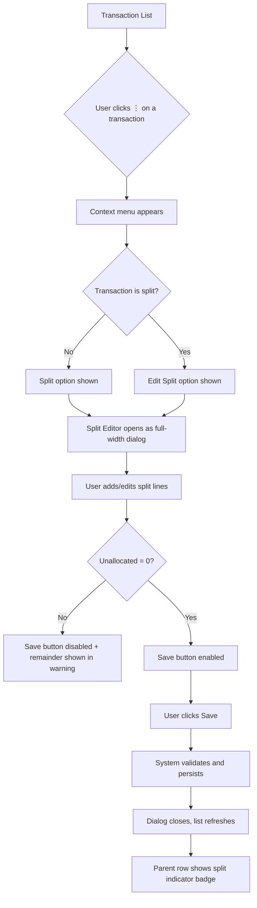
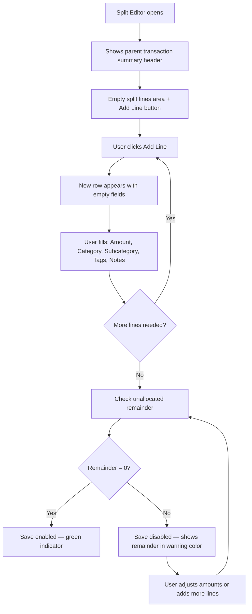
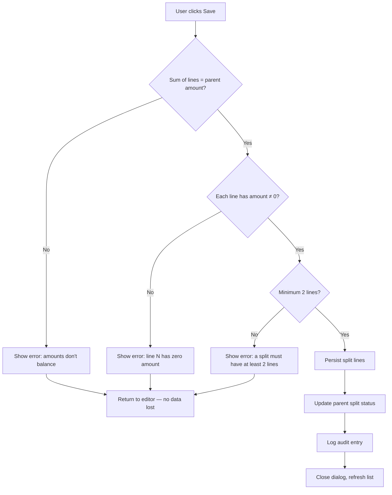
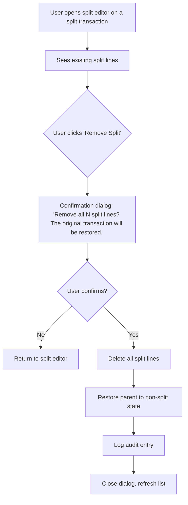

# Phase 3 — Split Transactions Specification

**Version:** 1.0
**Date:** 2026-04-14
**Author:** Niobe (Spec / UX Analyst)
**Requested by:** Pedro (perocha)
**Status:** Approved — open questions resolved by Pedro (2026-04-14)
**Scope:** V2 revamp Phase 3 — Split transactions (FR-022 to FR-025)
**Prerequisites:** Phase 1 merged (transactionType, nullable categories, categorizationStatus), Phase 2 merged (import modes, batch tracking)
**Branch:** `feature/split-transactions`

---

## Table of Contents

1. [Executive Summary](#1-executive-summary)
2. [User Stories](#2-user-stories)
3. [Real-World Scenarios](#3-real-world-scenarios)
4. [Terminology](#4-terminology)
5. [UX Flow](#5-ux-flow)
6. [Split Editor Design](#6-split-editor-design)
7. [Acceptance Criteria](#7-acceptance-criteria)
8. [Edge Cases](#8-edge-cases)
9. [Reporting Impact](#9-reporting-impact)
10. [Resolved Questions](#10-resolved-questions)

---

## 1. Executive Summary

A single bank movement often represents multiple distinct items from a business perspective. The **split** feature lets the admin decompose a parent transaction into named, independently classifiable sub-transactions (split lines) while preserving the original imported record as the financial anchor.

**Core principle:** The parent transaction's amount is the source of truth. Split lines redistribute that amount across different categories, subcategories, tags, and notes — but the sum of all lines must always equal the parent amount exactly. No money is created or destroyed.

**FRs addressed:** FR-022, FR-023, FR-024, FR-025.

**What this spec does NOT cover:** Data model design, API endpoint design, Cosmos DB storage strategy, or backend architecture. Those are the technical team's domain. This spec defines *what the user needs* and *how the feature should behave*.

---

## 2. User Stories

### US-001: Split a transaction into multiple lines

> As an NGO administrator, I want to split a single bank transaction into multiple lines with individual amounts, so that I can accurately track each component of a combined payment for financial reporting.

**Context:** María receives a single €1,200 bank transfer from the municipality. It covers three different grants: €500 for summer camp, €400 for therapy sessions, and €300 for transport subsidies. Without splitting, she'd categorize the whole €1,200 under one category and lose visibility into how the funds are distributed.

### US-002: Categorize split lines independently

> As an NGO administrator, I want to assign a different category, subcategory, tags, and notes to each split line, so that each component of a combined transaction appears correctly in category-level reports.

**Context:** Pedro pays a single invoice of €850 to a supplier. It includes €600 for calendar printing (category: Producción Calendarios), €200 for T-shirts (category: Merchandising), and €50 for shipping (category: Logística). Each cost center needs its own classification.

### US-003: See unallocated remainder while splitting

> As an NGO administrator, I want to see a live indicator of how much of the original amount remains unallocated as I add split lines, so that I know when the split is complete and balanced.

**Context:** While splitting a €3,000 remesa, María has entered 8 of 12 member payments. She needs to see instantly that €1,100 remains to be allocated across the remaining 4 members.

### US-004: Validate that splits balance before saving

> As an NGO administrator, I want the system to prevent me from saving a split where the lines don't add up to the original amount, so that the financial records stay accurate.

**Context:** A typo means one split line says €50 instead of €500. Without validation, the books would be off by €450 — a serious accounting error that might not be caught until year-end audit.

### US-005: Edit existing split lines

> As an NGO administrator, I want to edit the amounts, categories, or notes on individual split lines after saving, so that I can correct mistakes or reclassify items without undoing the entire split.

**Context:** After splitting a payment, María realizes she assigned the wrong subcategory to one line. She needs to fix just that line, not redo the whole split.

### US-006: Reverse (unsplit) a transaction

> As an NGO administrator, I want to remove all split lines and restore a transaction to its original unsplit state, so that I can start over if the split was done incorrectly.

**Context:** Pedro split a transaction under the wrong parent by mistake. He needs to undo the split entirely and re-do it on the correct transaction.

### US-007: See split status in transaction list

> As an NGO administrator, I want to see at a glance which transactions have been split and be able to expand/collapse split details, so that I can navigate the transaction list efficiently.

**Context:** When reviewing the monthly register, María needs to quickly distinguish between simple transactions and split ones without opening each record individually.

---

## 3. Real-World Scenarios

### 3.1 Remesa — Bulk bank transfer with individual member contributions

**Situation:** Rett España collects annual membership fees. Members pay via their banks, and all payments arrive as a single "remesa" (direct debit collection) credited to the Unicaja account.

- Bank shows: One movement, +€3,600, description "REMESA ADEUDOS DD 15/03"
- Reality: 12 members × €300 each

**Split workflow:**
1. María opens the €3,600 transaction
2. Clicks "Split" → split editor opens
3. Adds 12 lines, each €300
4. Assigns category "Cuotas socios" (membership fees) to all lines
5. Sets each line's notes field with the member name: "Cuota anual — García López, Ana"
6. Optionally tags each with a "2026" year tag
7. Unallocated shows €0.00 → saves

**Result:** The €3,600 bank movement is preserved. Reports show 12 × €300 under "Cuotas socios." María can search by member name in the notes.

### 3.2 Single supplier payment covering multiple cost centers

**Situation:** Pedro pays Imprenta López €850 with a single bank transfer. The invoice covers three items.

- Bank shows: One movement, −€850, description "TRANSF A IMPRENTA LOPEZ"
- Reality: €600 printing + €200 T-shirts + €50 shipping

**Split workflow:**
1. Pedro opens the −€850 transaction
2. Clicks "Split"
3. Adds 3 lines:
   - Line 1: −€600, category "Producción Calendarios", subcategory "Impresión"
   - Line 2: −€200, category "Merchandising", subcategory "Camisetas"
   - Line 3: −€50, category "Logística", subcategory "Envíos"
4. Unallocated: €0.00 → saves

**Result:** Each cost center gets its share. The "By Category" report correctly attributes €600 to printing, €200 to merchandise, €50 to logistics — instead of the full €850 appearing under a single category.

### 3.3 Incoming payment split across income concepts

**Situation:** The regional government sends a single €5,000 transfer covering two different grant programs.

- Bank shows: +€5,000, description "JUNTA ANDALUCIA SUBV 2026"
- Reality: €3,000 for "Subvención Actividades" + €2,000 for "Subvención Funcionamiento"

**Split workflow:**
1. Open the +€5,000 transaction
2. Split into 2 lines:
   - Line 1: +€3,000, category "Subvenciones", subcategory "Actividades"
   - Line 2: +€2,000, category "Subvenciones", subcategory "Funcionamiento"
3. Unallocated: €0.00 → saves

**Result:** Grant tracking shows exactly which program each euro came from.

### 3.4 Mixed transaction with different categories and tags

**Situation:** A reimbursement comes in covering event expenses from multiple categories.

- Bank shows: +€420, description "REEMBOLSO EVENTO NAVIDAD"
- Reality: €250 catering + €120 venue deposit + €50 decorations

**Split workflow:**
1. Open the +€420 transaction
2. Split into 3 lines:
   - Line 1: +€250, category "Eventos", subcategory "Catering", tag "Navidad 2025"
   - Line 2: +€120, category "Alquiler Locales", tag "Navidad 2025"
   - Line 3: +€50, category "Material Fungible", subcategory "Decoración", tag "Navidad 2025"
3. Unallocated: €0.00 → saves

**Result:** Each expense type is properly classified. Tag filtering by "Navidad 2025" shows all three lines together.

---

## 4. Terminology

| Term | Definition |
|------|-----------|
| **Parent transaction** | The original imported or manually created transaction. It carries the bank-provided amount and description. It is the financial anchor. |
| **Split line** | A sub-transaction created by the user underneath a parent. Each line has its own amount, category, subcategory, tags, and notes. |
| **Split** (noun) | The collection of all split lines belonging to one parent transaction. |
| **Splitting** (verb) | The act of creating split lines under a parent transaction. |
| **Unsplitting** (verb) | Removing all split lines, restoring the parent to a non-split state. |
| **Unallocated remainder** | The difference between the parent amount and the sum of all split line amounts. Must be exactly zero to save. |
| **Financial anchor** | The parent transaction. Its amount represents the actual bank movement and is never modified by splitting. |

---

## 5. UX Flow

### 5.1 How the user initiates a split

The split action is available from two places:

1. **Transaction list row action menu** — A "Split" option in the action menu (⋮) on each transaction row. This is the primary entry point.
2. **Transaction detail/edit dialog** — A "Split" button visible when viewing or editing an existing transaction.

**Preconditions:**
- Only **Admin** users see the split option (Viewers cannot split)
- The transaction must NOT already be soft-deleted
- The transaction must NOT already be split (if it's already split, the action changes to "Edit Split" / "View Split")

### 5.2 Overall user journey



### 5.3 Split editor flow — adding lines



### 5.4 Save and validation flow



### 5.5 Unsplit flow



---

## 6. Split Editor Design

### 6.1 Layout — Full-width dialog (modal)

The split editor opens as a **full-width Angular Material dialog** (`MatDialog`), similar in spirit to the transaction form dialog but wider to accommodate the tabular split lines. It is NOT a separate page — the user stays in the context of the transaction list.

**Why a dialog, not inline editing:**
- Inline editing in the transaction list row would be too cramped for multiple lines with category/subcategory/tags each.
- A separate page loses the context of the transaction list and requires navigation.
- A dialog keeps the user grounded — they're still "on" the transaction list page, just working on a split overlay.

### 6.2 Dialog structure

```
┌──────────────────────────────────────────────────────────────────┐
│  Split Transaction                                         [✕]   │
├──────────────────────────────────────────────────────────────────┤
│                                                                  │
│  ┌─ PARENT SUMMARY (read-only) ──────────────────────────────┐  │
│  │  15/03/2026 · Unicaja · REMESA ADEUDOS DD 15/03           │  │
│  │  Total: +€3,600.00 (Income)                               │  │
│  └───────────────────────────────────────────────────────────┘  │
│                                                                  │
│  ┌─ BALANCE BAR ─────────────────────────────────────────────┐  │
│  │  Allocated: €2,100.00    Unallocated: €1,500.00           │  │
│  │  ████████████████░░░░░░░░░░░░  58% allocated              │  │
│  └───────────────────────────────────────────────────────────┘  │
│                                                                  │
│  ┌─ SPLIT LINES (scrollable) ────────────────────────────────┐  │
│  │                                                            │  │
│  │  #  Amount      Category ▼       Subcategory ▼   Tags  ⋯  │  │
│  │  ── ────────── ──────────────── ────────────── ──────     │  │
│  │  1  €300.00    Cuotas socios    Ordinarias     2026  [✕]  │  │
│  │  2  €300.00    Cuotas socios    Ordinarias     2026  [✕]  │  │
│  │  3  €300.00    Cuotas socios    Ordinarias     2026  [✕]  │  │
│  │  ...                                                       │  │
│  │                                                            │  │
│  │  [+ Add Line]                                              │  │
│  │                                                            │  │
│  └───────────────────────────────────────────────────────────┘  │
│                                                                  │
│  ┌─ NOTES (optional, per-line) ──────────────────────────────┐  │
│  │  Line 1 note: "Cuota anual — García López, Ana"           │  │
│  └───────────────────────────────────────────────────────────┘  │
│                                                                  │
│            [Remove Split]              [Cancel]  [Save Split]    │
│                                                                  │
└──────────────────────────────────────────────────────────────────┘
```

### 6.3 Component descriptions

#### Parent summary header (read-only)
- Shows: date, account name, bank description (truncated if long), total amount with sign and type badge (Income/Expense/Transfer/Refund)
- **Not editable** from the split editor. The parent amount is the anchor.
- Styled with a subtle background tint matching the transaction type color (green for income, red for expense, etc.)

#### Balance bar
- **Two numbers:** "Allocated" (sum of all line amounts) and "Unallocated" (parent amount − allocated)
- **Progress bar** showing the allocation percentage visually
- **Color coding:**
  - Unallocated > 0 → orange/warning (`var(--clr-warning)`)
  - Unallocated = 0 → green/success (`var(--clr-success)`)
  - Over-allocated (sum > parent) → red/error (`var(--clr-error)`)
- Updates live as the user types amounts

#### Split lines table
- Scrollable area if many lines (e.g., 12-member remesa)
- Each line has:
  - **Row number** (auto-incremented, display only)
  - **Amount** (required, numeric input, pre-filled with same sign as parent)
  - **Category** (dropdown, optional — filters by parent's transactionType for income/expense, unrestricted for transfer/refund)
  - **Subcategory** (dropdown, optional — filtered by selected category)
  - **Tags** (multi-select chip input, optional)
  - **Notes** (text field, optional — for line-specific notes like member name)
  - **Delete button** [✕] to remove the line
- New lines are added via "+ Add Line" at the bottom
- **Tab order:** Amount → Category → Subcategory → Tags → Notes → next line's Amount (optimized for keyboard-driven entry)

#### Action buttons
- **Remove Split** (left-aligned, danger color) — only visible when editing an existing split. Opens confirmation dialog.
- **Cancel** — closes dialog without saving. If lines have been modified, shows "Discard changes?" confirmation.
- **Save Split** — disabled until unallocated = 0 and minimum 2 lines exist. Enabled state uses primary brand color.

### 6.4 Amount entry behavior

- The user enters a **positive number** for each line
- The system applies the same sign as the parent transaction. If parent is −€850 (expense), each line is stored negative. If parent is +€5,000 (income), each line is stored positive.
- The balance bar works with **absolute values** for clarity: "Allocated: €600 / €850" rather than confusing the user with negative allocation math
- **Exception — transfer/refund parents:** Since transfers and refunds can have user-entered signs, split line signs match the parent's actual sign. (In practice, the parent is either all-positive or all-negative, so lines follow suit.)

### 6.5 How split transactions appear in the transaction list

#### Collapsed view (default)
- The parent row shows a **split indicator badge** — a small icon (e.g., `call_split` Material Icon) with the line count: "Split (3)"
- The parent's **category column** shows "Split" or "Multiple categories" instead of a single category name
- The parent's **amount is displayed normally** — it's still the financial anchor
- Clicking the split badge or expanding the row reveals the split lines

#### Expanded view
- Below the parent row, indented split lines are shown in a lighter/muted style
- Each line shows: amount, category, subcategory, tags, notes (truncated)
- The expanded lines are visually subordinate to the parent (indented, smaller font, subtle divider)

```
┌───────────────────────────────────────────────────────────────────┐
│ 15/03  REMESA ADEUDOS DD 15/03   Unicaja   Split (12)  +€3,600  │
│  ├─ €300  Cuotas socios / Ordinarias   "García López, Ana"       │
│  ├─ €300  Cuotas socios / Ordinarias   "Martínez Ruiz, Juan"     │
│  ├─ €300  Cuotas socios / Ordinarias   "López Sánchez, María"    │
│  └─ ... (9 more lines)                                            │
├───────────────────────────────────────────────────────────────────┤
│ 14/03  PAGO ALQUILER LOCAL          Unicaja   Alquiler   −€800   │
└───────────────────────────────────────────────────────────────────┘
```

### 6.6 How split transactions appear in reports

#### By Category report
- Split lines contribute individually to their assigned categories
- The parent's own category (if any) is **ignored in category reports** when the transaction is split — only the split lines' categories count
- Unsplit lines from other transactions are unaffected

#### Summary report (income/expenses/net)
- The **parent amount** is used for totals — NOT the sum of split lines (they're always equal, so it doesn't matter mathematically, but the parent is the authoritative number)
- Split lines do NOT double-count. The parent is counted once.

#### By Account report
- Account-level totals use the parent amount (since all split lines belong to the same account as the parent)
- No change in aggregate numbers

---

## 7. Acceptance Criteria

### FR-022: Split a transaction into multiple lines

| ID | Criterion | Verification |
|----|-----------|-------------|
| AC-022-01 | Admin can open a split editor from the transaction row action menu | Click ⋮ → "Split" → dialog opens |
| AC-022-02 | Admin can open a split editor from the transaction edit dialog | "Split" button visible in edit dialog → click → split editor opens |
| AC-022-03 | Split editor shows the parent transaction details (date, account, description, amount, type) in a read-only header | Visual inspection |
| AC-022-04 | Admin can add split lines with "+ Add Line" | Click button → new empty row appears |
| AC-022-05 | Each split line has fields for: amount, category, subcategory, tags, notes | Visual inspection |
| AC-022-06 | Split lines must have a non-zero amount | Enter 0 → validation error on that line |
| AC-022-07 | A split must contain at least 2 lines | Attempt to save with 1 line → error: "A split must have at least 2 lines" |
| AC-022-08 | Admin can remove individual split lines with the delete button | Click [✕] on a line → line removed, balance bar updates |
| AC-022-09 | After saving a split, the parent row in the transaction list shows a split indicator badge with line count | Visual: icon + "(N)" badge visible |
| AC-022-10 | Viewer users do NOT see the "Split" action — they can only view existing split details in read-only mode | Login as Viewer → no "Split" in action menu; expanding a split row shows lines but no edit controls |
| AC-022-11 | Split lines are visible in the expanded transaction list row | Click expand on a split parent → lines appear below, indented |
| AC-022-12 | The parent transaction amount does NOT change when split | Parent amount before and after splitting is identical |

### FR-023: Categorize split lines independently

| ID | Criterion | Verification |
|----|-----------|-------------|
| AC-023-01 | Each split line can have a different category | Line 1: "Cuotas socios", Line 2: "Merchandising" → save succeeds |
| AC-023-02 | Each split line can have a different subcategory | Line 1: subcategory "Ordinarias", Line 2: subcategory "Camisetas" → save succeeds |
| AC-023-03 | Each split line can have different tags | Line 1: tag "2026", Line 2: tags "2026" + "Navidad" → save succeeds |
| AC-023-04 | Each split line can have its own notes | Line 1: "García López, Ana", Line 2: "Martínez Ruiz, Juan" → save succeeds |
| AC-023-05 | Category is optional on split lines (same as regular transactions) | Leave category blank on a split line → save succeeds |
| AC-023-06 | Category dropdown for income/expense parents filters by matching categoryType | Parent is income → only income categories shown in dropdown |
| AC-023-07 | Category dropdown for transfer/refund parents shows all categories | Parent is transfer → both income and expense categories available |
| AC-023-08 | Subcategory dropdown filters by selected category on that line | Select category "Eventos" → only subcategories of "Eventos" appear |
| AC-023-09 | Changing a line's category clears its subcategory if the subcategory no longer belongs to the new category | Change from "Eventos" (sub: "Catering") to "Logística" → subcategory resets to empty |
| AC-023-10 | Split lines appear in the "By Category" report under their individual categories | Split €850 into €600 "Calendarios" + €200 "Merchandising" + €50 "Logística" → report shows each contribution under its category |

### FR-024: Validate split totals

| ID | Criterion | Verification |
|----|-----------|-------------|
| AC-024-01 | The balance bar shows "Allocated" and "Unallocated" amounts updating in real time as the user types | Type €300 in line 1 → balance bar updates immediately |
| AC-024-02 | The balance bar shows a visual progress indicator (progress bar) | Visual: colored bar proportional to allocation % |
| AC-024-03 | When unallocated > 0, the bar shows warning color and the Save button is disabled | Visual: orange bar, grayed Save button |
| AC-024-04 | When unallocated = 0, the bar shows success color and the Save button is enabled | Visual: green bar, active Save button |
| AC-024-05 | When over-allocated (sum of lines > parent), the bar shows error color and Save is disabled | Visual: red bar, grayed Save, message "Over-allocated by €X" |
| AC-024-06 | Validation uses exact decimal comparison — no floating-point tolerance | €100.00 parent, lines €33.33 + €33.33 + €33.34 = €100.00 → valid. Lines €33.33 + €33.33 + €33.33 = €99.99 → invalid (€0.01 unallocated) |
| AC-024-07 | Save button cannot be clicked while validation fails (disabled, not just warning) | Button is `[disabled]`, not just visually dimmed |
| AC-024-08 | If the user somehow bypasses frontend validation (API call), the backend independently validates that split line amounts sum to parent amount | API returns 422 if sum ≠ parent amount |

### FR-025: Edit or reverse splits

| ID | Criterion | Verification |
|----|-----------|-------------|
| AC-025-01 | Admin can open the split editor on an already-split transaction to edit it | Click "Edit Split" on a split transaction → editor opens with existing lines populated |
| AC-025-02 | Admin can change the amount of an existing split line | Change line 1 from €300 to €350 → balance bar updates, adjust other lines to rebalance |
| AC-025-03 | Admin can change the category/subcategory/tags/notes of an existing split line | Change category on line 2 → save succeeds, reports update |
| AC-025-04 | Admin can add new lines to an existing split | Click "+ Add Line" on existing 3-line split → 4th line appears |
| AC-025-05 | Admin can remove lines from an existing split (as long as ≥ 2 remain) | Delete line 4 from a 4-line split → 3 lines remain, balance bar updates |
| AC-025-06 | Admin can reverse (unsplit) a transaction via "Remove Split" | Click "Remove Split" → confirmation dialog → confirm → all lines removed, parent restored |
| AC-025-07 | Unsplitting restores the parent's category to whatever it was before splitting (or null if it had none) | Parent had category "Varios" before split → after unsplit, category is "Varios" again |
| AC-025-08 | Confirmation dialog for unsplit clearly states how many lines will be removed | Dialog shows: "Remove all 12 split lines? The original transaction will be restored." |
| AC-025-09 | All split modifications (create, edit, delete, unsplit) are logged in the audit trail | Check audit log after split operations → entries exist with before/after values |
| AC-025-10 | Canceling the split editor without saving discards changes | Modify a line → click Cancel → confirm discard → no changes persisted |

---

## 8. Edge Cases

### 8.1 Split with only 1 line

**Verdict: Invalid.** A split with a single line is meaningless — it's just the parent transaction with extra steps. The minimum is **2 lines**. The UI will not allow saving fewer than 2 lines (AC-022-07). If the user removes lines down to 1, the Save button is disabled with a message: "A split must have at least 2 lines."

### 8.2 Split where one line has the full amount

**Verdict: Valid but discouraged.** Technically, a split where one line is €999 and another is €1 (from a €1,000 parent) is valid — the sum balances. This edge case exists in practice (e.g., a €1 bank fee embedded in a larger transfer). No need to block it. However, if the user creates a 2-line split where one line equals the parent amount and the other is €0, the €0 line fails validation (AC-022-06: amount must be non-zero).

### 8.3 Split a transaction that's already categorized

**Verdict: Allowed.** The parent's existing category is preserved but becomes subordinate to the split lines' categories for reporting purposes. The parent category serves as a "default" that the user may leave or clear. In category reports, only the split lines' categories are counted (not the parent's).

**UX note:** When splitting an already-categorized transaction, the split editor could pre-populate the first line with the parent's category as a convenience. This is a nice-to-have, not a requirement.

### 8.4 Split an imported transaction vs. a manually created one

**Verdict: No difference.** Both imported and manually created transactions can be split. The `importBatchId` and `importSource` on the parent are not affected by splitting. The split lines do NOT inherit import metadata — they are user-created artifacts, not imported records.

### 8.5 What happens to the parent's category when it's split?

**Behavior:**
- The parent's `categoryId` and `subcategoryId` remain as they were (unchanged by the split operation)
- For **reporting**, split-line categories take precedence. The parent's category is ignored in "By Category" reports when the transaction is split
- For the **transaction list**, the category column shows "Split (N)" or "Multiple categories" instead of the parent's category
- When the split is **reversed** (unsplit), the parent's original category is restored to visibility in reports and lists

### 8.6 What happens if the parent amount changes after splitting?

**Verdict: The split becomes invalid and must be re-balanced.**

This is a rare but important case. If an admin edits the parent transaction's amount after it has been split:
- The split lines' sum no longer matches the new parent amount
- The system should flag this as an inconsistency
- The parent transaction shows a warning badge: "Split out of balance"
- The admin must open the split editor and adjust line amounts to re-balance
- Until rebalanced, the transaction is flagged in the list with a warning indicator
- **Reports use the parent amount for totals** (not the stale split lines). Category-level breakdown from splits may be inaccurate until rebalanced — this is acceptable because the admin is expected to fix it promptly.

**Alternative considered:** Block parent amount edits when the transaction is split. Rejected because there are legitimate reasons to correct a parent amount (e.g., bank reconciliation corrects a typo). Blocking edits would force the user to unsplit → edit → re-split, which is worse UX.

### 8.7 Currency: all EUR currently — does this affect splits?

**Verdict: No impact in current scope.** All accounts are EUR. All transactions are EUR. All split lines inherit the parent's currency implicitly — there's no multi-currency splitting. If multi-currency support is added in the future, split lines should inherit the parent's currency and not allow cross-currency splits.

**Rule:** Split lines always use the same currency as the parent. This is implicit (not a field on the split line). The currency is the parent's `currency` field.

### 8.8 Soft-deleted transactions

**Verdict: Cannot split a soft-deleted transaction.** The "Split" action is not available in the action menu for deleted transactions. If a parent transaction is soft-deleted after being split, the split lines are soft-deleted with it (cascade soft-delete). Restoring the parent restores the split lines.

### 8.9 Audit trail for splits

**All split operations are audited:**

| Action | Audit Entry |
|--------|------------|
| Create split (first time) | `split_created`: records parent ID, all line details |
| Edit a split line | `split_line_updated`: records line ID, old/new field values |
| Add a line to existing split | `split_line_added`: records parent ID, new line details |
| Remove a line from existing split | `split_line_removed`: records parent ID, removed line details |
| Unsplit (reverse) | `split_removed`: records parent ID, all removed line details |

The audit entries should reference the parent transaction ID so that the audit trail for a transaction includes its split history.

### 8.10 Splitting a transaction that is part of a transfer pair

**Verdict: Allowed but independent.** If the parent has a `linkedTransactionId` (Phase 5, transfers), splitting one leg of a transfer does NOT automatically split the other leg. The transfer link is between parents, not between split lines. This is consistent with the "parent is the financial anchor" principle.

### 8.11 Maximum number of split lines

**Verdict: There should be a practical limit.** Suggest **50 lines per split** as a soft maximum. This covers the largest realistic remesa (50 members). The UI should warn at 50 lines but not hard-block. The backend may enforce a hard limit (e.g., 100) to prevent abuse.

> **Open question:** Should the limit be 50 or different? See Open Questions §10.

### 8.12 Duplicate split lines

**Verdict: Allowed.** Two split lines with the same amount, category, and tags are valid. In the remesa scenario, all 12 lines might be €300 under "Cuotas socios" — the only difference is the notes field with the member name.

### 8.13 Split lines and the `categorizationStatus` field

**Behavior:**
- Each split line should track its own `categorizationStatus` — if a line has a category, it's `manually_categorized`; if no category, it's `uncategorized`
- The parent's `categorizationStatus` is set to `manually_categorized` when split (the act of splitting is a manual classification action) regardless of whether the individual lines have categories

### 8.14 Splitting and reviewStatus

**Behavior:**
- Splitting does NOT change the parent's `reviewStatus`. If the parent was `approved`, it stays `approved` after splitting.
- Split lines do NOT have their own `reviewStatus` — review status is a property of the parent transaction (the financial anchor).
- Rationale: The review workflow focuses on whether the bank movement is legitimate, not how it's internally classified. Splitting is an internal accounting action, not a trust/review decision.

---

## 9. Reporting Impact

### 9.1 Monthly summary by category

**Before splits:** A €3,600 remesa categorized as "Cuotas socios" contributes €3,600 to that category.

**After splits:** The €3,600 parent is split into 12 lines of €300 each, all under "Cuotas socios". The total under "Cuotas socios" is still €3,600 — no change.

**Mixed-category split:** A €850 expense split into €600 "Calendarios" + €200 "Merchandising" + €50 "Logística". Before splitting: €850 went to one category. After: three categories get their proper share.

**Rule:** When a transaction is split, the "By Category" report uses the split lines' categories instead of the parent's category. Unsplit transactions use their own category as before.

**Uncategorized split lines:** Lines without a category contribute to an "Uncategorized" row in the category report, same as uncategorized regular transactions.

### 9.2 Monthly summary by account

**No change in totals.** Account-level reports use the parent amount. Since all split lines belong to the same account as the parent, the account total is the same whether the transaction is split or not.

**Display detail:** If the report supports drill-down (click on an account's total to see transactions), split transactions should show expanded split lines in the drill-down view.

### 9.3 Export to Excel

**Two export strategies for split transactions:**

**Option A — Parent-only export:** Export the parent row as a single row. The "Category" column shows "Split (N)." Simple, backward-compatible with the current 13-column format.

**Option B — Expanded export:** Export the parent row AND each split line as separate rows. Split lines are marked with a "Split Line" indicator. Parent rows that are split show "Split Parent" in a type column.

**Recommendation:** Option B. The whole point of splitting is granular classification — losing that in the export defeats the purpose. The export should include a column indicating whether a row is a parent, split line, or regular transaction. The parent row's amount should still appear so the totals are correct (split lines should be visually subordinate or have a separate "Split Amount" column).

> **Open question:** Exact export column layout needs Pedro's input. See Open Questions §10.

### 9.4 Transaction list aggregates (summary strip)

**No change in totals.** The summary strip (total income, total expenses, net) uses parent amounts. Split lines do not contribute separately to the strip totals — the parent amount already represents the full financial value.

**Uncategorized count:** If a split has 3 lines and 1 is uncategorized, the uncategorized count in the summary strip increments by 1 (for the uncategorized line). The parent itself is not counted as uncategorized if it's split — only the lines matter for categorization metrics when a split exists.

### 9.5 Search and filtering

- **Search by category:** Filtering the transaction list by a category should show split parents where any split line matches that category. The parent row appears with the matching line(s) highlighted or expanded.
- **Search by tag:** Same behavior — tag filter matches against split line tags, showing the parent if any line matches.
- **Search by text (detail/notes):** Text search should match against both parent fields (bankDescription, detail) and split line notes.
- **Amount range filter:** The filter applies to the parent amount, not individual line amounts. A split transaction with parent €3,600 appears when filtering for "amount > €2,000" even though individual lines are €300.

---

## 10. Resolved Questions

All questions answered by Pedro (2026-04-14). Decisions are binding for implementation.

### OQ-001: Maximum split line limit

**Decision:** Minimum 2 lines (splitting into 1 is just re-categorizing). Maximum 20 lines (soft limit). Pedro confirmed this covers all real-world scenarios including large remesas.

### OQ-002: Export format for split transactions

**Decision:** Respect the parent→child hierarchy in export. But export changes are **out of scope for Phase 3** — defer to a follow-up phase. Current export continues to show the parent transaction as-is.

### OQ-003: Pre-populate first line with parent's category?

**Decision:** Yes — when splitting an already-categorized transaction, pre-populate the first line with the parent's category and full amount. Nice UX convenience.

### OQ-004: Split indicator in filter bar

**Decision:** Not in v1. Add later if needed.

### OQ-005: Splitting and notes inheritance

**Decision:** Parent detail is shown in the split editor header as read-only context. Split lines have their own independent notes field that starts empty.

### OQ-006: Keyboard shortcuts for rapid entry

**Decision:** Nice-to-have. Build basic split first, add duplication shortcut as a follow-up.

### OQ-007: "Allocate remainder" convenience button

**Decision:** Yes — auto-fill the remainder into new lines. Easy to adopt, speeds up the workflow.

### Additional decisions from Pedro

| Topic | Decision |
|-------|----------|
| **Parent category after split** | Set to indicate "Split" status. The parent's category is no longer meaningful once split lines have their own categories. |
| **Re-split allowed** | Yes — an already-split transaction can be edited (modify existing split via PUT). |
| **Transaction list UX** | Show split transactions in the list with a clear visual split indicator. Details expand/collapse on click — split lines are NOT shown as separate rows. |
| **Audit granularity** | Log the entire split operation as ONE audit entry when saved. Not per-line. |
| **Import + split timing** | Split only AFTER import. Never during import. |

---

## Appendix A: Interaction with Phase 1 and Phase 2 Features

### Phase 1 dependencies

| Phase 1 Feature | Split Interaction |
|-----------------|-------------------|
| `transactionType` | Split lines inherit the parent's `transactionType` implicitly. Lines don't have their own type — they're subdivisions of the same movement. |
| `categorizationStatus` | Each split line tracks its own status. Parent is `manually_categorized` when split. |
| `reviewStatus` | Property of the parent only. Split lines don't have review status. |
| Nullable categories | Split lines can be uncategorized (categoryId = null), same as regular transactions. |
| `originalAmount` / `originalDate` | These fields are on the parent. If the parent amount is corrected after splitting, the split becomes out of balance (see Edge Case §8.6). |
| `counterpartyName` | Property of the parent only. Split lines don't have counterparty info — the counterparty is whoever was on the other side of the bank movement. |

### Phase 2 dependencies

| Phase 2 Feature | Split Interaction |
|-----------------|-------------------|
| Import batch tracking | `importBatchId` and `importSource` are parent properties. Split lines are user-created, not imported. |
| Bank import mode | Imported uncategorized transactions can be split. Common workflow: import bank statement → split complex movements → categorize lines. |
| Review workflow | Review is on the parent. Splitting a reviewed transaction doesn't change its review status. |

---

## Appendix B: Glossary Cross-Reference

| This Spec | Phase 1 Spec | Description |
|-----------|-------------|-------------|
| Parent transaction | Transaction (v2 schema) | The base transaction document |
| Split line | (new concept) | A sub-transaction created by splitting |
| Balance bar | — | UI element showing allocation progress |
| Unsplit | — | Removing all split lines from a parent |
| Financial anchor | — | The parent transaction's role as the authoritative amount |
