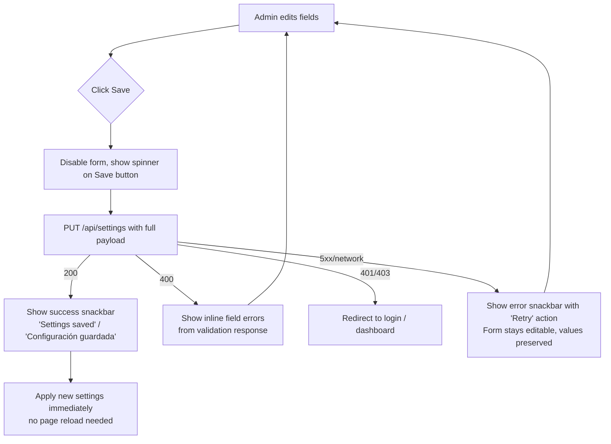

# System Settings — Spec

**Author:** Niobe (Spec / UX Analyst)
**Requested by:** Pedro (perocha)
**Date:** 2026-04-17
**Issue:** [#12](https://github.com/rett-europe/opentreasury/issues/12) — Add configuration feature to the application
**Branch:** `copilot/issue-12-create-new-spec`
**Status:** **Approved** — 2026-04-18 by Pedro, with amendments A1 + A2 (see §13). Architecturally signed off by Neo.

### Resolved Open Questions (2026-04-18)

Pedro accepted Neo's recommendations on all six open questions from §14:

- **OQ-1:** New page is **"Settings"**; existing right-drawer is renamed to **"Preferences"**.
- **OQ-2:** Ship V1 with the 4-currency short list (`EUR`, `USD`, `GBP`, `CHF`). Easy to extend later.
- **OQ-3:** Include **Fiscal year start month** in V1 even though no consumer uses it yet (avoids a later schema migration).
- **OQ-4:** `organizationName` surfaces in **browser tab title + export filenames only**. Not added to the toolbar.
- **OQ-5:** No external compliance need for an audit log. `updatedAt` + `updatedBy` on the document is sufficient for V1.
- **OQ-6:** No additional settings for V1 beyond the 6 listed in §3.

---

## 1. Problem Statement

OpenTreasury has no place for an admin to configure **system-level** (organization-wide) preferences. Values like the display currency, date format, and number formatting are currently hard-coded or inferred from the browser locale, which is fine for a solo demo but not for a real NGO with multiple users seeing inconsistent formatting.

The issue asks for:

> A new option on the left menu with **Settings** for system-level configuration. Start with placeholders for **Currency** and **Date format**.

The spec proposes a small, focused first cut of this page plus a short list of additional settings that are cheap to add now and avoid a second round-trip through the UX later.

### Why this is NOT the existing Settings drawer

There is already a **right-side drawer** opened from the toolbar (`tune` icon) that contains **per-user UI preferences**: language, theme (light/dark), compact mode, reduced motion. Those are personal to each logged-in user and persist per user account (see `AppSettingsService`).

The new **Settings** page is different:

| Aspect | Existing right drawer ("Preferences") | New left-menu page ("Settings") |
|--------|---------------------------------------|----------------------------------|
| Scope | Per user | Per organization (shared by all users) |
| Who can change | Any logged-in user (self) | **Admin only** |
| Content | UI/UX preferences (language, theme, density, motion) | Data & formatting config (currency, date format, …) |
| Storage | User profile | Organization config document |
| Effect on others | None | All users see the change |

**Decision D1:** The existing right-side drawer stays as-is and is **renamed in copy** from "Settings" to "Preferences" (labels: `es: Preferencias`, `en: Preferences`) to make room for the new admin Settings page. Label keys are added — the old `settingsTitle` / `openSettings` stay but the visible copy changes.

> ⚠️ If Pedro prefers to keep the drawer labeled "Settings" and call the new page "Configuration", that is fine — see **Open Question OQ-1**. The rest of this spec uses "Settings" (page) and "Preferences" (drawer).

---

## 2. User Stories

| ID | Role | Story | Acceptance |
|----|------|-------|------------|
| US-1 | Admin | I want a **Settings** entry in the left menu so I can manage organization-wide configuration from one place | A new "Settings" item appears in the `Configuration` section of the left sidenav, visible only to admins, routing to `/settings`. |
| US-2 | Admin | I want to set the **display currency** so all amounts across the app render with the right symbol and ISO code | Changing the currency updates the displayed symbol (`€`, `$`, `£`, …) on transaction lists, dashboard cards, exports, and the summary strip within the same session. |
| US-3 | Admin | I want to choose a **date format** so dates render in the style my team expects | Changing the date format updates every date displayed in the app (transaction rows, filters, export filename suffix, dashboard). |
| US-4 | Admin | I want my changes to persist so reopening the app (and other users signing in) see the same settings | Settings are stored server-side and reloaded on each user's next page load. |
| US-5 | Admin | I want clear feedback that my change was saved (or failed) | A success snackbar on save; an inline error with a "Retry" action on failure. No silent failures. |
| US-6 | Viewer | I should not be able to change system settings | The "Settings" menu item is **not rendered** for non-admins; direct navigation to `/settings` redirects to `/dashboard` via the existing `adminGuard`. |
| US-7 | Admin | I want sensible defaults out of the box so the app is usable before I touch Settings | On first run, defaults are Currency = EUR, Date format = `DD/MM/YYYY`, Number format = `1.234,56` (Spanish/European), Fiscal year start = January. |

---

## 3. Scope — Settings to include in V1

Pedro asked for Currency and Date format as a start and invited proposals. Recommendation for V1:

### 3.1 Must-have (explicitly requested)

| Setting | Type | Default | Notes |
|---------|------|---------|-------|
| **Currency** | Single-select | `EUR` | ISO 4217 code. Drives currency symbol + position across the app. |
| **Date format** | Single-select | `DD/MM/YYYY` | Drives all date rendering (list rows, dashboard, filters, export filenames). |

### 3.2 Recommended additions (low cost, high payoff)

| Setting | Type | Default | Why include now |
|---------|------|---------|-----------------|
| **Number format** | Single-select | `1.234,56` | Currency and dates without matching number format look broken (`€ 1,234.56` next to `17/04/2026` is jarring). Cheap to add, big polish win. |
| **Fiscal year start month** | Select (1–12) | `1` (January) | NGOs often report on non-calendar fiscal years. Reports/dashboards can use this later; storing now avoids a schema migration. |
| **Default language** | `es` / `en` | `es` | Seeds new users' personal language preference. Does **not** override a user's own choice in the Preferences drawer. |
| **Organization name** | Short text (≤ 80 chars) | `""` | Shown in page title / exports. Makes multi-NGO deployments self-identifying. |

### 3.3 Explicitly out of scope for V1

- Currency **conversion / FX rates** — V1 is display only; all transactions remain stored in their entered amount (no multi-currency math).
- Per-account currency overrides.
- Per-user overrides of org settings (beyond the existing Preferences drawer).
- Time zone (all timestamps are date-only today — revisit if/when we add timestamps).
- Theming / branding (logo upload, brand color).
- Audit trail for setting changes (nice to have; defer unless compliance requires it).
- Backup / data export of settings (settings are small; standard DB backup covers it).

**Decision D2:** Ship V1 with the 6 settings above (2 required + 4 recommended). Everything in 3.3 is a follow-up spec if Pedro wants it.

---

## 4. Navigation & Left-Menu Placement

### 4.1 Menu entry

Add a new `nav-item` to the existing `Configuration` section of the left sidenav in `app.component.ts`, directly below **Accounts**:

```
CONFIGURATION
  🏷  Categories
  🏷  Tags
  🏦  Accounts
  ⚙️  Settings   ← NEW
```

- **Icon:** `settings` (Material). Using `settings` (not `tune`, which is already the Preferences drawer trigger) makes the two distinct at a glance.
- **Label keys:** `settings.labels().systemSettings` — `es: Configuración`, `en: Settings`.
- **Visibility:** Inside the existing `@if (authService.isAdmin())` block. Viewers never see it.
- **Active state:** Uses standard `routerLinkActive="active"` styling like the other items.
- **Position:** Last in the Configuration section — admin-only "meta" config sits below the data-config entries (Categories, Tags, Accounts).

### 4.2 Route

```ts
{
  path: 'settings',
  loadComponent: () =>
    import('./features/settings/settings.component').then(
      (m) => m.SettingsComponent,
    ),
  canActivate: [MsalGuard, adminGuard],
}
```

A non-admin who navigates directly to `/settings` is redirected to `/dashboard` by the existing `adminGuard`.

---

## 5. Page Layout & UX

### 5.1 Structure

A single full-width page — no tabs, no sub-routes in V1. All settings fit above the fold on a 1080p screen.

```
┌─────────────────────────────────────────────────────────────────┐
│ Page header                                                     │
│   ⚙️  Settings                                                   │
│   Organization-wide preferences. Changes affect all users.      │
├─────────────────────────────────────────────────────────────────┤
│ ┌───── Regional & formatting ──────────────────────────────┐    │
│ │ Currency                  [ EUR — Euro (€)           ▾ ] │    │
│ │ Date format               [ DD/MM/YYYY — 17/04/2026  ▾ ] │    │
│ │ Number format             [ 1.234,56 (European)      ▾ ] │    │
│ │ Fiscal year starts        [ January                  ▾ ] │    │
│ └──────────────────────────────────────────────────────────┘    │
│                                                                 │
│ ┌───── Organization ───────────────────────────────────────┐    │
│ │ Organization name         [ _________________________ ]  │    │
│ │ Default language          [ Español                  ▾ ] │    │
│ │                                                          │    │
│ │ ℹ  Default language seeds new users. It does not       │    │
│ │    override your personal Preferences.                  │    │
│ └──────────────────────────────────────────────────────────┘    │
│                                                                 │
│                                        [ Cancel ]  [ Save ]     │
└─────────────────────────────────────────────────────────────────┘
```

- Two grouped cards (`mat-card`): **Regional & formatting** and **Organization**.
- One row per setting: label on the left, control on the right.
- **Single Save / Cancel pair at the bottom** — no per-row save. This matches user intent ("set everything the way I want, then save once") and avoids N round-trips.
- Each dropdown includes a **live example** in its option label (e.g. "DD/MM/YYYY — 17/04/2026") so the admin sees the effect before saving.

### 5.2 Dirty-state & navigation guard

- While the form has unsaved changes, the **Save** button is enabled and **Cancel** is visible.
- Navigating away with unsaved changes triggers a standard Material confirm dialog: "Discard changes? / ¿Descartar cambios?" — reuses the existing confirm-dialog pattern in `shared/`.
- Reloading after a successful save shows the same values — no flash of defaults.

### 5.3 Save flow



**Decision D3:** After a successful save, settings are applied **in-session without a reload** by updating the relevant service signal (see §7). This avoids jarring full-page refreshes and matches the Preferences drawer behavior.

---

## 6. Field Specifications

All dropdowns use `mat-select`. The text input uses `mat-form-field` + `matInput`.

### 6.1 Currency

- **Options (V1):** `EUR`, `USD`, `GBP`, `CHF`. Each option renders as `CODE — Name (symbol)`, e.g. `EUR — Euro (€)`.
- **Why a short list, not all 180 ISO codes:** NGOs in Europe overwhelmingly operate in these four. Showing 180 codes makes the control slow and confusing. Easy to extend the list later.
- **Persisted value:** 3-letter ISO 4217 code.
- **Display effect:** Any code path that currently hard-codes `€` must read the configured currency symbol instead. (Implementation detail for Morpheus/Trinity — listed in §7.)

### 6.2 Date format

- **Options:** `DD/MM/YYYY` (EU), `MM/DD/YYYY` (US), `YYYY-MM-DD` (ISO), `DD MMM YYYY` (long, localized month).
- **Persisted value:** The user-visible format token string (e.g. `"DD/MM/YYYY"`). These values use Moment/Day.js-style tokens for storage and display in the settings UI; they are **not** passed directly to Angular `DatePipe`.
- **Angular mapping (deterministic, V1):**
  - `DD/MM/YYYY` → `dd/MM/yyyy`
  - `MM/DD/YYYY` → `MM/dd/yyyy`
  - `YYYY-MM-DD` → `yyyy-MM-dd`
  - `DD MMM YYYY` → `dd MMM yyyy`
- **Implementation rule:** Only the four formats above are supported in V1. Any code path rendering dates in Angular must first map the persisted value through the table above and then use the resulting `DatePipe` pattern.
- **Display effect:** All on-screen date renders (`<td>{{tx.date | date:...}}</td>`, filters, dashboards) read from the setting (mapped through the table above) instead of a hard-coded pattern.
- **Export filenames:** Must always use an ISO-safe date (`YYYY-MM-DD`) or an equivalently sanitized/slugified variant, regardless of the configured display format. This avoids invalid filename characters (e.g. `/` from `DD/MM/YYYY`) on Windows/macOS and keeps exports sortable.

### 6.3 Number format

- **Options:** `1.234,56` (European: `.` thousands, `,` decimal), `1,234.56` (Anglo-Saxon), `1 234,56` (French: space thousands, `,` decimal).
- **Persisted value:** An enum tag (`"eu"`, `"us"`, `"fr"`).
- **Display effect:** Locale string for `DecimalPipe` / `CurrencyPipe` is derived from this tag.

### 6.4 Fiscal year start month

- **Options:** 12 months (`January` … `December`).
- **Persisted value:** Integer `1`–`12`.
- **Display effect:** No UI effect in V1. Stored for future reports. Making this visible now avoids a schema migration later.

### 6.5 Default language

- **Options:** `Español (es)`, `English (en)`. Matches existing supported languages.
- **Persisted value:** `"es"` or `"en"`.
- **Effect:** Only used to seed a new user's personal language when their profile is first created. Existing users are unaffected — they keep whatever is in their Preferences drawer.

### 6.6 Organization name

- **Type:** Free text.
- **Validation:** Trim on save; max 80 chars; empty string allowed (means "not set"). No HTML / markdown.
- **Display effect:** Shown in the browser tab title when non-empty (e.g. `"OpenTreasury — {orgName}"`) and in export filenames. Minor touch, but it makes deployments self-identifying.

---

## 7. Data Model & Persistence

### 7.1 Cosmos DB document

Following the project's Cosmos NoSQL pattern, system settings are stored as a **single singleton document inside the existing `reference_data` container** — no new container, no infra changes, no `CosmosService` edits.

**Why reuse `reference_data`:** the repo already initializes exactly four Cosmos containers (`transactions` pk `/partitionKey`, `categories` pk `/id`, `reference_data` pk `/type`, `audit_log` pk `/entityType`). Adding a fifth container would require Bicep + `CosmosService` changes for a single-document payload — wasteful. `reference_data` already follows the discriminated `type` pattern, so settings fit naturally.

```jsonc
// Container: reference_data
// Partition key: /type
{
  "id": "system",
  "type": "system_settings",        // partition key
  "currency": "EUR",
  "dateFormat": "DD/MM/YYYY",
  "numberFormat": "eu",
  "fiscalYearStartMonth": 1,
  "defaultLanguage": "es",
  "organizationName": "",
  "updatedAt": "2026-04-17T15:44:48Z",
  "updatedBy": "admin@ngo.example"
}
```

- **One document, `id = "system"`, `type = "system_settings"` (partition key).** Small. Read on app bootstrap, cached.
- `updatedAt` / `updatedBy` give a tiny audit trail without a separate log.
- If the document is missing on first bootstrap, the backend materializes it with defaults (see §2 US-7).
- A new `SystemSettingsRepository` lives alongside the existing repos under `app/repositories/cosmos/` and uses the shared `reference_data` container — no schema migration required.

### 7.2 API

| Method | Path | RBAC | Purpose |
|--------|------|------|---------|
| `GET`  | `/api/settings` | Any authenticated user | Returns the current system settings (so the frontend can apply currency/date format to every page, including for viewers). |
| `PUT`  | `/api/settings` | **Admin only** | Replaces the full document (all fields required). Returns the saved document. |

**Decision D4:** Use `PUT` with a full payload, not `PATCH`. The settings set is tiny (≤ 10 fields) and the UI always sends all of them. This keeps the API trivial and idempotent.

#### Request / response schema

```jsonc
// PUT /api/settings request body
{
  "currency": "EUR",                 // ISO 4217, one of the supported list
  "dateFormat": "DD/MM/YYYY",        // one of the 4 supported tokens
  "numberFormat": "eu",              // "eu" | "us" | "fr"
  "fiscalYearStartMonth": 1,         // 1..12
  "defaultLanguage": "es",           // "es" | "en"
  "organizationName": "Fundación X"  // 0..80 chars
}

// 200 response
{
  "currency": "EUR",
  ...
  "updatedAt": "2026-04-17T15:44:48Z",
  "updatedBy": "admin@ngo.example"
}

// 400 response (validation)
{
  "detail": [
    { "field": "currency", "error": "unsupported_currency" },
    { "field": "fiscalYearStartMonth", "error": "out_of_range" }
  ]
}
```

Server-side validation rejects anything outside the enumerated sets (`currency` in the supported list, `dateFormat` in the 4 tokens, etc.). The frontend dropdowns already constrain input, so 400s should only come from tampering — still handle gracefully.

### 7.3 Frontend service

A new `SystemSettingsService` in `core/services/` (separate from the existing `AppSettingsService`, which covers per-user UI prefs):

- `readonly settings = signal<SystemSettings>(DEFAULTS)`
- `load(): Promise<void>` — called on bootstrap (after auth) by `app.component.ts`, just like the existing `refData.load()`.
- `save(next: SystemSettings): Observable<SystemSettings>` — wraps `PUT /api/settings`, updates the signal on success.
- Exposes computed signals: `currencyCode()`, `currencySymbol()`, `dateFormatToken()`, `numberLocale()`, so pipes and components can react.

Transaction rows, the summary strip, dashboard cards, and exports switch from hard-coded `€` / `DD/MM/YYYY` to reading these computed signals.

---

## 8. Interaction With the Existing Preferences Drawer

The two surfaces overlap in one place: **language**.

- **System Settings → Default language:** org-wide seed for new users.
- **Preferences drawer → Language:** per-user override, wins for the current user.

**Decision D5:** Per-user choice always wins. The admin's Default language does **not** retro-actively change existing users. It only applies the first time a user's profile is created. This matches "per-user settings override per-org defaults" which is the industry norm and avoids sudden language flips for returning users.

All other system settings (currency, date format, number format, fiscal year, org name) are **not** overridable per user in V1.

---

## 9. RBAC & Security

- **View:** Any authenticated user can `GET /api/settings` — they need currency/date format to render the app correctly.
- **Edit:** Only admins can `PUT /api/settings`. Enforced both server-side (`role == "admin"` check on the route) and frontend (`adminGuard` on `/settings` route + menu item hidden for viewers).
- **Audit:** `updatedAt` + `updatedBy` written on every save. No full change-log in V1.
- **Org name validation:** reject scripts/HTML by plain-string validation (no rich text). Stored as-is, escaped at render (default Angular behavior).
- **CSRF / auth:** Uses existing MSAL bearer-token flow — no new concerns.

---

## 10. i18n — New Labels

Added to both `es.ts` and `en.ts` label files:

| Key | ES | EN |
|-----|----|----|
| `systemSettings` | Configuración del sistema | System settings |
| `systemSettingsSubtitle` | Preferencias de toda la organización. Los cambios afectan a todos los usuarios. | Organization-wide preferences. Changes affect all users. |
| `sectionRegional` | Regional y formato | Regional & formatting |
| `sectionOrganization` | Organización | Organization |
| `fieldCurrency` | Moneda | Currency |
| `fieldDateFormat` | Formato de fecha | Date format |
| `fieldNumberFormat` | Formato numérico | Number format |
| `fieldFiscalYearStart` | Inicio del año fiscal | Fiscal year starts |
| `fieldDefaultLanguage` | Idioma por defecto | Default language |
| `fieldOrganizationName` | Nombre de la organización | Organization name |
| `defaultLanguageHint` | El idioma por defecto se usa para usuarios nuevos. No sobrescribe tus Preferencias personales. | Default language seeds new users. It does not override your personal Preferences. |
| `settingsSaved` | Configuración guardada | Settings saved |
| `settingsSaveFailed` | No se pudo guardar la configuración | Could not save settings |
| `retry` | Reintentar | Retry |
| `discardChangesTitle` | ¿Descartar cambios? | Discard changes? |
| `discardChangesBody` | Tienes cambios sin guardar. ¿Quieres descartarlos? | You have unsaved changes. Discard them? |
| `discard` | Descartar | Discard |

Existing drawer label copy:

| Key (existing) | New ES | New EN |
|---|---|---|
| `settingsTitle` (drawer header) | Preferencias | Preferences |
| `openSettings` (toolbar button) | Abrir preferencias | Open preferences |

---

## 11. Edge Cases

| Scenario | Behavior |
|----------|----------|
| First-ever app load (no settings document exists) | Backend lazy-creates the document with defaults on first `GET /api/settings`. Frontend sees defaults, page renders normally. |
| `GET /api/settings` fails on bootstrap | Frontend falls back to hard-coded defaults, logs a warning, shows a dismissible banner on `/settings`: "Could not load current settings — defaults shown." Save is disabled until a successful reload. |
| Admin opens Settings in two tabs and saves in both | Last write wins (`PUT` replaces full doc). Out of scope: optimistic concurrency via `etag`. Acceptable for a single-admin NGO. |
| Admin edits and closes browser without saving | Next visit shows the last saved values. No local-draft persistence (YAGNI). |
| Viewer navigates to `/settings` directly | `adminGuard` redirects to `/dashboard`. No toast — matches existing admin-guard behavior. |
| Admin changes Default language to `en` but their own Preferences is `es` | UI stays in Spanish (personal preference wins). A new user signing in for the first time gets `en`. |
| Organization name contains emoji / accented chars | Allowed. Stored as UTF-8. Rendered as-is. |
| Organization name exceeds 80 chars | Blocked at input via `maxlength`; server re-validates and returns 400 with `organizationName: too_long`. |
| Currency is changed while a transaction list is open in another tab | Other tab continues with the previous currency until it reloads. This is acceptable — currency changes are rare. No push mechanism in V1. |
| Fiscal year start is set but no report yet consumes it | Stored silently; first consumer is a future reporting spec. No visible effect in V1. |

---

## 12. Acceptance Criteria

| # | Criterion | Testable? |
|---|-----------|-----------|
| AC-1 | Admin sees a **Settings** item with the `settings` Material icon in the Configuration section of the left sidenav; viewer does not | ✅ DOM assertion per role |
| AC-2 | Navigating to `/settings` as admin renders the Settings page with current values pre-filled | ✅ E2E |
| AC-3 | Navigating to `/settings` as viewer redirects to `/dashboard` | ✅ E2E |
| AC-4 | Changing Currency to `USD` and saving updates the displayed symbol on the Transactions page within the same session (no reload) | ✅ E2E |
| AC-5 | Changing Date format to `YYYY-MM-DD` and saving updates date rendering across the app | ✅ E2E |
| AC-6 | Each dropdown shows a live example of its value (e.g. `17/04/2026` in the date format options) | ✅ DOM |
| AC-7 | Clicking **Save** with no changes is a no-op or disabled | ✅ DOM |
| AC-8 | Clicking **Cancel** reverts unsaved edits to the last saved values | ✅ E2E |
| AC-9 | Navigating away with unsaved changes triggers a confirm dialog | ✅ E2E |
| AC-10 | After a failed save (simulated 500), an error snackbar with **Retry** is shown and the form stays editable with current values | ✅ E2E (mocked API) |
| AC-11 | After a successful save, success snackbar appears and values persist across page reload | ✅ E2E |
| AC-12 | Server rejects invalid values (e.g. `currency: "XYZ"`) with 400 and the frontend shows the field error | ✅ API test + E2E |
| AC-13 | On first ever load (no doc), defaults (`EUR`, `DD/MM/YYYY`, `eu`, month `1`, `es`, `""`) are returned and rendered | ✅ API test |
| AC-14 | All new UI strings render correctly in both `es` and `en` | ✅ E2E per language |
| AC-15 | The existing right-side drawer's header reads "Preferences" / "Preferencias" (label change) | ✅ DOM |

---

## 13. Implementation Notes (for Morpheus / Neo / Trinity)

Not binding — Niobe's cheat sheet for the implementers.

### Approved amendments (Neo, 2026-04-18)

These two amendments were added at spec-approval time and **are binding**:

- **A1 — Server-authoritative `updatedAt` / `updatedBy`.** The `PUT /api/settings` handler must set `updatedAt` from the server clock (UTC, ISO 8601) and `updatedBy` from the authenticated principal — never trust client-supplied values. Both fields are returned in the `PUT` and `GET` responses so the UI shows the canonical timestamp and last editor without a follow-up read. Even though §11 defers ETag/optimistic concurrency, this keeps the door open for adding `If-Match` later without a data-shape change.
- **A2 — Bootstrap ordering: settings load before first format-sensitive render.** `SystemSettingsService.load()` must complete (success or fall-back to defaults) **before** the first transaction list / dashboard / KPI strip render. Otherwise users will see a flash of `€` followed by a swap to `$` (or `DD/MM/YYYY` → `YYYY-MM-DD`). Trinity picks the mechanism — either gate the router outlet on a "core data loaded" signal, or have the affected pipes render an empty placeholder until `currencyCode()` / `dateFormatToken()` are non-null. The `GET /api/settings` failure path (§11 row 2) still applies — fall back to defaults rather than blocking the app indefinitely.

### Backend (Morpheus)
- New module `api/app/models/system_settings.py` — pydantic schema with enums for currency/dateFormat/numberFormat.
- New repository `SystemSettingsRepository` — read/upsert singleton `id="system"` in the chosen container.
- New router `api/app/routers/settings.py` — `GET /api/settings`, `PUT /api/settings` with role check on PUT.
- Reuse existing admin role dependency used by other admin-only routers.

### Frontend (Trinity + Neo)
- New feature folder `frontend/src/app/features/settings/` — `settings.component.ts` (standalone, reactive form).
- New service `core/services/system-settings.service.ts` — loaded at bootstrap (after auth, like `ReferenceDataService`).
- Audit existing code for hard-coded `€`, `DD/MM/YYYY`, and `'es-ES'` / `'en-US'` locales on `DatePipe` / `CurrencyPipe` — replace with computed signals from the new service.
- Extend `labels.type.ts`, `es.ts`, `en.ts` with the keys from §10.
- Add `settings` route and menu entry as described in §4.
- Rename drawer header copy only (no structural change to `AppSettingsService`).

### Testing (Cypher)
- Unit: service signals derive correct symbol / locale / pattern for each enum value.
- Unit: guard redirects non-admin on `/settings`.
- API: PUT validation; defaults on first GET; admin-only PUT.
- E2E: cover AC-1 … AC-15 in the Playwright/Cypress suite if present; otherwise document for manual.

### Scope estimate (not binding)
- Backend: ~2h (schema + repo + router + tests).
- Frontend: ~4h (page, service, hard-coded-format audit, labels, tests).

---

## 14. Open Questions for Pedro

| # | Question | Niobe's leaning |
|---|----------|-----------------|
| OQ-1 | Call the new page **"Settings"** (and rename the drawer to "Preferences"), or keep drawer as "Settings" and call the new page **"Configuration"**? | "Settings" (page) + "Preferences" (drawer) — "Settings" is what users search for in a left menu; "Preferences" is what users search for in a toolbar personal menu. |
| OQ-2 | Is the 4-currency short list (EUR/USD/GBP/CHF) enough for V1, or should we ship all ISO 4217 codes? | Short list. Extend on request. |
| OQ-3 | Do you want to include **Fiscal year start** now even though nothing consumes it in V1? | Yes — costs ~5 min to add, saves a migration later. |
| OQ-4 | Should `organizationName` surface anywhere visible in V1 (browser tab title, export filenames, toolbar)? | Browser tab title + export filenames only. Keeps toolbar clean. |
| OQ-5 | Any compliance requirement for an audit log of setting changes? If yes, scope a separate spec. | `updatedAt` + `updatedBy` on the doc is enough for V1. |
| OQ-6 | Any additional setting I missed that you know you'll want within the next 1–2 sprints? | — |

---

## 15. Decision Summary

| # | Decision | Rationale |
|---|----------|-----------|
| D1 | New "Settings" page is separate from existing right-drawer "Preferences" | System-wide vs per-user; admin-only vs self-serve |
| D2 | V1 ships 6 settings: Currency, Date format + 4 recommended; explicit out-of-scope list | Smallest useful set without a follow-up round-trip |
| D3 | Apply saved settings in-session via signals — no full-page reload | Smooth UX, matches Preferences-drawer pattern |
| D4 | API uses `PUT /api/settings` with full payload; singleton Cosmos doc `id="system"` | Tiny, idempotent, trivial to implement |
| D5 | Per-user language preference always wins over system Default language | User autonomy; industry norm |
