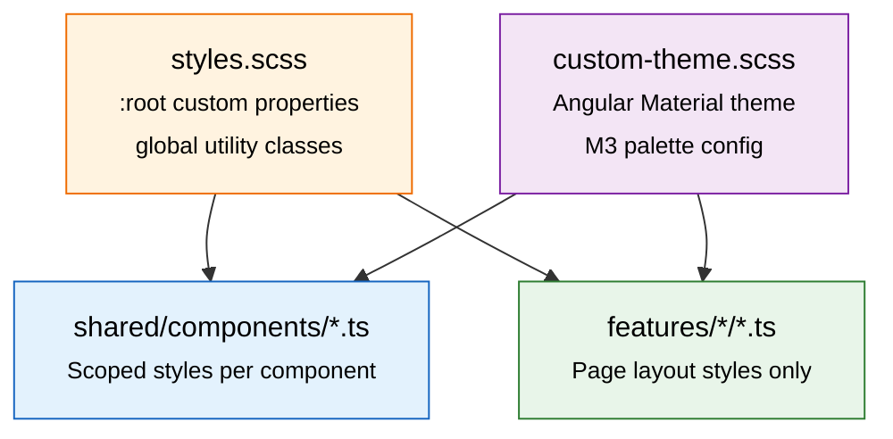
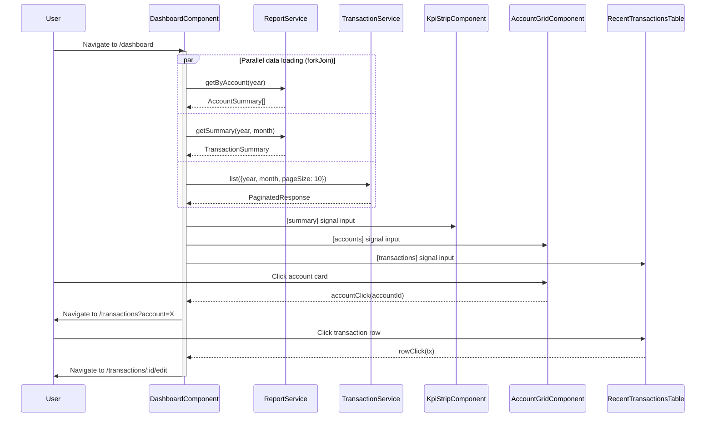
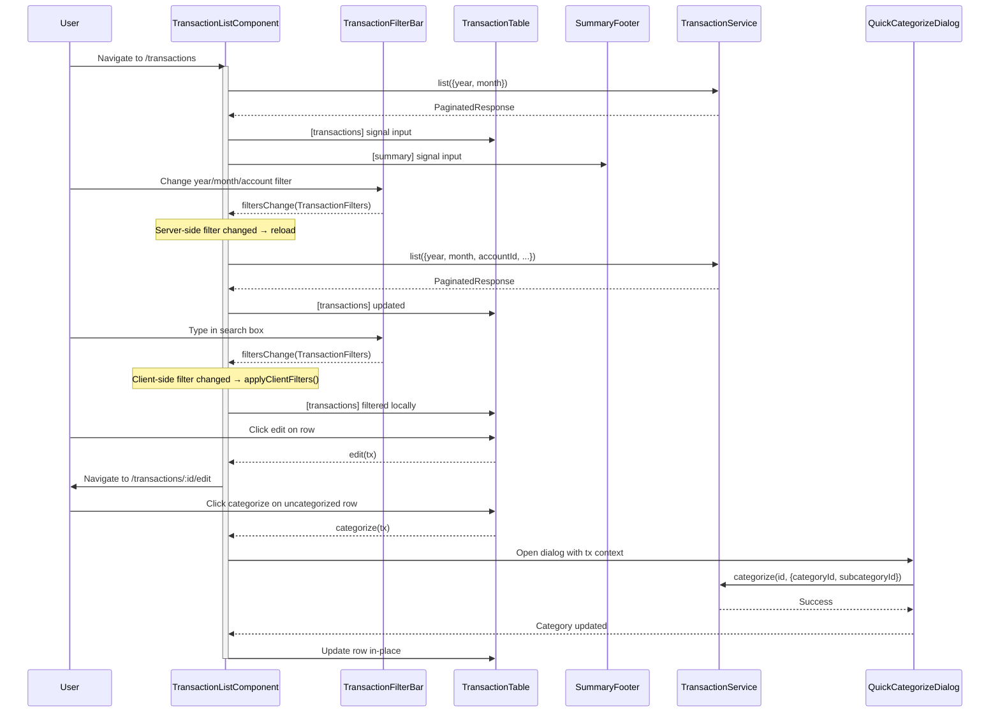
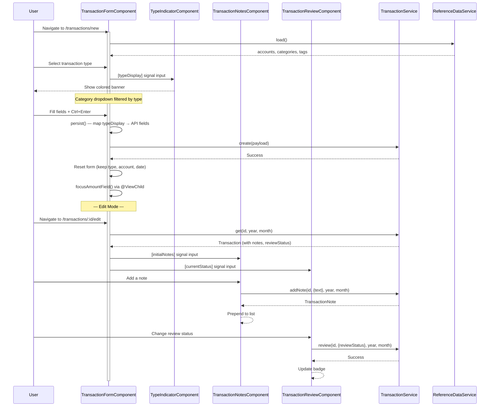
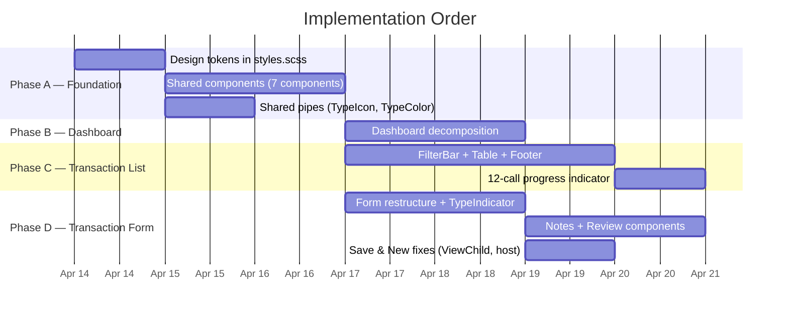

# UI Component Architecture — PoC (3 Screens)

**Version:** 1.0
**Date:** 2026-04-13
**Author:** Trinity (Frontend Dev)
**Requested by:** Pedro (perocha)
**Status:** Draft — awaiting approval
**Scope:** Component decomposition for Dashboard, Transaction List, Transaction Form
**Prerequisites:** Phase 1 frontend models/services (complete), PR #51 style revamp (merged)

---

## Table of Contents

1. [Component Tree](#1-component-tree)
2. [Dashboard Component Decomposition](#2-dashboard-component-decomposition)
3. [Transaction List Component Decomposition](#3-transaction-list-component-decomposition)
4. [Transaction Form Component Decomposition](#4-transaction-form-component-decomposition)
5. [Shared Components Library](#5-shared-components-library)
6. [Style Architecture](#6-style-architecture)
7. [Data Flow Diagrams](#7-data-flow-diagrams)
8. [Implementation Plan](#8-implementation-plan)

---

## 1. Component Tree

```mermaid
graph TD
  App["AppComponent<br/><small>Shell · toolbar · sidenav · router-outlet</small>"]

  App --> Dashboard["DashboardComponent<br/><small>Page · orchestrates data loading</small>"]
  App --> TxList["TransactionListComponent<br/><small>Page · state management · routing</small>"]
  App --> TxForm["TransactionFormComponent<br/><small>Page · form orchestration · save logic</small>"]

  %% Dashboard children
  Dashboard --> PH1["PageHeaderComponent"]
  Dashboard --> KPI["KpiStripComponent"]
  Dashboard --> AG["AccountGridComponent"]
  Dashboard --> ST1["SectionTitleComponent"]
  Dashboard --> RT["RecentTransactionsTableComponent"]
  Dashboard --> ES1["EmptyStateComponent"]
  Dashboard --> LC1["LoadingContainerComponent"]

  %% Transaction List children
  TxList --> PH2["PageHeaderComponent"]
  TxList --> FB["TransactionFilterBarComponent"]
  TxList --> TT["TransactionTableComponent"]
  TxList --> SF["TransactionSummaryFooterComponent"]
  TxList --> ES2["EmptyStateComponent"]
  TxList --> LC2["LoadingContainerComponent"]
  TxList --> QCD["QuickCategorizeDialogComponent"]

  %% Transaction Form children
  TxForm --> PH3["PageHeaderComponent"]
  TxForm --> TI["TypeIndicatorComponent"]
  TxForm --> TN["TransactionNotesComponent"]
  TxForm --> TR["TransactionReviewComponent"]
  TxForm --> LC3["LoadingContainerComponent"]
  TxForm --> ErrS["ErrorStateComponent"]

  %% Shared usage indicators
  TT --> TIP["TypeIconPipe"]
  TT --> TCP["TypeColorPipe"]
  TT --> SB["StatusBadgeComponent"]
  TT --> TP["TagPillComponent"]

  style App fill:#e8eaf6,stroke:#3f51b5,color:#000
  style Dashboard fill:#e3f2fd,stroke:#1565c0,color:#000
  style TxList fill:#e3f2fd,stroke:#1565c0,color:#000
  style TxForm fill:#e3f2fd,stroke:#1565c0,color:#000
  style PH1 fill:#f3e5f5,stroke:#7b1fa2,color:#000
  style PH2 fill:#f3e5f5,stroke:#7b1fa2,color:#000
  style PH3 fill:#f3e5f5,stroke:#7b1fa2,color:#000
  style ES1 fill:#f3e5f5,stroke:#7b1fa2,color:#000
  style ES2 fill:#f3e5f5,stroke:#7b1fa2,color:#000
  style LC1 fill:#f3e5f5,stroke:#7b1fa2,color:#000
  style LC2 fill:#f3e5f5,stroke:#7b1fa2,color:#000
  style LC3 fill:#f3e5f5,stroke:#7b1fa2,color:#000
  style SB fill:#f3e5f5,stroke:#7b1fa2,color:#000
  style TP fill:#f3e5f5,stroke:#7b1fa2,color:#000
  style ErrS fill:#f3e5f5,stroke:#7b1fa2,color:#000
```



**Legend:** Blue = page components, Purple = shared/reusable components, White = feature-specific sub-components.

---

## 2. Dashboard Component Decomposition

### 2.1 Current State

Single `DashboardComponent` at **~480 lines** (template ~160, styles ~200, class ~120). Contains:
- KPI strip (monthly income/expense/net cards)
- Account balance grid
- Recent transactions table
- Loading spinner and empty state
- Manual 3-counter loading pattern (`loaded++; if (loaded >= 3) ...`)

### 2.2 Proposed Component Breakdown

| Component | File Path | Responsibility | Size Target |
|-----------|-----------|---------------|-------------|
| `DashboardComponent` (page) | `features/dashboard/dashboard.component.ts` | Data loading, layout orchestration, routing | ~80 lines |
| `KpiStripComponent` | `features/dashboard/kpi-strip.component.ts` | Displays 3 KPI cards (income/expense/net) | ~60 lines |
| `AccountGridComponent` | `features/dashboard/account-grid.component.ts` | Account balance cards, click navigation | ~70 lines |
| `RecentTransactionsTableComponent` | `features/dashboard/recent-transactions-table.component.ts` | mat-table of last N transactions | ~90 lines |

Plus shared: `PageHeaderComponent`, `SectionTitleComponent`, `LoadingContainerComponent`, `EmptyStateComponent`.

### 2.3 Component Specifications

#### `DashboardComponent` (page orchestrator)

```typescript
@Component({
  selector: 'app-dashboard',
  standalone: true,
  changeDetection: ChangeDetectionStrategy.OnPush,
  imports: [
    PageHeaderComponent, SectionTitleComponent, LoadingContainerComponent,
    EmptyStateComponent, KpiStripComponent, AccountGridComponent,
    RecentTransactionsTableComponent,
  ],
  template: `
    <div class="page-container">
      <app-page-header [title]="settings.labels().dashboard"
                       [subtitle]="today | date: 'longDate'" />

      <app-loading-container [loading]="loading()">
        <app-section-title [text]="settings.labels().accountBalances" />
        <app-account-grid
          [accounts]="accountSummaries()"
          (accountClick)="onAccountClick($event)" />

        <app-section-title [text]="settings.labels().monthlySummary" />
        <app-kpi-strip [summary]="summary()" />

        <app-section-title [text]="settings.labels().recentTransactions" />
        @if (recentTransactions().length > 0) {
          <app-recent-transactions-table
            [transactions]="recentTransactions()"
            (rowClick)="onRowClick($event)"
            (viewAll)="router.navigate(['/transactions'])" />
        } @else {
          <app-empty-state icon="receipt_long"
                           [message]="settings.labels().noTransactionsThisMonth" />
        }
      </app-loading-container>
    </div>
  `,
})
```

**Data loading — fix the manual counter pattern:**

The current code uses 3 independent subscribes with a manual `loaded++` counter. Replace with `forkJoin` + `catchError`:

```typescript
ngOnInit(): void {
  const year = this.today.getFullYear();
  const month = this.today.getMonth() + 1;

  forkJoin({
    accounts: this.reportService.getByAccount(year).pipe(
      catchError(() => of([] as AccountSummary[]))
    ),
    summary: this.reportService.getSummary(year, month).pipe(
      catchError(() => of({ totalIncome: 0, totalExpenses: 0, net: 0 }))
    ),
    recent: this.transactionService.list({ year, month, pageSize: 10 }).pipe(
      catchError(() => of({ items: [] as Transaction[], continuationToken: null,
                            totalIncome: 0, totalExpenses: 0, net: 0 }))
    ),
  }).subscribe(({ accounts, summary, recent }) => {
    this.accountSummaries.set(accounts);
    this.summary.set(summary);
    this.recentTransactions.set(recent.items);
    this.loading.set(false);
  });
}
```

This is cleaner, handles errors per-stream, and shows all data at once (no partial rendering flicker).

#### `KpiStripComponent`

```typescript
@Component({
  selector: 'app-kpi-strip',
  standalone: true,
  changeDetection: ChangeDetectionStrategy.OnPush,
  imports: [MatCardModule, MatIconModule, CurrencyPipe],
  // Template: 3 mat-cards in a CSS grid
})
export class KpiStripComponent {
  summary = input.required<TransactionSummary | null>();
}
```

| Property | Type | Description |
|----------|------|-------------|
| `summary` | `input.required<TransactionSummary \| null>()` | Signal input — income, expense, net totals |

No outputs. Pure presentational. ~60 lines total.

#### `AccountGridComponent`

```typescript
@Component({
  selector: 'app-account-grid',
  standalone: true,
  changeDetection: ChangeDetectionStrategy.OnPush,
  imports: [MatCardModule, MatIconModule, CurrencyPipe],
})
export class AccountGridComponent {
  accounts = input.required<AccountSummary[]>();
  accountClick = output<string>(); // emits accountId
}
```

| Property | Type | Direction | Description |
|----------|------|-----------|-------------|
| `accounts` | `AccountSummary[]` | Input (signal) | Account balance data |
| `accountClick` | `string` | Output | Emits `accountId` when card clicked |

Uses `ReferenceDataService` via `inject()` to resolve account labels. ~70 lines.

#### `RecentTransactionsTableComponent`

```typescript
@Component({
  selector: 'app-recent-transactions-table',
  standalone: true,
  changeDetection: ChangeDetectionStrategy.OnPush,
  imports: [MatTableModule, CurrencyPipe, DatePipe],
})
export class RecentTransactionsTableComponent {
  transactions = input.required<Transaction[]>();
  rowClick = output<Transaction>();
  viewAll = output<void>();

  columns = ['date', 'account', 'description', 'category', 'amount'];
}
```

| Property | Type | Direction | Description |
|----------|------|-----------|-------------|
| `transactions` | `Transaction[]` | Input (signal) | Recent transaction rows |
| `rowClick` | `Transaction` | Output | Emits when a row is clicked |
| `viewAll` | `void` | Output | Emits when "View All" link is clicked |

Uses `ReferenceDataService` for label lookups. ~90 lines.

---

## 3. Transaction List Component Decomposition

### 3.1 Current State

Single `TransactionListComponent` at **~620 lines** (template ~265, styles ~50, class ~305). Contains:
- 9 filter fields with mixed server-side and client-side filtering
- 10-column mat-table with inline tag pills
- Summary footer with income/expense/net
- The "12 parallel API calls" pattern for "All Months"
- Per-row method calls for reference data lookups

### 3.2 Proposed Component Breakdown

| Component | File Path | Responsibility | Size Target |
|-----------|-----------|---------------|-------------|
| `TransactionListComponent` (page) | `features/transactions/transaction-list.component.ts` | Data loading, state management, routing | ~120 lines |
| `TransactionFilterBarComponent` | `features/transactions/transaction-filter-bar.component.ts` | Filter UI — emits params on change | ~130 lines |
| `TransactionTableComponent` | `features/transactions/transaction-table.component.ts` | mat-table with columns and row actions | ~150 lines |
| `TransactionSummaryFooterComponent` | `features/transactions/transaction-summary-footer.component.ts` | Totals bar | ~50 lines |
| `TypeIconPipe` | `shared/pipes/type-icon.pipe.ts` | Pure pipe: transaction → icon name | ~20 lines |
| `TypeColorPipe` | `shared/pipes/type-color.pipe.ts` | Pure pipe: transaction → CSS class | ~20 lines |

Plus shared: `PageHeaderComponent`, `LoadingContainerComponent`, `EmptyStateComponent`, `StatusBadgeComponent`, `TagPillComponent`.

### 3.3 Component Specifications

#### `TransactionListComponent` (page orchestrator)

Owns the data loading pipeline, filter state, and routing. Template shrinks to ~40 lines — just composing children.

```typescript
@Component({
  selector: 'app-transaction-list',
  standalone: true,
  changeDetection: ChangeDetectionStrategy.OnPush,
  imports: [
    PageHeaderComponent, LoadingContainerComponent, EmptyStateComponent,
    TransactionFilterBarComponent, TransactionTableComponent,
    TransactionSummaryFooterComponent,
  ],
  template: `
    <div class="page-container">
      <app-page-header [title]="settings.labels().transactions">
        <button mat-fab extended color="primary"
                (click)="router.navigate(['/transactions/new'])">
          <mat-icon>add</mat-icon>
          {{ settings.labels().newTransaction }}
        </button>
      </app-page-header>

      <app-transaction-filter-bar
        (filtersChange)="onFiltersChange($event)" />

      <app-loading-container [loading]="loading()">
        @if (transactions().length > 0) {
          <app-transaction-table
            [transactions]="transactions()"
            (edit)="onEdit($event)"
            (delete)="onDelete($event)"
            (categorize)="onCategorize($event)" />
          <app-transaction-summary-footer [summary]="footerSummary()" />
        } @else {
          <app-empty-state icon="receipt_long"
                           [message]="settings.labels().noTransactionsThisMonth" />
        }
      </app-loading-container>
    </div>
  `,
})
```

#### `TransactionFilterBarComponent`

Encapsulates all filter state and emits a structured filter object on every change.

**Output interface:**

```typescript
export interface TransactionFilters {
  year: number;
  month: number | null;        // null = all months
  accountId: string | null;
  categoryId: string | null;
  tagId: string | null;
  transactionType: string | null;
  categorizationStatus: string | null;
  reviewStatus: string | null;
  search: string | null;       // client-side text search
  amountMin: number | null;    // client-side amount filter
  amountMax: number | null;    // client-side amount filter
}
```

```typescript
@Component({
  selector: 'app-transaction-filter-bar',
  standalone: true,
  changeDetection: ChangeDetectionStrategy.OnPush,
  imports: [
    MatFormFieldModule, MatSelectModule, MatInputModule,
    MatIconModule, FormsModule,
  ],
})
export class TransactionFilterBarComponent {
  filtersChange = output<TransactionFilters>();

  // Internal state — each filter field binds here
  year = new Date().getFullYear();
  month: number | null = null;
  accountId: string | null = null;
  categoryId: string | null = null;
  tagId: string | null = null;
  transactionType: string | null = null;
  categorizationStatus: string | null = null;
  reviewStatus: string | null = null;
  search: string | null = null;
  amountMin: number | null = null;
  amountMax: number | null = null;

  // Uses ReferenceDataService for dropdown options
  private readonly refData = inject(ReferenceDataService);
  readonly settings = inject(AppSettingsService);

  emitFilters(): void {
    this.filtersChange.emit({
      year: this.year,
      month: this.month,
      accountId: this.accountId,
      categoryId: this.categoryId,
      tagId: this.tagId,
      transactionType: this.transactionType,
      categorizationStatus: this.categorizationStatus,
      reviewStatus: this.reviewStatus,
      search: this.search,
      amountMin: this.amountMin,
      amountMax: this.amountMax,
    });
  }
}
```

**Filter layout** (2 rows):
- **Row 1:** Year, Month, Account, Category, Tag, Transaction Type
- **Row 2:** Search (flex), Amount Min, Amount Max, Categorization Status, Review Status

Server-side filters (year, month, accountId, categoryId, tagId, transactionType, categorizationStatus, reviewStatus) trigger `loadTransactions()` on the parent. Client-side filters (search, amountMin, amountMax) trigger `applyClientFilters()` — the parent distinguishes based on which fields changed.

#### `TransactionTableComponent`

Pure presentational mat-table. Receives data, emits row actions.

```typescript
@Component({
  selector: 'app-transaction-table',
  standalone: true,
  changeDetection: ChangeDetectionStrategy.OnPush,
  imports: [
    MatTableModule, MatIconModule, MatButtonModule, MatTooltipModule,
    CurrencyPipe, DatePipe,
    TypeIconPipe, TypeColorPipe, StatusBadgeComponent, TagPillComponent,
  ],
})
export class TransactionTableComponent {
  transactions = input.required<Transaction[]>();
  edit = output<Transaction>();
  delete = output<Transaction>();
  categorize = output<Transaction>();

  readonly refData = inject(ReferenceDataService);
  readonly settings = inject(AppSettingsService);

  displayedColumns = [
    'type', 'date', 'account', 'description', 'category',
    'tags', 'amount', 'status', 'actions',
  ];
}
```

| Property | Type | Direction | Description |
|----------|------|-----------|-------------|
| `transactions` | `Transaction[]` | Input (signal) | Rows to display |
| `edit` | `Transaction` | Output | Edit button clicked |
| `delete` | `Transaction` | Output | Delete button clicked |
| `categorize` | `Transaction` | Output | Quick-categorize button on uncategorized row |

**Key improvements over current code:**
- `TypeIconPipe` and `TypeColorPipe` replace per-row method calls (`typeIcon(tx)`, `typeIconColor(tx)`) — pure pipes are memoized by Angular and only re-evaluate when input changes. This eliminates redundant computation in the change detection cycle.
- Column definitions shrink: no inline conditional styling, just CSS classes from pipes.

#### `TransactionSummaryFooterComponent`

```typescript
export interface TransactionSummaryData {
  totalIncome: number;
  totalExpenses: number;
  net: number;
  transactionCount: number;
  uncategorizedCount: number;
  transfersTotal: number;
}

@Component({
  selector: 'app-transaction-summary-footer',
  standalone: true,
  changeDetection: ChangeDetectionStrategy.OnPush,
  imports: [CurrencyPipe],
})
export class TransactionSummaryFooterComponent {
  summary = input.required<TransactionSummaryData>();
}
```

Template shows: count, income (green), expenses (red), net (conditional), uncategorized (orange, only if > 0), transfers (blue, only if > 0). Uses `flex-wrap` for narrow viewports. ~50 lines total.

#### `TypeIconPipe` and `TypeColorPipe`

```typescript
// shared/pipes/type-icon.pipe.ts
@Pipe({ name: 'typeIcon', standalone: true, pure: true })
export class TypeIconPipe implements PipeTransform {
  transform(tx: Transaction): string {
    switch (tx.transactionType) {
      case 'income': return 'arrow_upward';
      case 'expense': return 'arrow_downward';
      case 'transfer': return 'swap_horiz';
      case 'refund': return 'replay';
      default: return 'help_outline';
    }
  }
}

// shared/pipes/type-color.pipe.ts
@Pipe({ name: 'typeColor', standalone: true, pure: true })
export class TypeColorPipe implements PipeTransform {
  transform(tx: Transaction): string {
    switch (tx.transactionType) {
      case 'income': return 'type-income';
      case 'expense': return 'type-expense';
      case 'transfer': return 'type-transfer';
      case 'refund': return 'type-refund';
      default: return '';
    }
  }
}
```

Returns CSS class names — never inline colors. Classes defined once in `styles.scss`.

### 3.4 The 12-API-Call Problem

When "All Months" is selected, the current code fires 12 parallel `transactionService.list()` calls (one per month). This is because the backend API requires `month` as a mandatory parameter.

**Analysis of options:**

| Option | Description | Effort | UX Impact |
|--------|------------|--------|-----------|
| **A: Backend year endpoint** | Add `GET /api/transactions?year=2026` (no month). Backend aggregates. | Medium — requires Morpheus + API change + new Cosmos query | Best — single request, server-side pagination |
| **B: Client-side cache** | Cache per-month results. Subsequent "All Months" reads from cache. | Low — frontend only | Stale data risk, memory usage for 12 months |
| **C: Accept + progress** | Keep 12 calls, add a progress indicator (e.g., "Loading 7/12 months...") | Low — frontend only | Honest UX, user sees progress |

**Recommendation: Option C now, Option A as follow-up.**

Option C is the pragmatic choice for the PoC:

```typescript
// In TransactionListComponent
private loadAllMonths(baseParams: Omit<TransactionQueryParams, 'month'>): void {
  const calls = Array.from({ length: 12 }, (_, i) =>
    this.transactionService.list({ ...baseParams, month: i + 1 }).pipe(
      catchError(() => of({ items: [] as Transaction[], continuationToken: null,
                            totalIncome: 0, totalExpenses: 0, net: 0 })),
      tap(() => this.loadedMonths.update(n => n + 1)),
    )
  );
  this.loadedMonths.set(0);

  forkJoin(calls).subscribe(results => {
    const all = results.flatMap(r => r.items);
    all.sort((a, b) => a.date.localeCompare(b.date));
    this.applyResults(all);
  });
}

// In template — loading indicator
@if (loading()) {
  <app-loading-container [loading]="true"
    [message]="selectedMonth() === null
      ? ('Loading ' + loadedMonths() + '/12 months...')
      : undefined" />
}
```

Option A should be filed as a backend issue for Morpheus — a year-level transaction query with server-side pagination would eliminate this entirely.

---

## 4. Transaction Form Component Decomposition

### 4.1 Current State

Single `TransactionFormComponent` at **~660 lines** (template ~160, styles ~30, class ~470). Contains:
- Create + Edit dual mode
- Form group with 9 fields
- Category → subcategory cascade
- Type indicator banner
- Save & New workflow with `document.querySelector` for focus management
- `@HostListener('document:keydown')` for Ctrl+Enter (catches events globally)
- No notes section, no review section (per UX spec, these are needed)

### 4.2 Proposed Component Breakdown

| Component | File Path | Responsibility | Size Target |
|-----------|-----------|---------------|-------------|
| `TransactionFormComponent` (page) | `features/transactions/transaction-form.component.ts` | Form orchestration, save logic, type mapping, routing | ~200 lines |
| `TypeIndicatorComponent` | `features/transactions/type-indicator.component.ts` | Type banner (color + text by type) | ~50 lines |
| `TransactionNotesComponent` | `features/transactions/transaction-notes.component.ts` | Notes list + add note (edit mode) | ~100 lines |
| `TransactionReviewComponent` | `features/transactions/transaction-review.component.ts` | Review status badge + change dropdown (edit mode) | ~80 lines |

Plus shared: `PageHeaderComponent`, `LoadingContainerComponent`, `ErrorStateComponent`.

### 4.3 Component Specifications

#### `TransactionFormComponent` (page orchestrator)

**Owns the form group.** Children do NOT own FormGroup slices — they communicate via inputs/outputs. This keeps the save logic centralized and avoids split-brain form validation.

```typescript
@Component({
  selector: 'app-transaction-form',
  standalone: true,
  changeDetection: ChangeDetectionStrategy.OnPush,
  imports: [
    ReactiveFormsModule, MatFormFieldModule, MatInputModule, MatSelectModule,
    MatDatepickerModule, MatNativeDateModule, MatButtonModule, MatCardModule,
    MatIconModule, MatExpansionModule, MatSnackBarModule,
    PageHeaderComponent, LoadingContainerComponent, ErrorStateComponent,
    TypeIndicatorComponent, TransactionNotesComponent, TransactionReviewComponent,
  ],
})
export class TransactionFormComponent implements OnInit {
  // Signal for the amount input ViewChild — replaces document.querySelector
  private readonly amountInput = viewChild<ElementRef>('amountInput');

  form: FormGroup = this.fb.group({
    transactionTypeDisplay: ['', Validators.required],   // NEW — 6-value display type
    accountId: [localStorage.getItem(LAST_ACCOUNT_KEY) ?? '', Validators.required],
    date: [new Date(), Validators.required],
    valueDate: [null],
    amount: [null, [Validators.required, Validators.min(0.01)]],
    bankDescription: [''],
    categoryId: [null],                                   // NOW OPTIONAL
    subcategoryId: [null],                                // NOW OPTIONAL
    tagIds: [[] as string[]],
    detail: [''],
    counterpartyName: [''],                               // NEW
    counterpartyReference: [''],                           // NEW
    sourceReference: [''],                                 // NEW
  });
  // ...
}
```

**Form group structure — what parent owns vs children:**

| Form Control | Owner | Reason |
|-------------|-------|--------|
| All primary fields (type, account, dates, amount, category, etc.) | `TransactionFormComponent` | Centralized validation + save logic |
| Notes list | `TransactionNotesComponent` | Independent sub-resource — notes are posted individually |
| Review status | `TransactionReviewComponent` | Independent sub-resource — review is patched individually |

Children communicate back via `output()`:
- `TransactionNotesComponent.noteAdded` → parent does NOT need to act (notes are saved independently)
- `TransactionReviewComponent.reviewChanged` → parent does NOT need to act (review is saved independently)

**Save & New — fix `document.querySelector`:**

```typescript
// OLD (anti-pattern)
setTimeout(() => {
  document.querySelector<HTMLInputElement>('input[formcontrolname="amount"]')?.focus();
});

// NEW — use @ViewChild signal
private readonly amountInput = viewChild<ElementRef>('amountInput');

private focusAmountField(): void {
  // Wait one tick for the form reset to propagate
  afterNextRender(() => {
    this.amountInput()?.nativeElement.focus();
  });
}
```

In template: `<input matInput #amountInput formControlName="amount" ...>`

**HostListener fix — scope Ctrl+Enter to the form element:**

```typescript
// OLD (catches ALL keydowns on document — including inside dialogs, menus, etc.)
@HostListener('document:keydown', ['$event'])
handleKeyDown(event: KeyboardEvent): void { ... }

// NEW — use host binding on the form element
@Component({
  host: {
    '(keydown.control.enter)': 'onSaveAndNew()',
  },
})
```

Or simply bind on the `<form>` element in the template:

```html
<form [formGroup]="form" (ngSubmit)="onSaveAndNew()"
      (keydown.control.enter)="onSaveAndNew()">
```

This scopes the shortcut to the form, not the entire document.

**Save & New field preservation (per UX spec §2.3):**

After a successful save-and-new, preserve: `transactionTypeDisplay`, `accountId`, `date`. Reset everything else.

```typescript
const keepType = this.form.value.transactionTypeDisplay;
const keepAccount = this.form.value.accountId;
const keepDate = this.form.value.date;
this.form.reset({
  transactionTypeDisplay: keepType,
  accountId: keepAccount,
  date: keepDate,
  tagIds: [],
});
this.focusAmountField();
```

#### `TypeIndicatorComponent`

```typescript
@Component({
  selector: 'app-type-indicator',
  standalone: true,
  changeDetection: ChangeDetectionStrategy.OnPush,
  imports: [MatIconModule],
})
export class TypeIndicatorComponent {
  typeDisplay = input.required<string | null>(); // transactionTypeDisplay value

  readonly config = computed(() => {
    switch (this.typeDisplay()) {
      case 'income':           return { icon: '↑', text: 'Se registrará como INGRESO', cssClass: 'type-income' };
      case 'expense':          return { icon: '↓', text: 'Se registrará como GASTO', cssClass: 'type-expense' };
      case 'transfer_in':      return { icon: '↔', text: 'Transferencia de ENTRADA', cssClass: 'type-transfer' };
      case 'transfer_out':     return { icon: '↔', text: 'Transferencia de SALIDA', cssClass: 'type-transfer' };
      case 'refund_received':  return { icon: '↩', text: 'Reembolso RECIBIDO', cssClass: 'type-refund' };
      case 'refund_given':     return { icon: '↩', text: 'Reembolso EMITIDO', cssClass: 'type-refund' };
      default:                 return null; // hidden when no type selected
    }
  });
}
```

Template: a banner `div` with `[class]="config()?.cssClass"`, hidden when `config()` is null. ~50 lines total.

#### `TransactionNotesComponent`

Shown in edit mode only. Manages its own API calls for adding notes.

```typescript
@Component({
  selector: 'app-transaction-notes',
  standalone: true,
  changeDetection: ChangeDetectionStrategy.OnPush,
  imports: [
    MatCardModule, MatFormFieldModule, MatInputModule,
    MatButtonModule, MatIconModule, DatePipe,
  ],
})
export class TransactionNotesComponent {
  transactionId = input.required<string>();
  year = input.required<number>();
  month = input.required<number>();
  initialNotes = input<TransactionNote[]>([]);

  noteAdded = output<TransactionNote>();

  // Internal state
  notes = signal<TransactionNote[]>([]);
  newNoteText = signal('');
  adding = signal(false);

  private readonly transactionService = inject(TransactionService);
  private readonly snackBar = inject(MatSnackBar);

  constructor() {
    // Sync initial notes on first load
    effect(() => this.notes.set(this.initialNotes()));
  }

  addNote(): void {
    const text = this.newNoteText().trim();
    if (!text || this.adding()) return;

    this.adding.set(true);
    this.transactionService
      .addNote(this.transactionId(), { text }, this.year(), this.month())
      .subscribe({
        next: (note) => {
          this.notes.update(list => [note, ...list]);
          this.newNoteText.set('');
          this.noteAdded.emit(note);
          this.adding.set(false);
        },
        error: () => {
          this.snackBar.open('Error adding note', '', { duration: 3000 });
          this.adding.set(false);
        },
      });
  }
}
```

| Property | Type | Direction | Description |
|----------|------|-----------|-------------|
| `transactionId` | `string` | Input (signal) | ID of the transaction being edited |
| `year` | `number` | Input (signal) | Transaction year (for API) |
| `month` | `number` | Input (signal) | Transaction month (for API) |
| `initialNotes` | `TransactionNote[]` | Input (signal) | Notes loaded with the transaction |
| `noteAdded` | `TransactionNote` | Output | Emitted after a note is successfully added |

~100 lines total.

#### `TransactionReviewComponent`

Shown in edit mode only. Manages its own API call for changing review status.

```typescript
@Component({
  selector: 'app-transaction-review',
  standalone: true,
  changeDetection: ChangeDetectionStrategy.OnPush,
  imports: [
    MatSelectModule, MatFormFieldModule, MatIconModule, StatusBadgeComponent, DatePipe,
  ],
})
export class TransactionReviewComponent {
  transactionId = input.required<string>();
  year = input.required<number>();
  month = input.required<number>();
  currentStatus = input.required<ReviewStatus>();
  reviewedBy = input<string | null>(null);
  reviewedAt = input<string | null>(null);
  isAdmin = input(false);

  reviewChanged = output<ReviewStatus>();

  status = signal<ReviewStatus>('pending');
  saving = signal(false);

  private readonly transactionService = inject(TransactionService);

  constructor() {
    effect(() => this.status.set(this.currentStatus()));
  }

  onStatusChange(newStatus: ReviewStatus): void {
    if (this.saving()) return;
    this.saving.set(true);
    this.transactionService
      .review(this.transactionId(), { reviewStatus: newStatus }, this.year(), this.month())
      .subscribe({
        next: () => {
          this.status.set(newStatus);
          this.reviewChanged.emit(newStatus);
          this.saving.set(false);
        },
        error: () => this.saving.set(false),
      });
  }
}
```

Admin sees a `mat-select` to change status. Viewer sees a read-only `StatusBadgeComponent`. ~80 lines.

---

## 5. Shared Components Library

### 5.1 Component Catalog

| Component | Used In | Purpose | Size Target |
|-----------|---------|---------|-------------|
| `PageHeaderComponent` | Dashboard, List, Form | Title + subtitle + action buttons (content projection) | ~30 lines |
| `SectionTitleComponent` | Dashboard | Uppercase section label with bottom margin | ~15 lines |
| `LoadingContainerComponent` | Dashboard, List, Form | Centered spinner with optional message + `ng-content` | ~25 lines |
| `EmptyStateComponent` | Dashboard, List | Icon + message + optional action button | ~30 lines |
| `ErrorStateComponent` | Form | Error message + retry button | ~25 lines |
| `StatusBadgeComponent` | List (table), Form (review) | Pill-shaped colored chip for review/categorization status | ~40 lines |
| `TagPillComponent` | List (table) | Colored tag display pill | ~20 lines |

### 5.2 File Structure

```
shared/
  components/
    page-header.component.ts
    section-title.component.ts
    loading-container.component.ts
    empty-state.component.ts
    error-state.component.ts
    status-badge.component.ts
    tag-pill.component.ts
  pipes/
    type-icon.pipe.ts
    type-color.pipe.ts
  models/
    ... (existing)
```

### 5.3 Component Specifications

#### `PageHeaderComponent`

```typescript
@Component({
  selector: 'app-page-header',
  standalone: true,
  changeDetection: ChangeDetectionStrategy.OnPush,
  template: `
    <div class="page-header">
      <div>
        <h1>{{ title() }}</h1>
        @if (subtitle()) {
          <span class="header-subtitle">{{ subtitle() }}</span>
        }
      </div>
      <ng-content /> <!-- Action buttons projected here -->
    </div>
  `,
  styles: `
    .page-header {
      display: flex;
      justify-content: space-between;
      align-items: center;
      margin-bottom: 24px;
    }
    h1 { margin: 0; font-size: 24px; font-weight: 400; }
    .header-subtitle { font-size: 14px; color: var(--app-muted); }
  `,
})
export class PageHeaderComponent {
  title = input.required<string>();
  subtitle = input<string>();
}
```

#### `SectionTitleComponent`

```typescript
@Component({
  selector: 'app-section-title',
  standalone: true,
  changeDetection: ChangeDetectionStrategy.OnPush,
  template: `<div class="section-title">{{ text() }}</div>`,
  styles: `
    .section-title {
      font-size: 13px;
      font-weight: 600;
      text-transform: uppercase;
      letter-spacing: 0.5px;
      margin: 24px 0 12px;
      color: var(--app-muted);
    }
  `,
})
export class SectionTitleComponent {
  text = input.required<string>();
}
```

#### `LoadingContainerComponent`

```typescript
@Component({
  selector: 'app-loading-container',
  standalone: true,
  changeDetection: ChangeDetectionStrategy.OnPush,
  imports: [MatProgressSpinnerModule],
  template: `
    @if (loading()) {
      <div class="loading-container">
        <mat-spinner diameter="40" />
        @if (message()) {
          <p class="loading-message">{{ message() }}</p>
        }
      </div>
    } @else {
      <ng-content />
    }
  `,
  styles: `
    .loading-container {
      display: flex; flex-direction: column;
      justify-content: center; align-items: center;
      padding: 48px;
    }
    .loading-message {
      margin-top: 12px; font-size: 14px; color: var(--app-muted);
    }
  `,
})
export class LoadingContainerComponent {
  loading = input.required<boolean>();
  message = input<string>();
}
```

#### `EmptyStateComponent`

```typescript
@Component({
  selector: 'app-empty-state',
  standalone: true,
  changeDetection: ChangeDetectionStrategy.OnPush,
  imports: [MatIconModule, MatButtonModule],
  template: `
    <div class="empty-state">
      <mat-icon>{{ icon() }}</mat-icon>
      <p>{{ message() }}</p>
      @if (actionLabel()) {
        <button mat-stroked-button (click)="action.emit()">{{ actionLabel() }}</button>
      }
    </div>
  `,
  styles: `
    .empty-state {
      display: flex; flex-direction: column;
      align-items: center; padding: 48px; color: var(--app-muted);
    }
    .empty-state mat-icon {
      font-size: 48px; width: 48px; height: 48px; margin-bottom: 16px;
    }
  `,
})
export class EmptyStateComponent {
  icon = input.required<string>();
  message = input.required<string>();
  actionLabel = input<string>();
  action = output<void>();
}
```

#### `ErrorStateComponent`

```typescript
@Component({
  selector: 'app-error-state',
  standalone: true,
  changeDetection: ChangeDetectionStrategy.OnPush,
  imports: [MatIconModule, MatButtonModule],
  template: `
    <div class="error-state">
      <mat-icon>error_outline</mat-icon>
      <p>{{ message() }}</p>
      <button mat-stroked-button color="primary" (click)="retry.emit()">
        {{ retryLabel() || 'Retry' }}
      </button>
    </div>
  `,
  styles: `
    .error-state {
      display: flex; flex-direction: column;
      align-items: center; padding: 48px; color: #c62828;
    }
    .error-state mat-icon {
      font-size: 48px; width: 48px; height: 48px; margin-bottom: 16px;
    }
  `,
})
export class ErrorStateComponent {
  message = input.required<string>();
  retryLabel = input<string>();
  retry = output<void>();
}
```

#### `StatusBadgeComponent`

```typescript
@Component({
  selector: 'app-status-badge',
  standalone: true,
  changeDetection: ChangeDetectionStrategy.OnPush,
  imports: [MatIconModule],
  template: `
    <span class="status-badge" [class]="'status-' + status()">
      <mat-icon>{{ iconMap[status()] }}</mat-icon>
      {{ abbreviationMap[status()] }}
    </span>
  `,
  styles: `
    .status-badge {
      display: inline-flex; align-items: center; gap: 2px;
      padding: 2px 8px; border-radius: 12px;
      font-size: 11px; font-weight: 600;
    }
    .status-badge mat-icon { font-size: 14px; width: 14px; height: 14px; }
    .status-pending   { background: #fff3e0; color: #e65100; }
    .status-reviewed  { background: #e3f2fd; color: #1565c0; }
    .status-approved  { background: #e8f5e9; color: #2e7d32; }
    .status-flagged   { background: #ffebee; color: #c62828; }
    .status-uncategorized { background: #f5f5f5; color: #9e9e9e; }
  `,
})
export class StatusBadgeComponent {
  status = input.required<string>();

  iconMap: Record<string, string> = {
    pending: 'schedule',
    reviewed: 'visibility',
    approved: 'check_circle',
    flagged: 'flag',
    uncategorized: 'label_off',
  };

  abbreviationMap: Record<string, string> = {
    pending: 'P',
    reviewed: 'R',
    approved: 'A',
    flagged: 'F',
    uncategorized: 'SC',
  };
}
```

#### `TagPillComponent`

```typescript
@Component({
  selector: 'app-tag-pill',
  standalone: true,
  changeDetection: ChangeDetectionStrategy.OnPush,
  template: `
    <span class="tag-pill"
          [style.background-color]="backgroundColor()"
          [style.color]="textColor()">
      {{ label() }}
    </span>
  `,
  styles: `
    .tag-pill {
      display: inline-block; padding: 2px 10px;
      border-radius: 16px; font-size: 11px;
      font-weight: 500; white-space: nowrap;
    }
  `,
})
export class TagPillComponent {
  label = input.required<string>();
  backgroundColor = input('#e0e0e0');
  textColor = input('#333');
}
```

---

## 6. Style Architecture

### 6.1 Layered Organization



### 6.2 Global Design Tokens (`styles.scss`)

Add to `:root` (or `body`):

```scss
:root {
  // Semantic colors — transaction types
  --color-income: #4caf50;
  --color-expense: #e53935;
  --color-transfer: #1e88e5;
  --color-refund: #00897b;

  // Semantic colors — review status
  --color-pending: #ff9800;
  --color-reviewed: #2196f3;
  --color-approved: #4caf50;
  --color-flagged: #f44336;

  // Surfaces
  --surface-footer: #faf8fc;
  --surface-card: #ffffff;

  // Text
  --text-muted: #78717c;
  --text-primary: #231f27;
}
```

### 6.3 Global Utility Classes (`styles.scss`)

These exist ONCE and are NEVER duplicated in component styles:

```scss
// Amount colors — used in table cells, KPI cards, footer
.text-income  { color: var(--color-income); }
.text-expense { color: var(--color-expense); }
.text-transfer { color: var(--color-transfer); }
.text-refund  { color: var(--color-refund); }

// Type indicator backgrounds — used in TypeIndicatorComponent, table type column
.type-income   { background: #e8f5e9; color: #2e7d32; }
.type-expense  { background: #ffebee; color: #c62828; }
.type-transfer { background: #e3f2fd; color: #1565c0; }
.type-refund   { background: #e0f2f1; color: #00695c; }

// Layout utilities
.full-width   { width: 100%; }
.spacer       { flex: 1 1 auto; }
.text-right   { text-align: right; }
.text-center  { text-align: center; }
```

### 6.4 Rules

1. **No component may duplicate a global utility class.** If `.text-income` or `.loading-container` appears in a component's `styles`, it must be extracted to `styles.scss`.
2. **Shared components own their scoped styles** (badge shapes, pill shapes, etc.).
3. **Page components use minimal styles** — grid placement of sub-components, max-width, margin.
4. **Colors always reference CSS custom properties** — never hardcoded hex in component styles (dark theme support).

---

## 7. Data Flow Diagrams

### 7.1 Dashboard Data Flow



### 7.2 Transaction List Data Flow



### 7.3 Transaction Form Data Flow



---

## 8. Implementation Plan

### 8.1 Build Order



### 8.2 Parallelization

| Work Item | Dependency | Can Parallelize With |
|-----------|-----------|---------------------|
| Design tokens (`styles.scss`) | None | — |
| Shared components | Design tokens | Shared pipes |
| Dashboard decomposition | Shared components | Transaction List (partially) |
| Transaction List decomposition | Shared components | Dashboard decomposition |
| Transaction Form decomposition | Shared components | Dashboard, List |
| Notes + Review components | Form restructure | — |

**Key insight:** After Phase A (tokens + shared components), all 3 screens can be decomposed in parallel by separate developers/agents.

### 8.3 PR Strategy

| PR | Contents | Size Estimate |
|----|----------|--------------|
| **PR A: Shared Foundation** | Design tokens, 7 shared components, 2 pipes. No behavioral changes to existing screens. | ~500 lines |
| **PR B: Dashboard** | Dashboard decomposition into 4 components. Uses shared components from PR A. | ~400 lines |
| **PR C: Transaction List** | List decomposition into 4 components + filter interface. Uses shared components + pipes. | ~600 lines |
| **PR D: Transaction Form** | Form restructure + 3 new child components. Includes `document.querySelector` fix, `HostListener` fix. | ~700 lines |

**PR A must merge first.** PRs B, C, D can go in any order after A.

### 8.4 Testing Strategy

| Component Type | Test Approach | Tool |
|---------------|--------------|------|
| **Shared components** | Unit tests — verify inputs render correctly, outputs emit | Jest + `@angular/core/testing` |
| **Pipes** | Unit tests — verify transform logic for each transaction type | Jest (pure function tests) |
| **Page components** | Integration tests — verify data flows through children correctly | Jest + `ComponentFixture` with mock services |
| **Filter bar** | Unit test — verify `filtersChange` emits correct structure | Jest |
| **Notes/Review** | Unit test — verify API calls on user actions, optimistic UI updates | Jest + `HttpClientTestingModule` |
| **Dashboard** | Integration test — mock `forkJoin` responses, verify data reaches children | Jest |

**Testing priorities (highest first):**
1. `TypeIconPipe` / `TypeColorPipe` — pure logic, easy to test, high impact
2. `TransactionFilterBarComponent` — filter interface is a contract between components
3. `TransactionFormComponent` — save logic, type mapping, field preservation
4. `TransactionNotesComponent` — API interaction + optimistic updates
5. Shared components — mostly visual, lower priority for unit tests

### 8.5 Migration Path

Each screen is migrated independently. The pattern for each:

1. Create the child components in the same feature directory
2. Update the page component to compose children (imports, template)
3. Move template fragments from page → children
4. Move styles from page → children (or extract to global utilities)
5. Add `ChangeDetectionStrategy.OnPush` to all new components
6. Run `npx ng lint` + `npx ng build --configuration=production`
7. Verify no regressions in existing behavior

The existing monolithic components continue to work throughout. Each PR replaces one screen at a time — no big-bang rewrite.

---

## Appendix A: Type Mapping Reference

The transaction type display value maps to API values and visual properties:

| Display Value | API `transactionType` | Amount Sign | Icon | CSS Class |
|--------------|----------------------|-------------|------|-----------|
| `income` | `income` | `+abs(amount)` | `arrow_upward` | `type-income` |
| `expense` | `expense` | `-abs(amount)` | `arrow_downward` | `type-expense` |
| `transfer_in` | `transfer` | `+abs(amount)` | `swap_horiz` | `type-transfer` |
| `transfer_out` | `transfer` | `-abs(amount)` | `swap_horiz` | `type-transfer` |
| `refund_received` | `refund` | `+abs(amount)` | `replay` | `type-refund` |
| `refund_given` | `refund` | `-abs(amount)` | `replay` | `type-refund` |

## Appendix B: Signal Inputs vs Traditional `@Input`

All new components use **signal-based inputs** (`input()` / `input.required()`):

- Works with `OnPush` change detection (signals notify Angular of changes)
- Composable with `computed()` for derived state
- Type-safe without decorators
- Angular 19 stable API

No component in this architecture uses the traditional `@Input()` decorator.
