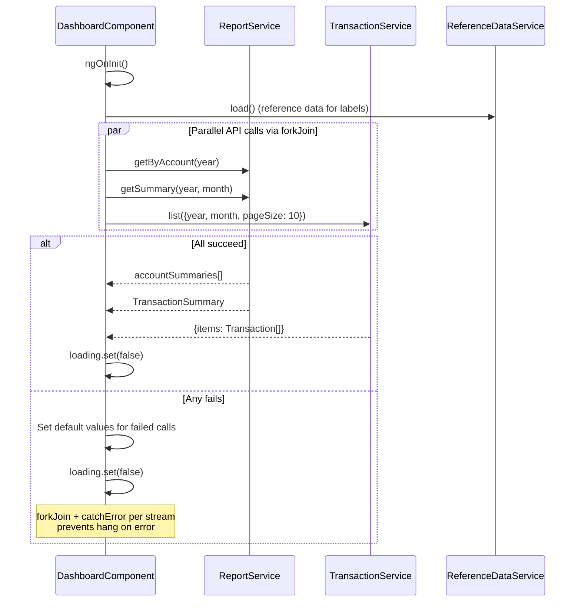
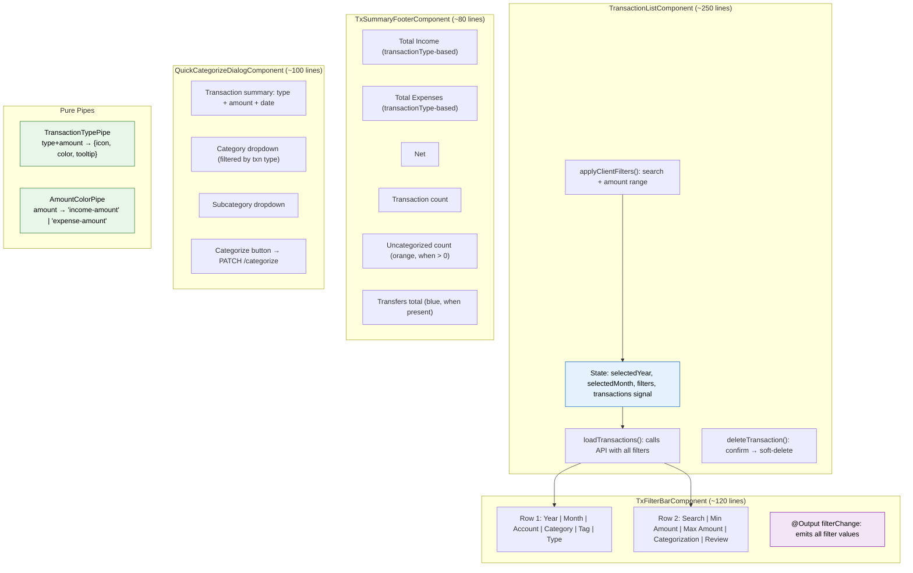
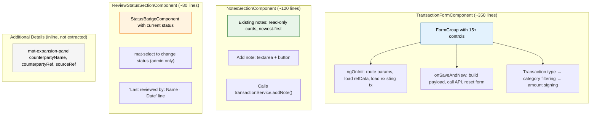
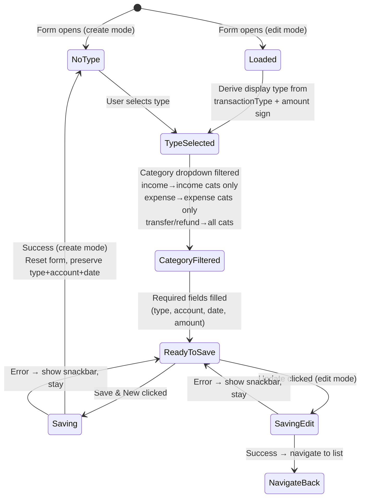
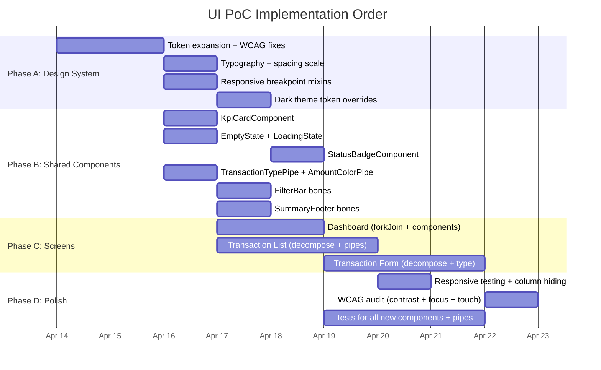

# UI Proof-of-Concept Proposal — 3-Screen Strategy

**Version:** 1.0
**Date:** 2026-04-13
**Author:** Neo (Lead / Architect)
**Requested by:** Pedro (perocha)
**Status:** Proposal — awaiting approval
**Replaces:** PR #51 (`copilot/revamp-ui-interface`) approach — selective reuse, not wholesale merge
**References:**
- [Phase 1 Frontend UX Spec](phase-1-frontend-ux-spec.md) — Niobe's UX specification
- [Phase 1 Core Model Spec](phase-1-core-model-spec.md) — data model
- PR #51 review by Neo, Mouse, Trinity (merged into `.squad/decisions.md` 2026-04-13)

---

## Table of Contents

1. [Strategy Overview](#1-strategy-overview)
2. [UI Pattern Catalog](#2-ui-pattern-catalog)
3. [Design System Requirements](#3-design-system-requirements)
4. [Component Architecture](#4-component-architecture)
5. [PR #51 Verdict — Keep vs Rebuild](#5-pr-51-verdict--keep-vs-rebuild)
6. [Implementation Plan](#6-implementation-plan)

---

## 1. Strategy Overview

### The Premise

Three screens — **Dashboard**, **Transaction List**, **Transaction Form** — cover every UI pattern the app will ever need. Once these three are built correctly, every remaining screen (Categories, Tags, Accounts, Import, Reports, Export) is a composition of already-proven patterns. No new patterns required.

### Why These Three

| Screen | What it proves |
|--------|---------------|
| **Dashboard** | Read-only data display: KPI aggregation, card grids, summary tables, navigation entry points, parallel data loading, empty/loading/error states |
| **Transaction List** | Data table: server-side filtering, client-side search, pagination/continuation, status badges, inline actions (quick-categorize dialog), summary footer computation, column visibility per viewport |
| **Transaction Form** | Complex input: reactive form with cross-field validation, type-driven context (category filtering, amount signing), progressive disclosure (collapsible sections), edit-mode-only sections (notes, review), Save & New workflow with state preservation |

### Success Criteria

After these 3 screens ship:
- Every new screen can be built by **composing existing sub-components** — no new patterns invented
- The design token system covers **100% of visual properties** — zero hardcoded hex colors
- Every shared layout (card grid, filter bar, summary footer, empty state) is a **reusable sub-component**
- All screens pass **WCAG AA** at every breakpoint
- **OnPush** change detection on every component

---

## 2. UI Pattern Catalog

### Pattern → Screen Mapping

Every UI pattern the app needs, mapped to the PoC screen that proves it:

| Pattern | PoC Screen(s) | Concrete Example | Reused By |
|---------|--------------|-----------------|-----------|
| **KPI stat card** | Dashboard | Income / Expense / Net strip | Reports summary |
| **Entity card grid** | Dashboard | Account balance cards | Accounts list, Categories list, Tags list |
| **Data table (server-filtered)** | Transaction List | Transaction table with year/month/account/category/type filters | Reports detail, Import preview, Export preview |
| **Filter bar** | Transaction List | Two-row filter bar with dropdowns + search + amount range | Reports filters |
| **Summary footer** | Transaction List | Income / Expenses / Net / Count / Uncategorized | Reports totals |
| **Status badges (stacked)** | Transaction List | Review status chip + categorization indicator | Import status, Audit log entries |
| **Inline action (dialog)** | Transaction List | Quick-categorize dialog on uncategorized rows | Inline edit patterns (categories rename, tag color) |
| **Empty state** | Dashboard, List | `receipt_long` icon + message | Every list/grid screen |
| **Loading state** | Dashboard, List, Form | `mat-spinner` centered | Every async screen |
| **Error state** | Form | Snackbar + form-level error feedback | Every API-mutating screen |
| **Complex reactive form** | Transaction Form | 12+ fields with cross-field validation | Account form (simpler), Category form (simpler) |
| **Type-driven context** | Transaction Form | Transaction type → category filtering → amount signing | Import mode selection → preview layout |
| **Progressive disclosure** | Transaction Form | Collapsible "Additional Details" expansion panel | Import advanced options (future) |
| **Edit-mode-only sections** | Transaction Form | Notes (append-only list + add), Review Status (badge + change) | Audit detail view (future) |
| **Save & New workflow** | Transaction Form | Form reset preserving type/account/date | — (unique to transaction entry) |
| **mat-select dropdown** | All three | Account picker, year/month, transaction type, category, tags (multi) | Every form + filter |
| **mat-datepicker** | Transaction Form | Date / Value Date | Report date range (future) |
| **Responsive card grid** | Dashboard | `repeat(auto-fill, minmax(240px, 1fr))` | Accounts, Categories, Tags |
| **Responsive table** | Transaction List | Column hiding on mobile breakpoints | Reports table |
| **Dark theme** | All three | CSS custom property override on `body.theme-dark` | Every screen |
| **Compact density** | All three | Reduced padding/margins via `body.density-compact` | Every screen |
| **i18n labels** | All three | `settings.labels().*` pattern | Every screen |
| **RBAC visibility** | Dashboard, List, Form | Admin-only buttons (new transaction, delete, Import sidenav) | Every admin action |
| **Clickable row → navigate** | Dashboard | Recent transactions table row → edit form | Reports drill-down (future) |
| **Currency formatting** | Dashboard, List, Form | `currency: 'EUR':'symbol':'1.2-2'` pipe | Every money display |
| **Tag pills (colored)** | Transaction List | Inline colored tag badges per row | Tags management list |
| **FAB (floating action)** | Dashboard | Bottom-right "+" button (admin only) | — (removed in PR #51, replaced by toolbar button) |

### Pattern Coverage Verification

**Screens that can be assembled from proven patterns after PoC:**

| Future Screen | Patterns Used | New Patterns Needed |
|--------------|---------------|-------------------|
| Categories | Entity card grid + dialog form + delete confirmation | None |
| Tags | Entity card grid + dialog form + color picker | Color picker only (small, isolated) |
| Accounts | Entity card grid + dialog form + currency badge | None |
| Import | File upload + preview table + status badges + summary footer | File upload (small, isolated) |
| Reports | KPI cards + data table + filter bar + summary footer | Chart (future — not in Phase 1) |
| Export | Filter bar + preview table + download action | Download trigger only |

**Result:** Only 2 minor new patterns needed outside the PoC (color picker, file upload). Both are single-component, isolated concerns.

---

## 3. Design System Requirements

### 3.1 Current Token State (from PR #51)

PR #51 introduced a CSS custom property system in `styles.scss` and dark theme overrides. This is the **correct architecture** — we keep it and expand it.

**What exists:**

| Token Category | Status | Example Tokens |
|---------------|--------|---------------|
| Brand color | ✅ Good | Derived from `mat.$violet-palette` (#6d4d8c base) |
| Semantic surfaces | ✅ Good | `--app-panel-bg`, `body.theme-dark` surface overrides |
| Text colors | ⚠️ Partial | `--app-muted` exists but fails WCAG AA at small sizes |
| Material system tokens | ✅ Good | `--mat-sys-primary`, `--mat-sys-surface`, etc. in dark mode |
| Spacing | ❌ Missing | 44 hardcoded pixel values across 3 screens |
| Typography | ❌ Missing | Font sizes hardcoded everywhere (11px–28px) |
| Transitions | ❌ Missing | No animation tokens |
| Focus indicators | ❌ Missing | Default browser focus only |
| Status colors | ❌ Missing | 13 hardcoded hex colors bypass token system |

### 3.2 Token Expansion Required

#### 3.2.1 Semantic Status Tokens (13 hardcoded colors to replace)

These are the exact hardcoded colors found in PR #51 that bypass the token system:

| Context | Current Hardcoded | Proposed Token | Light Value | Dark Value |
|---------|------------------|---------------|-------------|------------|
| Income text/icon | `#81c784` / `#4caf50` | `--clr-status-income` | `#4caf50` | `#81c784` |
| Expense text/icon | `#e57373` / `#e53935` | `--clr-status-expense` | `#e53935` | `#ef9a9a` |
| Transfer icon | `#1e88e5` | `--clr-status-transfer` | `#1565c0` | `#64b5f6` |
| Refund icon | `#00897b` | `--clr-status-refund` | `#00796b` | `#80cbc4` |
| Review: pending | `#ff9800` | `--clr-review-pending` | `#ef6c00` | `#ffb74d` |
| Review: reviewed | `#2196f3` | `--clr-review-reviewed` | `#1565c0` | `#64b5f6` |
| Review: approved | `#4caf50` | `--clr-review-approved` | `#2e7d32` | `#81c784` |
| Review: flagged | `#f44336` | `--clr-review-flagged` | `#c62828` | `#ef9a9a` |
| Muted text | `#8b8095` | `--clr-text-muted` | `#6B6178` | `#b8adbf` |
| Section title | `#333` | `--clr-text-heading` | `#231f27` | `#f4eef7` |
| Empty state | `#a69cad` | `--clr-text-disabled` | `#a69cad` | `#6f6674` |
| Summary footer bg | `#faf8fc` | `--clr-surface-subtle` | `#faf8fc` | `#1d1723` |
| Summary border | `rgba(0,0,0,0.12)` | `--clr-border-default` | `rgba(0,0,0,0.12)` | `rgba(244,238,247,0.16)` |

> **Rationale for adjusted values:** Light-mode values are darkened from PR #51 originals to pass WCAG AA (4.5:1 contrast ratio on white). Dark-mode values are lightened for AA on dark surfaces.

#### 3.2.2 Typography Scale

Missing entirely from PR #51. Every font size in the app is hardcoded.

| Token | Value | Usage |
|-------|-------|-------|
| `--font-size-xs` | `11px` | Tag pills, badge abbreviations |
| `--font-size-sm` | `13px` | Secondary text, indicators, hints |
| `--font-size-base` | `14px` | Body text, form inputs, table cells |
| `--font-size-md` | `16px` | Section titles, card subtitles |
| `--font-size-lg` | `20px` | Page subtitles |
| `--font-size-xl` | `24px` | Page titles (h1), KPI amounts |
| `--font-size-2xl` | `28px` | Hero stat (largest KPI) |
| `--font-weight-normal` | `400` | Body text |
| `--font-weight-medium` | `500` | Emphasis, badges, amounts |
| `--font-weight-semibold` | `600` | KPI values, totals |
| `--line-height-tight` | `1.2` | Headers, card titles |
| `--line-height-normal` | `1.5` | Body text, form inputs |

#### 3.2.3 Spacing Scale

~44 hardcoded pixel values in PR #51. About 60% map directly to a spacing scale.

| Token | Value | Maps to PR #51 usage |
|-------|-------|---------------------|
| `--space-1` | `4px` | Tag pill padding, badge gap |
| `--space-2` | `8px` | Form row margin, filter row margin |
| `--space-3` | `12px` | Filter gap, card grid gap (compact), sidenav padding |
| `--space-4` | `16px` | Page container padding, card grid gap, card content margin, form gap |
| `--space-5` | `20px` | — (interpolation) |
| `--space-6` | `24px` | Page container margin, page header margin, summary footer padding, summary gap |
| `--space-8` | `32px` | — |
| `--space-10` | `40px` | Spinner diameter |
| `--space-12` | `48px` | Loading container padding, empty state padding |

#### 3.2.4 Transition Tokens

| Token | Value | Usage |
|-------|-------|-------|
| `--transition-fast` | `150ms ease` | Hover effects, focus ring |
| `--transition-normal` | `250ms ease` | Expansion panels, drawers |
| `--transition-slow` | `400ms ease` | Page transitions |

Respects `body.reduced-motion` (already implemented — transitions override to `0.01ms`).

#### 3.2.5 Focus Tokens

| Token | Value | Usage |
|-------|-------|-------|
| `--focus-ring-width` | `2px` | All focusable elements |
| `--focus-ring-color` | `var(--mat-sys-primary)` | Brand-consistent focus |
| `--focus-ring-offset` | `2px` | Visible separation from element |

#### 3.2.6 Responsive Breakpoints

No breakpoints exist in PR #51. All layouts fixed-width.

| Token | Value | Behavior |
|-------|-------|----------|
| `--bp-mobile` | `599px` | Single column, sidenav overlay, simplified table |
| `--bp-tablet` | `959px` | Two columns, sidenav side mode on larger tablets |
| `--bp-desktop` | `1200px` | Full layout, all columns visible |

**Breakpoint strategy:**

```scss
// Mobile-first: base styles are mobile
// Progressive enhancement:
@media (min-width: 600px)  { /* tablet */ }
@media (min-width: 960px)  { /* desktop */ }
@media (min-width: 1200px) { /* wide desktop */ }
```

### 3.3 WCAG AA Requirements

| Issue | Current | Required | Fix |
|-------|---------|----------|-----|
| Muted text contrast | `#8b8095` (~3.7:1 on white) | ≥4.5:1 | Darken to `#6B6178` (4.6:1) |
| Income badge on white | `#81c784` (~2.9:1 on white) | ≥4.5:1 | Use `#4caf50` for text, `#e8f5e9` bg for badges |
| Status badge text | Colored text on white | ≥4.5:1 | Use colored background + dark text pattern |
| Dark mode muted text | `#b8adbf` on `#1d1723` | ≥4.5:1 | Verify contrast ratio (currently ~4.8:1 — passes) |
| Focus indicators | Browser default only | Visible 2px ring | Custom `--focus-ring-*` tokens |
| Touch targets | Varies | ≥44px × 44px | Verify all icon buttons and table action buttons |

### 3.4 Dark Theme Token Overrides

These semantic tokens need explicit dark-mode values in the `body.theme-dark` block:

```
All --clr-status-* tokens (income, expense, transfer, refund)
All --clr-review-* tokens (pending, reviewed, approved, flagged)
--clr-text-muted, --clr-text-heading, --clr-text-disabled
--clr-surface-subtle, --clr-border-default
All Material system tokens (--mat-sys-*) ← already done in PR #51
```

---

## 4. Component Architecture

### 4.1 Component Tree Overview

```mermaid
graph TD
    subgraph "App Shell (existing — keep)"
        APP["AppComponent<br/>toolbar + sidenav + settings + router-outlet"]
    end

    subgraph "Shared Components (new — Mouse + Trinity build)"
        KPI["KpiCardComponent<br/>icon + label + amount + trend color"]
        CGRID["CardGridComponent<br/>responsive auto-fill grid wrapper"]
        FBAR["FilterBarComponent<br/>two-row filter layout with slot projection"]
        SFOOTER["SummaryFooterComponent<br/>flex-wrap stat items"]
        EMPTY["EmptyStateComponent<br/>icon + message + optional action"]
        LOAD["LoadingStateComponent<br/>centered spinner with optional label"]
        SBADGE["StatusBadgeComponent<br/>colored chip with icon + abbreviation"]
        TYPEPIPE["TransactionTypePipe<br/>pure pipe: type → icon/color/tooltip"]
        AMTPIPE["AmountColorPipe<br/>pure pipe: amount → CSS class"]
    end

    subgraph "Dashboard"
        DASH["DashboardComponent<br/>orchestrator — forkJoin loading"]
        DASH_KPI["KPI Strip<br/>3x KpiCardComponent"]
        DASH_ACCTS["Account Grid<br/>CardGridComponent + account cards"]
        DASH_RECENT["Recent Transactions<br/>simple mat-table (5 cols, 10 rows)"]
    end

    subgraph "Transaction List"
        TXLIST["TransactionListComponent<br/>orchestrator — data loading + state"]
        TX_FILTER["TxFilterBarComponent<br/>extends FilterBarComponent"]
        TX_TABLE["mat-table<br/>9 columns, pipes for type/color"]
        TX_SUMMARY["TxSummaryFooterComponent<br/>extends SummaryFooterComponent"]
        TX_QCAT["QuickCategorizeDialogComponent<br/>mat-dialog for inline categorize"]
    end

    subgraph "Transaction Form"
        TXFORM["TransactionFormComponent<br/>orchestrator — form state + save logic"]
        TX_TYPESELECTOR["Type + Amount Section<br/>type dropdown + indicator banner + amount"]
        TX_NOTES["NotesSection Component<br/>read-only list + add textarea"]
        TX_REVIEW["ReviewStatusSection Component<br/>badge + change dropdown + reviewer info"]
        TX_ADDTL["Additional Details<br/>mat-expansion-panel (counterparty, source)"]
    end

    APP --> DASH
    APP --> TXLIST
    APP --> TXFORM

    DASH --> DASH_KPI --> KPI
    DASH --> DASH_ACCTS --> CGRID
    DASH --> DASH_RECENT

    TXLIST --> TX_FILTER --> FBAR
    TXLIST --> TX_TABLE
    TXLIST --> TX_SUMMARY --> SFOOTER
    TXLIST --> TX_QCAT

    TXFORM --> TX_TYPESELECTOR
    TXFORM --> TX_NOTES
    TXFORM --> TX_REVIEW
    TXFORM --> TX_ADDTL

    TX_TABLE --> TYPEPIPE
    TX_TABLE --> AMTPIPE
    TX_TABLE --> SBADGE

    DASH_RECENT --> AMTPIPE

    style APP fill:#e8eaf6,stroke:#3949ab,color:#000
    style KPI fill:#e8f5e9,stroke:#2e7d32,color:#000
    style CGRID fill:#e8f5e9,stroke:#2e7d32,color:#000
    style FBAR fill:#e8f5e9,stroke:#2e7d32,color:#000
    style SFOOTER fill:#e8f5e9,stroke:#2e7d32,color:#000
    style EMPTY fill:#e8f5e9,stroke:#2e7d32,color:#000
    style LOAD fill:#e8f5e9,stroke:#2e7d32,color:#000
    style SBADGE fill:#e8f5e9,stroke:#2e7d32,color:#000
    style TYPEPIPE fill:#e8f5e9,stroke:#2e7d32,color:#000
    style AMTPIPE fill:#e8f5e9,stroke:#2e7d32,color:#000
```



### 4.2 Dashboard — Component Decomposition

**Current state:** ~300 lines, monolithic, manual loading counter (bug: hangs on error).

**Target:** ~150 lines orchestrator + 3 sub-sections using shared components.

#### Data Flow



**Critical fix — replace manual counter with `forkJoin`:**

```typescript
// BEFORE (PR #51 — hangs on error):
let loaded = 0;
const checkDone = () => { loaded++; if (loaded >= 3) this.loading.set(false); };
// ← ERROR: complete() never fires on HTTP error. Error handler sets data but never calls checkDone.

// AFTER (correct):
forkJoin({
  accounts: this.reportService.getByAccount(year).pipe(catchError(() => of([]))),
  summary: this.reportService.getSummary(year, month).pipe(catchError(() => of({ totalIncome: 0, totalExpenses: 0, net: 0 }))),
  recent: this.transactionService.list({ year, month, pageSize: 10 }).pipe(catchError(() => of({ items: [] }))),
}).subscribe(({ accounts, summary, recent }) => {
  this.accountSummaries.set(accounts);
  this.summary.set(summary);
  this.recentTransactions.set(recent.items);
  this.loading.set(false);
});
```

#### Sub-components

| Sub-component | Responsibility | Lines (est.) |
|--------------|---------------|-------------|
| `KpiCardComponent` | Displays one stat: icon + label + formatted amount + color class | ~40 |
| Dashboard template | Uses `KpiCardComponent` ×3 for income/expense/net strip | inline |
| Account grid | Uses `CardGridComponent` wrapper + `mat-card` per account | inline |
| Recent transactions | Simple `mat-table` (5 columns, no filters, clickable rows) | inline |
| `EmptyStateComponent` | Reusable: icon + message + optional CTA button | ~30 |
| `LoadingStateComponent` | Reusable: centered spinner | ~15 |

#### Shared Patterns Proven

- **`forkJoin` + `catchError`** → canonical parallel loading (replaces manual counter)
- **`KpiCardComponent`** → reused by Reports summary
- **`CardGridComponent`** → reused by Accounts list, Categories list, Tags list
- **`EmptyStateComponent`** → reused by every list screen
- **`LoadingStateComponent`** → reused by every async screen

### 4.3 Transaction List — Component Decomposition

**Current state:** ~620 lines, filter bar + table + summary + dialog all inline.

**Target:** ~250 lines orchestrator + extracted sub-components.

#### Component Breakdown



#### The 12-API-Call Problem ("All Months")

**Problem:** When user selects "All months" in the year filter, the current code fires 12 parallel API calls (one per month). With continuation-token pagination, each call may itself be multiple requests.

**Proposed solution (phased):**

| Phase | Solution | Effort |
|-------|---------|--------|
| **Now (PoC)** | Allow "All months" = 12 parallel calls. Wrap in `forkJoin` with `catchError` per month. Show progressive loading indicator. Functional but wasteful. | Minimal — it works |
| **Phase 2** | Backend adds `GET /api/transactions?year=YYYY` (no month param) → returns all transactions for the year in one paginated response | Moderate — new endpoint |
| **Phase 3** | Backend adds `GET /api/transactions/summary?year=YYYY` → returns pre-aggregated totals without fetching all documents | Optimal |

**Decision:** Ship PoC with the 12-call approach (it works for ~200-500 txns/year). Log a follow-up issue for the backend endpoint.

#### Table Column Responsiveness

| Column | Desktop (≥960px) | Tablet (600–959px) | Mobile (<600px) |
|--------|------------------|--------------------|-----------------|
| Type icon | ✅ | ✅ | ✅ |
| Date | ✅ | ✅ | ✅ |
| Account | ✅ | ✅ | ❌ hide |
| Description | ✅ | ✅ (truncated) | ❌ hide |
| Category | ✅ | ❌ hide | ❌ hide |
| Tags | ✅ | ❌ hide | ❌ hide |
| Amount | ✅ | ✅ | ✅ |
| Status | ✅ | ✅ | ✅ (icon only) |
| Actions | ✅ | ✅ | ✅ (icon only) |

**Implementation:** `displayedColumns` is a computed signal that reads `BreakpointObserver` → adjusts the column list.

#### Summary Footer — transactionType-Based Classification

**Critical fix from PR #51 review:** The current summary computes income/expenses by amount sign. This violates the team decision — classification must use `transactionType`.

```typescript
// WRONG (PR #51):
totalIncome = transactions.filter(t => t.amount > 0).reduce(...)
totalExpenses = transactions.filter(t => t.amount < 0).reduce(...)

// CORRECT:
totalIncome = transactions
  .filter(t => t.transactionType === 'income')
  .reduce((sum, t) => sum + Math.abs(t.amount), 0);
totalExpenses = transactions
  .filter(t => t.transactionType === 'expense')
  .reduce((sum, t) => sum + Math.abs(t.amount), 0);
transfersTotal = transactions
  .filter(t => t.transactionType === 'transfer')
  .reduce((sum, t) => sum + t.amount, 0);
// Refunds: excluded from both income and expenses
```

#### Per-Row Method Calls → Pure Pipes

**Problem:** PR #51 uses `typeIconColor(tx)` and `typeTooltip(tx)` methods called per row in the template. With default change detection, these run on every CD cycle.

**Fix:** Extract to pure pipes:

```typescript
// TransactionTypePipe — pure, memoized per (type, amount) tuple
@Pipe({ name: 'txType', pure: true, standalone: true })
export class TransactionTypePipe implements PipeTransform {
  transform(tx: Transaction, field: 'icon' | 'color' | 'tooltip'): string { ... }
}

// Usage in template:
// <mat-icon [style.color]="tx | txType:'color'">{{ tx | txType:'icon' }}</mat-icon>
```

### 4.4 Transaction Form — Component Decomposition

**Current state:** ~660 lines, all sections inline, missing transaction type selector, notes, review, additional details.

**Target:** ~350 lines orchestrator + 3 extracted sub-components.

#### Component Breakdown



#### Sub-component Contracts

**NotesSectionComponent:**
```typescript
@Input() notes: Note[] = [];           // existing notes
@Input() transactionId: string = '';    // for API call
@Input() year: number = 0;
@Input() month: number = 0;
@Output() noteAdded = new EventEmitter<Note>();  // parent can update local state
// Hides entirely when transactionId is empty (create mode)
```

**ReviewStatusSectionComponent:**
```typescript
@Input() reviewStatus: ReviewStatus = 'pending';
@Input() reviewedBy: string | null = null;
@Input() reviewedByName: string | null = null;
@Input() reviewedAt: string | null = null;
@Input() transactionId: string = '';
@Input() year: number = 0;
@Input() month: number = 0;
@Input() isAdmin: boolean = false;
@Output() statusChanged = new EventEmitter<ReviewStatus>();
// Read-only chip when !isAdmin. Change dropdown when isAdmin.
```

#### Type-Driven Form Behavior



#### Save & New Workflow

Per UX spec §2.3 and §2.11 — on successful save in create mode:

1. Show success snackbar
2. Reset all form fields EXCEPT:
   - `transactionTypeDisplay` (preserved)
   - `accountId` (preserved — also saved to localStorage)
   - `date` (preserved)
3. Focus moves to the amount field (most likely next different value)
4. Ctrl+Enter shortcut triggers save (already implemented, but use `@ViewChild` focus instead of `document.querySelector`)

#### Error States (Missing from PR #51)

| Error Scenario | UI Response |
|---------------|-------------|
| Load transaction fails (edit mode) | Error card replacing form: "Could not load transaction. [Back to list]" |
| Save fails (400 validation) | Snackbar with error message + field-level errors |
| Save fails (409 conflict) | Snackbar: "Transaction was modified by another user. Reload?" |
| Save fails (500/network) | Snackbar: "Server error. Please try again." |
| Add note fails | Snackbar with error, textarea not cleared |
| Change review status fails | Snackbar, revert badge to previous status |

#### Progressive Disclosure

Additional Details section using `mat-expansion-panel`:
- **Default (create mode):** Collapsed
- **Edit mode, fields empty:** Collapsed
- **Edit mode, any field populated:** Auto-expanded
- **Contains:** counterpartyName, counterpartyReference, sourceReference
- **Not extracted** as a sub-component (too small, tightly coupled to the parent FormGroup)

### 4.5 Shared Component Specifications

#### KpiCardComponent

```typescript
@Component({ selector: 'app-kpi-card', standalone: true, changeDetection: ChangeDetectionStrategy.OnPush })
// Inputs:
@Input() icon: string;        // Material icon name
@Input() label: string;       // "Total Income"
@Input() amount: number;      // 12345.67
@Input() currency: string = 'EUR';
@Input() colorClass: string;  // 'income' | 'expense' | 'net' | 'neutral'
// Template: mat-card with icon, label, amount (currency pipe), color-coded
```

#### StatusBadgeComponent

```typescript
@Component({ selector: 'app-status-badge', standalone: true, changeDetection: ChangeDetectionStrategy.OnPush })
// Inputs:
@Input() status: string;      // 'pending' | 'reviewed' | 'approved' | 'flagged' | 'uncategorized'
@Input() size: 'sm' | 'md' = 'sm';
// Template: colored chip with icon + abbreviation text
// Colors: from --clr-review-* and --clr-status-* tokens
```

#### EmptyStateComponent

```typescript
@Component({ selector: 'app-empty-state', standalone: true, changeDetection: ChangeDetectionStrategy.OnPush })
// Inputs:
@Input() icon: string = 'receipt_long';
@Input() message: string;
@Input() actionLabel?: string;   // optional CTA button
@Output() action = new EventEmitter<void>();
```

---

## 5. PR #51 Verdict — Keep vs Rebuild

### Detailed Assessment

| PR #51 Artifact | Verdict | Rationale |
|----------------|---------|-----------|
| **Design token `:root` system** (`styles.scss`) | ✅ **Keep + Expand** | Architecture is correct (CSS custom properties, `body.theme-dark` override). Expand with missing token categories (§3.2). Replace ~44 hardcoded px values with spacing tokens. |
| **Dark theme setup** (`custom-theme.scss` + `styles.scss` dark overrides) | ✅ **Keep + Fix** | `mat.define-theme()` + `mat.all-component-colors()` is the correct Angular Material M3 approach. Fix: add semantic token overrides for the 13 hardcoded colors. |
| **App shell** (toolbar + sidenav + settings drawer) | ✅ **Keep as-is** | Good architecture. `BreakpointObserver` for mobile sidenav mode, settings panel with language/theme/compact/reduced-motion. No changes needed. |
| **i18n additions** (`labels.type.ts`, `es.ts`, `en.ts`) | ✅ **Keep** | `settings.labels().*` pattern is correct. ~42 new labels from UX spec still need adding, but existing additions are valid. |
| **Dashboard template** | 🔧 **Modify** | Keep the visual layout (KPI strip → account grid → recent transactions). Replace manual loading counter with `forkJoin`. Extract `KpiCardComponent`. Remove hardcoded colors → tokens. Add `OnPush`. |
| **Dashboard styles** | 🔧 **Modify** | Good visual hierarchy. Replace hardcoded colors (`#81c784`, `#e57373`, `#78717c`, etc.) with tokens. Replace hardcoded px with spacing tokens. |
| **Transaction List template** | 🔄 **Rebuild** | The 620-line monolith needs structural decomposition (filter bar, summary footer as sub-components). Column set changes per UX spec (add Type, Status; remove subcategory, balance). Summary logic must switch to transactionType-based. Per-row methods → pipes. |
| **Transaction List styles** | 🔧 **Modify** | Move hardcoded colors to tokens. Add responsive column hiding. Summary footer → sub-component with its own styles. |
| **Transaction Form template** | 🔄 **Rebuild** | The 660-line monolith needs structural decomposition (notes, review status as sub-components). Transaction Type selector is the biggest addition. Category becomes optional. Progressive disclosure section. Error states. The form layout is fundamentally restructured per UX spec §2.2. |
| **Transaction Form styles** | 🔧 **Modify** | Replace `.income`/`.expense` hardcoded colors with tokens. Add responsive grid collapse for mobile. |
| **QuickCategorizeDialogComponent** | ✅ **Keep + Fix** | Dialog structure is correct. Fix: use `--clr-status-*` tokens for type colors instead of hardcoded hex in `typeIconColor()`. Add subcategory dropdown. |
| **TYPE_MAP constant** | ✅ **Keep** | Correct mapping of `transactionTypeDisplay` → `{ transactionType, sign, icon, color, indicator }`. Central source of truth for type behavior. |
| **`density-compact` and `reduced-motion` CSS** | ✅ **Keep as-is** | Already correct pattern. |

### Summary Tally

| Verdict | Count |
|---------|-------|
| ✅ Keep as-is | 5 (app shell, i18n, TYPE_MAP, QuickCategorize structure, density/motion CSS) |
| 🔧 Modify (fix issues, keep structure) | 5 (tokens, dark theme, dashboard template, dashboard styles, list+form styles) |
| 🔄 Rebuild (structural decomposition) | 2 (Transaction List template, Transaction Form template) |

**Net:** ~60% reuse from PR #51, ~40% redesigned. The design system foundation and app shell are solid. The three screen components need decomposition and token compliance.

---

## 6. Implementation Plan

### 6.1 Work Phases



### 6.2 Assignment: Mouse vs Trinity

| Phase | Owner | What |
|-------|-------|------|
| **A: Design System** | **Mouse** | Token expansion, WCAG fixes, typography/spacing/transition scales, dark theme overrides, responsive breakpoint mixins. Deliverable: updated `styles.scss` + new `_tokens.scss` partial. |
| **B: Shared Components** | **Trinity** | All shared components (`KpiCard`, `EmptyState`, `LoadingState`, `StatusBadge`), pure pipes (`TransactionType`, `AmountColor`), `FilterBar` and `SummaryFooter` bones. All with `OnPush`. |
| **C1: Dashboard** | **Trinity** | Refactor to `forkJoin`, integrate shared components, apply tokens. |
| **C2: Transaction List** | **Trinity** | Decompose into filter bar + summary footer sub-components, add pipes, responsive columns, transactionType-based summary. |
| **C3: Transaction Form** | **Trinity** | Decompose notes/review sections, add transaction type selector, optional category, progressive disclosure, error states, Save & New. |
| **D: Polish** | **Mouse** (responsive + WCAG) / **Trinity** (tests) | Mouse validates breakpoints and contrast. Trinity writes `.spec.ts` for all new components and pipes. |

### 6.3 Parallelization

**Can run in parallel:**
- Phase A (Mouse) and Phase B pipes + basic components (Trinity) — Mouse delivers tokens, Trinity builds components against token contracts (not hardcoded values). Token CSS class names are agreed upfront.
- Phase C1 (Dashboard) can start as soon as `KpiCardComponent` and `forkJoin` pattern are ready — doesn't need all tokens finalized.
- Phase D: Tests (Trinity) runs alongside responsive/WCAG audit (Mouse).

**Must be serial:**
- Phase A tokens → Phase B `StatusBadge` (needs `--clr-review-*` and `--clr-status-*` tokens)
- Phase B shared components → Phase C screens (screens depend on shared components)
- Phase C screens → Phase D polish (can't polish what doesn't exist)

### 6.4 Deliverable File Structure

```
frontend/src/
├── styles.scss                          ← Mouse: expand tokens
├── _tokens.scss                         ← Mouse: NEW — all custom properties
├── _breakpoints.scss                    ← Mouse: NEW — responsive mixins
├── app/
│   ├── shared/
│   │   ├── components/
│   │   │   ├── kpi-card/                ← Trinity: NEW
│   │   │   ├── empty-state/            ← Trinity: NEW
│   │   │   ├── loading-state/          ← Trinity: NEW
│   │   │   └── status-badge/           ← Trinity: NEW
│   │   └── pipes/
│   │       ├── transaction-type.pipe.ts ← Trinity: NEW
│   │       └── amount-color.pipe.ts     ← Trinity: NEW
│   ├── features/
│   │   ├── dashboard/
│   │   │   └── dashboard.component.ts   ← Trinity: MODIFY (forkJoin + shared)
│   │   └── transactions/
│   │       ├── transaction-list.component.ts  ← Trinity: REBUILD
│   │       ├── tx-filter-bar.component.ts     ← Trinity: NEW (extracted)
│   │       ├── tx-summary-footer.component.ts ← Trinity: NEW (extracted)
│   │       ├── transaction-form.component.ts  ← Trinity: REBUILD
│   │       ├── notes-section.component.ts     ← Trinity: NEW (extracted)
│   │       ├── review-status-section.component.ts ← Trinity: NEW (extracted)
│   │       └── quick-categorize-dialog.component.ts ← Trinity: MODIFY
```

### 6.5 Definition of Done

Every component in this PoC must ship with:

- [ ] `OnPush` change detection
- [ ] Zero hardcoded hex colors — all via CSS custom property tokens
- [ ] Zero hardcoded px values for spacing — all via `--space-*` tokens or `--font-size-*`
- [ ] Dark theme verified (toggle → visual check, no broken colors)
- [ ] Responsive: renders correctly at all 3 breakpoints (mobile/tablet/desktop)
- [ ] WCAG AA: all text ≥4.5:1 contrast, focus rings visible, touch targets ≥44px
- [ ] i18n: all user-facing text via `settings.labels()`
- [ ] `.spec.ts` test file with meaningful coverage (not just "it should create")
- [ ] Lint clean: `npx ng lint` passes
- [ ] Build clean: `npx ng build --configuration=production` passes (budget warnings acceptable for now)

---

*End of proposal. Ready for Pedro's review.*
