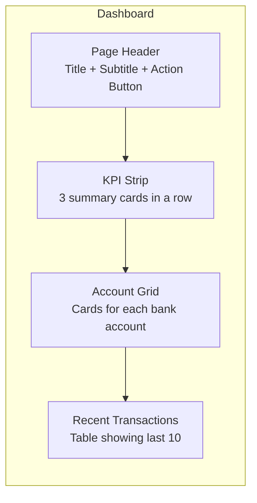
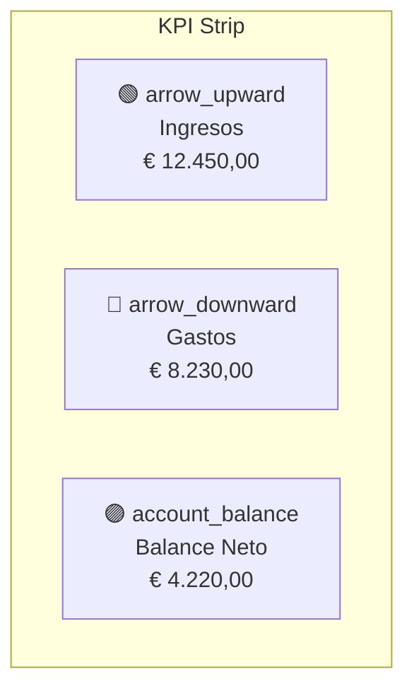
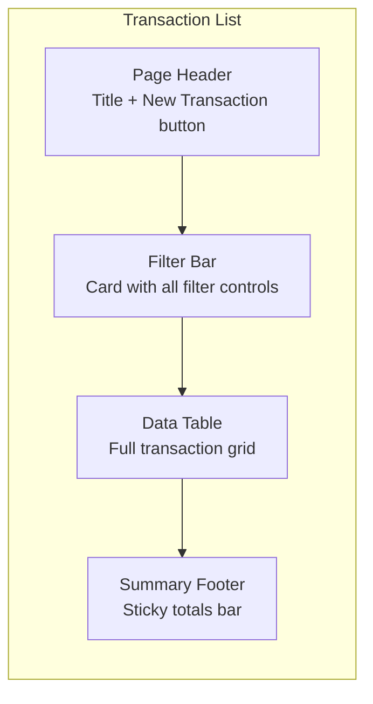
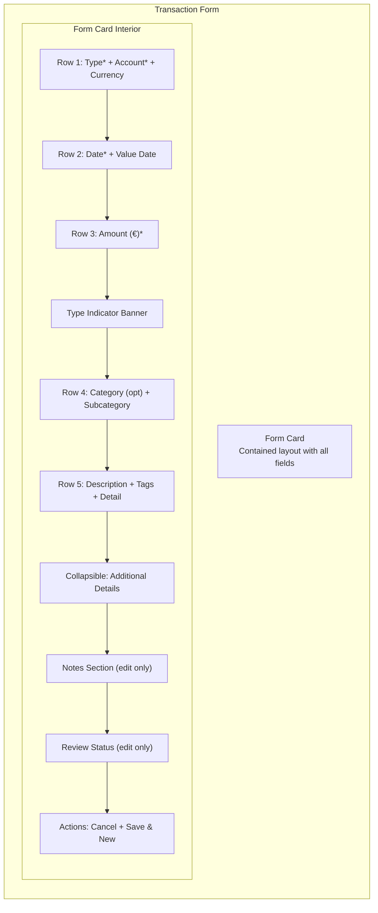
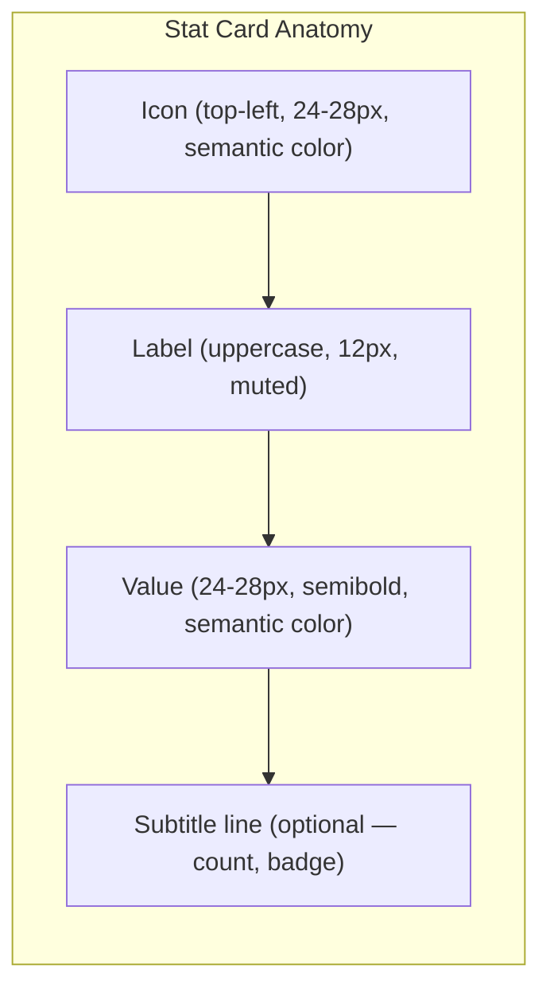
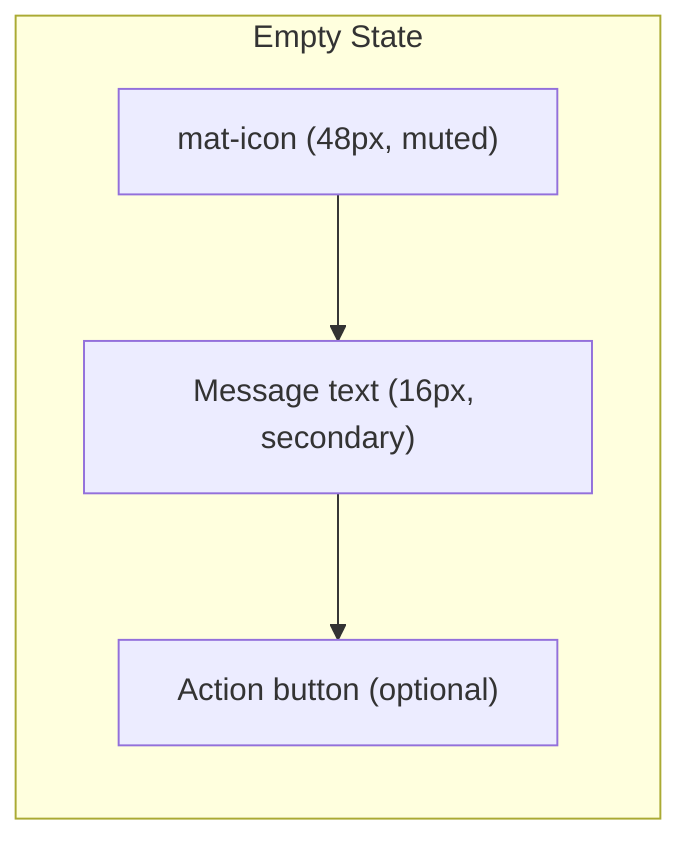

# UI Visual Design Specification

**Version:** 1.0
**Date:** 2026-04-13
**Author:** Mouse (UI Designer)
**Requested by:** Pedro (perocha)
**Status:** Draft — awaiting approval
**Scope:** PoC visual spec for 3 screens: Dashboard, Transaction List, Transaction Form
**Prerequisites:** Phase 1 UX Spec (`phase-1-frontend-ux-spec.md`), PR #51 review findings
**Implements against:** Angular Material 19, Angular 19 standalone components

---

## Table of Contents

1. [Design Token System](#1-design-token-system)
2. [Dashboard Screen](#2-dashboard-screen)
3. [Transaction List Screen](#3-transaction-list-screen)
4. [Transaction Form Screen](#4-transaction-form-screen)
5. [Shared Visual Components](#5-shared-visual-components)
6. [Responsive Strategy](#6-responsive-strategy)
7. [Accessibility Checklist](#7-accessibility-checklist)

---

## 1. Design Token System

All visual values are defined as CSS custom properties on `:root` (light) and `body.theme-dark` (dark). Components MUST reference tokens — never hardcode hex colors, pixel values, or font sizes. This replaces the ad-hoc properties currently scattered across `styles.scss` and component styles.

### 1.1 Brand Palette

The brand color is **Rett awareness violet** (`#6d4d8c`). All brand derivatives are computed from this anchor.

```scss
:root {
  /* ── Brand ─────────────────────────────────────── */
  --brand-primary:       #6d4d8c;   /* Rett violet — anchor */
  --brand-primary-light: #9c7cb5;   /* Lighter violet for hover / accents */
  --brand-primary-muted: #b8a5cc;   /* Soft violet for backgrounds */
  --brand-surface:       #f3edf8;   /* Very light violet tint for panels */
  --brand-surface-hover: #ebe3f1;   /* Hover state on brand-tinted surfaces */
  --brand-on-primary:    #ffffff;   /* Text on --brand-primary */
}

body.theme-dark {
  --brand-primary:       #d2bcff;   /* Lightened violet for dark surfaces */
  --brand-primary-light: #b094d9;
  --brand-primary-muted: #3d2e52;
  --brand-surface:       #251e2e;
  --brand-surface-hover: #2e2639;
  --brand-on-primary:    #1b1225;
}
```

### 1.2 Semantic Colors

Used for transaction types, status indicators, and feedback. Each semantic color has a base (for icons/text), a soft background (for badges/banners), and a contrasting foreground.

```scss
:root {
  /* ── Semantic: Income (green) ──────────────────── */
  --clr-income:          #2e7d32;   /* Icon / text */
  --clr-income-bg:       #e8f5e9;   /* Banner / badge background */
  --clr-income-on-bg:    #1b5e20;   /* Text on income-bg */

  /* ── Semantic: Expense (red) ───────────────────── */
  --clr-expense:         #c62828;   /* Icon / text */
  --clr-expense-bg:      #ffebee;   /* Banner / badge background */
  --clr-expense-on-bg:   #b71c1c;   /* Text on expense-bg */

  /* ── Semantic: Transfer (blue) ─────────────────── */
  --clr-transfer:        #1565c0;   /* Icon / text */
  --clr-transfer-bg:     #e3f2fd;   /* Banner / badge background */
  --clr-transfer-on-bg:  #0d47a1;   /* Text on transfer-bg */

  /* ── Semantic: Refund (teal) ───────────────────── */
  --clr-refund:          #00695c;   /* Icon / text */
  --clr-refund-bg:       #e0f2f1;   /* Banner / badge background */
  --clr-refund-on-bg:    #004d40;   /* Text on refund-bg */

  /* ── Semantic: Warning (amber) ─────────────────── */
  --clr-warning:         #e65100;   /* Icon / text */
  --clr-warning-bg:      #fff3e0;   /* Banner / badge background */
  --clr-warning-on-bg:   #bf360c;   /* Text on warning-bg */

  /* ── Semantic: Info (blue-gray) ────────────────── */
  --clr-info:            #37474f;   /* Icon / text */
  --clr-info-bg:         #eceff1;   /* Banner / badge background */
  --clr-info-on-bg:      #263238;   /* Text on info-bg */

  /* ── Semantic: Success (green, distinct from income) */
  --clr-success:         #388e3c;   /* Snackbar / confirmation */
  --clr-success-bg:      #e8f5e9;
  --clr-success-on-bg:   #1b5e20;

  /* ── Semantic: Error / Danger ──────────────────── */
  --clr-error:           #c62828;
  --clr-error-bg:        #ffebee;
  --clr-error-on-bg:     #b71c1c;
}

body.theme-dark {
  /* Income */
  --clr-income:          #81c784;
  --clr-income-bg:       #1b3a1e;
  --clr-income-on-bg:    #a5d6a7;

  /* Expense */
  --clr-expense:         #ef9a9a;
  --clr-expense-bg:      #3e1a1a;
  --clr-expense-on-bg:   #ef9a9a;

  /* Transfer */
  --clr-transfer:        #90caf9;
  --clr-transfer-bg:     #162a3e;
  --clr-transfer-on-bg:  #90caf9;

  /* Refund */
  --clr-refund:          #80cbc4;
  --clr-refund-bg:       #13302c;
  --clr-refund-on-bg:    #80cbc4;

  /* Warning */
  --clr-warning:         #ffb74d;
  --clr-warning-bg:      #3e2a12;
  --clr-warning-on-bg:   #ffb74d;

  /* Info */
  --clr-info:            #b0bec5;
  --clr-info-bg:         #1f2a30;
  --clr-info-on-bg:      #b0bec5;

  /* Success */
  --clr-success:         #81c784;
  --clr-success-bg:      #1b3a1e;
  --clr-success-on-bg:   #a5d6a7;

  /* Error */
  --clr-error:           #ef9a9a;
  --clr-error-bg:        #3e1a1a;
  --clr-error-on-bg:     #ef9a9a;
}
```

### 1.3 Surface & Background Colors

```scss
:root {
  /* ── Surfaces ──────────────────────────────────── */
  --clr-bg:              #faf8fc;   /* Page background */
  --clr-surface:         #ffffff;   /* Card / panel background */
  --clr-surface-raised:  #ffffff;   /* Elevated card (distinguished by shadow) */
  --clr-surface-panel:   #f8f4fb;   /* Settings panel, sidebar tint */
  --clr-border:          rgba(109, 77, 140, 0.14);  /* Card borders, dividers */
  --clr-divider:         rgba(109, 77, 140, 0.10);  /* Lighter separator */
  --clr-row-hover:       rgba(109, 77, 140, 0.04);  /* Table row hover */
  --clr-row-stripe:      rgba(109, 77, 140, 0.02);  /* Alternating row tint */
}

body.theme-dark {
  --clr-bg:              #100d14;
  --clr-surface:         #1d1723;
  --clr-surface-raised:  #251e2e;
  --clr-surface-panel:   #1d1723;
  --clr-border:          rgba(210, 188, 255, 0.12);
  --clr-divider:         rgba(210, 188, 255, 0.08);
  --clr-row-hover:       rgba(210, 188, 255, 0.06);
  --clr-row-stripe:      rgba(210, 188, 255, 0.03);
}
```

### 1.4 Text Colors

**WCAG AA fix:** `--clr-text-muted` is darkened from PR #51's `#8b8095` (3.7:1) to `#6B6178` (4.58:1 on white). At 12px Roboto this passes AA (4.5:1 threshold at ≥14px bold or ≥18px regular; 4.58:1 at 12px is borderline — we size muted text at 13px minimum).

```scss
:root {
  /* ── Text ──────────────────────────────────────── */
  --clr-text-primary:    #231f27;   /* Body text — 14.8:1 on white */
  --clr-text-secondary:  #4a4453;   /* Subtitles, less emphasis — 7.9:1 */
  --clr-text-muted:      #6B6178;   /* Hints, captions — 4.58:1 */
  --clr-text-disabled:   #a59bae;   /* Disabled controls — 2.8:1 (decorative) */
  --clr-text-inverse:    #f4eef7;   /* Text on dark / brand surfaces */
  --clr-text-link:       #5e35b1;   /* Hyperlinks — 7.0:1 */
}

body.theme-dark {
  --clr-text-primary:    #f4eef7;   /* 15.2:1 on #1d1723 */
  --clr-text-secondary:  #c4b8d0;   /* 7.1:1 */
  --clr-text-muted:      #9e90ab;   /* 4.6:1 */
  --clr-text-disabled:   #6b5f77;   /* 2.5:1 (decorative) */
  --clr-text-inverse:    #231f27;
  --clr-text-link:       #b39ddb;   /* 5.4:1 on #1d1723 */
}
```

### 1.5 Review Status Colors

These are used for review status badges. All pass WCAG AA on their respective backgrounds.

```scss
:root {
  /* ── Status: Review ────────────────────────────── */
  --status-pending:         #e65100;   /* Orange text */
  --status-pending-bg:      #fff3e0;   /* 4.6:1 text-on-bg */
  --status-reviewed:        #1565c0;   /* Blue text */
  --status-reviewed-bg:     #e3f2fd;   /* 5.2:1 */
  --status-approved:        #2e7d32;   /* Green text */
  --status-approved-bg:     #e8f5e9;   /* 4.8:1 */
  --status-flagged:         #c62828;   /* Red text */
  --status-flagged-bg:      #ffebee;   /* 5.6:1 */
}

body.theme-dark {
  --status-pending:         #ffb74d;
  --status-pending-bg:      #3e2a12;
  --status-reviewed:        #90caf9;
  --status-reviewed-bg:     #162a3e;
  --status-approved:        #81c784;
  --status-approved-bg:     #1b3a1e;
  --status-flagged:         #ef9a9a;
  --status-flagged-bg:      #3e1a1a;
}
```

### 1.6 Elevation (Box Shadows)

Standardized shadow scale. Angular Material provides its own elevation, but for custom cards and panels we use these tokens.

```scss
:root {
  /* ── Elevation ─────────────────────────────────── */
  --elev-card:       0 1px 3px rgba(109, 77, 140, 0.08),
                     0 1px 2px rgba(109, 77, 140, 0.06);
  --elev-card-hover: 0 4px 12px rgba(109, 77, 140, 0.12),
                     0 2px 4px rgba(109, 77, 140, 0.08);
  --elev-fab:        0 6px 16px rgba(109, 77, 140, 0.20),
                     0 2px 6px rgba(109, 77, 140, 0.10);
  --elev-dropdown:   0 8px 24px rgba(109, 77, 140, 0.16),
                     0 2px 8px rgba(109, 77, 140, 0.08);
  --elev-dialog:     0 12px 40px rgba(109, 77, 140, 0.24),
                     0 4px 12px rgba(109, 77, 140, 0.12);
}

body.theme-dark {
  --elev-card:       0 1px 3px rgba(0, 0, 0, 0.30),
                     0 1px 2px rgba(0, 0, 0, 0.20);
  --elev-card-hover: 0 4px 12px rgba(0, 0, 0, 0.40),
                     0 2px 4px rgba(0, 0, 0, 0.25);
  --elev-fab:        0 6px 16px rgba(0, 0, 0, 0.50),
                     0 2px 6px rgba(0, 0, 0, 0.30);
  --elev-dropdown:   0 8px 24px rgba(0, 0, 0, 0.50),
                     0 2px 8px rgba(0, 0, 0, 0.30);
  --elev-dialog:     0 12px 40px rgba(0, 0, 0, 0.60),
                     0 4px 12px rgba(0, 0, 0, 0.35);
}
```

### 1.7 Border Radius

Standardized to **one** radius scale. No mixing 16px and 18px as PR #51 did. Cards use 12px, small chips use 6px, pills use 16px (full rounding).

```scss
:root {
  /* ── Radii ─────────────────────────────────────── */
  --rad-xs:    4px;    /* Inputs, small controls */
  --rad-sm:    6px;    /* Chips, badges */
  --rad-md:    8px;    /* Buttons */
  --rad-lg:    12px;   /* Cards, dialogs */
  --rad-pill:  16px;   /* Tag pills, fully rounded */
  --rad-round: 50%;    /* Circular (avatar, icon button) */
}
```

### 1.8 Spacing Scale

8px base grid with additions at 12px and 20px for finer control. Every hardcoded pixel value in component styles should map to one of these.

```scss
:root {
  /* ── Spacing ───────────────────────────────────── */
  --spc-2:    2px;
  --spc-4:    4px;
  --spc-6:    6px;
  --spc-8:    8px;
  --spc-10:   10px;
  --spc-12:   12px;
  --spc-16:   16px;
  --spc-20:   20px;
  --spc-24:   24px;
  --spc-32:   32px;
  --spc-40:   40px;
  --spc-48:   48px;
  --spc-64:   64px;
}
```

### 1.9 Typography Scale

All font sizes as tokens. The app uses Roboto. Sizes are paired with line-heights and weights for common use cases.

```scss
:root {
  /* ── Typography: Sizes ─────────────────────────── */
  --font-xs:     11px;   /* Badges, micro labels */
  --font-sm:     12px;   /* Section labels, uppercase headers */
  --font-body:   14px;   /* Default body text, table cells */
  --font-md:     16px;   /* Input text, subtitles */
  --font-lg:     20px;   /* Card titles, section headers */
  --font-xl:     24px;   /* Page titles (h1) */
  --font-2xl:    28px;   /* KPI amounts, hero numbers */
  --font-3xl:    34px;   /* Large display (unused in PoC) */

  /* ── Typography: Weights ───────────────────────── */
  --fw-regular:  400;
  --fw-medium:   500;
  --fw-semibold: 600;
  --fw-bold:     700;

  /* ── Typography: Line heights ──────────────────── */
  --lh-tight:    1.2;    /* Headings, KPI numbers */
  --lh-normal:   1.5;    /* Body text */
  --lh-relaxed:  1.6;    /* Descriptions, notes */

  /* ── Typography: Letter spacing ────────────────── */
  --ls-section:  0.08em; /* Uppercase section labels */
}
```

### 1.10 Transitions

```scss
:root {
  /* ── Transitions ───────────────────────────────── */
  --transition-fast:   120ms ease-out;   /* Hover color, opacity */
  --transition-normal: 200ms ease-out;   /* Card hover lift, expand */
  --transition-slow:   350ms ease-in-out; /* Panel slide, collapse */
}
```

> `body.reduced-motion` already sets all `transition-duration: 0.01ms`. These tokens are silently overridden by that class.

### 1.11 Focus Ring

```scss
:root {
  /* ── Focus ─────────────────────────────────────── */
  --focus-ring:       0 0 0 3px rgba(109, 77, 140, 0.40);
  --focus-ring-inset: inset 0 0 0 2px var(--brand-primary);
}

body.theme-dark {
  --focus-ring:       0 0 0 3px rgba(210, 188, 255, 0.40);
}
```

### 1.12 Z-Index Scale

```scss
:root {
  /* ── Z-index ───────────────────────────────────── */
  --z-base:       0;
  --z-dropdown:   100;
  --z-sticky:     200;    /* Sticky table headers, summary footer */
  --z-toolbar:    300;    /* App toolbar */
  --z-sidenav:    400;    /* Sidenav overlay on mobile */
  --z-dialog:     500;    /* MatDialog backdrop + panel */
  --z-snackbar:   600;    /* Snackbar toast */
  --z-tooltip:    700;    /* Tooltip overlay */
  --z-fab:        250;    /* FAB floats above content, below nav */
}
```

### 1.13 Token Migration Notes

These tokens replace the following existing patterns:

| Current pattern | Replacement |
|----------------|-------------|
| `background-color: #faf8fc` | `var(--clr-bg)` |
| `color: #231f27` | `var(--clr-text-primary)` |
| `--app-panel-bg: #f8f4fb` | `var(--clr-surface-panel)` |
| `--app-muted: #6f6674` | `var(--clr-text-muted)` |
| `color: #81c784` (income) | `var(--clr-income)` |
| `color: #e57373` (expense) | `var(--clr-expense)` |
| `color: #9c7cb5` (net icon) | `var(--brand-primary-light)` |
| `color: #333` (heading) | `var(--clr-text-primary)` |
| Hardcoded `rgba(0, 0, 0, 0.04)` for hover | `var(--clr-row-hover)` |
| Inline `style.color` for type icons | CSS classes `.type-income`, `.type-expense`, etc. |

**Critical PR #51 fix:** The `typeIconColor()` method that returns hardcoded hex strings as inline styles MUST be replaced with CSS classes that reference tokens. This enables dark mode support.

```scss
/* Replace inline style="color: #4caf50" with: */
.type-income   { color: var(--clr-income); }
.type-expense  { color: var(--clr-expense); }
.type-transfer { color: var(--clr-transfer); }
.type-refund   { color: var(--clr-refund); }
```

---

## 2. Dashboard Screen

The dashboard is the landing page. It provides at-a-glance financial overview for the current month.

### 2.1 Layout Overview



### 2.2 Page Header

| Element | Spec |
|---------|------|
| Container | `.page-header` flex row, `align-items: center`, `margin-bottom: var(--spc-24)` |
| Title | "Panel" / "Dashboard" — `font-size: var(--font-xl)`, `font-weight: var(--fw-regular)`, `color: var(--clr-text-primary)` |
| Subtitle | Current month/year e.g. "Abril 2026" — `font-size: var(--font-body)`, `color: var(--clr-text-muted)`, `margin-left: var(--spc-12)` |
| Action button | "Nuevo Movimiento" — `mat-flat-button` with `color="primary"`, right-aligned via `flex: spacer`. Visible only for Admin role. Icon: `add` |

### 2.3 KPI Strip — Monthly Summary Cards

3 cards in a grid: **Income**, **Expenses**, **Net**.



**Card anatomy (Stat Card — reusable component, see §5.1):**

| Element | Spec |
|---------|------|
| Card container | `mat-card`, `border-radius: var(--rad-lg)`, `box-shadow: var(--elev-card)`, `padding: var(--spc-20)`, `transition: box-shadow var(--transition-normal)` |
| Card hover | `box-shadow: var(--elev-card-hover)`, `transform: translateY(-1px)` |
| Icon | `mat-icon`, `font-size: 28px`, positioned top-left in card |
| Icon colors | Income: `var(--clr-income)`, Expense: `var(--clr-expense)`, Net: `var(--brand-primary-light)` |
| Label | `font-size: var(--font-sm)`, `font-weight: var(--fw-bold)`, `letter-spacing: var(--ls-section)`, `text-transform: uppercase`, `color: var(--clr-text-muted)` |
| Amount | `font-size: var(--font-2xl)`, `font-weight: var(--fw-semibold)`, `line-height: var(--lh-tight)`, `margin-top: var(--spc-12)` |
| Amount color | Income: `var(--clr-income)`, Expense: `var(--clr-expense)`, Net: `var(--clr-text-primary)` (or `var(--clr-expense)` if negative) |

**Edge cases:**
- **Amount is €0.00:** Display normally as `€ 0,00` — no special treatment, text color stays the label's semantic color.
- **Net is negative:** Amount text switches to `var(--clr-expense)` and value displays with minus sign: `€ -1.200,00`.
- **Loading state:** Amount area shows a skeleton shimmer bar (48px × 12px), icon pulses at 50% opacity. See §5.5 for skeleton spec.

**Grid layout:**
- Desktop: `grid-template-columns: repeat(3, 1fr)`, `gap: var(--spc-16)`
- Tablet: `repeat(3, 1fr)` — cards compress but stay side-by-side
- Mobile: `repeat(1, 1fr)` — cards stack vertically

### 2.4 Account Grid

Cards for each bank account showing name, transaction count, and net balance for the current month.

**Card anatomy:**

| Element | Spec |
|---------|------|
| Card container | `mat-card`, `border-radius: var(--rad-lg)`, `box-shadow: var(--elev-card)`, `padding: var(--spc-16)`, `cursor: pointer` |
| Card hover | `box-shadow: var(--elev-card-hover)`, `transform: translateY(-1px)` — click navigates to filtered transaction list |
| Icon | `mat-icon` `account_balance` (bank) or `payments` (PayPal) — `color: var(--brand-primary-light)`, `font-size: 24px` |
| Account name | `font-size: var(--font-md)`, `font-weight: var(--fw-medium)`, `color: var(--clr-text-primary)` |
| Transaction count | `font-size: var(--font-sm)`, `color: var(--clr-text-muted)` — e.g. "12 movimientos" |
| Currency badge | `mat-chip` appearance, `font-size: var(--font-xs)`, `background: var(--brand-surface)`, `color: var(--brand-primary)`, `border-radius: var(--rad-sm)`, `padding: var(--spc-2) var(--spc-6)` |
| Net balance | `font-size: var(--font-lg)`, `font-weight: var(--fw-semibold)`, color follows sign: positive = `var(--clr-income)`, negative = `var(--clr-expense)`, zero = `var(--clr-text-secondary)` |

**Grid layout:**
- Desktop: `grid-template-columns: repeat(auto-fill, minmax(280px, 1fr))`, `gap: var(--spc-16)`
- Tablet: `minmax(240px, 1fr)`
- Mobile: single column

**Empty state:** If no accounts are configured, show the **Empty State** component (§5.4):
- Icon: `account_balance_wallet`
- Message: "No hay cuentas configuradas" / "No accounts configured"
- Action button: "Crear cuenta" / "Create account" — navigates to `/accounts`

**Section label:** "Cuentas" / "Account Balances" — styled as a section title (§5.8).

### 2.5 Recent Transactions Table

A table-in-card showing the last 10 transactions across all accounts for the current month.

**Card treatment:**

| Element | Spec |
|---------|------|
| Container | `mat-card`, `border-radius: var(--rad-lg)`, `box-shadow: var(--elev-card)`, `overflow: hidden` (table edges hug card radius) |
| Section header | Inside card, `padding: var(--spc-16) var(--spc-20)`, "Movimientos recientes" / "Recent Transactions" styled as section title, with "Ver todo →" link right-aligned |
| "Ver todo" link | `font-size: var(--font-sm)`, `color: var(--clr-text-link)`, `cursor: pointer`, navigates to `/transactions` |

**Table columns (simplified for dashboard — fewer than full list):**

| Column | Width | Content |
|--------|-------|---------|
| Type | 40px | Colored icon (same as transaction list §3) |
| Date | 90px | `dd/MM/yyyy`, `font-size: var(--font-body)` |
| Account | 120px | Account label, truncated with ellipsis |
| Description | flex | `bankDescription`, truncated |
| Amount | 100px | Right-aligned, signed, color-coded: positive = `var(--clr-income)`, negative = `var(--clr-expense)` |

**Row behavior:**
- Hover: `background-color: var(--clr-row-hover)`, `cursor: pointer`
- Click: navigate to edit form for that transaction
- Even/odd striping: NOT applied on dashboard (keep it clean)

**Empty state:** "No hay movimientos este mes" / "No transactions this month" — centered in card with `schedule` icon.

**"View All" link:** Right side of section header, standard link style.

---

## 3. Transaction List Screen

The primary work screen. María spends most of her time here filtering and reviewing transactions.

### 3.1 Layout Overview



### 3.2 Page Header

Same pattern as Dashboard header:
- Title: "Movimientos" / "Transactions"
- Action: "Nuevo Movimiento" / "New Transaction" — `mat-flat-button`, `color="primary"`, Admin only

### 3.3 Filter Bar

A `mat-card` containing all filter controls in two rows.

**Card treatment:**
- `border-radius: var(--rad-lg)`, `box-shadow: var(--elev-card)`, `padding: var(--spc-16) var(--spc-20)`
- `margin-bottom: var(--spc-16)`

**Row 1 — Primary filters:**

| Field | Type | Width |
|-------|------|-------|
| Year | `mat-select` | 100px |
| Month | `mat-select` | 140px |
| Account | `mat-select` | 180px |
| Category | `mat-select` | 180px |
| Subcategory | `mat-select` | 180px |
| Tag | `mat-select` (multi) | 160px |
| Transaction Type | `mat-select` | 160px |

**Row 2 — Secondary filters:**

| Field | Type | Width |
|-------|------|-------|
| Search | `mat-form-field` (text input), icon `search` | flex (fills remaining space) |
| Min Amount | `mat-form-field` (number) | 120px |
| Max Amount | `mat-form-field` (number) | 120px |
| Categorization | `mat-select` | 160px |
| Review Status | `mat-select` | 140px |

**Filter field appearance:**
- All use `appearance="outline"`
- `font-size: var(--font-body)`
- Label: `color: var(--clr-text-muted)` (Angular Material default handles this via the theme)

**Row layout:**
- Desktop: `display: flex`, `flex-wrap: wrap`, `gap: var(--spc-12)`
- Each field uses its specified width plus `flex-shrink: 0`
- Rows separate with `margin-top: var(--spc-12)` between Row 1 and Row 2

**Responsive wrapping behavior:**
- Tablet: fields wrap naturally (flex-wrap), roughly 4-5 per visual row
- Mobile: fields stack with `flex-basis: 100%` (full-width each). Secondary filters (Row 2) collapse into a `mat-expansion-panel` labeled "Más filtros" / "More filters", defaulting to collapsed.

### 3.4 Data Table

**Card treatment:** Same as recent transactions — `mat-card` with `border-radius: var(--rad-lg)`, table overflows hidden.

**Columns:**

| # | Column | Width | Alignment | Content Spec |
|---|--------|-------|-----------|-------------|
| 1 | Type | 48px | Center | Type icon (see below) |
| 2 | Date | 100px | Left | `dd/MM/yyyy`, `font-size: var(--font-body)`, `color: var(--clr-text-primary)` |
| 3 | Account | 140px | Left | Account label, `font-size: var(--font-body)`, truncate with ellipsis |
| 4 | Description | flex | Left | `bankDescription` (fallback to `detail`), `font-size: var(--font-body)`, truncate with ellipsis, `max-width: 300px` |
| 5 | Category | 160px | Left | Category name or uncategorized badge (see below) |
| 6 | Tags | 140px | Left | Tag pills (see below) |
| 7 | Amount | 110px | Right | Signed amount, color-coded, `font-weight: var(--fw-medium)`, `font-variant-numeric: tabular-nums` |
| 8 | Status | 80px | Center | Stacked status badges (see below) |
| 9 | Actions | 80px | Center | Icon buttons: `edit`, `delete` |

**Type icon column:**

Use CSS classes (not inline styles) to color icons:

| `transactionType` | Icon | CSS class | Token |
|-------------------|------|-----------|-------|
| `income` | `arrow_upward` | `.type-income` | `var(--clr-income)` |
| `expense` | `arrow_downward` | `.type-expense` | `var(--clr-expense)` |
| `transfer` | `swap_horiz` | `.type-transfer` | `var(--clr-transfer)` |
| `refund` | `replay` | `.type-refund` | `var(--clr-refund)` |

Icon size: 20px. Tooltip provides full text (e.g. "Ingreso" / "Income").

**Category column — uncategorized row treatment:**
- When `categoryId` is null:
  - Text: "Sin categorizar" / "Uncategorized" in `font-style: italic`, `color: var(--clr-text-muted)`
  - Inline button: `mat-icon-button` with `label` icon, `font-size: 16px`, `color: var(--brand-primary)` — opens quick-categorize dialog
- Row highlight: the ENTIRE row gets a subtle left border: `border-left: 3px solid var(--clr-warning)` to draw attention
- When category IS set: display category name normally, no special treatment

**Tag pills:**

| Property | Spec |
|----------|------|
| Shape | `border-radius: var(--rad-pill)` |
| Size | `font-size: var(--font-xs)`, `padding: var(--spc-2) var(--spc-8)`, `height: 22px` |
| Background | `var(--brand-surface)` |
| Text color | `var(--brand-primary)` |
| Max visible | 2 pills shown. If more exist, show "+N" pill with `background: var(--clr-text-muted)`, `color: var(--clr-text-inverse)` |
| Max width per pill | 80px, `text-overflow: ellipsis`, `overflow: hidden`, `white-space: nowrap` |
| Gap between pills | `var(--spc-4)` |
| Hover | Full tag text in `matTooltip` |

**Status column — stacked badges:**

Each cell can show up to 2 small badges stacked vertically:

1. **Review status badge** (always shown):

| Status | Abbr | Text color | Background | Icon |
|--------|------|------------|------------|------|
| `pending` | P | `var(--status-pending)` | `var(--status-pending-bg)` | `schedule` |
| `reviewed` | R | `var(--status-reviewed)` | `var(--status-reviewed-bg)` | `visibility` |
| `approved` | A | `var(--status-approved)` | `var(--status-approved-bg)` | `check_circle` |
| `flagged` | F | `var(--status-flagged)` | `var(--status-flagged-bg)` | `flag` |

Badge spec: `font-size: var(--font-xs)`, `padding: var(--spc-2) var(--spc-6)`, `border-radius: var(--rad-sm)`, `font-weight: var(--fw-bold)`, `display: inline-flex`, `align-items: center`, `gap: var(--spc-4)`.

2. **Categorization badge** (only when uncategorized):
   - `○ SC` text, `color: var(--clr-text-muted)`, `background: transparent`, `border: 1px solid var(--clr-border)`, same sizing as status badges

**Amount column:**
- Positive: `color: var(--clr-income)`
- Negative: `color: var(--clr-expense)`
- Transfer: `color: var(--clr-transfer)`
- Refund: `color: var(--clr-refund)`
- Format: `€ 1.234,56` with `font-variant-numeric: tabular-nums` for column alignment

**Row behavior:**
- Hover: `background-color: var(--clr-row-hover)`, `transition: background-color var(--transition-fast)`
- Click (on row, not action buttons): navigate to edit form
- `cursor: pointer` on entire row

**Delete confirmation:**
- `MatDialog` with `width: 360px`
- Title: "¿Eliminar movimiento?" / "Delete transaction?"
- Body shows transaction summary (date, amount, description)
- Actions: "Cancelar" / "Cancel" (text button) + "Eliminar" / "Delete" (`mat-flat-button`, `color="warn"`)

**Sorting affordance:**
- Clickable column headers for Date, Account, Amount
- `mat-sort-header` from Angular Material
- Arrow icon visible on active sort column
- Default sort: Date descending

### 3.5 Summary Footer

A sticky bottom bar showing aggregated totals for the current filtered view.

| Element | Spec |
|---------|------|
| Container | `position: sticky`, `bottom: 0`, `z-index: var(--z-sticky)`, `background: var(--clr-surface)`, `border-top: 1px solid var(--clr-border)`, `padding: var(--spc-12) var(--spc-20)` |
| Layout | `display: flex`, `flex-wrap: wrap`, `gap: var(--spc-24)`, `align-items: center` |
| Income total | Label "Ingresos:" `var(--clr-text-muted)` + amount in `var(--clr-income)`, `font-weight: var(--fw-semibold)` |
| Expense total | Label "Gastos:" + amount in `var(--clr-expense)`, `font-weight: var(--fw-semibold)` |
| Net total | Label "Neto:" + amount in `var(--clr-text-primary)` (or `var(--clr-expense)` if negative), `font-weight: var(--fw-bold)` |
| Transfer total | Label "Transferencias:" + amount in `var(--clr-transfer)` — only shown if transfers exist in filtered set |
| Uncategorized count | "N sin categorizar" in `var(--status-pending)` — only shown if count > 0 |
| Transaction count | Right-side, `color: var(--clr-text-muted)`, `font-size: var(--font-sm)` — e.g. "42 movimientos" |

**Responsive:**
- Desktop: all items fit on one line
- Tablet: wraps to 2 lines (gap handles spacing)
- Mobile: stacks vertically, `flex-direction: column`, `align-items: flex-start`

---

## 4. Transaction Form Screen

The form for creating and editing transactions. Follows Niobe's UX spec (§2) with added visual detail.

### 4.1 Layout Overview



### 4.2 Form Card Container

| Property | Spec |
|----------|------|
| Max width | `640px` |
| Margin | `0 auto` (centered) |
| Padding | `var(--spc-24) var(--spc-32)` |
| Background | `var(--clr-surface)` |
| Border radius | `var(--rad-lg)` |
| Shadow | `var(--elev-card)` |
| Title | "Nuevo Movimiento" or "Editar Movimiento" — `font-size: var(--font-xl)`, `font-weight: var(--fw-regular)`, `margin-bottom: var(--spc-24)` |

### 4.3 Form Grid

Rows use a grid system:

```scss
.form-row {
  display: grid;
  gap: var(--spc-16);
  margin-bottom: var(--spc-16);
}

.form-row.three-col { grid-template-columns: 1fr 1fr auto; }
.form-row.two-col   { grid-template-columns: 1fr 1fr; }
.form-row.full-width { grid-template-columns: 1fr; }
```

**Responsive (mobile <768px):** All form rows become `grid-template-columns: 1fr` (single column stacking).

### 4.4 Transaction Type Selector

| Property | Spec |
|----------|------|
| Position | Row 1, first field (left column of three-col) |
| Component | `mat-select`, `appearance="outline"` |
| Label | "Tipo de movimiento *" / "Transaction type *" |
| Required | Yes (red asterisk) |
| Default | None selected |
| Width | `1fr` |
| Icon per option | Optional small icons in dropdown: `arrow_upward`, `arrow_downward`, `swap_horiz`, `replay` with respective semantic colors |

### 4.5 Type Indicator Banner

A full-width banner below the amount field that confirms the transaction direction. **This replaces category-driven banners from v1.**

| Type Display | Background | Text Color | Border-left |
|-------------|------------|------------|-------------|
| Income | `var(--clr-income-bg)` | `var(--clr-income-on-bg)` | `3px solid var(--clr-income)` |
| Expense | `var(--clr-expense-bg)` | `var(--clr-expense-on-bg)` | `3px solid var(--clr-expense)` |
| Transfer In | `var(--clr-transfer-bg)` | `var(--clr-transfer-on-bg)` | `3px solid var(--clr-transfer)` |
| Transfer Out | `var(--clr-transfer-bg)` | `var(--clr-transfer-on-bg)` | `3px solid var(--clr-transfer)` |
| Refund Received | `var(--clr-refund-bg)` | `var(--clr-refund-on-bg)` | `3px solid var(--clr-refund)` |
| Refund Given | `var(--clr-refund-bg)` | `var(--clr-refund-on-bg)` | `3px solid var(--clr-refund)` |
| None selected | Hidden (`*ngIf`) | — | — |

**Banner spec:**
- `border-radius: var(--rad-sm)`
- `padding: var(--spc-10) var(--spc-16)`
- `font-size: var(--font-body)`
- `font-weight: var(--fw-medium)`
- `margin: var(--spc-4) 0 var(--spc-16) 0`
- Icon (↑, ↓, ↔, ↩) is part of the text string
- `transition: background-color var(--transition-normal), color var(--transition-normal)` (smooth change when type toggles)

### 4.6 Amount Field

| Property | Spec |
|----------|------|
| Prefix | `€` — styled as `matPrefix`, `font-size: var(--font-lg)`, `color: var(--clr-text-muted)`, `padding-right: var(--spc-8)` |
| Input text | `font-size: var(--font-lg)`, `font-weight: var(--fw-medium)`, `font-variant-numeric: tabular-nums` |
| Alignment | Left-aligned (not right — user is entering, not reading) |
| Min value | `0.01` (no negatives, type handles sign) |
| Hint text | None needed — the type indicator banner explains direction |

### 4.7 Category Field — Optional Treatment

| Property | Spec |
|----------|------|
| Label | "Categoría (opcional)" / "Category (optional)" — the "(opcional)" text is part of the `mat-label` |
| No asterisk | Remove `required` — field is not required |
| First option | "— Sin categorizar —" / "— Uncategorized —" with `value: null` |
| Clear affordance | The uncategorized option serves as the clear button |
| Filtering | Dropdown options filtered by `transactionType` (income → income categories only; expense → expense; transfer/refund → all) |

### 4.8 Collapsible Additional Details

Uses `mat-expansion-panel`:

| Property | Spec |
|----------|------|
| Panel header | "Detalles adicionales" / "Additional details", `font-size: var(--font-body)`, `color: var(--clr-text-secondary)` |
| Panel background | `var(--clr-surface)` (matches form card — seamless) |
| Panel border | `1px solid var(--clr-border)`, `border-radius: var(--rad-md)` |
| Expanded padding | `var(--spc-16)` |
| Fields inside | two-col grid: Counterparty Name + Counterparty Reference, then full-width Source Reference |
| Auto-expand | If any of these three fields have values (edit mode), panel opens automatically |

### 4.9 Notes Section (Edit Mode Only)

Hidden in create mode. Shown when editing an existing transaction.

**Section header:**
- "Notas (N)" / "Notes (N)" — `font-size: var(--font-md)`, `font-weight: var(--fw-medium)`, `color: var(--clr-text-primary)`
- `margin-top: var(--spc-24)`, `margin-bottom: var(--spc-12)`

**Note card (read-only):**

| Property | Spec |
|----------|------|
| Container | `border-radius: var(--rad-md)`, `background: var(--clr-surface-panel)`, `padding: var(--spc-12) var(--spc-16)`, `margin-bottom: var(--spc-8)` |
| Author + date | `font-size: var(--font-sm)`, `color: var(--clr-text-muted)`, `margin-bottom: var(--spc-4)` — format: "Demo Admin · 15/03/2026 10:30" |
| Note text | `font-size: var(--font-body)`, `color: var(--clr-text-primary)`, `line-height: var(--lh-relaxed)` |
| Sort order | Newest first |

**Add-note input:**

| Property | Spec |
|----------|------|
| Input | `mat-form-field` with `appearance="outline"`, `textarea`, 2 rows |
| Placeholder | "Escribir una nota..." / "Write a note..." |
| Button | "Añadir" / "Add" — `mat-flat-button`, `color="primary"`, disabled when textarea is empty |
| Layout | Input takes `flex: 1`, button beside it at `align-self: flex-end` |

### 4.10 Review Status Section (Edit Mode Only)

| Property | Spec |
|----------|------|
| Container | `display: flex`, `align-items: center`, `gap: var(--spc-12)`, `margin-top: var(--spc-24)`, `padding: var(--spc-16)`, `background: var(--clr-surface-panel)`, `border-radius: var(--rad-md)` |
| Label | "Revisión:" / "Review:" — `font-size: var(--font-body)`, `color: var(--clr-text-secondary)` |
| Status chip | Same badge spec as status column (§3.4), but slightly larger: `font-size: var(--font-sm)`, `padding: var(--spc-4) var(--spc-10)` |
| Change control | `mat-select` inline, `appearance="outline"`, `width: 160px`, labeled "Cambiar" / "Change". Admin only — hidden for Viewer role |
| Last reviewed by | Below the main line: `font-size: var(--font-sm)`, `color: var(--clr-text-muted)` — "Última revisión: María García · 16/03/2026" |

### 4.11 Actions Bar

| Property | Spec |
|----------|------|
| Container | `display: flex`, `justify-content: flex-end`, `gap: var(--spc-12)`, `margin-top: var(--spc-32)`, `padding-top: var(--spc-16)`, `border-top: 1px solid var(--clr-divider)` |
| Cancel | `mat-stroked-button` — "Cancelar" / "Cancel" |
| Save & New (create) | `mat-flat-button`, `color="primary"` — "Guardar y Nuevo" / "Save & New" |
| Save (edit) | `mat-flat-button`, `color="primary"` — "Actualizar" / "Update" |
| Keyboard hint | Small text below buttons: `Ctrl+Enter para guardar` / `Ctrl+Enter to save`, `font-size: var(--font-xs)`, `color: var(--clr-text-muted)` |

---

## 5. Shared Visual Components

Reusable patterns used across all three screens. Each is a visual specification for consistent styling.

### 5.1 Stat Card (KPI Card / Account Card)



| Property | Token |
|----------|-------|
| Background | `var(--clr-surface)` |
| Border radius | `var(--rad-lg)` |
| Shadow | `var(--elev-card)` → `var(--elev-card-hover)` on hover |
| Padding | `var(--spc-20)` |
| Hover effect | `translateY(-1px)`, shadow lift, `transition: all var(--transition-normal)` |
| Internal spacing | `var(--spc-8)` between icon and label, `var(--spc-12)` between label and value |

### 5.2 Data Table

Standard table styling applied to all `mat-table` instances:

| Property | Token |
|----------|-------|
| Container | Inside `mat-card` with `overflow: hidden` |
| Header row | `background: var(--brand-surface)`, `font-weight: var(--fw-bold)`, `font-size: var(--font-sm)`, `text-transform: uppercase`, `letter-spacing: var(--ls-section)`, `color: var(--clr-text-muted)` |
| Body cell | `font-size: var(--font-body)`, `color: var(--clr-text-primary)`, `padding: var(--spc-10) var(--spc-12)` |
| Row hover | `background: var(--clr-row-hover)` |
| Row border | `1px solid var(--clr-divider)` bottom border on each row |
| Text overflow | `white-space: nowrap`, `overflow: hidden`, `text-overflow: ellipsis` on description / account columns |
| Column alignment | Amount / numbers: `text-align: right`. Actions / status / type: `text-align: center`. All others: left. |
| Sort header | `mat-sort-header`: subtle arrow icon, active column highlighted with `color: var(--brand-primary)` |
| Pagination | `mat-paginator` below table if >50 rows, same card background |

### 5.3 Status Badge

Pill-shaped badge used for review status and categorization indicators.

| Property | Token |
|----------|-------|
| Shape | `display: inline-flex`, `align-items: center`, `gap: var(--spc-4)` |
| Size | `font-size: var(--font-xs)`, `padding: var(--spc-2) var(--spc-6)`, `line-height: 1` |
| Border radius | `var(--rad-sm)` |
| Font weight | `var(--fw-bold)` |
| Icon | Optional `mat-icon` at 12px inside the badge |

Status color mapping uses the `--status-*` tokens defined in §1.5.

### 5.4 Empty State

Centered message shown when a list or section has no data.



| Property | Token |
|----------|-------|
| Container | `display: flex`, `flex-direction: column`, `align-items: center`, `padding: var(--spc-48)`, `text-align: center` |
| Icon | `mat-icon`, `font-size: 48px`, `width: 48px`, `height: 48px`, `color: var(--clr-text-disabled)`, `margin-bottom: var(--spc-16)` |
| Message | `font-size: var(--font-md)`, `color: var(--clr-text-secondary)`, `max-width: 280px` |
| Action button | `mat-stroked-button`, `color="primary"`, `margin-top: var(--spc-16)` |

### 5.5 Loading State

Two variants:

**Spinner (default):**
- `mat-spinner` centered in the component's content area
- Container: `display: flex`, `justify-content: center`, `padding: var(--spc-48)`
- Spinner diameter: `40px`
- Color: uses Angular Material theme primary (brand violet)

**Skeleton shimmer (KPI cards, table rows):**
- Animated placeholder bars where content will appear
- Background: `var(--clr-border)` with a shimmer gradient animation
- Height matches the text line it replaces (e.g., 28px for amount, 14px for body text)
- Border radius: `var(--rad-xs)`
- Animation: left-to-right shimmer, `1.5s infinite`
- Disabled when `body.reduced-motion` is active (animation duration set to 0)

### 5.6 Error State

Inline error card shown when a data fetch fails.

| Property | Token |
|----------|-------|
| Container | `mat-card`, `border-left: 4px solid var(--clr-error)`, `padding: var(--spc-16)`, `border-radius: var(--rad-md)` |
| Background | `var(--clr-error-bg)` |
| Icon | `error_outline`, `color: var(--clr-error)`, `font-size: 24px` |
| Message | `font-size: var(--font-body)`, `color: var(--clr-error-on-bg)` — generic user-friendly message (never expose raw error) |
| Retry button | `mat-stroked-button` — "Reintentar" / "Retry", aligned right |
| Layout | `display: flex`, `align-items: center`, `gap: var(--spc-12)` |

### 5.7 Tag Pill

Compact pill for displaying tags in lists and forms.

| Property | Token |
|----------|-------|
| Shape | `border-radius: var(--rad-pill)` |
| Background | `var(--brand-surface)` |
| Text | `var(--brand-primary)`, `font-size: var(--font-xs)`, `font-weight: var(--fw-medium)` |
| Padding | `var(--spc-2) var(--spc-8)` |
| Height | `22px` |
| Max width | `80px` (truncate with ellipsis + tooltip) |
| Overflow pill "+N" | `background: var(--clr-text-muted)`, `color: var(--clr-text-inverse)`, `font-weight: var(--fw-bold)` |
| Gap | `var(--spc-4)` between pills |

### 5.8 Section Title

Used to label groups of content (e.g. "Cuentas", "Movimientos recientes").

| Property | Token |
|----------|-------|
| Font size | `var(--font-sm)` |
| Font weight | `var(--fw-bold)` |
| Letter spacing | `var(--ls-section)` |
| Text transform | `uppercase` |
| Color | `var(--clr-text-muted)` |
| Margin | `var(--spc-24) 0 var(--spc-12) 0` |

### 5.9 Page Header

Consistent header for every page.

| Property | Token |
|----------|-------|
| Container | `display: flex`, `justify-content: space-between`, `align-items: center`, `margin-bottom: var(--spc-24)` |
| Title | `font-size: var(--font-xl)`, `font-weight: var(--fw-regular)`, `color: var(--clr-text-primary)`, `margin: 0` |
| Subtitle (optional) | `font-size: var(--font-body)`, `color: var(--clr-text-muted)`, `margin-left: var(--spc-12)` |
| Action area | Right side, flex container for buttons |

---

## 6. Responsive Strategy

Three breakpoints. The app uses a sidebar navigation that affects available content width.

### 6.1 Breakpoint Definitions

| Name | Range | Sidebar | Content max-width |
|------|-------|---------|-------------------|
| **Desktop** | >1200px | Persistent (240px), always visible | `1200px - 240px = 960px` usable |
| **Tablet** | 768–1200px | Collapsible (hamburger toggle) | Full viewport width minus padding |
| **Mobile** | <768px | Overlay (hamburger, full-screen drawer) | Full viewport width, `padding: 0 var(--spc-12)` |

### 6.2 Dashboard Responsive Behavior

| Element | Desktop | Tablet | Mobile |
|---------|---------|--------|--------|
| KPI cards | 3 columns | 3 columns (compressed) | 1 column (stacked) |
| Account grid | `auto-fill, minmax(280px, 1fr)` | `minmax(240px, 1fr)` | 1 column |
| Recent transactions table | All 5 columns | Hide Account column, reduce Description width | Type + Description + Amount only. "Ver todo" link prominent |
| FAB button | Not used (header button) | Not used | Fixed FAB bottom-right: `mat-fab`, `color="primary"`, `icon: add`, `z-index: var(--z-fab)`. Replaces header button. |
| Page header subtitle | Inline next to title | Inline | Below title (`display: block`) |

### 6.3 Transaction List Responsive Behavior

| Element | Desktop | Tablet | Mobile |
|---------|---------|--------|--------|
| Filter bar Row 1 | All 7 filters in flex-wrap | Wraps to ~2 visual lines | Each filter full-width, stacked |
| Filter bar Row 2 | All 5 filters visible | Wraps naturally | Collapsible panel "Más filtros" |
| Table columns | All 9 visible | Hide Tags + Status columns (6 visible) | Type + Description + Amount only (3 columns). Tap row → full details via bottom sheet or navigation |
| Summary footer | Single-line flex | Wraps to 2 lines | Vertical stack |
| Column widths | As specified | Proportionally compressed | Fixed: Type 40px, Description flex, Amount 90px |
| Delete action | Icon in Actions column | Icon in Actions column | Swipe-left gesture or long-press context menu (future) |

### 6.4 Transaction Form Responsive Behavior

| Element | Desktop | Tablet | Mobile |
|---------|---------|--------|--------|
| Form card | `max-width: 640px`, centered | `max-width: 640px`, centered | Full-width, `padding: var(--spc-16)` |
| Three-col rows | 3 columns | 3 columns | 1 column stacked |
| Two-col rows | 2 columns | 2 columns | 1 column stacked |
| Amount € prefix | Inline | Inline | Inline |
| Expansion panel | Standard | Standard | Standard (no change needed) |
| Notes section | Cards side-by-side with input | Same | Full-width stacked |
| Actions bar | Right-aligned flex | Right-aligned | Full-width stacked buttons, Save primary on top |

### 6.5 Breakpoint Media Queries

```scss
/* Tablet */
@media (max-width: 1200px) {
  .page-container {
    max-width: 100%;
    padding: 0 var(--spc-16);
  }
}

/* Mobile */
@media (max-width: 768px) {
  .page-container {
    padding: 0 var(--spc-12);
    margin: var(--spc-16) auto;
  }

  .form-row.three-col,
  .form-row.two-col {
    grid-template-columns: 1fr;
  }

  .page-header {
    flex-direction: column;
    align-items: flex-start;
    gap: var(--spc-8);
  }
}
```

---

## 7. Accessibility Checklist

### 7.1 Color Contrast — WCAG AA Compliance Table

All text-on-background combinations used in the app:

| Combination | Foreground | Background | Ratio | Size | Verdict |
|-------------|-----------|------------|-------|------|---------|
| Body text on page BG | `#231f27` | `#faf8fc` | 14.8:1 | 14px | ✅ AAA |
| Secondary text on page BG | `#4a4453` | `#faf8fc` | 7.9:1 | 14px | ✅ AAA |
| Muted text on page BG | `#6B6178` | `#faf8fc` | 4.58:1 | ≥13px | ✅ AA |
| Muted text on white card | `#6B6178` | `#ffffff` | 4.56:1 | ≥13px | ✅ AA |
| Income (green) on white | `#2e7d32` | `#ffffff` | 5.1:1 | 14px | ✅ AA |
| Expense (red) on white | `#c62828` | `#ffffff` | 5.6:1 | 14px | ✅ AA |
| Transfer (blue) on white | `#1565c0` | `#ffffff` | 5.7:1 | 14px | ✅ AA |
| Refund (teal) on white | `#00695c` | `#ffffff` | 5.3:1 | 14px | ✅ AA |
| Income on income-bg | `#1b5e20` | `#e8f5e9` | 7.4:1 | 14px | ✅ AAA |
| Expense on expense-bg | `#b71c1c` | `#ffebee` | 5.7:1 | 14px | ✅ AA |
| Transfer on transfer-bg | `#0d47a1` | `#e3f2fd` | 7.2:1 | 14px | ✅ AAA |
| Refund on refund-bg | `#004d40` | `#e0f2f1` | 8.1:1 | 14px | ✅ AAA |
| Pending (orange) on pending-bg | `#e65100` | `#fff3e0` | 4.6:1 | 11px bold | ✅ AA (large) |
| Reviewed (blue) on reviewed-bg | `#1565c0` | `#e3f2fd` | 5.2:1 | 11px bold | ✅ AA |
| Approved (green) on approved-bg | `#2e7d32` | `#e8f5e9` | 4.8:1 | 11px bold | ✅ AA |
| Flagged (red) on flagged-bg | `#c62828` | `#ffebee` | 5.6:1 | 11px bold | ✅ AA |
| Brand pill text on brand-surface | `#6d4d8c` | `#f3edf8` | 4.5:1 | 11px | ✅ AA |
| Link on white | `#5e35b1` | `#ffffff` | 7.0:1 | 14px | ✅ AAA |
| Dark: primary text on surface | `#f4eef7` | `#1d1723` | 12.5:1 | 14px | ✅ AAA |
| Dark: muted on surface | `#9e90ab` | `#1d1723` | 4.6:1 | ≥13px | ✅ AA |
| Dark: income on dark BG | `#81c784` | `#1b3a1e` | 5.8:1 | 14px | ✅ AA |
| Dark: expense on dark BG | `#ef9a9a` | `#3e1a1a` | 5.2:1 | 14px | ✅ AA |

### 7.2 Focus Indicators

- **All interactive elements** MUST have a visible focus ring: `box-shadow: var(--focus-ring)` on `:focus-visible`
- Angular Material components provide built-in focus indicators via ripple — ensure `MatRipple` is not disabled
- Custom buttons / icon buttons: add `:focus-visible { box-shadow: var(--focus-ring); outline: none; }`
- Focus ring color is brand violet (visible on both light and dark backgrounds)
- Tab order follows visual order (no `tabindex` overrides unless necessary)

### 7.3 Keyboard Navigation Paths

**Dashboard:**
1. Tab through KPI cards (not interactive — skip)
2. Tab through account cards → Enter to navigate
3. Tab through Recent Transactions rows → Enter to edit
4. Tab to "Ver todo" link → Enter to navigate

**Transaction List:**
1. Tab through filter fields (Year → Month → Account → ... → Review Status)
2. Tab into table → Arrow keys to navigate rows
3. Tab to row actions (Edit, Delete)
4. Tab to pagination controls
5. Tab to summary footer (not interactive — skip)

**Transaction Form:**
1. Tab: Type → Account → Date → Value Date → Amount → Category → Subcategory → Description → Tags → Detail
2. Tab to expansion panel header → Enter to expand → Tab through inner fields
3. Tab to Notes textarea → Enter to focus → Tab to Add button
4. Tab to Review Status dropdown
5. Tab to Cancel → Tab to Save & New
6. `Ctrl+Enter` saves from anywhere in the form

### 7.4 Screen Reader Considerations

| Element | Requirement |
|---------|-------------|
| Type icon column | `aria-label` on each icon: e.g. `aria-label="Ingreso"` / `aria-label="Income"`. Icon is decorative if tooltip exists, but add `aria-label` as fallback |
| Edit/Delete icon buttons | `aria-label="Editar movimiento"` / `aria-label="Edit transaction"`, `aria-label="Eliminar movimiento"` / `aria-label="Delete transaction"` |
| Status badges | `aria-label` with full status text: `aria-label="Pendiente de revisión"` / `aria-label="Pending review"` |
| Table | `mat-table` provides implicit table semantics. Ensure `mat-header-cell` text matches column meaning. Add `aria-sort` on sortable columns |
| FAB (mobile) | `aria-label="Nuevo movimiento"` / `aria-label="New transaction"` |
| Filter dropdowns | `mat-select` provides native accessibility. Ensure `mat-label` is present on every field |
| Uncategorized inline button | `aria-label="Categorizar este movimiento"` / `aria-label="Categorize this transaction"` |
| KPI cards | Use `role="group"` with `aria-label="Resumen mensual"` / `aria-label="Monthly summary"` on the KPI strip container |
| Summary footer | `role="status"` and `aria-live="polite"` so screen readers announce when totals update after filtering |
| Notes section | `role="log"` on the notes container, `aria-live="polite"` so new notes are announced |
| Delete confirmation dialog | `mat-dialog` handles focus trapping. Ensure the cancel button receives initial focus (safer default) |
| Type indicator banner | `role="status"`, `aria-live="polite"` — announced when type changes |

### 7.5 Color Blind Safety

The design does NOT rely solely on color to convey meaning:
- **Transaction types:** Color + unique icon (arrow_upward, arrow_downward, swap_horiz, replay)
- **Status badges:** Color + text abbreviation (P, R, A, F) + icon
- **Amounts:** Color + sign character (+ / -)
- **Uncategorized:** Color + italic text + border-left + inline button
- **Type indicator banner:** Color + text + icon (↑, ↓, ↔, ↩)

---

## Appendix A: Design Token Quick Reference

All tokens organized by category for developer lookup:

| Category | Prefix | Count | Example |
|----------|--------|-------|---------|
| Brand | `--brand-*` | 6 | `--brand-primary` |
| Semantic Colors | `--clr-{type}` | 24 | `--clr-income`, `--clr-expense-bg` |
| Status | `--status-*` | 8 | `--status-pending`, `--status-pending-bg` |
| Surfaces | `--clr-bg`, `--clr-surface-*` | 7 | `--clr-surface`, `--clr-row-hover` |
| Text | `--clr-text-*` | 6 | `--clr-text-primary`, `--clr-text-muted` |
| Elevation | `--elev-*` | 5 | `--elev-card`, `--elev-dialog` |
| Radius | `--rad-*` | 6 | `--rad-lg`, `--rad-pill` |
| Spacing | `--spc-*` | 13 | `--spc-8`, `--spc-24` |
| Typography | `--font-*`, `--fw-*`, `--lh-*`, `--ls-*` | 18 | `--font-body`, `--fw-medium` |
| Transitions | `--transition-*` | 3 | `--transition-fast` |
| Focus | `--focus-*` | 2 | `--focus-ring` |
| Z-index | `--z-*` | 8 | `--z-toolbar`, `--z-dialog` |

**Total tokens: ~106** (light) + dark overrides for ~45 of them.

## Appendix B: Component-to-Token Mapping

Quick reference for which tokens each component type uses:

| Component | Tokens Used |
|-----------|-------------|
| Stat Card | `--clr-surface`, `--rad-lg`, `--elev-card`, `--elev-card-hover`, `--spc-20`, `--font-2xl`, `--font-sm`, `--fw-semibold`, `--transition-normal` |
| Data Table | `--brand-surface`, `--clr-row-hover`, `--clr-divider`, `--font-body`, `--font-sm`, `--fw-bold`, `--ls-section`, `--spc-10`, `--spc-12` |
| Status Badge | `--status-*`, `--rad-sm`, `--font-xs`, `--fw-bold`, `--spc-2`, `--spc-6` |
| Tag Pill | `--brand-surface`, `--brand-primary`, `--rad-pill`, `--font-xs`, `--spc-2`, `--spc-8` |
| Filter Field | `--font-body`, `--clr-text-muted`, `--spc-12` (gap) |
| Type Banner | `--clr-{type}-bg`, `--clr-{type}-on-bg`, `--clr-{type}`, `--rad-sm`, `--font-body`, `--spc-10`, `--spc-16`, `--transition-normal` |
| Form Card | `--clr-surface`, `--rad-lg`, `--elev-card`, `--spc-24`, `--spc-32`, `--font-xl` |
| Empty State | `--clr-text-disabled`, `--clr-text-secondary`, `--font-md`, `--spc-48`, `--spc-16` |
| Error State | `--clr-error`, `--clr-error-bg`, `--clr-error-on-bg`, `--rad-md`, `--spc-16`, `--spc-12` |
| Summary Footer | `--clr-surface`, `--clr-border`, `--z-sticky`, `--spc-12`, `--spc-20`, `--spc-24`, `--fw-semibold`, `--fw-bold` |
